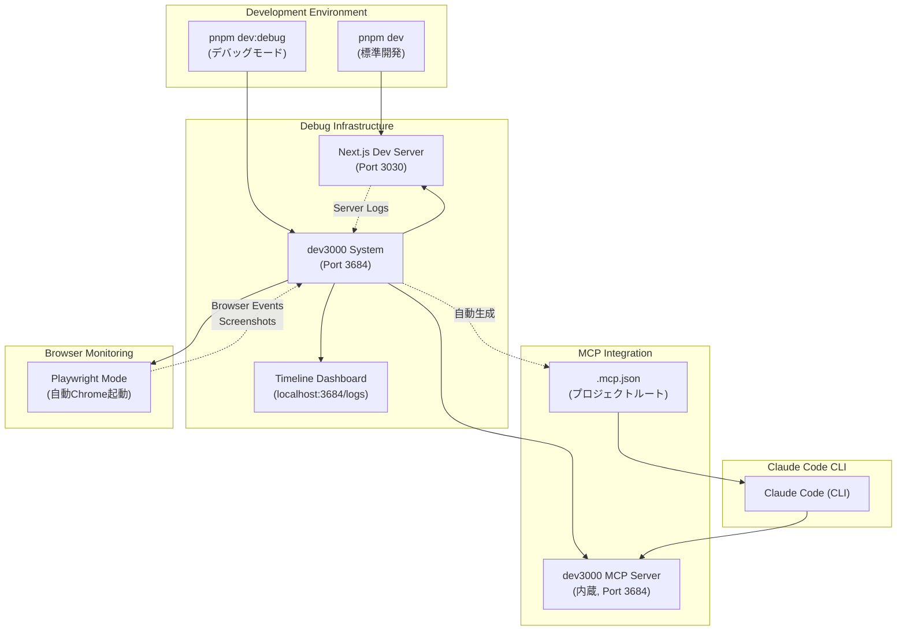
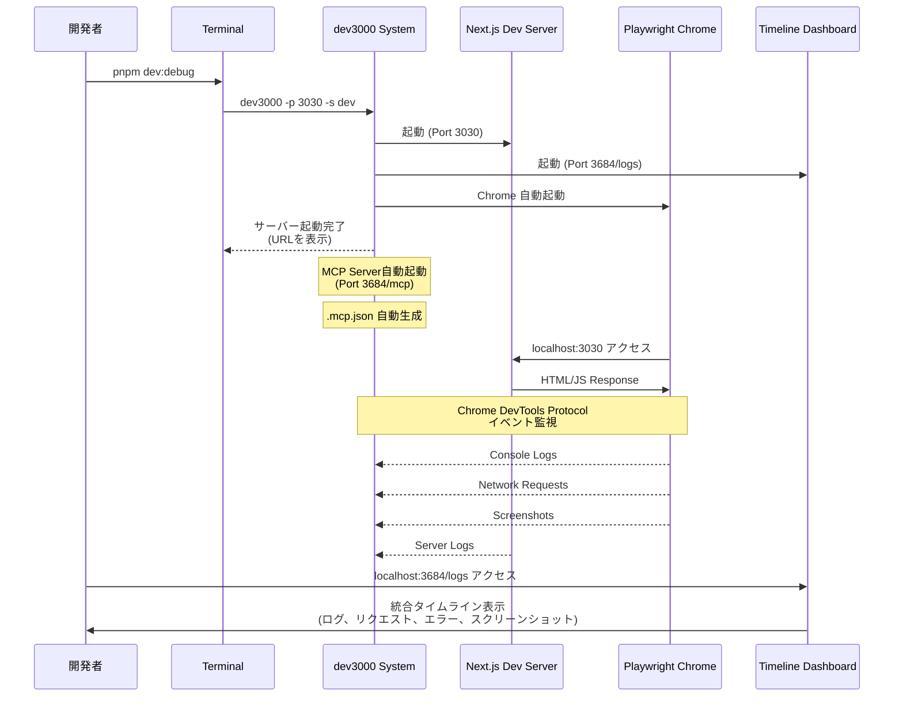
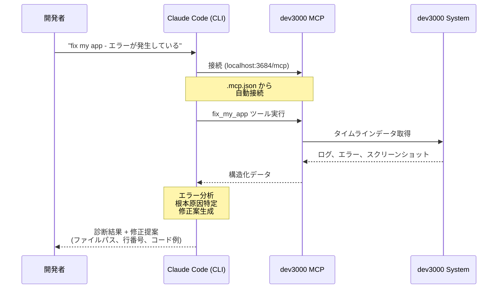

# Design Document: debug-environment

## Overview

本機能は、LINE Mini App Reversi プロジェクトにおける AI 支援開発を強化するため、包括的なデバッグツール（dev3000）を統合する。dev3000 はサーバーとブラウザの包括的な開発履歴記録を実現し、MCP Server を内蔵することで **Claude Code (CLI)** からの直接アクセスを可能にする。

**重要**: 本機能は **Claude Code (CLI tool) 専用**です。

**Purpose**: Claude Code (CLI) が、サーバーログ、ブラウザイベント、ネットワークリクエストの完全な文脈を持ってデバッグ支援を行えるようにする。これにより、エラーメッセージやスクリーンショットの手動共有が不要となり、問題診断の精度と速度が向上する。

**Users**: 本プロジェクトの開発者が、複雑な問題のデバッグ、E2E テスト失敗の診断、WebAssembly 統合の監視、Web アプリケーションの問題解決に利用する。

**Impact**: 既存の開発ワークフロー (`pnpm dev`) を維持しながら、必要時にオンデマンドで強力なデバッグ機能を起動できる環境を構築する。dev3000 を Next.js 15 のまま統合し、Playwright モードでブラウザを自動起動・監視する。

### Goals

- サーバーログ、ブラウザイベント、ネットワークリクエストを統合タイムラインで記録する
- Claude Code (CLI) が MCP プロトコル経由でデバッグツール（dev3000 MCP Server）を利用できるようにする（Zero Configuration）
- 既存の開発ワークフロー（`pnpm dev`）に影響を与えずに、オンデマンドで起動可能なデバッグ環境を構築する
- Playwright モードで Chrome を自動起動し、ブラウザイベントを包括的に監視する

### Non-Goals

- 本番環境へのデバッグツール統合（開発環境専用）
- リアルタイム協調デバッグ機能（チーム間でのライブセッション共有）
- 自動化されたバグ修正（AI 支援診断のみ、修正判断は開発者が行う）
- デバッグデータの永続化とアナリティクス（セッション単位の一時的記録のみ）

## Architecture

### Existing Architecture Analysis

本プロジェクトは以下の技術スタックと設計原則を採用している：

- **Next.js 15 App Router** with Static Export (`output: 'export'`)
- **TypeScript strict mode** with Pure Functions優先のゲームロジック
- **Server/Client Component明確分離**（SSG最適化とクライアント実行の明確な境界）
- **pnpm + Husky + lint-staged** による品質ゲート自動化
- **Jest + Playwright** による多層テスト戦略

**制約事項**:

- Static Export (`output: 'export'`) モードのため、Server Actions や動的サーバーサイド機能は利用不可

**既存パターンの保持**:

- `pnpm dev` による標準開発フローは変更しない
- `package.json` scripts パターンに従い、新規デバッグコマンドを追加
- `.kiro/` ディレクトリによる開発ドキュメント管理を継続
- Husky/lint-staged による品質ゲート自動化は維持

### High-Level Architecture



**Architecture Integration**:

- **既存パターンの保持**: `pnpm dev` を変更せず、`pnpm dev:debug` を新規追加することで、通常開発とデバッグモードを明確に分離
- **新規コンポーネントの理由**:
  - **dev3000 System**: フレームワーク非依存の包括的記録により、Next.js以外のツール（WebAssembly）も監視可能
  - **dev3000 MCP Server**: Zero Configuration で Claude Code から MCP 経由でアクセス可能、`.mcp.json` による自動設定
  - **Playwright Mode**: Chrome を自動起動し、ブラウザイベントとスクリーンショットを包括的に記録
- **Technology Alignment**: pnpm、TypeScript strict mode、既存のCI/CDパイプライン（Husky/lint-staged）との整合性を維持
- **Steering Compliance**:
  - CI/CD Standards: 品質ゲートを変更せず、デバッグツールは開発時オプションとして追加
  - Project Structure: `.kiro/` によるドキュメント管理を継続、新規設定ファイル (`.mcp.json`) はプロジェクトルートに自動生成
  - Type Safety: MCP Server通信でも型定義を明確化（後述のComponent Interfacesで詳述）

### Technology Alignment

本機能は既存技術スタックに以下の新規依存関係を追加する：

**新規グローバル依存関係**:

- **dev3000** (グローバルインストール推奨): `pnpm install -g dev3000`
  - 理由: 複数プロジェクトでの再利用性、プロジェクト依存関係の肥大化防止
  - バージョン: 最新安定版（パッケージマネージャーで管理）
  - 内蔵機能: MCP Server（Zero Configuration）、Playwright モード

**自動生成ファイル**:

- `.mcp.json` (プロジェクトルート、dev3000 が初回起動時に自動生成)

**設定ファイルの追加**:

- `/docs/DEBUG_SETUP.md` (プロジェクトドキュメント、簡易セットアップガイド)

**既存パターンからの逸脱**:

- **なし**: 既存の開発フロー (`pnpm dev`)、テスト戦略、品質ゲートは変更しない
- **追加のみ**: `pnpm dev:debug` コマンドと関連ドキュメントを追加

### Key Design Decisions

#### Decision 1: dev3000 のブラウザ監視モード - Playwright モードをデフォルト化

**Context**:

- dev3000 は Playwright モードでブラウザを自動起動し、包括的な監視を提供
- Playwright モードは自動 Chrome 起動、自動スクリーンショット、ブラウザ操作記録などの強力な機能を持つ
- 開発者は Chrome Extension をインストールする手間が不要（Zero Configuration）

**Alternatives**:

1. **Playwright モードのみ（選択）**: 自動化が強力で、セットアップ不要
2. **Chrome Extension モード**: 軽量だが、Extension の手動インストールが必要

**Selected Approach**:

Playwright モードを**デフォルト**として採用する：

- **デフォルトモード（Playwright）**: `pnpm dev:debug` の標準動作
  - コマンド: `dev3000 -p 3030 -s dev`
  - 利点: Zero Configuration（Chrome Extension インストール不要）、自動スクリーンショット、完全なブラウザ操作記録
  - 制約: リソース消費が比較的高い（メモリ 1-2GB、CPU 10-20%）

**Rationale**:

1. **Zero Configuration**: Chrome Extension の手動インストール手順が不要で、開発者の初期セットアップが最小限
2. **包括的な監視**: 自動スクリーンショット、ブラウザ操作記録、コンソールログ、ネットワークリクエストをすべて自動記録
3. **開発者体験の向上**: `pnpm dev:debug` 一発でデバッグ環境が起動し、即座に利用可能

**Trade-offs**:

- **Gain**: セットアップ不要、包括的な監視、開発者体験の向上
- **Sacrifice**: リソース消費が Chrome Extension モードより高い（ただし、現代の開発マシンでは許容範囲内）

#### Decision 2: ドキュメント構造 - 複数ドキュメント戦略（README更新 + 専用ガイド）

**Context**:

- デバッグツールは設定手順、トラブルシューティングなど、ドキュメント量が多い
- プロジェクトには既存の README.md があるが、詳細なデバッグ手順で肥大化させるべきではない
- `.kiro/` は Kiro フレームワーク用のため、一般的な開発ドキュメントは `/docs/` に配置すべき

**Alternatives**:

1. **単一ドキュメント（README.md のみ更新）**: シンプルだが、README が長大化し可読性低下
2. **専用ガイドのみ（/docs/DEBUG_SETUP.md）**: 詳細だが、README から参照がないと発見されにくい
3. **複数ドキュメント（選択）**: README で概要とクイックスタート、/docs/ で詳細ガイド

**Selected Approach**:

複数ドキュメント戦略を採用し、以下の2ファイルで構成する：

- **README.md（既存ファイル更新）**:
  - 新規セクション追加: "## Debugging with AI Tools"
  - 内容: 概要（2-3行）、クイックスタートコマンド（`pnpm dev:debug`）、詳細ガイドへのリンク（`/docs/DEBUG_SETUP.md`）
  - 目的: プロジェクト参加者が即座にデバッグツールの存在を認識でき、詳細は専用ガイドに委譲

- **/docs/DEBUG_SETUP.md（新規作成）**:
  - 構成:
    1. Introduction（dev3000 の概要と利点）
    2. Installation（`pnpm install -g dev3000`）
    3. Usage（`pnpm dev:debug` コマンド、Timeline Dashboard へのアクセス）
    4. MCP Integration（Zero Configuration、`.mcp.json` が自動生成され、Claude Code が自動的に dev3000 MCP Server にアクセス可能）
    5. Troubleshooting（よくある問題と解決策）
  - 目的: シンプルなセットアップガイドを提供、既存ツール（dev3000）の活用方法にフォーカス

**Rationale**:

1. **情報の段階的開示**: README でデバッグツールの存在を周知し、詳細は専用ガイドに委譲することで、各ファイルの責務を明確化
2. **保守性**: デバッグツールの更新（新機能追加、トラブルシューティング追記）を /docs/DEBUG_SETUP.md で完結させ、README は最小限の更新で維持
3. **発見性**: README に明確なリンクを配置することで、新規参加者がドキュメントの存在を見逃さない
4. **構造化**: Kiro 仕様書（.kiro/specs/）とは独立した一般開発ドキュメント（/docs/）として管理

**Trade-offs**:

- **Gain**: 各ドキュメントの責務が明確、保守性向上、README の可読性維持
- **Sacrifice**: ドキュメントファイル数の増加（2ファイル）、開発者は詳細情報のために複数ファイルを参照する必要がある

## System Flows

### デバッグモード起動フロー



### AI デバッグ支援フロー（MCP経由）



## Requirements Traceability

| Requirement | Requirement Summary  | Components                                          | Interfaces                                                     | Flows                    |
| ----------- | -------------------- | --------------------------------------------------- | -------------------------------------------------------------- | ------------------------ |
| 1.1-1.6     | dev3000開発履歴記録  | dev3000 System, Timeline Dashboard, Playwright Mode | dev3000 CLI, Dashboard UI, Playwright                          | デバッグモード起動フロー |
| 2.1-2.5     | dev3000 MCP AI機能   | dev3000 MCP Server                                  | `fix_my_app`, `execute_browser_action`, `get_mcp_capabilities` | AI デバッグ支援フロー    |
| 3.1-3.4     | 開発ワークフロー統合 | package.json scripts, Development Scripts           | `pnpm dev`, `pnpm dev:debug`                                   | デバッグモード起動フロー |
| 4.1-4.4     | MCP Client設定       | `.mcp.json` (自動生成)                              | MCPサーバー接続設定                                            | AI デバッグ支援フロー    |
| 5.1-5.6     | ドキュメント         | README.md, /docs/DEBUG_SETUP.md                     | セットアップ手順、トラブルシューティング                       | 全フロー                 |

## Components and Interfaces

### Development Scripts Layer

#### pnpm dev:debug Command

**Responsibility & Boundaries**

- **Primary Responsibility**: dev3000 を Playwright モードで起動し、Next.js 開発サーバー、Timeline Dashboard、Chrome ブラウザを自動起動する
- **Domain Boundary**: 開発ワークフロー自動化レイヤー
- **Data Ownership**: なし（起動トリガーのみ）
- **Transaction Boundary**: コマンド実行単位（起動失敗時はプロセス全体が終了）

**Dependencies**

- **Inbound**: 開発者による手動実行（`pnpm dev:debug`）
- **Outbound**:
  - dev3000 グローバルコマンド（`dev3000 -p 3000 -s dev`）
  - Next.js 開発サーバー（dev3000が起動）
  - Playwright Chrome（dev3000が起動）
- **External**:
  - dev3000 (グローバルインストール)
  - Node.js 24.x
  - Next.js 15.x
  - Playwright (dev3000内蔵)

**External Dependencies Investigation**:

- **dev3000**:
  - インストール: `pnpm install -g dev3000` または `npm install -g dev3000`
  - 最新バージョン確認: GitHub Releases (<https://github.com/vercel-labs/dev3000/releases>)
  - 互換性: Node.js 20.19+ 推奨、Next.js 14+ 対応
  - パフォーマンス: Playwright モードのメモリ消費 1-2GB、CPU 10-20%
  - サーバーログ記録のオーバーヘッドは通常 5% 未満

**Contract Definition**

**Service Interface**:

```typescript
// package.json scripts
interface DevScripts {
  // 標準開発モード（既存）
  dev: 'next dev';

  // デバッグモード（Playwright）
  'dev:debug': 'dev3000 -p 3030 -s dev';
}
```

- **Preconditions**:
  - dev3000 がグローバルにインストール済み（`pnpm install -g dev3000`）
  - Next.js プロジェクトが有効（`package.json` に `"dev": "next dev"` が存在）
  - Port 3030, 3684 が利用可能
  - Playwright 互換環境（Chromium実行可能）
- **Postconditions**:
  - Next.js Dev Server が Port 3030 で起動
  - dev3000 MCP Server が Port 3684 で起動
  - Timeline Dashboard が `http://localhost:3684/logs` でアクセス可能
  - Playwright Chrome が自動起動し、`localhost:3030` にアクセス
  - `.mcp.json` がプロジェクトルートに自動生成される
  - コンソールに起動完了メッセージと URL が表示される
- **Invariants**:
  - `pnpm dev` の動作は変更されない（既存ワークフロー保持）

### MCP Integration Layer

#### dev3000 MCP Server

**Responsibility & Boundaries**

- **Primary Responsibility**: dev3000 が記録したタイムラインデータ（ログ、エラー、スクリーンショット）を MCP プロトコル経由で AI アシスタントに提供する
- **Domain Boundary**: AI統合レイヤー（dev3000内蔵MCPサーバー）
- **Data Ownership**: タイムラインログ（一時ファイル、セッション終了時に削除）
- **Transaction Boundary**: MCP ツール呼び出し単位（ステートレス）

**Dependencies**

- **Inbound**:
  - Claude Code (MCP Client)
  - MCP Client Config
- **Outbound**:
  - dev3000 System（タイムラインデータ取得）
  - Browser（`execute_browser_action` による操作実行）
- **External**:
  - Model Context Protocol (MCP) 仕様準拠
  - dev3000 内蔵MCPサーバー（Port 3684）

**External Dependencies Investigation**:

- **Model Context Protocol (MCP)**:
  - プロトコル仕様: <https://modelcontextprotocol.io/docs>
  - Claude統合ガイド: <https://support.claude.com/en/articles/10949351>
  - 通信方式: stdio, HTTP/SSE (dev3000)
  - 認証: なし（localhost接続のみ）
  - 制限事項: dev3000 MCP Server は dev3000 プロセスが起動中のみ利用可能

**Contract Definition**

**MCP Tools Interface**:

```typescript
// dev3000 MCP Server が提供するツール
interface Dev3000MCPTools {
  /**
   * タイムラインデータを分析し、問題の診断結果を返す
   * @returns 構造化されたエラー分析、根本原因、修正提案
   */
  fix_my_app(): Promise<{
    errors: Array<{
      timestamp: string;
      type: 'server' | 'browser' | 'network';
      message: string;
      stackTrace?: string;
      screenshot?: string; // base64
    }>;
    rootCause: string;
    suggestions: string[];
  }>;

  /**
   * ブラウザ操作を実行し、結果を記録
   * @param action - 実行する操作（click, type, navigate, screenshot）
   * @param selector - 対象要素のCSSセレクター（clickの場合）
   * @param value - 入力値（typeの場合）
   */
  execute_browser_action(
    action: 'click' | 'type' | 'navigate' | 'screenshot',
    selector?: string,
    value?: string
  ): Promise<{
    success: boolean;
    screenshot?: string; // base64
    error?: string;
  }>;

  /**
   * 利用可能なMCP機能を取得（動的capability discovery）
   */
  get_mcp_capabilities(): Promise<{
    tools: string[];
    nextjsDevAvailable: boolean; // nextjs-dev MCP連携の有無
    chromeDevtoolsAvailable: boolean; // chrome-devtools MCP連携の有無
  }>;
}
```

- **Preconditions**:
  - dev3000 プロセスが起動中（`pnpm dev:debug` 実行済み）
  - MCP Client が正しく設定済み
- **Postconditions**:
  - `fix_my_app`: タイムラインから抽出したエラー情報を構造化して返す
  - `execute_browser_action`: ブラウザ操作実行後のスクリーンショットを記録
- **Invariants**:
  - dev3000 プロセスが停止すると MCP Server も停止
  - タイムラインデータは最大5分間キャッシュ（TTL）

**Error Handling**:

```typescript
type MCPError =
  | { type: 'SERVER_NOT_RUNNING'; message: 'dev3000 is not running' }
  | { type: 'NO_DATA'; message: 'No timeline data available' }
  | { type: 'BROWSER_ACTION_FAILED'; message: string; details: string };
```

#### MCP Client Configuration

**Responsibility & Boundaries**

- **Primary Responsibility**: Claude Code (CLI) が dev3000 MCP Server に接続するための設定を自動生成・管理する
- **Domain Boundary**: MCP クライアント設定レイヤー
- **Data Ownership**: MCP サーバー接続情報（`.mcp.json`、プロジェクトルート）
- **Transaction Boundary**: dev3000 初回起動時に自動生成

**重要**: この設定は **Claude Code (CLI) 専用**です。

**Dependencies**

- **Inbound**:
  - dev3000 System（初回起動時に `.mcp.json` を自動生成）
  - Claude Code (CLI)（プロジェクト起動時に `.mcp.json` を読み込み）
- **Outbound**:
  - dev3000 MCP Server (http://localhost:3684/mcp)
- **External**:
  - Claude Code (CLI)
  - MCP プロトコル仕様

**Contract Definition**

**Configuration File Schema** (`.mcp.json`、プロジェクトルート):

```json
{
  "mcpServers": {
    "dev3000": {
      "url": "http://localhost:3684/mcp",
      "description": "dev3000 development history and AI debugging tools"
    }
  }
}
```

**Type Definition**:

```typescript
interface MCPClientConfig {
  mcpServers: {
    [serverName: string]: {
      url: string;
      description?: string;
    };
  };
}
```

- **Preconditions**:
  - dev3000 が起動中（`.mcp.json` 自動生成）
  - Claude Code (CLI) がプロジェクトディレクトリで起動
- **Postconditions**:
  - dev3000 初回起動時に `.mcp.json` が自動生成される
  - Claude Code (CLI) 起動時に dev3000 MCP Server に自動接続
  - 接続失敗時はエラーメッセージを表示
- **Invariants**:
  - `.mcp.json` は dev3000 が自動管理（手動編集不要）

**State Management**:

- **State Model**:
  - `NOT_GENERATED`: `.mcp.json` 未生成（dev3000 未起動）
  - `GENERATED`: `.mcp.json` 生成済み
  - `CONNECTED`: Claude Code (CLI) が MCP Server に接続中
- **Persistence**: `.mcp.json` (プロジェクトルート)
- **Concurrency**: 単一プロセス（dev3000）が生成、複数プロセス（Claude Code CLI）が読み取り可能

**Integration Strategy**:

- **Modification Approach**: dev3000 が初回起動時に `.mcp.json` を自動生成（既存ファイルがある場合は上書きしない）
- **Backward Compatibility**: `.mcp.json` が既に存在する場合、dev3000 は変更を加えない
- **Migration Path**: なし（完全自動化）

### Debug Recording Layer

#### dev3000 System

**Responsibility & Boundaries**

- **Primary Responsibility**: Next.js Dev Server、ブラウザ、ネットワークリクエストのイベントを統合タイムラインとして記録し、Timeline Dashboard および MCP Server 経由で提供する
- **Domain Boundary**: 開発履歴記録レイヤー
- **Data Ownership**: タイムラインログ（一時ファイル、デフォルトで `/tmp/dev3000-logs/`）
- **Transaction Boundary**: イベント記録単位（非同期、バッファリングあり）

**Dependencies**

- **Inbound**:
  - Next.js Dev Server（stdout/stderr）
  - Chrome Extension または Playwright（ブラウザイベント）
  - 開発者（Timeline Dashboard アクセス）
- **Outbound**:
  - Timeline Dashboard（ログ可視化）
  - dev3000 MCP Server（AI統合）
- **External**:
  - dev3000 CLI (グローバルインストール)
  - Chrome DevTools Protocol（ブラウザ監視）

**Contract Definition**

**CLI Interface**:

```typescript
interface Dev3000CLIOptions {
  // ターゲットアプリケーションのポート
  port?: number; // default: 3030

  // MCPサーバーのポート
  mcpPort?: number; // default: 3684

  // package.jsonのdevスクリプト名
  script?: string; // default: "dev"

  // カスタム起動コマンド（scriptを上書き）
  command?: string;

  // Chromeブラウザのパス
  browser?: string;

  // サーバーのみモード（Playwright起動なし）
  serversOnly?: boolean; // default: false

  // Chromeプロファイルディレクトリ
  profileDir?: string; // default: "/tmp/dev3000-chrome-profile"
}

// 実行例
// dev3000 --servers-only -p 3030 -s dev
```

**Timeline Event Schema**:

```typescript
interface TimelineEvent {
  timestamp: string; // ISO 8601
  type: 'server' | 'browser' | 'network' | 'screenshot';
  source: 'next-dev' | 'console' | 'network' | 'playwright' | 'extension';
  level: 'info' | 'warn' | 'error';
  message: string;
  metadata?: {
    file?: string;
    line?: number;
    stackTrace?: string;
    url?: string;
    method?: string; // HTTP method
    status?: number; // HTTP status code
    screenshot?: string; // base64, type: 'screenshot'のみ
  };
}
```

- **Preconditions**:
  - Next.js プロジェクトが存在（`package.json` に `"dev"` スクリプト）
  - Port 3030, 3684 が利用可能
  - `--servers-only` なしの場合: Playwright 互換環境
- **Postconditions**:
  - タイムラインイベントがリアルタイムで記録される
  - Timeline Dashboard でイベントを時系列表示
  - dev3000 MCP Server 経由で AI がアクセス可能
- **Invariants**:
  - イベント順序は timestamp でソート保証
  - メモリ使用量が閾値を超えた場合、古いイベントを自動アーカイブ

**State Management**:

- **State Model**:
  - `STARTING`: Next.js Dev Server 起動中
  - `RECORDING`: イベント記録中
  - `PAUSED`: 記録一時停止（手動操作）
  - `STOPPED`: プロセス終了
- **Persistence**:
  - タイムラインログ（JSON Lines形式、`/tmp/dev3000-logs/session-{id}.jsonl`）
  - 自動アーカイブ: 5分以上アクセスなし → 古いイベント削除
- **Concurrency**:
  - 非同期イベント記録（バッファリング、100ms間隔でフラッシュ）
  - 複数ブラウザタブからの同時記録をサポート

#### Timeline Dashboard

**Responsibility & Boundaries**

- **Primary Responsibility**: dev3000 System が記録したタイムラインイベントを Web UI で可視化し、フィルタリング、検索、エクスポート機能を提供する
- **Domain Boundary**: UI可視化レイヤー
- **Data Ownership**: なし（dev3000 System から読み取り専用）
- **Transaction Boundary**: UI操作単位（リアルタイムストリーミング）

**Dependencies**

- **Inbound**:
  - 開発者（Web ブラウザ経由でアクセス）
- **Outbound**:
  - dev3000 System（タイムラインデータ取得）
- **External**:
  - dev3000 内蔵 Web サーバー（Port 3684）

**Contract Definition**

**Dashboard UI Interface**:

```typescript
interface DashboardFeatures {
  // タイムラインビュー
  timeline: {
    // イベントを時系列表示（最新が上）
    display: 'chronological';
    // リアルタイム更新（WebSocket）
    realtime: true;
    // フィルタリング
    filters: {
      type: ('server' | 'browser' | 'network' | 'screenshot')[];
      level: ('info' | 'warn' | 'error')[];
      source: string[];
      search: string; // message本文検索
    };
  };

  // スクリーンショットビュー
  screenshots: {
    // スクリーンショットをサムネイル表示
    display: 'gallery';
    // クリックで拡大表示
    preview: true;
  };

  // エクスポート
  export: {
    // JSON形式でダウンロード
    format: 'json';
    // タイムスタンプ範囲指定
    range?: { start: string; end: string };
  };
}
```

- **Preconditions**:
  - dev3000 System が起動中
  - ブラウザで `http://localhost:3684/logs` にアクセス
- **Postconditions**:
  - タイムラインイベントがリアルタイムで表示される
  - フィルタリング操作が即座に反映される
- **Invariants**:
  - Timeline Dashboard は読み取り専用（イベント削除・編集不可）

**Integration Strategy**:

- **Modification Approach**: dev3000 内蔵の Dashboard を使用（カスタマイズ不要）
- **Backward Compatibility**: dev3000 のバージョンアップに自動追従
- **Migration Path**: なし（dev3000 が提供する UI をそのまま利用）

### Browser Monitoring Layer

#### Playwright Mode

**Responsibility & Boundaries**

- **Primary Responsibility**: dev3000 が自動的に起動した Chrome インスタンスでブラウザイベント、スクリーンショット、操作再現を完全制御する
- **Domain Boundary**: ブラウザ監視レイヤー（高度モード）
- **Data Ownership**: Playwright が管理する Chrome インスタンスの状態
- **Transaction Boundary**: ブラウザ操作単位（同期）

**Dependencies**

- **Inbound**:
  - dev3000 System（Playwright 起動指示）
- **Outbound**:
  - dev3000 System（イベント、スクリーンショット送信）
- **External**:
  - Playwright（dev3000 内蔵）
  - Chromium（Playwright がダウンロード）

**External Dependencies Investigation**:

- **Playwright**:
  - バージョン: dev3000 に内蔵（明示的インストール不要）
  - Chromium: 初回実行時に自動ダウンロード（約 300MB）
  - パフォーマンス: メモリ消費 1-2GB、CPU 使用率 10-20%
  - 制限事項: 自動起動の Chrome では LIFF 環境を再現できない（LINEアプリ内ブラウザではない）

**Contract Definition**

**Playwright Mode Interface**:

```typescript
// dev3000 が Playwright 経由で記録するイベント
interface PlaywrightEvent {
  type: 'console' | 'network' | 'screenshot' | 'action';
  timestamp: string;
  data: ConsoleEvent | NetworkEvent | ScreenshotEvent | ActionEvent;
}

interface ScreenshotEvent {
  url: string; // スクリーンショット撮影時のページURL
  screenshot: string; // base64
  trigger: 'error' | 'warning' | 'manual'; // 撮影トリガー
}

interface ActionEvent {
  type: 'click' | 'type' | 'navigate';
  selector?: string; // CSS selector
  value?: string; // type action の場合
  url?: string; // navigate の場合
}
```

- **Preconditions**:
  - dev3000 が Playwright モードで起動（`pnpm dev:debug`）
  - Chromium 実行可能環境
  - 十分なシステムリソース
- **Postconditions**:
  - Chrome が自動起動し、`http://localhost:3030` をロード
  - エラー/警告発生時に自動スクリーンショット撮影
  - 全ブラウザ操作が Timeline に記録
- **Invariants**:
  - Chrome インスタンスは dev3000 プロセスに紐付き、dev3000 停止時に自動終了

**Integration Strategy**:

- **Modification Approach**: dev3000 の Playwright 統合をそのまま使用
- **Backward Compatibility**: dev3000 のバージョンアップに自動追従
- **Migration Path**:
  1. Phase 1: `pnpm dev:debug:playwright` コマンドを実装
  2. Phase 2: E2E テスト失敗調査時の利用ガイドを追加（`/docs/DEBUG_SETUP.md`）

## Data Models

### Timeline Event Data Model

本システムのコアデータモデルは、dev3000 System が記録する **Timeline Event** である。

#### Logical Data Model

**Core Entities**:

```typescript
// Timeline Event (Aggregate Root)
interface TimelineEvent {
  id: string; // UUID
  timestamp: string; // ISO 8601, UTC
  type: 'server' | 'browser' | 'network' | 'screenshot';
  source: 'next-dev' | 'console' | 'network' | 'playwright' | 'extension';
  level: 'info' | 'warn' | 'error';
  message: string;
  metadata: EventMetadata;
}

// Value Objects
type EventMetadata =
  | ServerLogMetadata
  | BrowserConsoleMetadata
  | NetworkRequestMetadata
  | ScreenshotMetadata;

interface ServerLogMetadata {
  file?: string;
  line?: number;
  stackTrace?: string;
}

interface BrowserConsoleMetadata {
  args: unknown[];
  stackTrace?: string;
  url: string; // ページURL
}

interface NetworkRequestMetadata {
  method: string;
  url: string;
  status: number;
  requestHeaders: Record<string, string>;
  responseHeaders: Record<string, string>;
  requestBody?: string;
  responseBody?: string;
  timing: {
    start: number;
    end: number;
    duration: number; // ms
  };
}

interface ScreenshotMetadata {
  url: string;
  screenshot: string; // base64
  trigger: 'error' | 'warning' | 'manual';
}
```

**Business Rules & Invariants**:

- `timestamp` は常に UTC で記録（タイムゾーン変換なし）
- `id` は UUID v4 で生成（重複なし保証）
- `type` と `source` の組み合わせは限定される:
  - `type: 'server'` → `source: 'next-dev'`
  - `type: 'browser'` → `source: 'console' | 'playwright' | 'extension'`
  - `type: 'network'` → `source: 'network' | 'playwright' | 'extension'`
  - `type: 'screenshot'` → `source: 'playwright'`
- `metadata` の型は `type` に応じて決定される（discriminated union）

**Consistency & Integrity**:

- **Transaction Boundary**: 単一 TimelineEvent の記録は atomic（全フィールド揃って記録）
- **Referential Integrity**: なし（TimelineEvent は自己完結）
- **Temporal Aspects**:
  - セッション単位で記録（dev3000 起動から停止まで）
  - 5分間アクセスなしで古いイベントを自動削除（TTL）

#### Physical Data Model

**Storage**: JSON Lines形式（`.jsonl`）

- ファイルパス: `/tmp/dev3000-logs/session-{sessionId}.jsonl`
- 1行 = 1 TimelineEvent（JSON serialized）
- ファイルサイズ制限: 100MB（超過時に自動ローテーション）

**Index Strategy**:

- インデックスなし（全件スキャン、セッション単位で十分小規模）
- Timeline Dashboard はメモリ上でフィルタリング

**Partitioning**:

- セッション単位でファイル分割（同時実行の dev3000 プロセスごとに別ファイル）

### MCP Communication Data Model

#### Request/Response Schema

MCP プロトコルに準拠した通信スキーマ：

```typescript
// MCP Tool Request (例: fix_my_app)
interface MCPToolRequest {
  jsonrpc: '2.0';
  id: string | number;
  method: 'tools/call';
  params: {
    name: string; // "fix_my_app"
    arguments?: Record<string, unknown>;
  };
}

// MCP Tool Response
interface MCPToolResponse {
  jsonrpc: '2.0';
  id: string | number;
  result?: {
    content: Array<{
      type: 'text' | 'image' | 'resource';
      text?: string; // JSON serialized result
      data?: string; // base64 (image)
      uri?: string; // resource URI
    }>;
  };
  error?: {
    code: number;
    message: string;
    data?: unknown;
  };
}
```

**Serialization Format**: JSON (UTF-8)

**Schema Versioning Strategy**:

- MCP プロトコル仕様に準拠（バージョン `2.0`）
- Tool の追加・削除は Backward Compatible（Claude Code は利用可能なツールを動的発見）
- Tool の引数変更は Breaking Change（避ける、新規 Tool として追加）

**Backward/Forward Compatibility**:

- **Backward**: 古い Claude Code バージョンでも基本 Tool（`fix_my_app`）は利用可能
- **Forward**: 新規 Tool 追加時、古い Claude Code はそのツールを認識しないだけ（エラーなし）

## Error Handling

### Error Strategy

本システムのエラーハンドリングは以下の原則に基づく：

1. **Fail Fast**: 設定エラー（Port競合、MCP設定不正）は起動時に即座に検出し、明確なエラーメッセージを表示
2. **Graceful Degradation**: dev3000 System が停止しても、Next.js Dev Server は通常動作を継続（デバッグ機能のみ無効化）
3. **User Context**: エラーメッセージには具体的な解決手順を含める（例: "Port 3684 is already in use. Stop other dev3000 processes or use --mcp-port option."）
4. **Observability**: 全エラーを Timeline Dashboard に記録し、AI が文脈を持って診断可能にする

### Error Categories and Responses

#### User Errors（設定ミス、操作ミス）

| Error                           | Category   | Response                                                                                     | Recovery                       |
| ------------------------------- | ---------- | -------------------------------------------------------------------------------------------- | ------------------------------ |
| Port 競合（3000, 3684）         | 設定エラー | "Port {port} is already in use. Stop other processes or change port with --port option."     | プロセス停止または別ポート指定 |
| dev3000 未インストール          | 環境エラー | "dev3000 not found. Install globally: pnpm install -g dev3000"                               | グローバルインストール実行     |
| MCP 設定ファイル不正            | 設定エラー | "Invalid MCP config: {file}. Check JSON syntax and structure."                               | JSON 構文修正                  |
| Chrome Extension 未インストール | 環境エラー | "Chrome Extension not detected. Install from chrome://extensions/. See /docs/DEBUG_SETUP.md" | Extension インストール         |

#### System Errors（インフラ障害、リソース不足）

| Error                                | Category               | Response                                                                        | Recovery                |
| ------------------------------------ | ---------------------- | ------------------------------------------------------------------------------- | ----------------------- |
| Next.js Dev Server 起動失敗          | インフラエラー         | "Failed to start Next.js dev server: {error}. Check project configuration."     | プロジェクト設定確認    |
| Playwright Chromium ダウンロード失敗 | ネットワークエラー     | "Failed to download Chromium. Check internet connection or use --servers-only." | `--servers-only` で回避 |
| Timeline ログファイル書き込み失敗    | ファイルシステムエラー | "Cannot write to /tmp/dev3000-logs/. Check disk space and permissions."         | ディスク容量確認        |
| MCP Server 接続タイムアウト          | ネットワークエラー     | "MCP Server (localhost:3684) not responding. Restart dev3000."                  | dev3000 再起動          |

#### Business Logic Errors（Static Export 制約）

| Error                                    | Category     | Response                                                                        | Recovery                          |
| ---------------------------------------- | ------------ | ------------------------------------------------------------------------------- | --------------------------------- |
| nextjs_runtime 利用不可（Static Export） | Next.js 制約 | "nextjs_runtime tool requires dynamic rendering. Use dev3000 timeline instead." | dev3000 Timeline Dashboard で代替 |
| Server Actions 監視不可（Static Export） | Next.js 制約 | "Server Actions monitoring unavailable in Static Export mode."                  | ドキュメントで制約を明記          |

### Monitoring

#### Error Tracking

- **Timeline Dashboard**: 全エラーを `level: 'error'` として記録
- **MCP Tool `fix_my_app`**: エラーを時系列順に整理し、根本原因を特定

#### Logging Strategy

```typescript
// エラーログフォーマット
interface ErrorLog extends TimelineEvent {
  type: 'server' | 'browser';
  level: 'error';
  message: string; // エラーメッセージ（人間可読）
  metadata: {
    errorCode?: string; // 内部エラーコード
    stackTrace?: string; // スタックトレース
    context?: Record<string, unknown>; // 追加コンテキスト
    suggestedAction?: string; // 推奨される対応手順
  };
}
```

#### Health Monitoring

- **dev3000 System**: 起動確認 → `http://localhost:3684/health` にアクセス（200 OK で正常）
- **MCP Server**: Claude Code の MCP 接続ステータスで確認（UI上で "Connected" 表示）
- **Timeline Dashboard**: ブラウザで `http://localhost:3684/logs` にアクセス可能かチェック

## Testing Strategy

### Unit Tests

本機能は設定ファイルとドキュメントが中心のため、ユニットテストは最小限とする。

1. **MCP Client Config Validation**:
   - 正しい JSON 構文の設定ファイルが生成されることを検証
   - `mcpServers` セクションに必須フィールド（command, args, url）が含まれることを確認

2. **package.json scripts Validation**:
   - `pnpm dev:debug` コマンドが正しい dev3000 オプションを呼び出すことを検証
   - `pnpm dev` が変更されていないことを確認

3. **Timeline Event Schema Validation**:
   - TimelineEvent 型定義が TypeScript strict mode でコンパイル可能
   - discriminated union（`type` による `metadata` 型の分岐）が正しく機能

### Integration Tests

4. **dev3000 System + Next.js Dev Server 統合**:
   - `pnpm dev:debug` 実行後、Next.js Dev Server が Port 3000 で起動することを確認
   - Timeline Dashboard（`http://localhost:3684/logs`）が HTTP 200 を返すことを確認

5. **MCP Server 接続テスト**:
   - dev3000 MCP Server（`http://localhost:3684/mcp`）に接続可能
   - `fix_my_app` ツール呼び出しが成功（モックイベントを事前記録）

6. **Chrome Extension Mode 統合**:
   - `--servers-only` モードで起動後、Playwright プロセスが起動しないことを確認
   - 手動で開いたブラウザのコンソールログが Timeline に記録されることを確認

7. **Playwright Mode 統合**:
   - Playwright モードで起動後、Chrome インスタンスが自動起動することを確認
   - エラー発生時に自動スクリーンショットが Timeline に記録されることを確認

8. **Next.js Devtools MCP 統合**:
   - `nextjs_docs` ツールが Next.js 公式ドキュメントを検索可能
   - `browser_eval` ツールが Playwright コードを実行可能

### E2E Tests（Manual Validation）

自動化困難なシナリオは手動検証とする。

9. **Claude Code (CLI) End-to-End Flow**:
   - Claude Code (CLI) で MCP サーバー接続を確認
   - "fix my app" とプロンプト → dev3000 タイムラインデータが返されることを確認
   - AI の診断結果が有用であることを検証（主観的評価）

10. **Error Scenario Reproduction**:
    - 意図的にエラーを発生させる（例: 存在しないページに遷移）
    - Timeline Dashboard でエラーログとスクリーンショットを確認
    - Claude Code (CLI) が正しい診断を提供することを検証

## Security Considerations

### Threat Modeling

本機能は**開発環境専用**のため、セキュリティリスクは限定的だが、以下の脅威を考慮する：

#### Threat 1: Timeline ログへの不正アクセス

- **脅威**: Timeline ログに機密情報（API キー、パスワード）が記録され、第三者がアクセス
- **対策**:
  - Timeline ログは `/tmp/dev3000-logs/` に保存（ユーザーローカル、外部公開なし）
  - セッション終了時に自動削除（5分間アクセスなしで削除）
  - ドキュメントで「機密情報をコンソールに出力しない」ことを推奨

#### Threat 2: MCP Server への不正接続

- **脅威**: 外部プロセスが `localhost:3684/mcp` に接続し、Timeline データを取得
- **対策**:
  - MCP Server は `localhost` のみバインド（外部ネットワークからアクセス不可）
  - 認証なし（localhost接続は開発者本人と仮定）
  - ファイアウォール設定でポート 3684 を外部公開しないことを推奨

#### Threat 3: Chrome Extension の権限悪用

- **脅威**: Chrome Extension が過剰な権限を要求し、ブラウザデータを漏洩
- **対策**:
  - dev3000 提供の Extension のみ使用（信頼できるソース）
  - 権限要求を最小限に制限（`debugger`, `activeTab`, `http://localhost:3684/*` のみ）
  - Extension ソースコードをレビュー可能（GitHub公開）

### Data Protection

- **Timeline ログの暗号化**: なし（ローカル開発環境、暗号化は過剰）
- **ネットワークリクエストの記録**: HTTP ヘッダー、ボディを記録するため、API キーが含まれる可能性に注意（ドキュメントで注意喚起）

### Compliance

- **GDPR**: 開発環境専用のため対象外（本番データを扱わない）

## Implementation Plan

本機能は既存コードベースに影響を与えないため、マイグレーションは不要。シンプルな実装手順を以下に示す。

### Implementation Steps

**実施内容**:

1. dev3000 グローバルインストール: `pnpm install -g dev3000`
2. `package.json` に `"dev:debug"` スクリプト追加（`dev3000 -p 3000 -s dev`）
3. README.md に概要セクション追加
4. `/docs/DEBUG_SETUP.md` 作成

**Validation Checkpoints**:

- `pnpm dev:debug` で Next.js Dev Server、Playwright Chrome、Timeline Dashboard が起動
- `http://localhost:3684/logs` でタイムラインが表示される
- `.mcp.json` がプロジェクトルートに自動生成される
- Claude Code (CLI) で dev3000 MCP Server に自動接続可能
- Playwright Chrome が自動的に `localhost:3000` にアクセス

**Rollback Triggers**:

- Port 競合が解決不可能
- MCP Server 接続が常に失敗
- Timeline Dashboard が全く動作しない
- Playwright Chrome が起動しない

**Rollback Procedure**:

1. `package.json` から `"dev:debug"` スクリプト削除
2. `.mcp.json` 削除
3. dev3000 アンインストール: `pnpm uninstall -g dev3000`

### Quality Gates

- **機能検証**: 全 Acceptance Criteria（要件仕様書）を満たす
- **既存機能検証**: `pnpm dev`、`pnpm test`、`pnpm test:e2e` がすべて pass

---

**Document Version**: 2.0
**Generated**: 2025-10-24
**Updated**: 2025-10-24
**Next.js Version**: 15.x
**Target Platform**: Claude Code (CLI) ONLY
**Status**: Design Simplified
