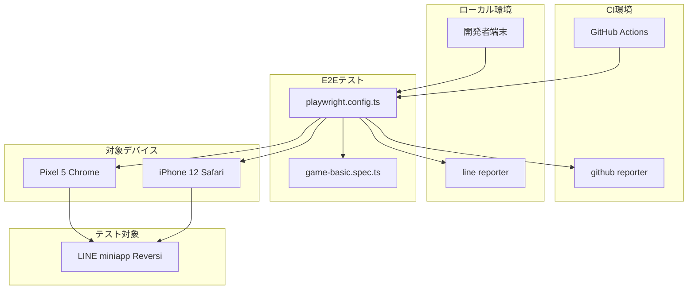
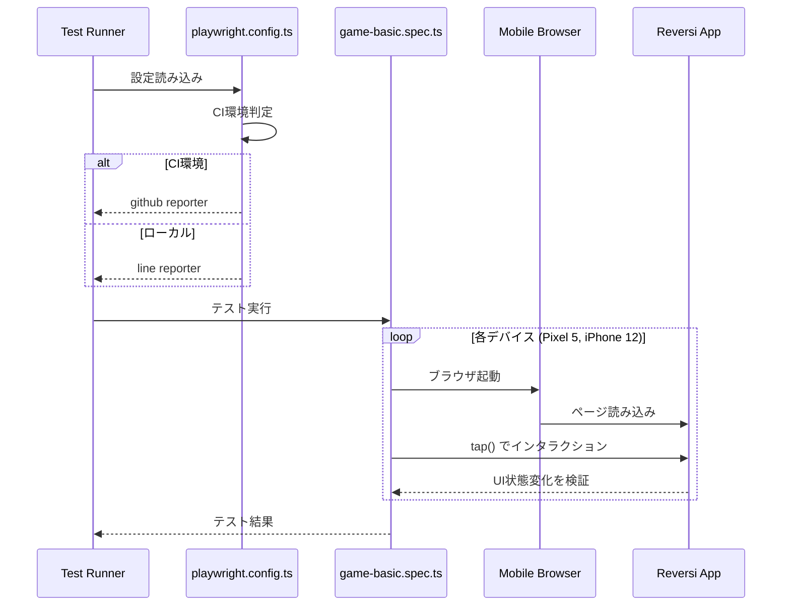
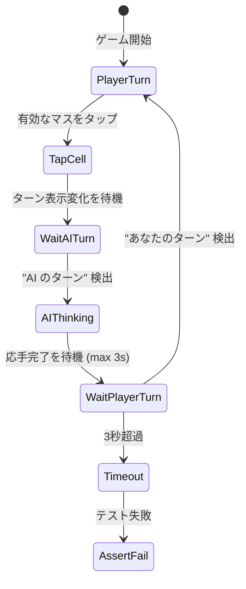

# Design Document: E2Eテスト再構築

## Overview

**Purpose**: LINE miniappリバーシゲームの品質保証基盤を確立するため、Playwrightを使用したE2Eテストを再構築する。既存の11テストファイルを削除し、ゲーム体験の基本動作・表示確認に特化した単一ファイルに集約する。

**Users**: 開発者およびCIシステムがゲーム機能の回帰テストとして利用する。

**Impact**: 既存のE2Eテストファイル（11ファイル）を全削除し、新しい単一ファイル構成に移行。playwright.config.ts をモバイル専用に更新。

### Goals

- ゲームの基本動作（初期盤面、石配置・反転、ターン切替、AI対戦）を自動検証する
- モバイルデバイス環境での動作を保証する
- ローカル開発とGitHub Actions CI両方での実行をサポートする
- AIコーディングエージェントが結果を容易に確認できる形式で出力する

### Non-Goals

- VRT（Visual Regression Testing）の実装
- LINE連携（LIFF）テスト
- デスクトップブラウザのテスト
- パス機能のテスト
- ゲーム終了・リセット機能のテスト

## Architecture

### Existing Architecture Analysis

現在のE2Eテスト構成:

| 項目             | 現状                               | 課題                             |
| ---------------- | ---------------------------------- | -------------------------------- |
| テストファイル数 | 11ファイル                         | 過剰な分割、重複したセットアップ |
| 対象ブラウザ     | Desktop Chrome, Pixel 5, iPhone 12 | デスクトップは不要               |
| レポーター       | HTML のみ                          | CI環境での可視性が低い           |

既存パターンの活用:

- `data-testid` 属性によるセレクター（`game-board`, `game-result`, `message-box`）
- `data-row`, `data-col` によるセル特定
- `data-stone`, `data-valid` による状態検証

### Architecture Pattern & Boundary Map



**Architecture Integration**:

- Selected pattern: 単一ファイル構成（テスト範囲が限定的なため）
- Domain boundaries: E2E テストは `e2e/` ディレクトリに分離、設定は `playwright.config.ts`
- Existing patterns preserved: `data-testid` セレクター、Playwright 標準構成
- New components rationale: 既存11ファイルを単一ファイルに統合し保守性向上
- Steering compliance: TypeScript strict mode、Playwright 標準パターン

### Technology Stack

| Layer             | Choice / Version   | Role in Feature               | Notes                    |
| ----------------- | ------------------ | ----------------------------- | ------------------------ |
| Testing Framework | Playwright ^1.40.0 | E2Eテスト実行                 | 既存バージョンを継続使用 |
| Reporter (Local)  | line               | 進捗表示、AIエージェント向け  | 単一行出力               |
| Reporter (CI)     | github             | GitHub Actions アノテーション | 自動失敗箇所表示         |
| Mobile Emulation  | Pixel 5, iPhone 12 | モバイルデバイスシミュレート  | `hasTouch: true`         |

## System Flows

### テスト実行フロー



### AI応手待機フロー



## Requirements Traceability

| Requirement | Summary                      | Components           | Interfaces           | Flows            |
| ----------- | ---------------------------- | -------------------- | -------------------- | ---------------- |
| 1.1         | 8x8ボード表示検証            | game-basic.spec.ts   | data-testid selector | 初期化検証       |
| 1.2         | 初期4石配置検証              | game-basic.spec.ts   | data-stone selector  | 初期化検証       |
| 1.3         | 有効手ヒント表示検証         | game-basic.spec.ts   | data-valid selector  | 初期化検証       |
| 1.4         | ターン表示検証               | game-basic.spec.ts   | text selector        | 初期化検証       |
| 2.1         | 石配置検証                   | game-basic.spec.ts   | tap(), data-stone    | 石配置フロー     |
| 2.2         | 石反転検証                   | game-basic.spec.ts   | data-stone count     | 石配置フロー     |
| 2.3         | 石数カウント更新検証         | game-basic.spec.ts   | aria-label           | 石配置フロー     |
| 3.1         | AIターンへの切替検証         | game-basic.spec.ts   | text selector        | ターン切替フロー |
| 3.2         | プレイヤーターンへの復帰検証 | game-basic.spec.ts   | waitFor text         | ターン切替フロー |
| 3.3         | プレイヤーターン時ヒント表示 | game-basic.spec.ts   | data-valid           | ターン切替フロー |
| 3.4         | AIターン時ヒント非表示       | game-basic.spec.ts   | data-valid count     | ターン切替フロー |
| 4.1         | occupied エラー検証          | game-basic.spec.ts   | message-box text     | 無効手フロー     |
| 4.2         | no_flips エラー検証          | game-basic.spec.ts   | message-box text     | 無効手フロー     |
| 4.3         | エラー後ゲーム継続検証       | game-basic.spec.ts   | tap valid cell       | 無効手フロー     |
| 5.1         | AI 1手目応手検証             | game-basic.spec.ts   | waitFor, stone count | AI対戦フロー     |
| 5.2         | プレイヤー2手目実行検証      | game-basic.spec.ts   | tap(), text          | AI対戦フロー     |
| 5.3         | AI 2手目応手検証             | game-basic.spec.ts   | waitFor, stone count | AI対戦フロー     |
| 5.4         | AI思考中表示検証             | game-basic.spec.ts   | text 思考中          | AI対戦フロー     |
| 5.5         | AI応手時間制限検証           | game-basic.spec.ts   | timeout 3000         | AI対戦フロー     |
| 6.1         | モバイルプロジェクト限定     | playwright.config.ts | projects config      | -                |
| 6.2         | data-testid使用              | game-basic.spec.ts   | locator pattern      | 全フロー         |
| 6.3         | ローカル line レポーター     | playwright.config.ts | reporter config      | -                |
| 6.4         | CI github レポーター         | playwright.config.ts | reporter config      | -                |
| 6.5         | 失敗時スクリーンショット     | playwright.config.ts | screenshot config    | -                |
| 6.6         | 単一ファイル構成             | game-basic.spec.ts   | -                    | -                |
| 7.1         | 既存specファイル削除         | -                    | -                    | クリーンアップ   |
| 7.2         | モバイルプロジェクトのみ更新 | playwright.config.ts | projects config      | -                |
| 7.3         | デスクトップ設定削除         | playwright.config.ts | projects config      | -                |

## Components and Interfaces

| Component            | Domain/Layer  | Intent               | Req Coverage      | Key Dependencies          | Contracts |
| -------------------- | ------------- | -------------------- | ----------------- | ------------------------- | --------- |
| playwright.config.ts | Configuration | テスト実行環境の設定 | 6.1-6.5, 7.2-7.3  | @playwright/test (P0)     | Config    |
| game-basic.spec.ts   | Test          | ゲーム基本動作検証   | 1.1-5.5, 6.2, 6.6 | playwright.config.ts (P0) | Test      |

### Configuration Layer

#### playwright.config.ts

| Field        | Detail                            |
| ------------ | --------------------------------- |
| Intent       | E2Eテスト実行環境の設定管理       |
| Requirements | 6.1, 6.2, 6.3, 6.4, 6.5, 7.2, 7.3 |

**Responsibilities & Constraints**

- モバイルデバイスプロジェクト（Pixel 5, iPhone 12）のみを定義
- 環境変数 `CI` に基づくレポーター切り替え
- 失敗時のスクリーンショット自動保存
- webServer 設定でローカル/CI 両環境対応

**Dependencies**

- External: @playwright/test - 設定API提供 (P0)

**Contracts**: Config [x]

##### Configuration Contract

```typescript
import { defineConfig, devices } from '@playwright/test';

interface PlaywrightConfig {
  testDir: './e2e';
  fullyParallel: boolean;
  forbidOnly: boolean; // CI環境でのみtrue
  retries: number; // CI: 2, ローカル: 0
  workers: number | undefined; // CI: 1, ローカル: undefined
  reporter: ReporterConfig;
  use: {
    baseURL: string;
    trace: 'on-first-retry';
    screenshot: 'only-on-failure';
  };
  projects: ProjectConfig[];
  webServer: WebServerConfig;
}

type ReporterConfig =
  | [['github'], ['html', { outputFolder: 'playwright-report' }]] // CI
  | [['line'], ['html', { outputFolder: 'playwright-report' }]]; // ローカル

interface ProjectConfig {
  name: 'mobile-chrome' | 'mobile-safari';
  use: (typeof devices)['Pixel 5'] | (typeof devices)['iPhone 12'];
}
```

**Implementation Notes**

- Integration: `process.env.CI` で環境判定し、レポーターを動的切り替え
- Validation: デスクトッププロジェクト（chromium）を完全削除
- Risks: CI環境での webServer タイムアウト - 120秒に設定

### Test Layer

#### game-basic.spec.ts

| Field        | Detail                   |
| ------------ | ------------------------ |
| Intent       | ゲーム基本動作の自動検証 |
| Requirements | 1.1-5.5, 6.2, 6.6        |

**Responsibilities & Constraints**

- 全てのゲーム基本動作テストを単一ファイルに集約
- `data-testid` セレクターによる安定した要素特定
- モバイル向け `tap()` メソッドによるインタラクション
- AI応答待機は `waitFor` + 3秒タイムアウト

**Dependencies**

- Inbound: playwright.config.ts - 設定参照 (P0)
- External: @playwright/test - テストAPI (P0)
- External: Reversi App - テスト対象 (P0)

**Contracts**: Test [x]

##### Test Suite Structure

```typescript
import { test, expect, type Page } from '@playwright/test';

// テストグループ構造
interface TestSuite {
  name: 'E2Eテスト - ゲーム基本動作';
  tests: {
    初期盤面表示: TestCase;
    '石配置・反転': TestCase;
    ターン切替: TestCase;
    無効な手への対応: TestCase;
    'AI対戦（2往復）': TestCase;
  };
}

// セレクター定義
interface Selectors {
  gameBoard: '[data-testid="game-board"]';
  messageBox: '[data-testid="message-box"]';
  cell: (row: number, col: number) => `[data-row="${row}"][data-col="${col}"]`;
  blackStones: '[data-stone="black"]';
  whiteStones: '[data-stone="white"]';
  validMoves: '[data-valid="true"]';
  turnText: {
    player: 'あなたのターン';
    ai: 'AI のターン';
    thinking: '思考中';
  };
  errorMessages: {
    occupied: 'そのマスには既に石が置かれています';
    noFlips: 'そのマスに置いても石を反転できません';
  };
}

// 待機設定
interface WaitConfig {
  aiResponseTimeout: 3000; // AI応答最大待機時間 (ms)
  uiUpdateDelay: 500; // UI更新確認待機 (ms)
}
```

##### Helper Functions Contract

```typescript
/**
 * 有効な手のマスをタップする
 * @param page - Playwright Page オブジェクト
 * @returns タップしたセルのLocator
 */
async function tapValidMove(page: Page): Promise<Locator>;

/**
 * AIのターン完了を待機する
 * @param page - Playwright Page オブジェクト
 * @param timeout - 最大待機時間 (デフォルト: 3000ms)
 */
async function waitForAITurn(page: Page, timeout?: number): Promise<void>;

/**
 * プレイヤーターンへの復帰を待機する
 * @param page - Playwright Page オブジェクト
 * @param timeout - 最大待機時間 (デフォルト: 3000ms)
 */
async function waitForPlayerTurn(page: Page, timeout?: number): Promise<void>;

/**
 * 石の総数を取得する
 * @param page - Playwright Page オブジェクト
 * @returns { black: number, white: number }
 */
async function getStoneCount(
  page: Page
): Promise<{ black: number; white: number }>;
```

**Implementation Notes**

- Integration: テスト間の状態リセットは `beforeEach` で `page.goto('/')` を実行
- Validation: 各検証ステップで `expect` による明示的なアサーション
- Risks: AI応答時間の変動 - リトライ設定（CI: 2回）で対応

## Data Models

### Test Data Model

テストで使用するデータ構造:

**Initial Board State**:

- 64セル (8x8)
- 黒石: 2個 (d4, e5)
- 白石: 2個 (d5, e4)
- 有効手: 4個 (c4, d3, e6, f5)

**Cell Identification**:

- `data-row`: 0-7 (行番号)
- `data-col`: 0-7 (列番号)
- `id`: a1-h8 (チェス形式)

## Error Handling

### Error Strategy

テスト失敗時の対応戦略:

| シナリオ                   | 検出方法             | 対応                               |
| -------------------------- | -------------------- | ---------------------------------- |
| 要素が見つからない         | Playwright timeout   | リトライ後、スクリーンショット保存 |
| AI応答タイムアウト         | waitFor timeout (3s) | テスト失敗としてレポート           |
| 予期しないエラーメッセージ | text assertion fail  | スクリーンショット保存             |
| ネットワークエラー         | page.goto failure    | リトライ後、CI失敗レポート         |

### Monitoring

- **失敗時スクリーンショット**: `screenshot: 'only-on-failure'`
- **トレース**: `trace: 'on-first-retry'`
- **HTMLレポート**: 全実行結果を `playwright-report/` に保存

## Testing Strategy

### E2E Tests

| テストケース     | 検証内容                                   | 優先度 |
| ---------------- | ------------------------------------------ | ------ |
| 初期盤面表示     | 8x8ボード、初期4石、ヒント表示、ターン表示 | P0     |
| 石配置・反転     | 有効手タップ、石配置、反転、カウント更新   | P0     |
| ターン切替       | AIターンへの切替、プレイヤーターンへの復帰 | P0     |
| 無効な手への対応 | occupied/no_flips エラー、ゲーム継続       | P1     |
| AI対戦（2往復）  | 2往復の対戦フロー、思考中表示、時間制限    | P0     |

## Optional Sections

### Performance Considerations

- **AI応答時間**: 3秒以内を要件として設定
- **テスト実行時間**: 全テスト完了まで目標60秒以内
- **並列実行**: `fullyParallel: true` でデバイス間並列実行

## Supporting References

### 削除対象ファイル一覧

以下の11ファイルを削除:

```
e2e/
├── ai-game.spec.ts
├── ai-negative-value-fix.spec.ts
├── cross-browser-compatibility.spec.ts
├── element-id-assignment.spec.ts
├── game-flow.spec.ts
├── last-move-highlight.spec.ts
├── move-history.spec.ts
├── pass-feature.spec.ts
├── responsive.spec.ts
├── ui-usability-improvement.spec.ts
└── wasm-error.spec.ts
```

### 調査ノート参照

詳細な調査結果とベストプラクティスは `research.md` を参照:

- モバイルテストにおける tap vs click
- レポーター設定戦略
- 既存 data-testid 分析
- UI テキスト・メッセージ確認
