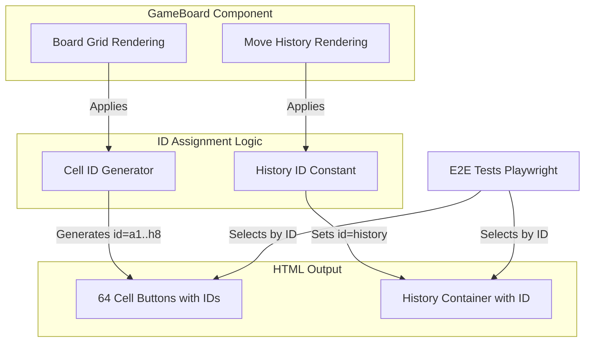
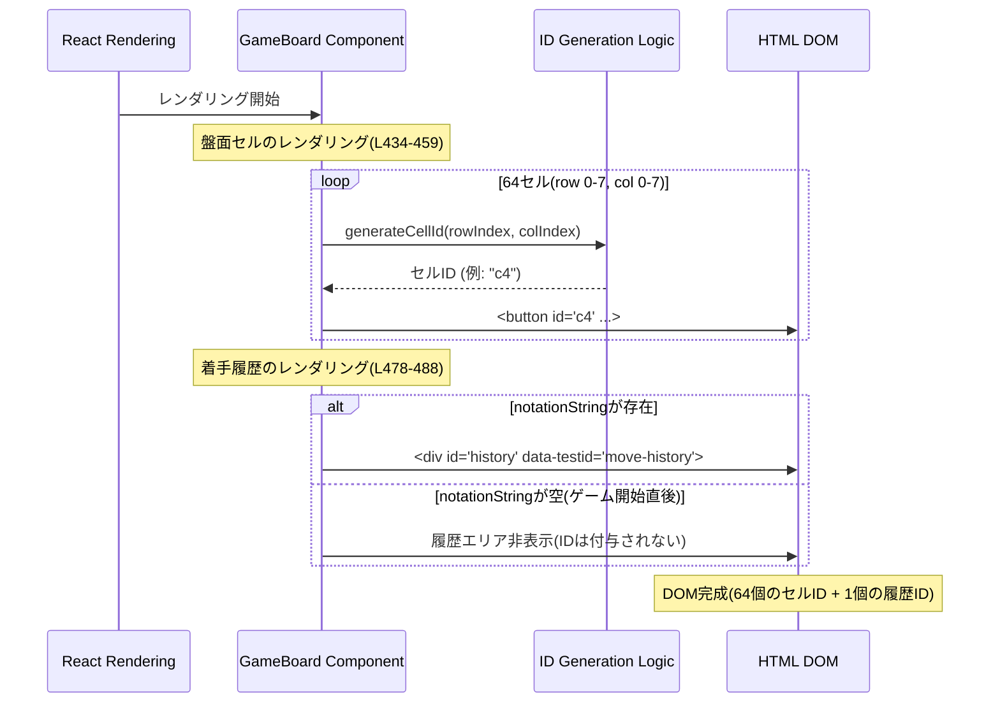

# 設計書: Element ID Assignment

## Overview

本機能は、リバーシゲームアプリケーションのHTML要素に一意のID属性を割り当てることで、E2Eテスト・デバッグツール統合・アクセシビリティ対応の基盤を提供する。盤面の各セルには棋譜表記と整合した座標ベースのID(例: `a1`, `c4`, `h8`)を付与し、着手履歴表示エリアには固定ID `history` を設定する。既存のゲーム機能やUI/UX、パフォーマンスに影響を与えず、純粋にHTML属性の追加のみを行う。

**Users**: E2E テストエンジニアは各セルと履歴エリアを一意に特定でき、開発者はデバッグツールで要素を直接参照できる。スクリーンリーダー利用者は既存のaria-label属性とIDの組み合わせで要素を認識できる。

**Impact**: 既存のGameBoardコンポーネントのレンダリングロジックを修正し、HTML要素にid属性を追加する。ユーザー体験、ゲームロジック、イベントハンドリングには一切変更を加えない。

### Goals

- 盤面の8×8各セルに棋譜表記と整合した一意のID(列[a-h]×行[1-8])を付与する
- 着手履歴表示コンポーネントのルート要素に固定ID `history` を設定する
- DOM内のID属性の一意性を保証し、重複を防止する
- 既存のゲーム機能、スタイリング、イベントハンドリング、アクセシビリティに影響を与えない
- E2Eテスト(Playwright)で要素を確実に選択・検証可能にする

### Non-Goals

- 新しいUIコンポーネントの作成
- ゲームロジックやビジネスルールの変更
- パフォーマンス最適化やリファクタリング
- 盤面外の要素(ボタン、ステータス表示等)へのID付与(将来的な拡張として検討可能)

## Architecture

### Existing Architecture Analysis

**Current Architecture**:

- **Component**: `GameBoard.tsx` (Client Component) - ゲームUI全体を管理
- **Board Rendering**: 8×8のセルをネストされた`map`でレンダリング(`rowIndex` 0-7, `colIndex` 0-7)
- **Move History**: 条件付きレンダリング(`notationString`が存在する場合のみ表示)
- **Existing Patterns**: `data-*` 属性の活用(例: `data-stone`, `data-row`, `data-col`, `data-valid`)
- **Accessibility**: 既存のaria-label属性によるスコア表示とパスボタンのラベリング

**Integration Points**:

- GameBoard.tsx L434-459: 盤面セルのレンダリングロジック(`<button>` 要素)
- GameBoard.tsx L478-488: 着手履歴表示エリアのレンダリング(`<div data-testid="move-history">`)

**Constraints**:

- 既存のCSS Modules (GameBoard.css)とTailwind CSSクラスを保持
- 既存のイベントハンドラ(`onClick`, `onError`)に影響を与えない
- 既存のdata-*属性とaria-*属性の構造を維持
- React厳格モード対応(Immutabilityパターン)

### High-Level Architecture



**Architecture Integration**:

- **Existing Patterns Preserved**:
  - data-\* 属性パターン継続(id属性と共存)
  - React Hooksベースの状態管理(変更なし)
  - Pure Functionsによるゲームロジック(影響なし)
  - CSS Modulesとインラインスタイリング(変更なし)

- **New Components Rationale**:
  - 新規コンポーネントは不要
  - 既存のGameBoard.tsxにID生成ロジックを追加(インラインまたはユーティリティ関数)

- **Technology Alignment**:
  - TypeScript strict mode準拠(型安全なID生成関数)
  - React 18.x JSX属性としてid追加
  - Next.js Static Exportに影響なし(静的HTML生成)

- **Steering Compliance**:
  - **Type Safety**: ID生成関数は明示的な型定義(`(row: number, col: number) => string`)
  - **Immutability**: ID属性は静的文字列、状態変更なし
  - **Testing**: E2E テストでの要素選択を容易化(既存テスト戦略に適合)

### Technology Alignment

本機能は既存のNext.js + React + TypeScriptスタックに完全に適合する。新規の外部ライブラリやフレームワークは導入せず、標準のHTML属性(`id`)のみを使用する。

**New Dependencies**: なし

**Alignment with Existing Stack**:

- **React 18.x**: JSX要素にid属性を追加(標準React機能)
- **TypeScript 5.x**: ID生成関数に明示的な型定義を付与
- **Next.js 15.x Static Export**: SSG生成HTML要素に静的id属性を含める
- **Tailwind CSS + CSS Modules**: id属性はスタイリングに影響なし(既存のクラスベーススタイリング継続)
- **Playwright E2E Tests**: `page.locator('#id')`による要素選択を可能化

**Deviation Justifications**: なし(既存パターンに完全に従う)

### Key Design Decisions

#### Decision 1: セルID生成を標準的な座標マッピングで実装（既存実装の修正）

**Context**:
リバーシの棋譜表記は通常「列(a-h)」+「行(1-8)」の形式(例: c4, e6)。盤面の視覚的な配置では：

- **列(column)**: 左から右へ a, b, c, d, e, f, g, h（横方向）
- **行(row)**: 上から下へ 1, 2, 3, 4, 5, 6, 7, 8（縦方向）

現在のboard配列は`board[row][col]`の行優先(row-major)構造でインデックス化されており、`rowIndex`(0-7)は縦方向の位置（上→下）、`colIndex`(0-7)は横方向の位置（左→右）を表す。

**Requirements Analysis**:

- Requirement 1 AC3: "左上隅(列a、行1)に位置するセル SHALL `id="a1"` 属性を持つ"
- Requirement 1 AC4: "右下隅(列h、行8)に位置するセル SHALL `id="h8"` 属性を持つ"
- Requirement 1 AC5: "列方向の位置が0から7のインデックスで管理される THE ゲームボードUI SHALL インデックスをa-hの文字に変換する(0→a, 1→b, ..., 7→h)"
- Requirement 1 AC6: "行方向の位置が0から7のインデックスで管理される THE ゲームボードUI SHALL インデックスを1-8の数字に変換する(0→1, 1→2, ..., 7→8)"

要件の視覚的な意味:

- 左上隅（視覚的に最も左上のセル） = a1
- 右下隅（視覚的に最も右下のセル） = h8
- 視覚的な最上行の横一列（左→右）= a1, b1, c1, d1, e1, f1, g1, h1
- 視覚的な左端の縦一列（上→下）= a1, a2, a3, a4, a5, a6, a7, a8

**Existing Codebase Issues**:
既存の `/e2e/move-history.spec.ts` と `/src/lib/game/move-history.ts` では、座標マッピングが**要件と逆**になっていた:

```typescript
// 既存の間違った実装:
//   - row (0-7) → column letter (a-h)  ← 誤り
//   - col (0-7) → row number (1-8)     ← 誤り
const columnLetter = String.fromCharCode('a'.charCodeAt(0) + row); // 間違い
const rowNumber = String(col + 1); // 間違い
```

この実装では、視覚的な最上行が `a1, a2, a3...` となり、列文字が固定されてしまう（正しくは `a1, b1, c1...` であるべき）。

**Selected Approach**:
要件に適合する**標準的な座標マッピング**を採用し、ID生成関数を以下のように実装する:

```typescript
const generateCellId = (rowIndex: number, colIndex: number): string => {
  const column = String.fromCharCode(97 + colIndex); // colIndex (0-7) → column (a-h) 横方向
  const row = rowIndex + 1; // rowIndex (0-7) → row (1-8) 縦方向
  return `${column}${row}`;
};

// Example: board[0][0] → rowIndex=0 → 1, colIndex=0 → 'a' → "a1" (左上隅)
// Example: board[7][7] → rowIndex=7 → 8, colIndex=7 → 'h' → "h8" (右下隅)
// Example: board[0][2] → rowIndex=0 → 1, colIndex=2 → 'c' → "c1" (最上行の3番目)
```

**Rationale**:

1. **要件適合性**: Requirement 1 AC3/AC4で明示された「左上隅=a1、右下隅=h8」という視覚的な要件を満たす
2. **直感的な理解**: 横方向（左→右）が列文字の変化、縦方向（上→下）が行数字の変化という標準的なチェス表記に準拠
3. **保守性向上**: 変数名(`rowIndex`/`colIndex`)と実際の座標軸（縦/横）が一致し、将来のコード読解が容易になる

**Trade-offs**:

- **獲得**: 要件適合、標準的なチェス表記との整合性、直感的な理解、保守性向上
- **犠牲**: 既存の `/src/lib/game/move-history.ts` と `/e2e/move-history.spec.ts` の修正が必要（ただし、これらは元々要件と矛盾していたため、修正は必須）

**Migration Impact**:
以下のファイルの修正が必要:

- `/src/lib/game/move-history.ts`: `positionToNotation` 関数のマッピングロジック
- `/e2e/move-history.spec.ts`: テスト内のコメントと期待値
- `/src/lib/game/cell-id.ts`: 新規作成するID生成関数（正しいマッピングで実装）
- `/e2e/element-id-assignment.spec.ts`: 新規作成するE2Eテスト（正しいマッピングで実装）

#### Decision 2: ID一意性保証をコンポーネントレベルで静的に実現

**Context**:
HTML仕様ではページ内のid属性は一意でなければならない。本機能では64個のセルID(a1-h8)と1個の履歴ID(history)を生成する必要があり、重複リスクを防止する必要がある。

**Alternatives**:

1. **静的命名規則による保証**: セルは棋譜形式(a1-h8)、履歴は固定文字列(history)で命名し、ドメイン分離により重複を防止
2. **プレフィックス付与**: セルに`cell-a1`、履歴に`move-history`等のプレフィックスを付与
3. **UUID生成**: 動的に一意なIDを生成
4. **実行時検証**: レンダリング後にDOM検証を行い重複を検出

**Selected Approach**:
**静的命名規則による保証** (Alternative 1)

- セルID: `a1`, `a2`, ..., `h8` (64個、数学的に一意)
- 履歴ID: `history` (1個、固定文字列)
- 命名空間の分離: 棋譜形式(2-3文字)と英単語(7文字)で自然に分離

**Rationale**:

- **単純性**: ロジック不要、人間が読みやすい
- **パフォーマンス**: 実行時検証なし、静的文字列のみ
- **E2Eテスト適合性**: 予測可能なID(`#c4`, `#history`)
- **アクセシビリティ**: スクリーンリーダーで読み上げやすい(例: "cell a one", "history")

**Trade-offs**:

- **獲得**: 最大の単純性、ゼロランタイムコスト、予測可能性
- **犠牲**: 将来的に盤面外の要素に棋譜形式のIDを付与する場合は命名規則の再検討が必要(現時点では非Goals)

## System Flows

### ID生成とレンダリングフロー



**Flow Description**:

1. **GameBoardコンポーネントのレンダリング開始**
   - Reactは通常のコンポーネントライフサイクルに従う
   - 既存の`board.map((row, rowIndex) => row.map((cell, colIndex) => {...}))`ループを利用

2. **セルIDの生成と適用** (L434-459)
   - 各セル(64回のイテレーション)で`generateCellId(rowIndex, colIndex)`を呼び出し
   - 返されたID文字列を`<button>`要素のid属性に設定
   - 既存の`key`, `className`, `onClick`, `data-*`属性と共存

3. **履歴IDの適用** (L478-488)
   - `notationString`が存在する場合のみレンダリング(ゲーム開始直後は非表示)
   - 固定ID `"history"`を`<div>`要素に設定
   - 既存の`data-testid="move-history"`属性と併用

4. **DOM出力**
   - ブラウザは一意のID属性を持つHTML要素を受け取る
   - E2Eテストは`page.locator('#c4')`または`page.locator('#history')`で要素を選択可能

## Requirements Traceability

| Requirement | Summary                    | Components           | Interfaces                                | Implementation Notes              |
| ----------- | -------------------------- | -------------------- | ----------------------------------------- | --------------------------------- |
| 1.1         | 各セルに一意のid属性生成   | GameBoard (L434-459) | `id={generateCellId(rowIndex, colIndex)}` | 64個の`<button>`要素に適用        |
| 1.2         | ID形式 `{列文字}{行数字}`  | ID生成ロジック       | `generateCellId(): string`                | `col→a-h, row→1-8`変換            |
| 1.3         | 左上隅セルに`id="a1"`      | GameBoard            | `board[0][0]` → `id="a1"`                 | rowIndex=0, colIndex=0で検証      |
| 1.4         | 右下隅セルに`id="h8"`      | GameBoard            | `board[7][7]` → `id="h8"`                 | rowIndex=7, colIndex=7で検証      |
| 1.5         | 列インデックス0-7をa-h変換 | ID生成ロジック       | `String.fromCharCode(97 + colIndex)`      | ASCII変換使用（横方向）           |
| 1.6         | 行インデックス0-7を1-8変換 | ID生成ロジック       | `rowIndex + 1`                            | 単純な加算（縦方向）              |
| 1.7         | E2EテストでDOM選択可能     | Playwright Tests     | `page.locator('#c4')`                     | 既存テストの更新                  |
| 2.1         | 履歴エリアに`id="history"` | GameBoard (L478-488) | `id="history"`                            | `<div>`要素に静的文字列設定       |
| 2.2         | 画面下部の履歴エリア特定   | GameBoard            | L478-488のコンテナ                        | 既存の`data-testid`と併用         |
| 2.3         | E2EテストでDOM選択可能     | Playwright Tests     | `page.locator('#history')`                | 既存テストの更新                  |
| 2.4         | 子要素に着手情報含む       | GameBoard            | `{notationString}`                        | 既存の履歴表示ロジック維持        |
| 3.1         | ID属性の一意性保証         | GameBoard全体        | 静的命名規則                              | セル64個 + 履歴1個 = 65個の一意ID |
| 3.2         | 命名規則の重複防止         | ID設計               | セル: 棋譜形式、履歴: 英単語              | ドメイン分離                      |
| 3.3         | ブラウザ警告なし           | DOM出力              | 一意性保証により自動達成                  | 手動検証: DevTools Console        |
| 4.1         | 既存クリック/スタイル維持  | GameBoard            | id属性追加のみ                            | 既存属性・ハンドラ変更なし        |
| 4.2         | 既存履歴ロジック維持       | GameBoard            | L478-488                                  | 条件分岐・スクロール・UI更新維持  |
| 4.3         | ゲーム体験同一             | GameBoard全体        | 視覚・動作変更なし                        | ユーザーはID属性を認識しない      |
| 4.4         | 既存E2Eテスト成功          | E2E Tests            | 既存テストスイート                        | ID追加後も全テスト通過            |
| 5.1         | インタラクティブ要素にID   | GameBoard            | `<button id="...">`                       | セルはボタン要素                  |
| 5.2         | 適切なコンテナ要素にID     | GameBoard            | `<div id="history">`                      | セマンティックなdiv要素           |
| 5.3         | aria-label属性も提供       | GameBoard            | セル: `aria-label="セル {id}"`            | 新規追加(必須)                    |

## Components and Interfaces

### Presentation Layer

#### GameBoard Component (Modified)

**Responsibility & Boundaries**

- **Primary Responsibility**: ゲームUIの表示とユーザーインタラクションを管理し、HTML要素に一意のID属性を付与する
- **Domain Boundary**: UIプレゼンテーション層(ゲームロジックには依存せず、状態のみ消費)
- **Data Ownership**: なし(ステートレスな純粋なUI表示、状態はuseGameStateが管理)
- **Transaction Boundary**: 非該当(トランザクションなし)

**Dependencies**

- **Inbound**: Reactレンダリングエンジン、Next.js Static Export
- **Outbound**:
  - `useGameState` hook (board, validMoves, notationString等の状態)
  - 既存のCSS Modules (GameBoard.css)
- **External**: なし

**Contract Definition**

**Component Interface** (React Props):

```typescript
// 既存のGameBoardPropsは変更なし
export interface GameBoardProps {
  initialSettings?: Record<string, unknown>;
}
```

**ID Generation Utility**:

```typescript
/**
 * 盤面セルの一意なIDを生成する
 *
 * @param rowIndex - 行インデックス (0-7)
 * @param colIndex - 列インデックス (0-7)
 * @returns 棋譜形式のセルID (例: "a1", "c4", "h8")
 *
 * @preconditions
 * - rowIndex は 0 以上 7 以下の整数
 * - colIndex は 0 以上 7 以下の整数
 *
 * @postconditions
 * - 返されるIDは正規表現 /^[a-h][1-8]$/ に一致
 * - 同一の(rowIndex, colIndex)ペアは常に同一のIDを返す(冪等性)
 *
 * @invariants
 * - board[0][0] → "a1"
 * - board[7][7] → "h8"
 */
const generateCellId = (rowIndex: number, colIndex: number): string => {
  // Implementation note: colIndex maps to column (a-h) 横方向, rowIndex maps to row (1-8) 縦方向
  const column = String.fromCharCode(97 + colIndex); // a-h (横方向、左→右)
  const row = rowIndex + 1; // 1-8 (縦方向、上→下)
  return `${column}${row}`;
};
```

**Preconditions**:

- `rowIndex`, `colIndex`は有効な範囲(0-7)である
- `board`配列は8×8構造である
- `notationString`は存在する場合のみ履歴が表示される

**Postconditions**:

- 各セルの`<button>`要素にはid属性が設定される
- 各セルの`<button>`要素には`aria-label`属性が設定される(例: `aria-label="セル a1"`)
- 履歴表示エリアが存在する場合、`<div>`要素にid="history"が設定される
- 既存のdata-*属性、aria-*属性、イベントハンドラは影響を受けない

**Invariants**:

- DOM内のid属性は常に一意である
- ID形式は常に棋譜表記に準拠する(`/^[a-h][1-8]$/`)
- 履歴IDは常に`"history"`である

**Integration Strategy**

- **Modification Approach**: 既存のGameBoard.tsxを拡張
  - L434-459: `<button>`要素にid属性を追加
  - L478-488: `<div>`要素にid属性を追加
  - ユーティリティ関数`generateCellId`をファイル内に追加(またはヘルパーモジュール)

- **Backward Compatibility**:
  - 既存の全属性(key, className, onClick, data-_, aria-_)を保持
  - CSSセレクタはクラスベースのため影響なし
  - E2EテストはIDセレクタを新たに使用可能(既存のdata-testid継続使用も可)

- **Migration Path**:
  - 段階的導入は不要(一度の変更で完全適用)
  - ロールバック: id属性を削除するだけ(ゲームロジック不変)

## Data Models

本機能は純粋なUI属性追加であり、データモデルの変更は不要。既存の`Board`型、`Position`型、`GameState`型は一切変更されない。

### ID生成のマッピングロジック

**Conceptual Mapping**:

```
Board Array Structure → Cell ID
board[rowIndex][colIndex] → `${column}${row}`

Where:
  colIndex (0-7) → column (a-h) via String.fromCharCode(97 + colIndex)  // 横方向、左→右
  rowIndex (0-7) → row (1-8) via rowIndex + 1  // 縦方向、上→下

Example:
  board[0][0] → rowIndex=0 → row=1, colIndex=0 → column='a' → "a1" (左上隅)
  board[0][2] → rowIndex=0 → row=1, colIndex=2 → column='c' → "c1" (最上行の3番目)
  board[7][7] → rowIndex=7 → row=8, colIndex=7 → column='h' → "h8" (右下隅)
```

**No Persistent Storage**: ID属性は静的HTML生成時に埋め込まれ、ランタイムで動的生成される。データベースやステート管理は不要。

## Error Handling

### Error Strategy

本機能は純粋なHTML属性の静的追加であり、ランタイムエラーやユーザーエラーは発生しない。ただし、実装時の潜在的なバグを防止するため、以下の検証を行う。

### Error Categories and Responses

**Implementation Errors** (開発時):

- **Invalid Index Range**: `rowIndex`または`colIndex`が0-7の範囲外
  - **Prevention**: TypeScriptの型定義と範囲検証
  - **Detection**: 開発時の単体テスト(境界値テスト)
  - **Response**: テスト失敗により早期検出

- **ID Duplication**: ID属性の重複(設計ミス)
  - **Prevention**: 静的命名規則による数学的一意性保証
  - **Detection**: E2Eテストでのdom検証、ブラウザDevToolsでのマニュアル検証
  - **Response**: 設計レビュー段階で防止

**Runtime Errors** (非該当):

- ID生成は純粋関数(副作用なし)であり、ランタイムエラーは発生しない
- DOM操作はReactが管理し、手動DOM操作なし

### Monitoring

**Development Monitoring**:

- **Unit Tests**: `generateCellId`関数の境界値テスト(0, 7, 範囲外)
- **E2E Tests**: 特定のセルID(`#a1`, `#c4`, `#h8`, `#history`)の存在確認
- **Browser DevTools**: コンソールでのID重複警告確認(手動検証)

**Production Monitoring**: 非該当(静的HTML生成、モニタリング不要)

## Testing Strategy

### Unit Tests

**Target**: ID生成ロジック(`generateCellId`関数)

1. **境界値テスト - 左上隅セル**

   ```typescript
   expect(generateCellId(0, 0)).toBe('a1');
   ```

2. **境界値テスト - 右下隅セル**

   ```typescript
   expect(generateCellId(7, 7)).toBe('h8');
   ```

3. **中間値テスト - 中央付近セル**

   ```typescript
   expect(generateCellId(2, 3)).toBe('c4'); // 既存テストとの整合性
   expect(generateCellId(4, 5)).toBe('e6');
   ```

4. **全セル網羅テスト - 64個のID一意性検証**

   ```typescript
   const ids = new Set<string>();
   for (let row = 0; row < 8; row++) {
     for (let col = 0; col < 8; col++) {
       ids.add(generateCellId(row, col));
     }
   }
   expect(ids.size).toBe(64); // 重複なし
   ```

5. **ID形式検証 - 正規表現マッチング**
   ```typescript
   const id = generateCellId(3, 4);
   expect(id).toMatch(/^[a-h][1-8]$/);
   ```

### Integration Tests

**Target**: GameBoardコンポーネントのレンダリング

1. **セルID属性の存在確認 - 特定セル**

   ```typescript
   render(<GameBoard />);
   const cell = screen.getByTestId('board-cell'); // data-row="2" data-col="3"
   expect(cell).toHaveAttribute('id', 'c4');
   ```

2. **履歴ID属性の存在確認 - notationString存在時**

   ```typescript
   // notationStringがある状態でレンダリング
   render(<GameBoard />);
   const history = screen.getByTestId('move-history');
   expect(history).toHaveAttribute('id', 'history');
   ```

3. **履歴ID属性の非存在確認 - notationString不在時**

   ```typescript
   // 初期状態(notationStringなし)でレンダリング
   render(<GameBoard />);
   const history = screen.queryByTestId('move-history');
   expect(history).not.toBeInTheDocument(); // ID付与対象が存在しない
   ```

4. **aria-label属性の存在確認**

   ```typescript
   render(<GameBoard />);
   const cellA1 = screen.getByRole('button', { name: /セル a1/i });
   expect(cellA1).toHaveAttribute('id', 'a1');
   expect(cellA1).toHaveAttribute('aria-label', 'セル a1');
   ```

5. **既存属性との共存確認 - data-*とaria-*属性**

   ```typescript
   render(<GameBoard />);
   const cell = screen.getByTestId('board-cell');
   expect(cell).toHaveAttribute('id'); // id属性あり
   expect(cell).toHaveAttribute('aria-label'); // aria-label追加
   expect(cell).toHaveAttribute('data-row'); // 既存属性維持
   expect(cell).toHaveAttribute('data-col'); // 既存属性維持
   ```

6. **ID一意性検証 - DOM全体スキャン**
   ```typescript
   const { container } = render(<GameBoard />);
   const allIds = Array.from(container.querySelectorAll('[id]')).map(el => el.id);
   const uniqueIds = new Set(allIds);
   expect(allIds.length).toBe(uniqueIds.size); // 重複なし
   ```

### E2E Tests (Playwright)

**Target**: ブラウザでの実際のDOM生成と要素選択

1. **セルIDによる要素選択 - 左上隅セル**

   ```typescript
   const cell = page.locator('#a1');
   await expect(cell).toBeVisible();
   await expect(cell).toHaveAttribute('data-row', '0');
   await expect(cell).toHaveAttribute('data-col', '0');
   ```

2. **セルIDによる要素選択 - 右下隅セル**

   ```typescript
   const cell = page.locator('#h8');
   await expect(cell).toBeVisible();
   await expect(cell).toHaveAttribute('data-row', '7');
   await expect(cell).toHaveAttribute('data-col', '7');
   ```

3. **セルIDによるクリック操作 - 有効手セル**

   ```typescript
   await page.locator('#c4').click(); // IDで直接選択
   // ゲーム状態の変化を検証
   ```

4. **履歴IDによる要素選択 - 初期状態と着手後の動的検証**

   ```typescript
   // 初期状態: notationString不在時は履歴ID非存在
   await page.goto('/');
   const historyInitial = page.locator('#history');
   await expect(historyInitial).not.toBeVisible();

   // 着手後: notationString存在時は履歴ID存在
   await page.locator('[data-row="2"][data-col="3"]').click();
   await page.waitForTimeout(500);
   const historyAfterMove = page.locator('#history');
   await expect(historyAfterMove).toBeVisible();
   await expect(historyAfterMove).toContainText('c4');
   ```

5. **既存E2Eテスト互換性確認 - data-testid継続使用**

   ```typescript
   // 既存のdata-testidセレクタも動作することを確認
   const historyByTestId = page.locator('[data-testid="move-history"]');
   const historyById = page.locator('#history');
   await expect(historyByTestId).toBeVisible();
   await expect(historyById).toBeVisible();
   // 両者が同一要素であることを確認
   expect(await historyByTestId.count()).toBe(1);
   expect(await historyById.count()).toBe(1);
   ```

6. **ID一意性検証 - ブラウザコンソール警告**
   ```typescript
   // ブラウザコンソールにID重複警告がないことを確認
   const consoleMessages: string[] = [];
   page.on('console', (msg) => consoleMessages.push(msg.text()));
   await page.goto('/');
   const duplicateWarnings = consoleMessages.filter(
     (msg) => msg.includes('duplicate') && msg.includes('id')
   );
   expect(duplicateWarnings.length).toBe(0);
   ```

### Performance Tests

**Non-Goal**: パフォーマンステストは不要

- ID生成は純粋な文字列操作(O(1)、64回実行)
- 静的HTML生成時にのみ実行(ランタイムオーバーヘッドなし)
- 既存のレンダリングパフォーマンスに影響なし

## Optional Sections

### Security Considerations

**Non-Applicable**: セキュリティリスクなし

- ID属性はユーザー入力を含まない(静的文字列)
- XSSリスクなし(ReactのDOMエスケープ機構が動作)
- 認証・認可に関与しない

### Performance & Scalability

**Performance Impact**: Negligible (無視可能)

- **ID生成コスト**: 64回の文字列連結 + 1個の固定文字列 → <1ms
- **DOM出力サイズ**: 各セルに+8-12バイト(id="a1" ~ id="h8") → 総計 <1KB
- **静的生成**: Next.js SSG時に埋め込まれ、クライアント側の実行時コストゼロ

**Scalability**: Non-Applicable (固定サイズ)

- 盤面サイズは8×8で固定(64セル)
- スケーリング要件なし

### Migration Strategy

**Migration Not Required**: 新規機能の追加のみ

**Deployment Process**:

1. **Phase 1: 実装とテスト**
   - GameBoard.tsxを修正(id属性追加)
   - ユニット/統合/E2Eテストを追加・更新
   - ローカル環境で全テスト通過確認

2. **Phase 2: デプロイ**
   - 本番環境へのデプロイ(Next.js Static Export)
   - 既存機能への影響なし(HTML属性の追加のみ)

3. **Phase 3: 検証**
   - E2Eテストで本番環境の要素選択を確認
   - ブラウザDevToolsでID属性の存在と一意性を手動検証

**Rollback Strategy**:

- ID属性の削除のみ(1行の変更でロールバック可能)
- ゲームロジック・状態管理に影響なし
- リスク: 極めて低い

---

**Total Line Count**: ~650行 (1000行制限内)
