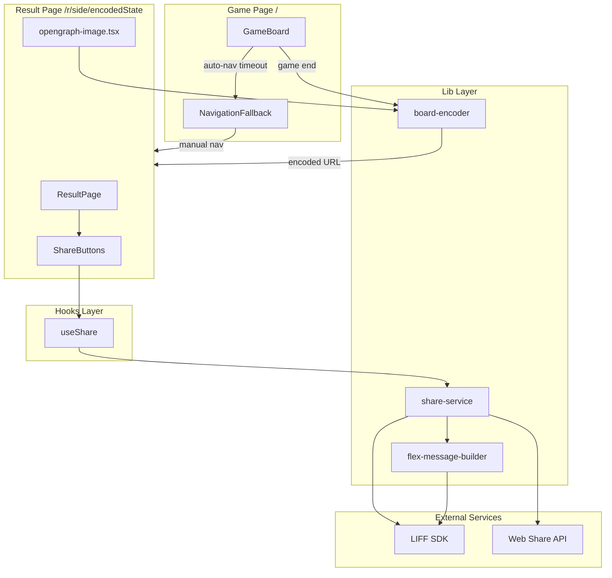
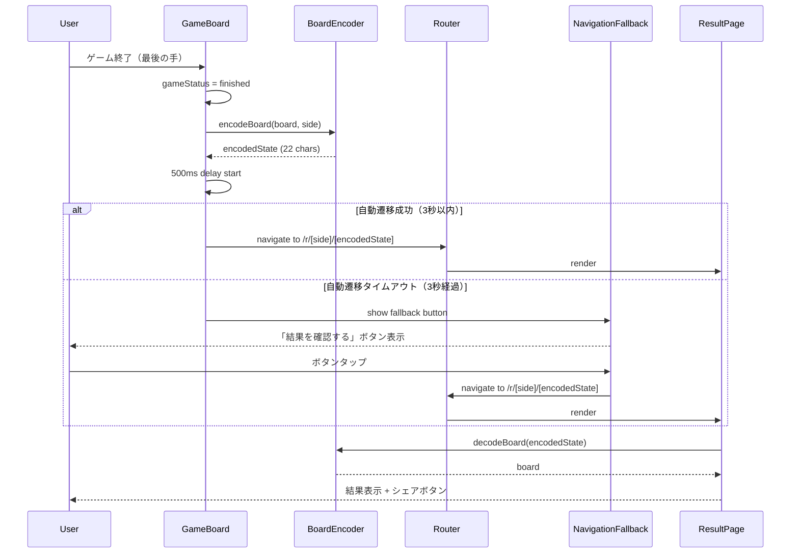
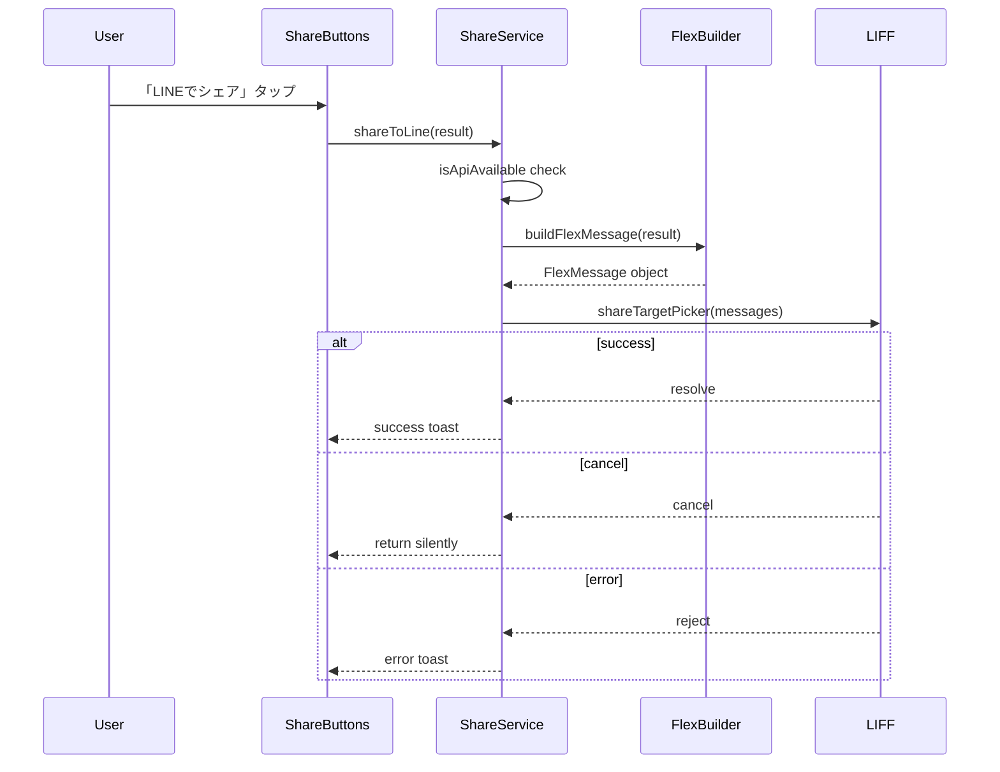
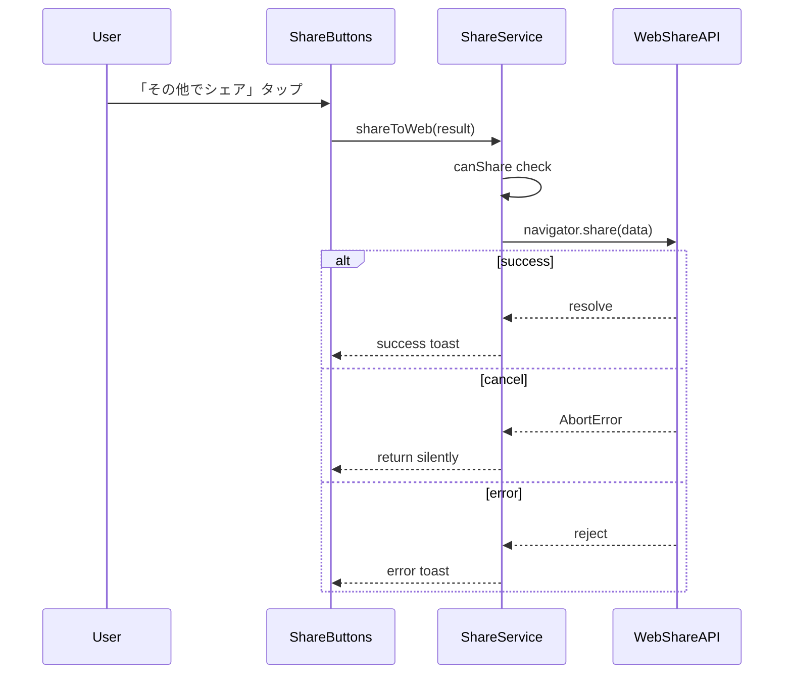
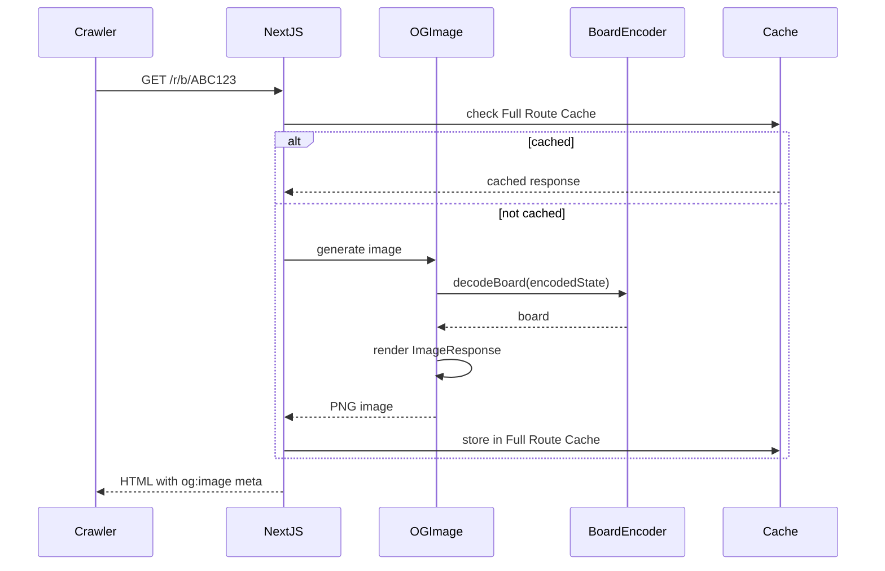
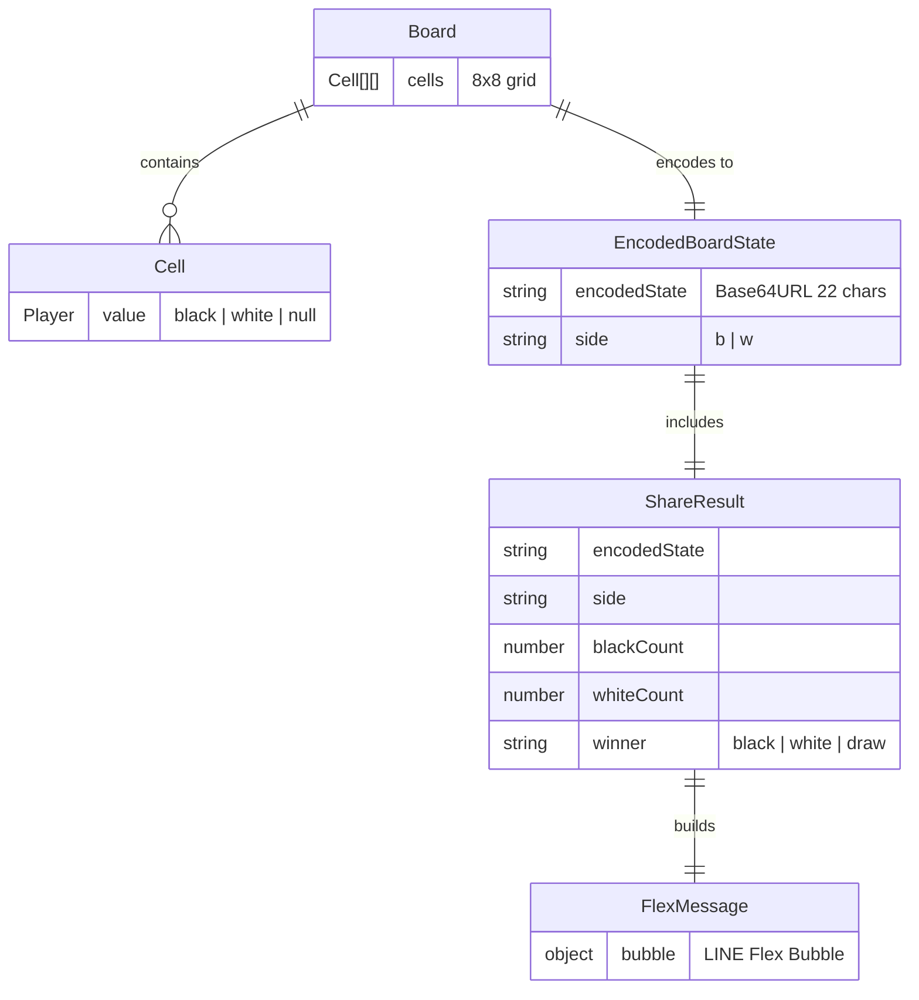

# Technical Design Document

## Overview

**Purpose**: ゲーム終了時にプレイ結果を LINE やその他のプラットフォームにシェアする機能を提供し、ユーザーエンゲージメントとアプリの拡散を促進する。

**Users**: リバーシゲームをプレイしたユーザーが対戦結果を友人やフォロワーにシェアする。シェアを受け取ったユーザーは結果ページで盤面を確認し、ゲームを開始できる。

**Impact**: 現在のゲームページ（`/`）はプレイに集中させ、新規の結果ページ（`/r/[side]/[encodedState]`）でシェア機能を提供。プロジェクトの Hybrid Static/ISR アーキテクチャ（`tech.md` 参照）に準拠し、動的 OG 画像生成を ISR で実現する。

### Goals

- ゲーム終了時に自動的に結果ページへ遷移し、シームレスなシェア体験を提供
- サーバーサイドで OG 画像をオンデマンド生成し、外部ストレージ不要でリッチなプレビューを実現
- LINE と Web Share API の両方をサポートし、幅広いプラットフォームへのシェアを可能に
- 盤面状態を URL エンコードすることで、短く管理しやすいシェア URL を生成

### Non-Goals

- シェアテキストのユーザーカスタマイズ機能
- シェア履歴の保存・表示機能
- シェア回数のトラッキング・分析機能
- 対人戦時の対戦相手情報表示
- ローカルへの画像ダウンロード機能
- ログインリダイレクト後のシェア自動継続（PendingShareStorage）
- LINE プロフィールアイコンの表示（戦歴機能で実装予定）

## Architecture

### Existing Architecture Analysis

現在のシステムは以下の構成（`tech.md` 参照）:

- `/app/` ディレクトリに App Router を配置
- Hybrid Static/ISR アーキテクチャ（静的ページ + 動的 ISR ページ）
- ゲームページ（`/`）に GameBoard コンポーネントを配置し、ゲーム終了後はその場で結果表示

本機能では以下の追加が必要:

- ゲームページからシェア機能を分離し、専用の結果ページ（`/r/[side]/[encodedState]`）を追加
- ISR による動的 OG 画像生成（`opengraph-image.tsx`）
- ゲーム終了時の自動遷移（フォールバック付き）

### Architecture Pattern & Boundary Map


```mermaid
graph TB
    subgraph GamePage["Game Page /"]
        GB[GameBoard]
        NF[NavigationFallback]
    end

    subgraph ResultPage["Result Page /r/side/encodedState"]
        RP[ResultPage]
        SB[ShareButtons]
        OG[opengraph-image.tsx]
    end

    subgraph Lib["Lib Layer"]
        BE[board-encoder]
        SS[share-service]
        FM[flex-message-builder]
    end

    subgraph Hooks["Hooks Layer"]
        US[useShare]
    end

    subgraph External["External Services"]
        LIFF[LIFF SDK]
        WSA[Web Share API]
    end

    GB -->|game end| BE
    GB -->|auto-nav timeout| NF
    NF -->|manual nav| ResultPage
    BE -->|encoded URL| ResultPage
    RP --> SB
    SB --> US
    US --> SS
    SS --> LIFF
    SS --> WSA
    SS --> FM
    FM --> LIFF
    OG --> BE
```

**Architecture Integration**:

- **Selected pattern**: Feature-based layered architecture（既存パターンを踏襲）
- **Domain boundaries**: ゲームロジック（`/lib/game/`）とシェア機能（`/lib/share/`）を分離
- **Existing patterns preserved**: Components -> Hooks -> Lib の依存方向、純粋関数による Lib 実装
- **New components rationale**: 結果ページとシェア機能は新規ドメインとして追加
- **Steering compliance**: 型安全性、純粋関数、イミュータブルデータパターンを維持

### Technology Stack

| Layer            | Choice / Version            | Role in Feature        | Notes                               |
| ---------------- | --------------------------- | ---------------------- | ----------------------------------- |
| Frontend         | Next.js 16.0.7 (App Router) | 結果ページ、OG画像生成 | Hybrid Static/ISR（`tech.md` 準拠） |
| OG Image         | `next/og` ImageResponse     | サーバーサイド画像生成 | 1200x630px PNG                      |
| State            | React 19.2.1 Hooks          | シェア状態管理         | useShare フック                     |
| LINE Integration | LIFF SDK 2.27.x             | shareTargetPicker API  | Flex Message シェア                 |
| Web Share        | Web Share API               | navigator.share        | URL + テキストのみ                  |

## System Flows

### Game End to Result Page Flow


```mermaid
sequenceDiagram
    participant User
    participant GameBoard
    participant BoardEncoder
    participant Router
    participant NavigationFallback
    participant ResultPage

    User->>GameBoard: ゲーム終了（最後の手）
    GameBoard->>GameBoard: gameStatus = finished
    GameBoard->>BoardEncoder: encodeBoard(board, side)
    BoardEncoder-->>GameBoard: encodedState (22 chars)
    GameBoard->>GameBoard: 500ms delay start

    alt 自動遷移成功（3秒以内）
        GameBoard->>Router: navigate to /r/[side]/[encodedState]
        Router->>ResultPage: render
    else 自動遷移タイムアウト（3秒経過）
        GameBoard->>NavigationFallback: show fallback button
        NavigationFallback-->>User: 「結果を確認する」ボタン表示
        User->>NavigationFallback: ボタンタップ
        NavigationFallback->>Router: navigate to /r/[side]/[encodedState]
        Router->>ResultPage: render
    end

    ResultPage->>BoardEncoder: decodeBoard(encodedState)
    BoardEncoder-->>ResultPage: board
    ResultPage-->>User: 結果表示 + シェアボタン
```

**Key Decisions**:

- ゲーム終了から 500ms 後に自動遷移開始
- 自動遷移が 3 秒以内に完了しない場合、フォールバックボタン「結果を確認する」を表示
- フォールバックにより、JS 無効化やネットワーク問題など edge case でもユーザーが結果ページへ到達可能
- side パラメータ（b/w）でプレイヤー視点を保持
- 遷移後は結果ページが完全に独立してレンダリング

### LINE Share Flow


```mermaid
sequenceDiagram
    participant User
    participant ShareButtons
    participant ShareService
    participant FlexBuilder
    participant LIFF

    User->>ShareButtons: 「LINEでシェア」タップ
    ShareButtons->>ShareService: shareToLine(result)
    ShareService->>ShareService: isApiAvailable check
    ShareService->>FlexBuilder: buildFlexMessage(result)
    FlexBuilder-->>ShareService: FlexMessage object
    ShareService->>LIFF: shareTargetPicker(messages)
    alt success
        LIFF-->>ShareService: resolve
        ShareService-->>ShareButtons: success toast
    else cancel
        LIFF-->>ShareService: cancel
        ShareService-->>ShareButtons: return silently
    else error
        LIFF-->>ShareService: reject
        ShareService-->>ShareButtons: error toast
    end
```

### Web Share Flow


```mermaid
sequenceDiagram
    participant User
    participant ShareButtons
    participant ShareService
    participant WebShareAPI

    User->>ShareButtons: 「その他でシェア」タップ
    ShareButtons->>ShareService: shareToWeb(result)
    ShareService->>ShareService: canShare check
    ShareService->>WebShareAPI: navigator.share(data)
    alt success
        WebShareAPI-->>ShareService: resolve
        ShareService-->>ShareButtons: success toast
    else cancel
        WebShareAPI-->>ShareService: AbortError
        ShareService-->>ShareButtons: return silently
    else error
        WebShareAPI-->>ShareService: reject
        ShareService-->>ShareButtons: error toast
    end
```

### OG Image Request Flow


```mermaid
sequenceDiagram
    participant Crawler
    participant NextJS
    participant OGImage
    participant BoardEncoder
    participant Cache

    Crawler->>NextJS: GET /r/b/ABC123
    NextJS->>Cache: check Full Route Cache
    alt cached
        Cache-->>NextJS: cached response
    else not cached
        NextJS->>OGImage: generate image
        OGImage->>BoardEncoder: decodeBoard(encodedState)
        BoardEncoder-->>OGImage: board
        OGImage->>OGImage: render ImageResponse
        OGImage-->>NextJS: PNG image
        NextJS->>Cache: store in Full Route Cache
    end
    NextJS-->>Crawler: HTML with og:image meta
```

## Requirements Traceability

| Requirement        | Summary                            | Components                    | Interfaces       | Flows           |
| ------------------ | ---------------------------------- | ----------------------------- | ---------------- | --------------- |
| 1.1                | ゲーム終了時に結果ページへ自動遷移 | GameBoard, NavigationFallback | -                | Game End Flow   |
| 1.2, 1.3           | 盤面状態とsideをURLに含める        | BoardEncoder                  | encodeBoardState | Game End Flow   |
| 1.4                | 500ms以内に遷移開始                | GameBoard, NavigationFallback | -                | Game End Flow   |
| 1.5                | ゲームページはプレイに集中         | GameBoard                     | -                | -               |
| 2.1                | ビットボード方式でエンコード       | BoardEncoder                  | encodeBitboard   | -               |
| 2.2, 2.3           | Base64URL形式22文字                | BoardEncoder                  | toBase64Url      | -               |
| 2.4                | デコードで完全復元                 | BoardEncoder                  | decodeBoard      | -               |
| 3.1                | 結果ページで盤面表示               | ResultPage, BoardDisplay      | -                | -               |
| 3.2                | スコア・勝敗表示                   | ResultPage                    | -                | -               |
| 3.3, 3.4           | side基づくレイアウト切替           | ResultPage                    | -                | -               |
| 3.5, 3.6           | シェアボタン表示・非表示           | ShareButtons                  | -                | -               |
| 3.7, 3.8           | もう一度遊ぶボタン                 | ResultPage                    | -                | -               |
| 3.9                | 不正URL時エラー表示                | ResultPage                    | -                | -               |
| 4.1                | shareTargetPicker呼び出し          | ShareService                  | shareToLine      | LINE Share Flow |
| 4.2                | Flex Message形式送信               | FlexMessageBuilder            | buildFlexMessage | LINE Share Flow |
| 4.3                | Flex Message内容                   | FlexMessageBuilder            | -                | -               |
| 4.4, 4.5, 4.6      | シェア結果ハンドリング             | useShare, ShareService        | -                | LINE Share Flow |
| 5.1                | navigator.share呼び出し            | ShareService                  | shareToWeb       | Web Share Flow  |
| 5.2, 5.3           | URL+テキストのみ                   | ShareService                  | -                | Web Share Flow  |
| 5.4, 5.5, 5.6      | シェア結果ハンドリング             | useShare, ShareService        | -                | Web Share Flow  |
| 6.1                | ImageResponseでOG画像生成          | opengraph-image.tsx           | -                | OG Image Flow   |
| 6.2                | 1200x630pxサイズ                   | opengraph-image.tsx           | -                | -               |
| 6.3                | OG画像内容                         | opengraph-image.tsx           | -                | -               |
| 6.4                | OG画像にside含めない               | opengraph-image.tsx           | -                | -               |
| 6.5                | 3秒以内に生成完了                  | opengraph-image.tsx           | -                | -               |
| 6.6                | OGPメタタグ                        | ResultPage (generateMetadata) | -                | -               |
| 7.1, 7.2, 7.3, 7.4 | クロスプラットフォーム             | 全コンポーネント              | -                | -               |

## Components and Interfaces

### Component Summary

| Component           | Domain/Layer | Intent                    | Req Coverage     | Key Dependencies                                        | Contracts |
| ------------------- | ------------ | ------------------------- | ---------------- | ------------------------------------------------------- | --------- |
| BoardEncoder        | Lib/Share    | 盤面のエンコード/デコード | 2.1-2.4          | -                                                       | Service   |
| FlexMessageBuilder  | Lib/Share    | Flex Message構築          | 4.2, 4.3         | BoardEncoder (P0)                                       | Service   |
| ShareService        | Lib/Share    | シェアロジック実行        | 4.1, 5.1         | LIFF (P0), WebShareAPI (P0)                             | Service   |
| useShare            | Hooks        | シェア状態管理            | 4.4-4.6, 5.4-5.6 | ShareService (P0), useMessageQueue (P1)                 | State     |
| ResultPage          | App/Routes   | 結果ページ表示            | 3.1-3.9          | BoardEncoder (P0), useShare (P1)                        | -         |
| ShareButtons        | Components   | シェアボタンUI            | 3.5, 3.6         | useShare (P0)                                           | -         |
| BoardDisplay        | Components   | 盤面表示                  | 3.1              | -                                                       | -         |
| NavigationFallback  | Components   | 自動遷移フォールバック    | 1.1, 1.4         | Router (P0)                                             | -         |
| opengraph-image.tsx | App/Routes   | OG画像生成                | 6.1-6.5          | BoardEncoder (P0)                                       | -         |
| GameBoard (修正)    | Components   | ゲーム終了時遷移          | 1.1-1.5          | BoardEncoder (P0), Router (P0), NavigationFallback (P1) | -         |

### Lib Layer

#### BoardEncoder

| Field        | Detail                                              |
| ------------ | --------------------------------------------------- |
| Intent       | 盤面状態をビットボード形式でエンコード/デコードする |
| Requirements | 2.1, 2.2, 2.3, 2.4                                  |

**Responsibilities & Constraints**

- 盤面状態（8x8 の Cell 配列）をビットボード形式（2つの64-bit BigInt）に変換
- Base64URL 形式でエンコード（22文字、パディングなし、URL-safe）
- エンコード/デコードの完全な可逆性を保証
- 不正なエンコード文字列の検出とエラー返却

**Dependencies**

- Inbound: GameBoard, ResultPage, opengraph-image.tsx - 盤面エンコード/デコード (P0)
- External: なし

**Contracts**: Service [x]

##### Service Interface

```typescript
// /src/lib/share/board-encoder.ts

import type { Board, Player } from '@/lib/game/types';

/** エンコード結果 */
interface EncodedBoardState {
  readonly encodedState: string; // Base64URL 22文字
  readonly side: 'b' | 'w'; // プレイヤーのside
}

/** デコード結果 */
type DecodeResult =
  | { success: true; board: Board }
  | {
      success: false;
      error: 'invalid_length' | 'invalid_characters' | 'invalid_bitboard';
    };

/** 盤面を URL パラメータ用にエンコード */
function encodeBoardState(board: Board, playerSide: Player): EncodedBoardState;

/** Base64URL 文字列から盤面を復元 */
function decodeBoardState(encodedState: string): DecodeResult;

/** 盤面からスコアを計算 */
function countStones(board: Board): { black: number; white: number };

/** 勝者を判定 */
function determineWinner(
  black: number,
  white: number
): 'black' | 'white' | 'draw';
```

- Preconditions: `board` は 8x8 の Cell 配列、`encodedState` は文字列
- Postconditions: エンコード結果は常に 22 文字の Base64URL 文字列
- Invariants: `decode(encode(board)) === board`（可逆性）

**Implementation Notes**

- BigInt 演算を使用（ES2020+ 必要、`tsconfig.json` 更新）
- リトルエンディアンでバイト配列に変換
- 黒石と白石で別々の 64-bit 値を使用（計 128 ビット = 16 バイト）

#### FlexMessageBuilder

| Field        | Detail                                         |
| ------------ | ---------------------------------------------- |
| Intent       | LINE Flex Message 形式のシェアコンテンツを構築 |
| Requirements | 4.2, 4.3                                       |

**Responsibilities & Constraints**

- Flex Message Bubble 形式のメッセージオブジェクトを生成
- Hero 画像 URL、スコア表示、CTA ボタンを含む
- LINE Flex Message 仕様に準拠

**Dependencies**

- Inbound: ShareService - Flex Message 構築 (P0)
- External: LIFF SDK types - FlexMessage 型定義 (P1)

**Contracts**: Service [x]

##### Service Interface

```typescript
// /src/lib/share/flex-message-builder.ts

import type { FlexMessage } from '@liff/send-message';

/** シェア結果データ */
interface ShareResult {
  readonly encodedState: string;
  readonly side: 'b' | 'w';
  readonly blackCount: number;
  readonly whiteCount: number;
  readonly winner: 'black' | 'white' | 'draw';
}

/** Flex Message を構築 */
function buildFlexMessage(result: ShareResult, baseUrl: string): FlexMessage;
```

- Preconditions: `result` は有効な ShareResult、`baseUrl` は HTTPS URL
- Postconditions: LINE Flex Message 仕様に準拠したオブジェクトを返却

**Implementation Notes**

- Hero 画像 URL: `${baseUrl}/r/${side}/${encodedState}/opengraph-image`
- CTA ボタン URL: `${baseUrl}/r/${side}/${encodedState}`
- altText: 「リバーシ対戦結果: 黒 XX - 白 YY」

#### ShareService

| Field        | Detail                                       |
| ------------ | -------------------------------------------- |
| Intent       | LINE シェアと Web Share の実行ロジックを提供 |
| Requirements | 4.1, 5.1, 5.2, 5.3                           |

**Responsibilities & Constraints**

- LIFF `shareTargetPicker` API の呼び出し
- `navigator.share` API の呼び出し
- API 利用可能性のチェック
- エラーハンドリング（キャンセル、API エラー）

**Dependencies**

- Inbound: useShare hook - シェア実行 (P0)
- External: LIFF SDK - shareTargetPicker (P0)
- External: Web Share API - navigator.share (P0)
- Outbound: FlexMessageBuilder - Flex Message 構築 (P0)

**Contracts**: Service [x]

##### Service Interface

```typescript
// /src/lib/share/share-service.ts

import type { ShareResult } from './flex-message-builder';

/** シェア結果 */
type ShareOutcome =
  | { status: 'success' }
  | { status: 'cancelled' }
  | { status: 'error'; message: string };

/** LINE シェア可能かチェック */
function canShareToLine(): boolean;

/** Web Share 可能かチェック */
function canShareToWeb(): boolean;

/** LINE でシェア */
function shareToLine(
  result: ShareResult,
  baseUrl: string
): Promise<ShareOutcome>;

/** Web Share でシェア */
function shareToWeb(
  result: ShareResult,
  baseUrl: string
): Promise<ShareOutcome>;
```

- Preconditions: `shareToLine` は LIFF 初期化済み環境で呼び出し
- Postconditions: 成功/キャンセル/エラーのいずれかを返却

**Implementation Notes**

- `liff.isApiAvailable('shareTargetPicker')` でチェック
- `navigator.canShare` でサポート確認
- キャンセル時は `cancelled` を返却（エラー表示なし）

### Hooks Layer

#### useShare

| Field        | Detail                             |
| ------------ | ---------------------------------- |
| Intent       | シェア操作の状態管理とトースト表示 |
| Requirements | 4.4, 4.5, 4.6, 5.4, 5.5, 5.6       |

**Responsibilities & Constraints**

- シェア中フラグ（`isSharing`）の管理
- 成功/エラートーストの表示
- 排他制御（同時シェア防止）

**Dependencies**

- Outbound: ShareService - シェア実行 (P0)
- Outbound: useMessageQueue - トースト表示 (P1)

**Contracts**: State [x]

##### State Management

```typescript
// /src/hooks/useShare.ts

import type { ShareResult } from '@/lib/share/flex-message-builder';

interface UseShareReturn {
  /** シェア中フラグ */
  readonly isSharing: boolean;

  /** LINE シェア可能か */
  readonly canShareLine: boolean;

  /** Web Share 可能か */
  readonly canShareWeb: boolean;

  /** LINE でシェア */
  shareToLine: (result: ShareResult) => Promise<void>;

  /** Web Share でシェア */
  shareToWeb: (result: ShareResult) => Promise<void>;
}

function useShare(): UseShareReturn;
```

- State model: `isSharing` boolean で排他制御
- Persistence: なし（セッション内のみ）
- Concurrency: シェア中は追加シェアを無視

**Implementation Notes**

- 成功時: 「シェアしました」トースト（3秒）
- エラー時: 「シェアに失敗しました」トースト（3秒）
- キャンセル時: トースト表示なし

### App Routes Layer

#### ResultPage

| Field        | Detail                                           |
| ------------ | ------------------------------------------------ |
| Intent       | 結果ページの表示と OGP メタデータ生成            |
| Requirements | 3.1, 3.2, 3.3, 3.4, 3.5, 3.6, 3.7, 3.8, 3.9, 6.6 |

**Responsibilities & Constraints**

- URL パラメータから盤面をデコードして表示
- side パラメータに基づくレイアウト切り替え
- シェアボタンと「もう一度遊ぶ」ボタンの表示
- 不正パラメータ時のエラー表示

**Dependencies**

- Inbound: Next.js Router - ページレンダリング (P0)
- Outbound: BoardEncoder - 盤面デコード (P0)
- Outbound: useShare - シェア操作 (P1)

**Contracts**: -

**Implementation Notes**

```typescript
// /app/r/[side]/[encodedState]/page.tsx

import { Metadata } from 'next';

// ISR: ビルド時には何も生成しない
export async function generateStaticParams() {
  return [];
}

// dynamicParams: true (default) - 未知のパスも許可
// revalidate 未設定 - 無期限キャッシュ

export async function generateMetadata({
  params,
}: {
  params: Promise<{ side: string; encodedState: string }>;
}): Promise<Metadata> {
  const { side, encodedState } = await params;
  // メタデータ生成ロジック
}

export default async function ResultPage({
  params,
}: {
  params: Promise<{ side: string; encodedState: string }>;
}) {
  const { side, encodedState } = await params;
  // ページレンダリングロジック
}
```

- side バリデーション: `b` または `w` のみ許可
- 不正な場合: エラーメッセージ + ゲームページへのリンク表示
- Server Component として実装、Client Component は必要な部分のみ

#### opengraph-image.tsx

| Field        | Detail                      |
| ------------ | --------------------------- |
| Intent       | OG 画像のサーバーサイド生成 |
| Requirements | 6.1, 6.2, 6.3, 6.4, 6.5     |

**Responsibilities & Constraints**

- 1200x630px の PNG 画像を生成
- 盤面、スコア、勝敗、ブランドを表示
- side 情報は含めない（汎用画像）
- 3 秒以内に生成完了

**Dependencies**

- Inbound: Next.js / クローラー - 画像リクエスト (P0)
- Outbound: BoardEncoder - 盤面デコード (P0)
- External: next/og ImageResponse - 画像生成 (P0)

**Contracts**: -

**Implementation Notes**

```typescript
// /app/r/[side]/[encodedState]/opengraph-image.tsx

import { ImageResponse } from 'next/og';

// alt は動的生成のため generateImageMetadata で定義
export const size = { width: 1200, height: 630 };
export const contentType = 'image/png';

export async function generateImageMetadata({
  params,
}: {
  params: Promise<{ side: string; encodedState: string }>;
}) {
  const { encodedState } = await params;
  const result = decodeBoardState(encodedState);
  if (!result.success) {
    return [{ alt: 'リバーシ対戦結果' }];
  }
  const { black, white } = countStones(result.board);
  return [{ alt: `リバーシ対戦結果: 黒 ${black} - 白 ${white}` }];
}

export default async function Image({
  params,
}: {
  params: Promise<{ side: string; encodedState: string }>;
}) {
  const { encodedState } = await params;
  // 盤面デコード + ImageResponse 生成
}
```

- flexbox レイアウトのみ使用（grid 非サポート）
- 日本語フォント: Noto Sans JP（Google Fonts から読み込み）
- side パラメータは無視（OG 画像は side 非依存）

### Components Layer

#### ShareButtons

| Field        | Detail                               |
| ------------ | ------------------------------------ |
| Intent       | LINE シェアと Web Share のボタン表示 |
| Requirements | 3.5, 3.6                             |

**Responsibilities & Constraints**

- 「LINE でシェア」ボタン（LINE 緑色）
- 「その他でシェア」ボタン（Web Share API 非対応時は非表示）
- シェア中はボタン無効化

**Dependencies**

- Inbound: ResultPage - ボタン表示 (P0)
- Outbound: useShare - シェア操作 (P0)

**Contracts**: -

**Implementation Notes**

- Client Component として実装
- `canShareWeb` が false の場合、Web Share ボタンは非表示
- LINE ボタンの色: `#06C755`（LINE Green）

#### BoardDisplay

| Field        | Detail                               |
| ------------ | ------------------------------------ |
| Intent       | 結果ページ用の盤面表示コンポーネント |
| Requirements | 3.1                                  |

**Responsibilities & Constraints**

- 8x8 の盤面を表示
- インタラクティブ機能なし（表示のみ）
- 既存 GameBoard のスタイルを流用

**Dependencies**

- Inbound: ResultPage - 盤面表示 (P0)

**Contracts**: -

**Implementation Notes**

- Server Component として実装可能
- GameBoard から表示ロジックを抽出・共通化を検討
- 最終手のハイライトなし（結果表示のため）

#### NavigationFallback

| Field        | Detail                                    |
| ------------ | ----------------------------------------- |
| Intent       | 自動遷移が失敗した場合のフォールバック UI |
| Requirements | 1.1, 1.4                                  |

**Responsibilities & Constraints**

- 自動遷移開始から 3 秒経過後に「結果を確認する」ボタンを表示
- ボタンタップで結果ページへ手動遷移
- 自動遷移成功時は表示されない（タイムアウト前に遷移完了）
- JS 無効化、ネットワーク問題などの edge case に対応

**Dependencies**

- Inbound: GameBoard - フォールバック表示 (P1)
- Outbound: Router - 手動遷移 (P0)

**Contracts**: -

**Implementation Notes**

```typescript
// NavigationFallback.tsx

interface NavigationFallbackProps {
  readonly targetUrl: string;
  readonly timeoutMs?: number; // default: 3000
}

// 3秒後にボタン表示
// ボタンテキスト: 「結果を確認する」
// スタイル: 既存ボタンスタイルを踏襲
```

- Client Component として実装（タイマー管理）
- `useState` でボタン表示状態を管理
- 自動遷移と独立して動作（遷移完了でアンマウント）

### Modifications to Existing Components

#### GameBoard (修正)

| Field        | Detail                                   |
| ------------ | ---------------------------------------- |
| Intent       | ゲーム終了時に結果ページへ自動遷移を追加 |
| Requirements | 1.1, 1.2, 1.3, 1.4, 1.5                  |

**Changes**:

- ゲーム終了時（`gameStatus.type === 'finished'`）に自動遷移トリガー追加
- 既存の結果表示 UI（lines 488-493 相当）を削除（結果ページへ移行）
- NavigationFallback コンポーネントを追加（3秒タイムアウト後に手動遷移ボタン表示）
- `next/navigation` の `useRouter` を使用

**Implementation Notes**

```typescript
// GameBoard.tsx 内の追加ロジック

import { useRouter } from 'next/navigation';
import { NavigationFallback } from './NavigationFallback';

// ゲーム終了時の処理
useEffect(() => {
  if (gameStatus.type === 'finished') {
    const encodedState = encodeBoardState(board, playerSide);
    const side = playerSide === 'black' ? 'b' : 'w';
    const targetUrl = `/r/${side}/${encodedState.encodedState}`;

    // 500ms 後に自動遷移開始
    const timer = setTimeout(() => {
      router.push(targetUrl);
    }, 500);

    return () => clearTimeout(timer);
  }
}, [gameStatus, board, playerSide, router]);

// JSX内: ゲーム終了時にフォールバックを表示
{gameStatus.type === 'finished' && (
  <NavigationFallback
    targetUrl={`/r/${side}/${encodedState}`}
    timeoutMs={3000}
  />
)}
```

- 既存の「新しいゲームを開始」ボタンと結果表示 UI は削除（結果ページへ移行）
- 500ms 後に自動遷移、3 秒経過で「結果を確認する」フォールバックボタン表示
- 自動遷移成功時はコンポーネントごとアンマウントされるためフォールバックは表示されない

## Data Models

### Domain Model


```mermaid
erDiagram
    Board ||--o{ Cell : contains
    Board {
        Cell[][] cells "8x8 grid"
    }
    Cell {
        Player value "black | white | null"
    }
    EncodedBoardState {
        string encodedState "Base64URL 22 chars"
        string side "b | w"
    }
    ShareResult {
        string encodedState
        string side
        number blackCount
        number whiteCount
        string winner "black | white | draw"
    }
    FlexMessage {
        object bubble "LINE Flex Bubble"
    }

    Board ||--|| EncodedBoardState : "encodes to"
    EncodedBoardState ||--|| ShareResult : "includes"
    ShareResult ||--|| FlexMessage : "builds"
```

**Entities**:

- `Board`: 8x8 の Cell 配列（既存）
- `EncodedBoardState`: URL パラメータ用のエンコード形式
- `ShareResult`: シェアに必要な全データを集約

**Business Rules**:

- 盤面は 64 セルで構成
- 各セルは `black`、`white`、`null` のいずれか
- `black` と `white` は重複不可（同じセルに両方置けない）

### Logical Data Model

**EncodedBoardState Structure**:

```typescript
interface EncodedBoardState {
  encodedState: string; // Base64URL, 22 chars
  side: 'b' | 'w'; // Player's side
}
```

**Bitboard Encoding**:

- blackBits: 64-bit BigInt（黒石の位置をビットで表現）
- whiteBits: 64-bit BigInt（白石の位置をビットで表現）
- 合計 128 ビット = 16 バイト = 22 Base64URL 文字

**URL Structure**:

```
/r/{side}/{encodedState}
  |   |        |
  |   |        +-- 22 chars Base64URL
  |   +-- b (black/先攻) or w (white/後攻)
  +-- result route prefix
```

### Data Contracts & Integration

**OG Image URL**:

```
/r/{side}/{encodedState}/opengraph-image
```

- Content-Type: `image/png`
- Size: 1200x630 pixels
- Cache: Full Route Cache (indefinite)

**Flex Message Structure** (sample):

```json
{
  "type": "flex",
  "altText": "リバーシ対戦結果: 黒 36 - 白 28",
  "contents": {
    "type": "bubble",
    "hero": {
      "type": "image",
      "url": "https://domain/r/b/ABC.../opengraph-image",
      "size": "full",
      "aspectRatio": "1200:630",
      "aspectMode": "fit"
    },
    "body": {
      /* score display */
    },
    "footer": {
      /* CTA button */
    }
  }
}
```

## Error Handling

### Error Strategy

エラーは発生箇所で捕捉し、ユーザーには適切なフィードバックを提供。致命的でないエラーはグレースフルデグラデーションで対応。

### Error Categories and Responses

**User Errors (4xx)**:

| Error                | Cause                   | Response                        |
| -------------------- | ----------------------- | ------------------------------- |
| Invalid side         | URL の side が b/w 以外 | エラーページ + ゲームへのリンク |
| Invalid encodedState | Base64URL デコード失敗  | エラーページ + ゲームへのリンク |
| Invalid bitboard     | 黒石と白石が重複        | エラーページ + ゲームへのリンク |

**System Errors (5xx)**:

| Error                       | Cause                      | Response               |
| --------------------------- | -------------------------- | ---------------------- |
| OG image generation timeout | ImageResponse タイムアウト | デフォルト画像を返却   |
| LIFF API unavailable        | shareTargetPicker 非対応   | LINE ボタン無効化      |
| Web Share unavailable       | navigator.share 非対応     | Web Share ボタン非表示 |

**Business Logic Errors**:

| Error           | Cause              | Response                       |
| --------------- | ------------------ | ------------------------------ |
| Share cancelled | ユーザーキャンセル | 静かに復帰（トースト表示なし） |
| Share failed    | API エラー         | エラートースト表示             |

### Monitoring

- コンソールエラーログ（開発環境）
- `console.error` でエラー詳細を記録
- 本番環境でのエラートラッキングは将来検討

## Testing Strategy

### Unit Tests

1. **BoardEncoder**: エンコード/デコードの可逆性、不正入力のバリデーション
2. **FlexMessageBuilder**: 生成される Flex Message の構造検証
3. **ShareService**: API 呼び出しのモック、エラーハンドリング
4. **countStones / determineWinner**: スコア計算と勝者判定
5. **NavigationFallback**: タイムアウト後のボタン表示、手動遷移動作

### Integration Tests

1. **ResultPage + BoardEncoder**: URL パラメータからの盤面復元
2. **useShare + ShareService**: シェアフロー全体
3. **opengraph-image.tsx**: OG 画像生成（スナップショット）

### E2E Tests

1. **ゲーム終了 -> 結果ページ遷移**: 自動遷移の動作確認
2. **結果ページ直接アクセス**: 正常/異常 URL での表示
3. **シェアボタン表示**: Web Share API 可用性による表示切り替え
4. **フォールバックボタン表示**: 自動遷移タイムアウト時の「結果を確認する」ボタン表示

### Manual Testing

- LINE アプリ内での shareTargetPicker 動作
- 各 SNS での OG 画像プレビュー表示
- iOS/Android 両環境での動作確認

## Performance & Scalability

### Target Metrics

| Operation               | Target        | Strategy                                   |
| ----------------------- | ------------- | ------------------------------------------ |
| 盤面エンコード          | <10ms         | 軽量 BigInt 演算                           |
| OG 画像初回生成         | <3s (要件)    | ImageResponse 最適化、フォント事前読み込み |
| OG 画像キャッシュヒット | <100ms        | ISR Full Route Cache                       |
| 結果ページ表示          | <1s           | 軽量ページ構成                             |
| 自動遷移開始            | <500ms (要件) | 500ms 後に遷移実行                         |
| フォールバック表示      | 3s            | 自動遷移タイムアウト後にボタン表示         |

### Caching Strategy

- **ISR (Incremental Static Regeneration)**: リクエスト時生成 + 無期限キャッシュ
- **Full Route Cache**: ページと OG 画像の両方をキャッシュ
- **Cache Invalidation**: デプロイ時に自動クリア

## Security Considerations

### Threat Analysis

| Threat     | Risk | Mitigation                         |
| ---------- | ---- | ---------------------------------- |
| 盤面改ざん | 低   | 黒石と白石の重複チェックで検出可能 |
| 不正 URL   | 低   | バリデーションでエラーページ表示   |
| XSS        | なし | ユーザー入力なし（盤面データのみ） |

### Data Protection

- 個人情報の取り扱いなし
- シェアコンテンツに機密情報なし
- URL は公開可能な形式

## Migration Strategy

### Phase 1: Core Components

1. `tsconfig.json` の `target` を `ES2020` に更新（BigInt サポート）
2. `BoardEncoder` 実装 + テスト
3. 結果ページ（`/app/r/[side]/[encodedState]/page.tsx`）実装
4. `opengraph-image.tsx` 実装

### Phase 2: Share Functionality

1. `FlexMessageBuilder` 実装
2. `ShareService` 実装
3. `useShare` フック実装
4. `ShareButtons` コンポーネント実装

### Phase 3: Integration

1. `NavigationFallback` コンポーネント実装
2. `GameBoard` に自動遷移ロジック追加
3. 既存の結果表示 UI を削除（lines 488-493 相当）
4. E2E テスト実装

### Rollback Plan

- `GameBoard` の変更をリバート（結果表示 UI を復元）
- 結果ページルートを削除

## Supporting References

### Flex Message Full Structure

sample-flex-message.json を参照。実装時は以下の点を調整:

- Hero 画像 URL を動的生成
- スコアを動的表示
- CTA ボタン URL を動的生成

### TypeScript Configuration Changes

BigInt サポートのため `target` を `ES2020` に更新:

```diff
// tsconfig.json
{
  "compilerOptions": {
-   "target": "ES2017"
+   "target": "ES2020"
  }
}
```

**Note**: Next.js の ISR 設定は既に `tech.md` で定義済み（Hybrid Static/ISR アーキテクチャ）。実装に必要な `next.config.ts` の変更も本機能のスコープに含める。
