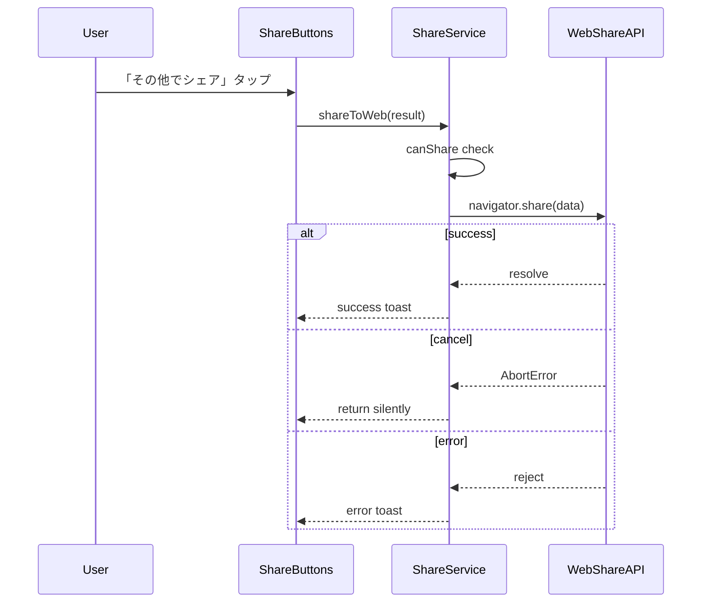

# Technical Design Document

## Overview

**Purpose**: ゲーム終了時にプレイ結果を LINE やその他のプラットフォームにシェアする機能を提供し、ユーザーエンゲージメントとアプリの拡散を促進する。

**Users**: リバーシゲームをプレイしたユーザーが対局結果を友人やフォロワーにシェアする。シェアを受け取ったユーザーは結果ページで盤面を確認し、ゲームを開始できる。

**Impact**: 現在のゲームページ（`/`）はプレイに集中させ、新規の結果ページ（`/r/[side]/[encodedMoves]`）でシェア機能を提供。プロジェクトの Hybrid Static/ISR アーキテクチャ（`tech.md` 参照）に準拠し、動的 OG 画像生成を ISR で実現する。

### Goals

- ゲーム終了時に自動的に結果ページへ遷移し、シームレスなシェア体験を提供
- サーバーサイドで OG 画像をオンデマンド生成し、外部ストレージ不要でリッチなプレビューを実現
- LINE と Web Share API の両方をサポートし、幅広いプラットフォームへのシェアを可能に
- 手順履歴を Base64URL 直接エンコード方式で変換することで、短く管理しやすいシェア URL（最大 60 文字）を生成し、将来の棋譜機能拡張にも対応

### Non-Goals

スコープ外事項は requirements.md の Non-Goals セクションを参照。

## Architecture

### Existing Architecture Analysis

現在のシステムは以下の構成（`tech.md` 参照）:

- `/src/app/` ディレクトリに App Router を配置
- Hybrid Static/ISR アーキテクチャ（静的ページ + 動的 ISR ページ）
- ゲームページ（`/`）に GameBoard コンポーネントを配置し、ゲーム終了後はその場で結果表示
- `useGameState` フックで `moveHistory`（チェス記法の文字列配列）を管理

**現在の設定からの移行が必要な項目**:

- `next.config.ts`: 現在 `output: 'export'`（Static Export）が設定されているが、ISR と `ImageResponse` による動的 OG 画像生成には削除が必要

本機能では以下の追加が必要:

- ゲームページからシェア機能を分離し、専用の結果ページ（`/r/[side]/[encodedMoves]`）を追加
- ISR による動的 OG 画像生成（`opengraph-image.tsx`）
- ゲーム終了時の自動遷移（フォールバック付き）
- 手順履歴から盤面を復元する機能

### Architecture Pattern & Boundary Map


**Architecture Integration**:

- **Selected pattern**: Feature-based layered architecture（既存パターンを踏襲）
- **Domain boundaries**: ゲームロジック（`/lib/game/`）とシェア機能（`/lib/share/`）を分離
- **Existing patterns preserved**: Components -> Hooks -> Lib の依存方向、純粋関数による Lib 実装
- **New components rationale**: 結果ページとシェア機能は新規ドメインとして追加
- **Steering compliance**: 型安全性、純粋関数、イミュータブルデータパターンを維持

### Technology Stack

| Layer            | Choice / Version            | Role in Feature        | Notes                               |
| ---------------- | --------------------------- | ---------------------- | ----------------------------------- |
| Frontend         | Next.js 16.0.7 (App Router) | 結果ページ、OG画像生成 | Hybrid Static/ISR（`tech.md` 準拠） |
| OG Image         | `next/og` ImageResponse     | サーバーサイド画像生成 | 1200x630px PNG                      |
| State            | React 19.2.1 Hooks          | シェア状態管理         | useShare フック                     |
| LINE Integration | LIFF SDK 2.27.x             | shareTargetPicker API  | Flex Message シェア                 |
| Web Share        | Web Share API               | navigator.share        | URL + テキストのみ                  |

## System Flows

### Game End to Result Page Flow


**Key Decisions**:

- ゲーム終了から 500ms 後に自動遷移開始
- 自動遷移が 2 秒以内に完了しない場合、フォールバックボタン「結果を確認する」を表示
  - **Rationale**: LTE 環境の typical RTT（50-100ms）に対して十分なマージンを確保しつつ、ユーザーの待ち時間ストレスを最小化。3G 環境（200-500ms RTT）でも複数リトライを許容できる時間。LINE WebView の初期化オーバーヘッドを考慮しても 2 秒で十分に余裕がある。
- フォールバックにより、JS 無効化やネットワーク問題など edge case でもユーザーが結果ページへ到達可能
- side パラメータ（b/w）でプレイヤー視点を保持
- 遷移後は結果ページが完全に独立してレンダリング
- 既存の `moveHistory`（チェス記法配列）を Base64URL 直接エンコード方式で変換

### LINE Share Flow


### Web Share Flow



### OG Image Request Flow


## Requirements Traceability

| Requirement        | Summary                            | Components                    | Interfaces       | Flows           |
| ------------------ | ---------------------------------- | ----------------------------- | ---------------- | --------------- |
| 1.1                | ゲーム終了時に結果ページへ自動遷移 | GameBoard, NavigationFallback | -                | Game End Flow   |
| 1.2, 1.3           | 手順とsideをURLに含める            | MoveHistoryEncoder            | encodeMoves      | Game End Flow   |
| 1.4                | 500ms以内に遷移開始                | GameBoard, NavigationFallback | -                | Game End Flow   |
| 1.5                | ゲームページはプレイに集中         | GameBoard                     | -                | -               |
| 2.1                | Base64URL直接エンコード            | MoveHistoryEncoder            | encodeMoves      | -               |
| 2.2, 2.3           | Position→Base64URL文字変換         | MoveHistoryEncoder            | positionToChar   | -               |
| 2.4                | 最大60手のURL対応                  | MoveHistoryEncoder            | -                | -               |
| 2.5                | デコードで完全復元                 | MoveHistoryEncoder            | decodeMoves      | -               |
| 3.1                | 手順から盤面復元                   | MoveHistoryEncoder            | replayMoves      | -               |
| 3.2                | 既存ゲームロジック再利用           | MoveHistoryEncoder            | -                | -               |
| 3.3                | パス処理                           | MoveHistoryEncoder            | replayMoves      | -               |
| 3.4                | 不正手検出                         | MoveHistoryEncoder            | replayMoves      | -               |
| 4.1                | 結果ページで盤面表示               | ResultPage, BoardDisplay      | -                | -               |
| 4.2                | スコア・勝敗表示                   | ResultPage                    | -                | -               |
| 4.3, 4.4           | side基づくレイアウト切替           | ResultPage                    | -                | -               |
| 4.5, 4.6           | シェアボタン表示・非表示           | ShareButtons                  | -                | -               |
| 4.7, 4.8           | もう一度遊ぶボタン                 | ResultPage                    | -                | -               |
| 4.9                | 不正URL時エラー表示                | ResultPage                    | -                | -               |
| 5.1                | shareTargetPicker呼び出し          | ShareService                  | shareToLine      | LINE Share Flow |
| 5.2                | Flex Message形式送信               | FlexMessageBuilder            | buildFlexMessage | LINE Share Flow |
| 5.3                | Flex Message内容                   | FlexMessageBuilder            | -                | -               |
| 5.4, 5.5, 5.6      | シェア結果ハンドリング             | useShare, ShareService        | -                | LINE Share Flow |
| 6.1                | Bubble形式                         | FlexMessageBuilder            | buildFlexMessage | -               |
| 6.2                | Hero画像表示                       | FlexMessageBuilder            | -                | -               |
| 6.3                | Bodyスコア表示                     | FlexMessageBuilder            | -                | -               |
| 6.4                | 対局結果ボタン                     | FlexMessageBuilder            | -                | -               |
| 6.5                | 新しく対局ボタン                   | FlexMessageBuilder            | -                | -               |
| 6.6                | AIテキスト                         | FlexMessageBuilder            | -                | -               |
| 6.7                | Footerブランディング               | FlexMessageBuilder            | -                | -               |
| 6.8                | Footer矢印リンク                   | FlexMessageBuilder            | -                | -               |
| 6.9                | homeUrl形式                        | url-builder                   | buildHomeUrl     | -               |
| 6.10               | permalinkUrl形式                   | url-builder                   | buildPermalink   | -               |
| 7.1                | navigator.share呼び出し            | ShareService                  | shareToWeb       | Web Share Flow  |
| 7.2, 7.3           | URL+テキストのみ                   | ShareService                  | -                | Web Share Flow  |
| 7.4, 7.5, 7.6      | シェア結果ハンドリング             | useShare, ShareService        | -                | Web Share Flow  |
| 8.1                | ImageResponseでOG画像生成          | opengraph-image.tsx           | -                | OG Image Flow   |
| 8.2                | 1200x630pxサイズ                   | opengraph-image.tsx           | -                | -               |
| 8.3                | OG画像内容                         | opengraph-image.tsx           | -                | -               |
| 8.4                | OG画像にside含めない               | opengraph-image.tsx           | -                | -               |
| 8.5                | 3秒以内に生成完了                  | opengraph-image.tsx           | -                | -               |
| 8.6                | OGPメタタグ                        | ResultPage (generateMetadata) | -                | -               |
| 9.1, 9.2, 9.3, 9.4 | クロスプラットフォーム             | 全コンポーネント              | -                | -               |

## Components and Interfaces

### Component Summary

| Component           | Domain/Layer | Intent                    | Req Coverage       | Key Dependencies                                              | Contracts |
| ------------------- | ------------ | ------------------------- | ------------------ | ------------------------------------------------------------- | --------- |
| MoveHistoryEncoder  | Lib/Share    | 手順のエンコード/デコード | 2.1-2.5, 3.1-3.4   | game-logic (P0)                                               | Service   |
| FlexMessageBuilder  | Lib/Share    | Flex Message構築          | 5.2, 5.3, 6.1-6.10 | LINE CDN (P1)                                                 | Service   |
| ShareService        | Lib/Share    | シェアロジック実行        | 5.1, 7.1           | LIFF (P0), WebShareAPI (P0), FlexMessageBuilder (P0)          | Service   |
| url-builder         | Lib/Share    | URL構築                   | 6.9, 6.10          | -                                                             | Service   |
| useShare            | Hooks        | シェア状態管理            | 5.4-5.6, 7.4-7.6   | ShareService (P0), useMessageQueue (P1), url-builder (P0)     | State     |
| ResultPage          | App/Routes   | 結果ページ表示            | 4.1-4.10           | MoveHistoryEncoder (P0), useShare (P1)                        | -         |
| ShareButtons        | Components   | シェアボタンUI            | 4.6, 4.7           | useShare (P0)                                                 | -         |
| BoardDisplay        | Components   | 盤面表示                  | 4.1                | -                                                             | -         |
| NavigationFallback  | Components   | 自動遷移フォールバック    | 1.1, 1.4           | Router (P0)                                                   | -         |
| opengraph-image.tsx | App/Routes   | OG画像生成                | 8.1-8.5            | MoveHistoryEncoder (P0)                                       | -         |
| GameBoard (修正)    | Components   | ゲーム終了時遷移          | 1.1-1.5            | MoveHistoryEncoder (P0), Router (P0), NavigationFallback (P1) | -         |

### Lib Layer

#### MoveHistoryEncoder

| Field        | Detail                                                                       |
| ------------ | ---------------------------------------------------------------------------- |
| Intent       | 手順履歴を Base64URL 直接エンコード方式でエンコード/デコードし盤面を復元する |
| Requirements | 2.1, 2.2, 2.3, 2.4, 2.5, 3.1, 3.2, 3.3, 3.4                                  |

**Responsibilities & Constraints**

- 手順履歴（Position 配列）を Base64URL 文字列に直接変換
- 1 手 = 1 文字（最大 60 文字、URL-safe）
- エンコード/デコードの完全な可逆性を保証
- デコードした手順から既存の `applyMove` 関数を使用して盤面を復元
- 不正なエンコード文字列の検出とエラー返却
- パス（手番スキップ）が含まれる手順の正しい処理

**Base64URL 直接エンコード方式仕様**

各手を Position から直接 Base64URL 文字に変換:

```
Position(row, col) → インデックス（row * 8 + col、0-63）→ Base64URL文字

BASE64URL_CHARS = 'ABCDEFGHIJKLMNOPQRSTUVWXYZabcdefghijklmnopqrstuvwxyz0123456789-_'

例:
  (0, 0) -> インデックス0 -> 'A'  // a1
  (3, 3) -> インデックス27 -> 'b' // d4
  (4, 5) -> インデックス37 -> 'l' // f5
  (7, 7) -> インデックス63 -> '_' // h8
```

- 1 手 = 1 文字
- 60 手 = 60 文字

**Dependencies**

- Inbound: GameBoard, ResultPage, opengraph-image.tsx - 手順エンコード/デコード (P0)
- Outbound: game-logic - applyMove, calculateValidMoves (P0)
- External: なし

**Contracts**: Service [x]

##### Service Interface

```typescript
// 場所: /src/lib/share/move-encoder.ts

import type { Board, Position } from '@/lib/game/types';

/** Base64URL 文字セット（0-63 のインデックスに対応） */
const BASE64URL_CHARS =
  'ABCDEFGHIJKLMNOPQRSTUVWXYZabcdefghijklmnopqrstuvwxyz0123456789-_';

/** デコード結果 */
type DecodeResult<T> =
  | { success: true; value: T }
  | {
      success: false;
      error: 'invalid_length' | 'invalid_characters' | 'invalid_position';
    };

/** 盤面復元結果 */
type ReplayResult =
  | { success: true; board: Board; blackCount: number; whiteCount: number }
  | {
      success: false;
      error: 'invalid_move' | 'decode_error';
      moveIndex?: number;
    };

/** Position を Base64URL 文字に変換 */
function positionToChar(position: Position): string;

/** Base64URL 文字を Position に変換 */
function charToPosition(char: string): DecodeResult<Position>;

/** 手順配列をエンコード（単純な文字列結合） */
function encodeMoves(moves: readonly Position[]): string;

/** エンコード文字列から手順配列を復元 */
function decodeMoves(encoded: string): DecodeResult<Position[]>;

/** 手順配列から盤面を復元（既存の applyMove を使用） */
function replayMoves(moves: readonly Position[]): ReplayResult;

/** 盤面からスコアを計算（既存の countStones を再エクスポート） */
function countStones(board: Board): { black: number; white: number };

/** 勝者を判定 */
function determineWinner(
  black: number,
  white: number
): 'black' | 'white' | 'draw';
```

- Preconditions: `moves` は有効な Position 配列、`encoded` は文字列
- Postconditions: エンコード結果は URL-safe な Base64URL 文字列（最大 60 文字）
- Invariants: `decodeMoves(encodeMoves(moves)) === moves`（可逆性）

**Implementation Notes**

- チェス記法から Position への変換は既存の `move-history.ts` を参照
- `applyMove` の Result 型を活用したエラーハンドリング
- パス処理: 有効手がない場合は自動的に手番を切り替え
- 単純な文字列操作で実現（Base64 エンコード/デコード処理不要）

#### FlexMessageBuilder

| Field        | Detail                                         |
| ------------ | ---------------------------------------------- |
| Intent       | LINE Flex Message 形式のシェアコンテンツを構築 |
| Requirements | 5.2, 5.3, 6.1-6.10                             |

**Responsibilities & Constraints**

- Flex Message Bubble 形式のメッセージオブジェクトを生成
- Hero セクション: OG 画像（1200:630 アスペクト比）を表示
- Body セクション: スコア表示、セパレーター、2 つの CTA ボタン、AI テキスト
- Footer セクション: アプリブランディング（アイコン、アプリ名、矢印リンク）
- LINE Flex Message 仕様に準拠

**Dependencies**

- Inbound: ShareService - Flex Message 構築 (P0)
- External: LIFF SDK types - FlexMessage 型定義 (P1)
- External: LINE CDN - アプリアイコン画像、矢印アイコン画像 (P1)

**Contracts**: Service [x]

##### Service Interface

```typescript
// 場所: /src/lib/share/flex-message-builder.ts

import type { FlexMessage } from '@liff/send-message';

/** シェア結果データ */
interface ShareResult {
  readonly encodedMoves: string;
  readonly side: 'b' | 'w';
  readonly blackCount: number;
  readonly whiteCount: number;
  readonly winner: 'black' | 'white' | 'draw';
}

/** Flex Image コンポーネント（アイコン用） */
interface FlexImage {
  type: 'image';
  url: string;
  flex?: number;
  gravity?: 'top' | 'center' | 'bottom';
  size?: string;
  aspectMode?: 'cover' | 'fit';
  action?: {
    type: 'uri';
    label: string;
    uri: string;
  };
}

/** アプリブランディング用定数 */
const APP_ICON_URL =
  'https://ch.line-scdn.net/0h13VXrO22bhxrIXCF_PERSzl8ZX5YQ3AXSRV6ewteRmUGQis6HxRqAgZxM0gPQkshHCZHOwheQkdHcE8qCxJEewdxViQCRE9KFjtXc09zRn4AanUQXztR/f256x256';
const ARROW_ICON_URL =
  'https://vos.line-scdn.net/service-notifier/footer_go_btn.png';

/**
 * Flex Message を構築
 *
 * @param result - ゲーム結果データ
 * @param permalinkUrl - 結果ページURL (miniapp.line.me)
 * @param ogImageUrl - OG画像URL (外部アクセス用エンドポイント)
 * @param homeUrl - ホームURL (miniapp.line.me、新規対局用)
 * @returns FlexMessage オブジェクト
 */
function buildFlexMessage(
  result: ShareResult,
  permalinkUrl: string,
  ogImageUrl: string,
  homeUrl: string
): FlexMessage;
```

- Preconditions: `result` は有効な ShareResult、すべての URL は HTTPS URL
- Postconditions: LINE Flex Message 仕様に準拠したオブジェクトを返却

**Flex Message 構造仕様**

```
Bubble
├── Hero
│   └── Image: OG画像 (1200:630, fit)
├── Body (paddingAll: lg)
│   ├── タイトルボックス (vertical)
│   │   └── Text: "かんたんリバーシ対局結果" (sm, #777777, bold, center, wrap: true)
│   ├── スコア表示 (horizontal, alignItems: center, margin: md)
│   │   ├── プレイヤー側: ラベル + 石マーク + スコア (勝者は王冠)
│   │   ├── vs / - (中央)
│   │   └── AI側: ラベル + スコア + 石マーク (勝者は王冠)
│   ├── Separator (margin: xl)
│   └── ボタンボックス (vertical, margin: xl, spacing: xs)
│       ├── Button: "対局結果を見る" (primary, #06C755) → permalinkUrl
│       ├── Button: "新しく対局する ● vs ○" (link, #06C755) → homeUrl
│       └── Text: "AIに勝てるかな？" (sm, center, #888888)
└── Footer (spacing: md)
    ├── Separator (#f0f0f0)
    └── ブランディングボックス (horizontal, flex: 1, spacing: md)
        ├── Image: アプリアイコン (flex: 1, xxs, gravity: center, aspectMode: fit)
        ├── Text: "かんたんリバーシ" (flex: 19, xs, #999999, bold, gravity: center, wrap: false)
        └── Image: 矢印アイコン (flex: 1, xxs, gravity: center, aspectMode: fit, action.label: "action") → homeUrl
```

**Implementation Notes**

- Hero 画像 URL: `ogImageUrl` パラメータを使用
- 「対局結果を見る」ボタン: `permalinkUrl` パラメータを使用
- 「新しく対局する」ボタン: `homeUrl` パラメータを使用
- Footer 矢印アイコン: `homeUrl` パラメータを使用
- アプリアイコン・矢印アイコン: LINE CDN の固定 URL を使用
- altText: 「リバーシ対局結果: 黒 XX - 白 YY」

#### ShareService

| Field        | Detail                                       |
| ------------ | -------------------------------------------- |
| Intent       | LINE シェアと Web Share の実行ロジックを提供 |
| Requirements | 5.1, 5.2, 7.1, 7.2, 7.3                      |

**Responsibilities & Constraints**

- LIFF `shareTargetPicker` API の呼び出し
- `navigator.share` API の呼び出し
- API 利用可能性のチェック
- エラーハンドリング（キャンセル、API エラー）
- シェア権限: LINE ログイン済みかつ `shareTargetPicker` が利用可能なすべてのユーザーがシェア可能（ゲームをプレイした本人に限定しない、ユーザー認証チェックなし）

**Dependencies**

- Inbound: useShare hook - シェア実行 (P0)
- External: LIFF SDK - shareTargetPicker (P0)
- External: Web Share API - navigator.share (P0)
- Outbound: FlexMessageBuilder - Flex Message 構築 (P0)

**Contracts**: Service [x]

##### Service Interface

```typescript
// 場所: /src/lib/share/share-service.ts

import type { ShareResult } from './flex-message-builder';

/** シェア結果 */
type ShareOutcome =
  | { status: 'success' }
  | { status: 'cancelled' }
  | { status: 'error'; message: string };

/** LINE シェア可能かチェック */
function canShareToLine(): boolean;

/** Web Share 可能かチェック */
function canShareToWeb(): boolean;

/**
 * LINE でシェア
 *
 * @param result - ゲーム結果データ
 * @param permalinkUrl - 結果ページURL (miniapp.line.me)
 * @param ogImageUrl - OG画像URL (外部アクセス用エンドポイント)
 * @param homeUrl - ホームURL (miniapp.line.me、新規対局用)
 * @returns シェア結果
 */
function shareToLine(
  result: ShareResult,
  permalinkUrl: string,
  ogImageUrl: string,
  homeUrl: string
): Promise<ShareOutcome>;

/** Web Share でシェア */
function shareToWeb(
  result: ShareResult,
  shareUrl: string
): Promise<ShareOutcome>;
```

- Preconditions: `shareToLine` は LIFF 初期化済み環境で呼び出し
- Postconditions: 成功/キャンセル/エラーのいずれかを返却

**Implementation Notes**

- `liff.isApiAvailable('shareTargetPicker')` でチェック
- `navigator.canShare` でサポート確認
- キャンセル時は `cancelled` を返却（エラー表示なし）
- `shareToLine` は `homeUrl` パラメータを `buildFlexMessage` に渡す

#### url-builder

| Field        | Detail                                    |
| ------------ | ----------------------------------------- |
| Intent       | LINE Mini App 用の URL 構築ユーティリティ |
| Requirements | 6.9, 6.10                                 |

**Responsibilities & Constraints**

- LINE Mini App permalink URL の構築（`miniapp.line.me` ドメイン）
- ホーム URL（新規対局用）の構築
- 結果ページパス、OG 画像パスの構築
- エンドポイント URL の構築（外部アクセス用）

**Dependencies**

- Inbound: useShare - URL 構築 (P0)
- Inbound: ShareService - URL 構築 (P0)
- External: なし

**Contracts**: Service [x]

##### Service Interface

```typescript
// 場所: /src/lib/share/url-builder.ts

/** LINE Mini App ドメイン（固定） */
const MINIAPP_DOMAIN = 'https://miniapp.line.me' as const;

/**
 * LINE Mini App permalink URL を構築
 *
 * @param liffId - LIFF ID (例: "2008360924-2LG5QXmN")
 * @param path - パス (例: "/r/b/ABC123")
 * @returns Permalink URL
 * @example buildPermalink("1234-abc", "/r/b/XYZ")
 *          => "https://miniapp.line.me/1234-abc/r/b/XYZ"
 */
function buildPermalink(liffId: string, path: string): string;

/**
 * LINE Mini App ホーム URL を構築（新規対局用）
 *
 * @param liffId - LIFF ID
 * @returns ホーム URL
 * @example buildHomeUrl("1234-abc")
 *          => "https://miniapp.line.me/1234-abc"
 */
function buildHomeUrl(liffId: string): string;

/**
 * 外部アクセス用エンドポイント URL を構築
 *
 * @param baseUrl - ベースエンドポイント URL
 * @param path - パス
 * @returns フルエンドポイント URL
 */
function buildEndpointUrl(baseUrl: string, path: string): string;

/**
 * 結果ページパスを構築
 *
 * @param side - プレイヤーサイド ("b" or "w")
 * @param encodedMoves - エンコード済み手順
 * @returns パス (例: "/r/b/ABC123")
 */
function buildResultPath(side: 'b' | 'w', encodedMoves: string): string;

/**
 * OG 画像パスを構築
 *
 * @param side - プレイヤーサイド
 * @param encodedMoves - エンコード済み手順
 * @returns パス (例: "/r/b/ABC123/opengraph-image")
 */
function buildOgImagePath(side: 'b' | 'w', encodedMoves: string): string;
```

- Preconditions: `liffId` は有効な LIFF ID 形式
- Postconditions: 有効な HTTPS URL を返却

**Implementation Notes**

- `buildHomeUrl` は `buildPermalink(liffId, '')` と同等だが、明示的なセマンティクスのために別関数として提供
- すべての関数は純粋関数として実装（副作用なし）

### Hooks Layer

#### useShare

| Field        | Detail                             |
| ------------ | ---------------------------------- |
| Intent       | シェア操作の状態管理とトースト表示 |
| Requirements | 5.4, 5.5, 5.6, 7.4, 7.5, 7.6       |

**Responsibilities & Constraints**

- シェア中フラグ（`isSharing`）の管理
- 成功/エラートーストの表示
- 排他制御（同時シェア防止）
- homeUrl の構築と ShareService への受け渡し

**Dependencies**

- Outbound: ShareService - シェア実行 (P0)
- Outbound: useMessageQueue - トースト表示 (P1)
- Outbound: url-builder - homeUrl 構築 (P0)

**Contracts**: State [x]

##### State Management

```typescript
// 場所: /src/hooks/useShare.ts

import type { ShareResult } from '@/lib/share/flex-message-builder';

interface UseShareReturn {
  /** シェア中フラグ */
  readonly isSharing: boolean;

  /** LINE シェア可能か */
  readonly canShareLine: boolean;

  /** Web Share 可能か */
  readonly canShareWeb: boolean;

  /** LINE でシェア */
  shareToLine: (result: ShareResult) => Promise<void>;

  /** Web Share でシェア */
  shareToWeb: (result: ShareResult) => Promise<void>;
}

function useShare(): UseShareReturn;
```

- State model: `isSharing` boolean で排他制御
- Persistence: なし（セッション内のみ）
- Concurrency: シェア中は追加シェアを無視

**Implementation Notes**

- 成功時: 「シェアしました」トースト（3秒）
- エラー時: 「シェアに失敗しました」トースト（3秒）
- キャンセル時: トースト表示なし
- `shareToLine` 内で `buildHomeUrl(liffId)` を呼び出し、homeUrl を構築して ShareService に渡す

### App Routes Layer

#### ResultPage

| Field        | Detail                                                 |
| ------------ | ------------------------------------------------------ |
| Intent       | 結果ページの表示と OGP メタデータ生成                  |
| Requirements | 4.1, 4.2, 4.3, 4.4, 4.5, 4.6, 4.7, 4.8, 4.9, 4.10, 7.6 |

**Responsibilities & Constraints**

- URL パラメータから手順をデコードして盤面を復元・表示
- side パラメータに基づくレイアウト切り替え
- スコア表示ラベル: プレイヤー側は「プレーヤー」、AI側は「AI」と表示（静的ラベル、アクセス経路によらず固定）
- シェアボタンと「もう一度遊ぶ」ボタンの表示
- 不正パラメータ時のエラー表示

**Dependencies**

- Inbound: Next.js Router - ページレンダリング (P0)
- Outbound: MoveHistoryEncoder - 手順デコード・盤面復元 (P0)
- Outbound: useShare - シェア操作 (P1)

**Contracts**: -

**Implementation Notes**

```typescript
// 場所: /src/app/r/[side]/[encodedMoves]/page.tsx

import { Metadata } from 'next';

// ISR: ビルド時には何も生成しない
export async function generateStaticParams() {
  return [];
}

// dynamicParams: true (default) - 未知のパスも許可
// revalidate 未設定 - 無期限キャッシュ

export async function generateMetadata({
  params,
}: {
  params: Promise<{ side: string; encodedMoves: string }>;
}): Promise<Metadata> {
  const { side, encodedMoves } = await params;
  // メタデータ生成ロジック
}

export default async function ResultPage({
  params,
}: {
  params: Promise<{ side: string; encodedMoves: string }>;
}) {
  const { side, encodedMoves } = await params;
  // ページレンダリングロジック
}
```

- side バリデーション: `b` または `w` のみ許可
- 不正な場合: エラーメッセージ + ゲームページへのリンク表示
- Server Component として実装、Client Component は必要な部分のみ

#### opengraph-image.tsx

| Field        | Detail                      |
| ------------ | --------------------------- |
| Intent       | OG 画像のサーバーサイド生成 |
| Requirements | 7.1, 7.2, 7.3, 7.4, 7.5     |

**Responsibilities & Constraints**

- 1200x630px の PNG 画像を生成
- 盤面、スコア、勝敗、ブランドを表示
- side 情報は含めない（汎用画像）
- 3 秒以内に生成完了

**Dependencies**

- Inbound: Next.js / クローラー - 画像リクエスト (P0)
- Outbound: MoveHistoryEncoder - 手順デコード・盤面復元 (P0)
- External: next/og ImageResponse - 画像生成 (P0)

**Contracts**: -

**Implementation Notes**

```typescript
// 場所: /src/app/r/[side]/[encodedMoves]/opengraph-image.tsx

import { ImageResponse } from 'next/og';

// alt は動的生成のため generateImageMetadata で定義
export const size = { width: 1200, height: 630 };
export const contentType = 'image/png';

export async function generateImageMetadata({
  params,
}: {
  params: Promise<{ side: string; encodedMoves: string }>;
}) {
  const { encodedMoves } = await params;
  const decodeResult = decodeMoves(encodedMoves);
  if (!decodeResult.success) {
    return [{ alt: 'リバーシ対局結果' }];
  }
  const replayResult = replayMoves(decodeResult.value);
  if (!replayResult.success) {
    return [{ alt: 'リバーシ対局結果' }];
  }
  return [
    {
      alt: `リバーシ対局結果: 黒 ${replayResult.blackCount} - 白 ${replayResult.whiteCount}`,
    },
  ];
}

export default async function Image({
  params,
}: {
  params: Promise<{ side: string; encodedMoves: string }>;
}) {
  const { encodedMoves } = await params;
  // 手順デコード + 盤面復元 + ImageResponse 生成
}
```

- flexbox レイアウトのみ使用（grid 非サポート）
- 日本語フォント: Noto Sans JP（Google Fonts から読み込み）
- side パラメータは無視（OG 画像は side 非依存）

### Components Layer

#### ShareButtons

| Field        | Detail                               |
| ------------ | ------------------------------------ |
| Intent       | LINE シェアと Web Share のボタン表示 |
| Requirements | 4.5, 4.6                             |

**Responsibilities & Constraints**

- 「LINE でシェア」ボタン（LINE 緑色）
- 「その他でシェア」ボタン（Web Share API 非対応時は非表示）
- シェア中はボタン無効化

**Dependencies**

- Inbound: ResultPage - ボタン表示 (P0)
- Outbound: useShare - シェア操作 (P0)

**Contracts**: -

**Implementation Notes**

- Client Component として実装
- `canShareWeb` が false の場合、Web Share ボタンは非表示
- LINE ボタンの色: `#06C755`（LINE Green）

#### BoardDisplay

| Field        | Detail                               |
| ------------ | ------------------------------------ |
| Intent       | 結果ページ用の盤面表示コンポーネント |
| Requirements | 4.1                                  |

**Responsibilities & Constraints**

- 8x8 の盤面を表示
- インタラクティブ機能なし（表示のみ）
- 既存 GameBoard のスタイルを流用

**Dependencies**

- Inbound: ResultPage - 盤面表示 (P0)

**Contracts**: -

**Implementation Notes**

- Server Component として実装可能
- GameBoard から表示ロジックを抽出・共通化を検討
- 最終手のハイライトなし（結果表示のため）

#### NavigationFallback

| Field        | Detail                                    |
| ------------ | ----------------------------------------- |
| Intent       | 自動遷移が失敗した場合のフォールバック UI |
| Requirements | 1.1, 1.4                                  |

**Responsibilities & Constraints**

- 自動遷移開始から 2 秒経過後に「結果を確認する」ボタンを表示
- ボタンタップで結果ページへ手動遷移
- 自動遷移成功時は表示されない（タイムアウト前に遷移完了）
- JS 無効化、ネットワーク問題などの edge case に対応

**Dependencies**

- Inbound: GameBoard - フォールバック表示 (P1)
- Outbound: Router - 手動遷移 (P0)

**Contracts**: -

**Implementation Notes**

```typescript
// NavigationFallback.tsx

interface NavigationFallbackProps {
  readonly targetUrl: string;
  readonly timeoutMs?: number; // default: 2000
}

// 2秒後にボタン表示
// ボタンテキスト: 「結果を確認する」
// スタイル: 既存ボタンスタイルを踏襲
```

- Client Component として実装（タイマー管理）
- `useState` でボタン表示状態を管理
- 自動遷移と独立して動作（遷移完了でアンマウント）

### Modifications to Existing Components

#### GameBoard (修正)

| Field        | Detail                                   |
| ------------ | ---------------------------------------- |
| Intent       | ゲーム終了時に結果ページへ自動遷移を追加 |
| Requirements | 1.1, 1.2, 1.3, 1.4, 1.5                  |

**Changes**:

- ゲーム終了時（`gameStatus.type === 'finished'`）に自動遷移トリガー追加
- 既存の結果表示 UI（lines 488-493 相当）を削除（結果ページへ移行）
- NavigationFallback コンポーネントを追加（3秒タイムアウト後に手動遷移ボタン表示）
- `next/navigation` の `useRouter` を使用
- `moveHistory` をチェス記法から Position 配列に変換してエンコード

**Implementation Notes**

```typescript
// GameBoard.tsx 内の追加ロジック

import { useRouter } from 'next/navigation';
import { NavigationFallback } from './NavigationFallback';
import { encodeMoves } from '@/lib/share/move-encoder';

// チェス記法を Position に変換するヘルパー
function notationToPosition(notation: string): Position {
  const col = notation.charCodeAt(0) - 'a'.charCodeAt(0);
  const row = parseInt(notation[1], 10) - 1;
  return { row, col };
}

// ゲーム終了時の処理
useEffect(() => {
  if (gameStatus.type === 'finished') {
    // moveHistory（チェス記法配列）を Position 配列に変換
    const positions = moveHistory.map(notationToPosition);
    const encodedMoves = encodeMoves(positions);
    const side = playerSide === 'black' ? 'b' : 'w';
    const targetUrl = `/r/${side}/${encodedMoves}`;

    // 500ms 後に自動遷移開始
    const timer = setTimeout(() => {
      router.push(targetUrl);
    }, 500);

    return () => clearTimeout(timer);
  }
}, [gameStatus, moveHistory, playerSide, router]);

// JSX内: ゲーム終了時にフォールバックを表示
{gameStatus.type === 'finished' && (
  <NavigationFallback
    targetUrl={`/r/${side}/${encodedMoves}`}
    timeoutMs={2000}
  />
)}
```

- 既存の「新しいゲームを開始」ボタンと結果表示 UI は削除（結果ページへ移行）
- 500ms 後に自動遷移、2 秒経過で「結果を確認する」フォールバックボタン表示
- 自動遷移成功時はコンポーネントごとアンマウントされるためフォールバックは表示されない

## Data Models

### Domain Model


**Entities**:

- `Board`: 8x8 の Cell 配列（既存）
- `MoveHistory`: 手順の Position 配列（既存は string[] だが内部的に Position[] に変換）
- `EncodedMoves`: URL パラメータ用のエンコード形式（Base64URL 直接エンコード）
- `ShareResult`: シェアに必要な全データを集約

**Business Rules**:

- 盤面は 64 セルで構成
- 各セルは `black`、`white`、`null` のいずれか
- 手順を初期盤面から順に適用することで任意の盤面状態を復元可能

### Logical Data Model

**EncodedMoves Structure**:

```typescript
interface EncodedMoves {
  encodedMoves: string; // Base64URL direct encoding, max 60 chars
  side: 'b' | 'w'; // Player's side
}
```

Base64URL 直接エンコード方式の仕様は MoveHistoryEncoder セクションを参照。

**URL Structure**:

```
/r/{side}/{encodedMoves}
  |   |        |
  |   |        +-- Base64URL direct encoded moves (max 60 chars)
  |   +-- b (black/先攻) or w (white/後攻)
  +-- result route prefix
```

### Data Contracts & Integration

**OG Image URL**:

```
/r/{side}/{encodedMoves}/opengraph-image
```

- Content-Type: `image/png`
- Size: 1200x630 pixels
- Cache: Full Route Cache (indefinite)

**Flex Message Structure**:

詳細な構造は `sample-flex-message.json` を参照。主要な構成:

```
FlexMessage
├── type: "flex"
├── altText: "リバーシ対局結果: 黒 XX - 白 YY"
└── contents (Bubble)
    ├── hero
    │   └── Image: OG画像 (1200:630, fit)
    ├── body (paddingAll: lg)
    │   ├── タイトルボックス (vertical)
    │   │   └── Text: "かんたんリバーシ対局結果" (sm, #777777, bold, center, wrap: true)
    │   ├── スコア表示 (horizontal box, alignItems: center, margin: md)
    │   │   ├── プレイヤー: ラベル + 石マーク + スコア (勝者は王冠)
    │   │   ├── vs / - (中央)
    │   │   └── AI: ラベル + スコア + 石マーク (勝者は王冠)
    │   ├── Separator (margin: xl)
    │   └── ボタンボックス (vertical, margin: xl, spacing: xs)
    │       ├── Button: "対局結果を見る" (primary, #06C755) → permalinkUrl
    │       ├── Button: "新しく対局する ● vs ○" (link, #06C755) → homeUrl
    │       └── Text: "AIに勝てるかな？" (sm, center, #888888)
    └── footer (spacing: md)
        ├── Separator (#f0f0f0)
        └── ブランディングボックス (horizontal, flex: 1, spacing: md)
            ├── Image: アプリアイコン (flex: 1, xxs, gravity: center, aspectMode: fit, LINE CDN)
            ├── Text: "かんたんリバーシ" (flex: 19, xs, #999999, bold, gravity: center, wrap: false)
            └── Image: 矢印アイコン (flex: 1, xxs, gravity: center, aspectMode: fit, action.label: "action", LINE CDN) → homeUrl
```

**URL パラメータ**:

| Parameter    | Format                                              | Example                                                  |
| ------------ | --------------------------------------------------- | -------------------------------------------------------- |
| permalinkUrl | `https://miniapp.line.me/{liffId}/r/{side}/{moves}` | `https://miniapp.line.me/2008360924-2LG5QXmN/r/b/ABC123` |
| ogImageUrl   | `{baseUrl}/r/{side}/{moves}/opengraph-image`        | `https://example.com/r/b/ABC123/opengraph-image`         |
| homeUrl      | `https://miniapp.line.me/{liffId}`                  | `https://miniapp.line.me/2008360924-2LG5QXmN`            |

**ブランディング用固定 URL**:

| Asset          | URL                                                                                                                                                        |
| -------------- | ---------------------------------------------------------------------------------------------------------------------------------------------------------- |
| アプリアイコン | `https://ch.line-scdn.net/0h13VXrO22bhxrIXCF_PERSzl8ZX5YQ3AXSRV6ewteRmUGQis6HxRqAgZxM0gPQkshHCZHOwheQkdHcE8qCxJEewdxViQCRE9KFjtXc09zRn4AanUQXztR/f256x256` |
| 矢印アイコン   | `https://vos.line-scdn.net/service-notifier/footer_go_btn.png`                                                                                             |

## Error Handling

### Error Strategy

エラーは発生箇所で捕捉し、ユーザーには適切なフィードバックを提供。致命的でないエラーはグレースフルデグラデーションで対応。

### Error Categories and Responses

**User Errors (4xx)**:

| Error                | Cause                   | Response                        |
| -------------------- | ----------------------- | ------------------------------- |
| Invalid side         | URL の side が b/w 以外 | エラーページ + ゲームへのリンク |
| Invalid encodedMoves | Base64URL デコード失敗  | エラーページ + ゲームへのリンク |
| Invalid position     | Base64URL 文字が無効    | エラーページ + ゲームへのリンク |
| Invalid move         | 手順の途中で不正な手    | エラーページ + ゲームへのリンク |

**System Errors (5xx)**:

| Error                       | Cause                      | Response               |
| --------------------------- | -------------------------- | ---------------------- |
| OG image generation timeout | ImageResponse タイムアウト | デフォルト画像を返却   |
| LIFF API unavailable        | shareTargetPicker 非対応   | LINE ボタン無効化      |
| Web Share unavailable       | navigator.share 非対応     | Web Share ボタン非表示 |

**Business Logic Errors**:

| Error           | Cause              | Response                       |
| --------------- | ------------------ | ------------------------------ |
| Share cancelled | ユーザーキャンセル | 静かに復帰（トースト表示なし） |
| Share failed    | API エラー         | エラートースト表示             |

### Monitoring

- コンソールエラーログ（開発環境）
- `console.error` でエラー詳細を記録
- 本番環境でのエラートラッキングは将来検討

## Testing Strategy

### Unit Tests

1. **MoveHistoryEncoder**: エンコード/デコードの可逆性、Base64URL 直接エンコード変換、不正入力のバリデーション
2. **replayMoves**: 手順からの盤面復元、パス処理、不正手検出
3. **FlexMessageBuilder**: 生成される Flex Message の構造検証（Body ボタン、Footer ブランディング含む）
4. **ShareService**: API 呼び出しのモック、エラーハンドリング、homeUrl パラメータの受け渡し
5. **url-builder**: buildHomeUrl、buildPermalink、buildResultPath、buildOgImagePath の URL 生成
6. **countStones / determineWinner**: スコア計算と勝者判定
7. **NavigationFallback**: タイムアウト後のボタン表示、手動遷移動作

### Integration Tests

1. **ResultPage + MoveHistoryEncoder**: URL パラメータからの盤面復元
2. **useShare + ShareService**: シェアフロー全体
3. **opengraph-image.tsx**: OG 画像生成（スナップショット）

### E2E Tests

1. **ゲーム終了 -> 結果ページ遷移**: 自動遷移の動作確認
2. **結果ページ直接アクセス**: 正常/異常 URL での表示
3. **シェアボタン表示**: Web Share API 可用性による表示切り替え
4. **フォールバックボタン表示**: 自動遷移タイムアウト時の「結果を確認する」ボタン表示

### Manual Testing

- LINE アプリ内での shareTargetPicker 動作
- 各 SNS での OG 画像プレビュー表示
- iOS/Android 両環境での動作確認

## Performance & Scalability

### Target Metrics

| Operation               | Target        | Strategy                                   |
| ----------------------- | ------------- | ------------------------------------------ |
| 手順エンコード          | <10ms         | 単純な文字列操作                           |
| 手順デコード            | <10ms         | 単純な文字列操作                           |
| 盤面復元（60手）        | <50ms         | 既存 applyMove の連続適用                  |
| OG 画像初回生成         | <3s (要件)    | ImageResponse 最適化、フォント事前読み込み |
| OG 画像キャッシュヒット | <100ms        | ISR Full Route Cache                       |
| 結果ページ表示          | <1s           | 軽量ページ構成                             |
| 自動遷移開始            | <500ms (要件) | 500ms 後に遷移実行                         |
| フォールバック表示      | 2s            | 自動遷移タイムアウト後にボタン表示         |

### Caching Strategy

- **ISR (Incremental Static Regeneration)**: リクエスト時生成 + 無期限キャッシュ
- **Full Route Cache**: ページと OG 画像の両方をキャッシュ
- **Cache Invalidation**: デプロイ時に自動クリア

## Security Considerations

### Threat Analysis

| Threat     | Risk | Mitigation                          |
| ---------- | ---- | ----------------------------------- |
| 手順改ざん | 低   | 不正な手は replayMoves でエラー検出 |
| 不正 URL   | 低   | バリデーションでエラーページ表示    |
| XSS        | なし | ユーザー入力なし（手順データのみ）  |

### Data Protection

- 個人情報の取り扱いなし
- シェアコンテンツに機密情報なし
- URL は公開可能な形式

## Migration Strategy

### Phase 1: 設定変更 + Core Components

**設定変更（ISR サポートのため必須）**:

1. `next.config.ts` から `output: 'export'` 設定を削除
   - **理由**: Static Export モードでは ISR と `ImageResponse` による動的 OG 画像生成が使用不可
   - **影響**: ビルド出力が `/out` ディレクトリから `.next` に変更、Vercel での ISR サポートが有効化

**Core Components 実装**:

2. `MoveHistoryEncoder` 実装 + テスト（Base64URL 直接エンコード/デコード + 盤面復元）
3. 結果ページ（`/src/app/r/[side]/[encodedMoves]/page.tsx`）実装
4. `opengraph-image.tsx` 実装

### Phase 2: Share Functionality

1. `FlexMessageBuilder` 実装
2. `ShareService` 実装
3. `useShare` フック実装
4. `ShareButtons` コンポーネント実装

### Phase 3: Integration

1. `NavigationFallback` コンポーネント実装
2. `GameBoard` に自動遷移ロジック追加
3. 既存の結果表示 UI を削除（lines 488-493 相当）
4. E2E テスト実装

### Rollback Plan

- `GameBoard` の変更をリバート（結果表示 UI を復元）
- 結果ページルートを削除

## Supporting References

### Flex Message Full Structure

sample-flex-message.json を参照。実装時は以下の点を調整:

- Hero 画像 URL を動的生成
- スコアを動的表示
- CTA ボタン URL を動的生成

### Configuration Changes

#### next.config.ts

ISR と動的 OG 画像生成のため `output: 'export'` を削除:

```diff
// next.config.ts
import type { NextConfig } from 'next';

const nextConfig: NextConfig = {
- output: 'export',
  images: {
    unoptimized: true,
  },
};

export default nextConfig;
```

**Note**: この設定変更により、プロジェクトは Static Export から Hybrid Static/ISR アーキテクチャ（`tech.md` 参照）に移行する。Vercel では ISR が自動的にサポートされ、追加設定は不要。

### Base64URL Direct Encoding Reference

Base64URL 直接エンコード方式の詳細仕様は MoveHistoryEncoder セクションを参照。
