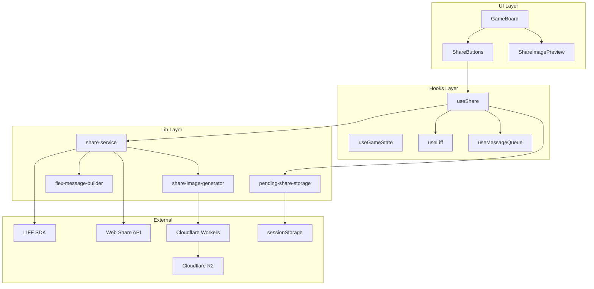
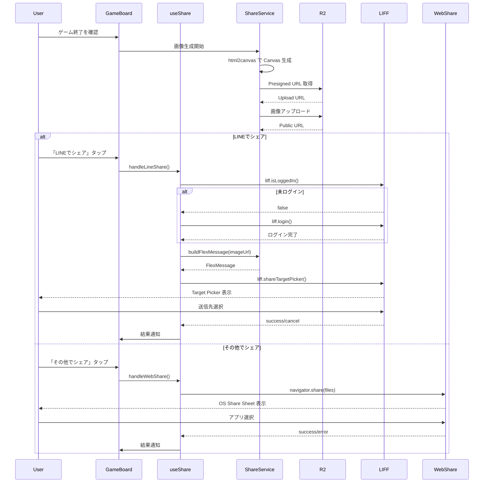
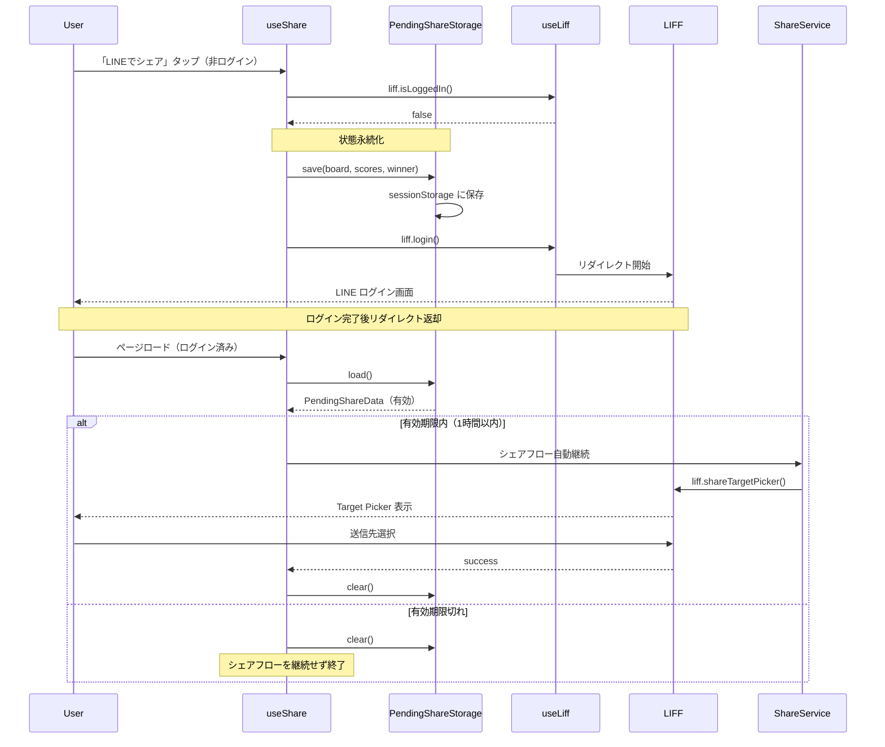

# Design Document: ゲーム結果シェア機能

## Overview

**Purpose**: リバーシゲーム終了時に、盤面・スコア・勝敗を含む画像を生成し、LINEまたはOS標準のシェア機能を通じて友人に共有する機能を提供する。

**Users**: リバーシをプレイしたユーザーが、ゲーム結果を友人やグループに共有し、ゲームへの招待を行う。

**Impact**: 既存のGameBoardコンポーネントのゲーム終了画面を拡張し、シェアボタンとシェア機能を追加する。新規インフラとしてCloudflare R2/Workersを導入。

### Goals

- ゲーム終了時に視覚的に魅力的なシェア画像を生成する
- LINEログイン済みユーザーはFlex Messageでリッチなシェアを実現する
- LINE非ログインでもOS標準シェア機能で画像共有を可能にする
- 非ログイン時のシェア操作をログイン後も継続可能にする
- シェア操作の成功/失敗をユーザーに適切にフィードバックする

### Non-Goals

- シェアテキストのカスタマイズ機能（将来検討）
- シェア履歴の保存
- シェア回数のトラッキング/分析
- 対人戦時の対戦相手情報表示
- サーバーサイドでの画像生成

## Architecture

### Existing Architecture Analysis

現在のアーキテクチャは以下の特徴を持つ：

- **静的エクスポート**: `output: 'export'` によりサーバーサイド処理なし
- **LIFF統合**: LiffProvider → LiffContext → useLiff パターン
- **メッセージ通知**: useMessageQueue + MessageBox による統一通知
- **ゲーム状態**: useGameState でゲーム状態・終了判定を管理

シェア機能は既存のLIFF統合パターンを拡張し、ゲーム終了画面（`gameStatus.type === 'finished'`）にシェアUIを追加する。

### Architecture Pattern & Boundary Map



**Architecture Integration**:

- **Selected pattern**: Hooks + Pure Functions（既存パターンに準拠）
- **Domain boundaries**: UI（Components）→ State Management（Hooks）→ Business Logic（Lib）の単方向依存
- **Existing patterns preserved**: useLiff, useMessageQueue, GameBoard構造を維持
- **New components rationale**: シェア固有のロジックを分離し、テスタビリティと再利用性を確保
- **State persistence**: PendingShareStorageでログインリダイレクト間の状態を保持
- **Steering compliance**: Pure Logic vs Stateful Hooks の分離原則に準拠

### Technology Stack

| Layer            | Choice / Version      | Role in Feature                  | Notes                    |
| ---------------- | --------------------- | -------------------------------- | ------------------------ |
| Frontend         | React 19.2.0          | UIコンポーネント、フック         | 既存                     |
| Image Generation | html2canvas ^1.4.1    | Canvas画像生成                   | 新規依存                 |
| LINE Integration | @line/liff 2.x        | shareTargetPicker, Flex Message  | 既存                     |
| Web Share        | Navigator.share() API | OS標準シェア                     | ブラウザAPI              |
| State Persist    | sessionStorage        | ログインリダイレクト間の状態保持 | ブラウザAPI              |
| Storage          | Cloudflare R2         | 画像ホスティング                 | 新規インフラ（許容済み） |
| Storage API      | Cloudflare Workers    | Presigned URL生成                | 新規インフラ（許容済み） |

**インフラ方針**: 静的エクスポート（`output: 'export'`）の方針を維持しつつ、画像ストレージ用に新規Cloudflare R2/Workersインフラの構築を許容。フロントエンドとストレージAPIは独立してデプロイ可能。

## System Flows

### シェアフロー概要



### 画像生成タイミング

ゲーム終了時（`gameStatus.type === 'finished'`）に画像生成を開始し、バックグラウンドでアップロードを完了する。ユーザーがシェアボタンをタップする時点で画像URLが利用可能であることを目指す。

### ログイン後シェア継続フロー

非ログイン状態で「LINEでシェア」をタップした場合、`liff.login()` によるページリダイレクトが発生する。リダイレクト間でゲーム状態を保持し、シェアフローを自動継続する。



**State Persistence選択理由（sessionStorage）**:

- LIFFリダイレクト後もデータ保持される（同一オリジン）
- 全ブラウザ環境（LINEアプリ内ブラウザ、Safari、Chrome）で安定動作
- タブを閉じると自動クリア（プライバシー配慮）
- localStorageと異なり永続化しないため、古いデータが残り続けるリスクが低い

## Requirements Traceability

| Requirement | Summary                    | Components                        | Interfaces                     | Flows                      |
| ----------- | -------------------------- | --------------------------------- | ------------------------------ | -------------------------- |
| 1.1         | シェアボタン表示           | ShareButtons                      | -                              | -                          |
| 1.2         | ボタン配置                 | ShareButtons                      | -                              | -                          |
| 1.3         | LINEブランドカラー         | ShareButtons                      | -                              | -                          |
| 1.4         | ボタンサイズ               | ShareButtons                      | -                              | -                          |
| 1.5         | Web Share非対応時の非表示  | ShareButtons                      | useShare.canWebShare           | -                          |
| 2.1         | ログイン済みでのシェア     | useShare                          | ShareService.shareViaLine      | シェアフロー               |
| 2.2         | 非ログイン時のログイン処理 | useShare                          | useLiff.login                  | シェアフロー               |
| 2.3         | ログイン後のシェア継続     | useShare                          | -                              | シェアフロー               |
| 2.4         | Flex Message形式           | FlexMessageBuilder                | buildShareFlexMessage          | -                          |
| 2.5         | Flex Messageに画像含む     | FlexMessageBuilder                | -                              | -                          |
| 2.6         | 結果テキスト・招待文       | FlexMessageBuilder                | -                              | -                          |
| 2.7         | アプリ起動ボタン           | FlexMessageBuilder                | -                              | -                          |
| 2.8         | 非ログイン時の状態保存     | useShare, PendingShareStorage     | PendingShareStorage.save       | ログイン後シェア継続フロー |
| 2.9         | ログイン後の状態復元       | useShare, PendingShareStorage     | PendingShareStorage.load/clear | ログイン後シェア継続フロー |
| 2.10        | 保存状態の有効期限         | PendingShareStorage               | PendingShareStorage.isExpired  | ログイン後シェア継続フロー |
| 3.1         | Web Share API呼び出し      | ShareService                      | shareViaWebShare               | シェアフロー               |
| 3.2         | 画像ファイル共有           | ShareService                      | -                              | -                          |
| 3.3         | シェアテキスト             | ShareService                      | -                              | -                          |
| 3.4         | ログイン状態非依存         | ShareButtons, useShare            | -                              | -                          |
| 4.1         | 画像生成開始               | ShareImageGenerator               | generateShareImage             | シェアフロー               |
| 4.2         | 盤面状態含む               | ShareImagePreview                 | -                              | -                          |
| 4.3         | スコア表示                 | ShareImagePreview                 | -                              | -                          |
| 4.4         | 勝敗テキスト               | ShareImagePreview                 | -                              | -                          |
| 4.5         | ブランディング要素         | ShareImagePreview                 | -                              | -                          |
| 4.6         | 外部ストレージアップロード | ShareService, ShareImageGenerator | uploadImage                    | シェアフロー               |
| 5.1-5.4     | シェアテキスト構成         | ShareService                      | buildShareText                 | -                          |
| 6.1         | シェア完了通知             | useShare                          | useMessageQueue.addMessage     | -                          |
| 6.2         | エラー通知                 | useShare                          | useMessageQueue.addMessage     | -                          |
| 6.3         | キャンセル時の挙動         | useShare                          | -                              | -                          |
| 7.1-7.4     | クロスプラットフォーム     | 全コンポーネント                  | -                              | -                          |
| 8.1-8.2     | パフォーマンス             | ShareService                      | -                              | シェアフロー               |

## Components and Interfaces

| Component           | Domain/Layer | Intent                         | Req Coverage                        | Key Dependencies                                                                | Contracts |
| ------------------- | ------------ | ------------------------------ | ----------------------------------- | ------------------------------------------------------------------------------- | --------- |
| ShareButtons        | UI           | シェアボタン表示・制御         | 1.1-1.5, 3.4                        | useShare (P0)                                                                   | -         |
| ShareImagePreview   | UI           | シェア画像DOM構築              | 4.2-4.5                             | -                                                                               | -         |
| useShare            | Hooks        | シェア状態・操作管理           | 2.1-2.3, 2.8-2.10, 3.1-3.4, 6.1-6.3 | useLiff (P0), useMessageQueue (P0), ShareService (P0), PendingShareStorage (P0) | State     |
| ShareService        | Lib          | シェア処理ビジネスロジック     | 2.4-2.7, 3.1-3.3, 4.1, 4.6, 5.1-5.4 | FlexMessageBuilder (P1), ShareImageGenerator (P1)                               | Service   |
| FlexMessageBuilder  | Lib          | Flex Message構築               | 2.4-2.7                             | -                                                                               | Service   |
| ShareImageGenerator | Lib          | 画像生成・アップロード         | 4.1, 4.6, 8.1-8.2                   | html2canvas (P0, External), Cloudflare Workers API (P0, External)               | Service   |
| PendingShareStorage | Lib          | ログインリダイレクト間状態保持 | 2.8, 2.9, 2.10                      | sessionStorage (External)                                                       | Service   |

### UI Layer

#### ShareButtons

| Field        | Detail                                             |
| ------------ | -------------------------------------------------- |
| Intent       | ゲーム終了時にLINEシェア・OS標準シェアボタンを表示 |
| Requirements | 1.1, 1.2, 1.3, 1.4, 1.5, 3.4                       |

**Responsibilities & Constraints**

- ゲーム終了状態でのみ表示
- 「LINEでシェア」ボタンはLINEブランドカラー（`#06C755`）で表示
- 「その他でシェア」ボタンはWeb Share API対応時のみ表示
- タップしやすいサイズ（最小44x44px）を確保

**Dependencies**

- Inbound: GameBoard — ゲーム終了時のUI統合 (P0)
- Outbound: useShare — シェア操作の委譲 (P0)

**Contracts**: State [ ]

**Props Interface**

```typescript
interface ShareButtonsProps {
  /** シェア画像の準備完了状態 */
  readonly isShareReady: boolean;
  /** LINE シェアボタンのクリックハンドラ */
  readonly onLineShare: () => void;
  /** Web Share ボタンのクリックハンドラ */
  readonly onWebShare: () => void;
  /** Web Share API 対応状態 */
  readonly canWebShare: boolean;
  /** シェア処理中フラグ */
  readonly isSharing: boolean;
}
```

**Implementation Notes**

- 既存の `.reset-button` スタイルを基にLINEボタンスタイルを追加
- `disabled` 状態は `isShareReady === false` または `isSharing === true` 時

---

#### ShareImagePreview

| Field        | Detail                                               |
| ------------ | ---------------------------------------------------- |
| Intent       | シェア用画像のDOM構造を構築（html2canvasの描画対象） |
| Requirements | 4.2, 4.3, 4.4, 4.5                                   |

**Responsibilities & Constraints**

- 固定サイズ: 1200x630px（OGP比率）
- 横並びレイアウト: 左側に盤面、右側に結果情報
- 盤面サイズ: 560x560px（8x8グリッド、できるだけ大きく）
- スコア表示: 黒/白の石数を表示
- 勝敗テキストパターン:
  - 黒（プレーヤー）勝利: 「プレーヤーの勝ち!」
  - 白（AI）勝利: 「プレーヤーの負け...」
  - 引き分け: 「引き分け」
- ブランド名: 「かんたんリバーシ」
- 背景色: 濃緑系（#1a2f14）
- 絵文字は不使用

**レイアウト図**

```
┌──────────────────────────────────────────────────────┐
│  ┌──────────────┐   ┌─────────────────────────────┐  │
│  │              │   │   プレーヤーの勝ち!          │  │
│  │  [盤面 8x8]   │   │   ─────────────────         │  │
│  │  (560x560)   │   │   ● 36                      │  │
│  │              │   │   ○ 28                      │  │
│  │              │   │   ─────────────────         │  │
│  └──────────────┘   │   かんたんリバーシ           │  │
│                     └─────────────────────────────┘  │
└──────────────────────────────────────────────────────┘
```

**Dependencies**

- Inbound: ShareService — html2canvasキャプチャ対象 (P0)

**Contracts**: -

**Props Interface**

```typescript
interface ShareImagePreviewProps {
  /** 盤面状態 */
  readonly board: Board;
  /** 黒石の数 */
  readonly blackCount: number;
  /** 白石の数 */
  readonly whiteCount: number;
  /** 勝者（'black' | 'white' | 'draw'） */
  readonly winner: Player | 'draw';
  /** 参照用のref */
  readonly containerRef: React.RefObject<HTMLDivElement>;
}
```

**Implementation Notes**

- `visibility: hidden` でレンダリングするが画面には非表示
- 外部画像（プロフィール画像等）は含めない（CORS制約）
- インラインスタイルを使用しhtml2canvas互換性を確保
- winner プロパティから勝敗テキストを導出: `black` → 「プレーヤーの勝ち!」、`white` → 「プレーヤーの負け...」、`draw` → 「引き分け」

### Hooks Layer

#### useShare

| Field        | Detail                                                           |
| ------------ | ---------------------------------------------------------------- |
| Intent       | シェア操作の状態管理と実行制御                                   |
| Requirements | 2.1, 2.2, 2.3, 2.8, 2.9, 2.10, 3.1, 3.2, 3.3, 3.4, 6.1, 6.2, 6.3 |

**Responsibilities & Constraints**

- シェア画像の準備状態を管理
- LINEログイン状態に応じたシェアフロー制御
- ログインリダイレクト間のゲーム状態保持・復元
- シェア結果のメッセージ通知
- 複数回シェア操作の排他制御

**Dependencies**

- Inbound: GameBoard / ShareButtons — シェア操作の呼び出し (P0)
- Outbound: useLiff — ログイン状態・ログイン処理 (P0)
- Outbound: useMessageQueue — 通知表示 (P0)
- Outbound: ShareService — シェア実行 (P0)
- Outbound: PendingShareStorage — 状態永続化 (P0)

**Contracts**: State [x]

##### State Management

```typescript
interface UseShareReturn {
  /** シェア画像の準備完了状態 */
  readonly isShareReady: boolean;
  /** シェア処理中フラグ */
  readonly isSharing: boolean;
  /** Web Share API 対応状態 */
  readonly canWebShare: boolean;
  /** シェア画像URL（アップロード完了後） */
  readonly shareImageUrl: string | null;
  /** LINEシェア実行 */
  readonly handleLineShare: () => Promise<void>;
  /** Web Share実行 */
  readonly handleWebShare: () => Promise<void>;
  /** 画像生成開始（ゲーム終了時に呼び出し） */
  readonly prepareShareImage: (
    board: Board,
    blackCount: number,
    whiteCount: number,
    winner: Player | 'draw'
  ) => Promise<void>;
}
```

- State model: `isShareReady`, `isSharing`, `shareImageUrl`, `hasPendingShare`
- Persistence: PendingShareStorage経由でsessionStorageに一時保存
- Concurrency: `isSharing` フラグで排他制御

**Implementation Notes**

- ゲーム終了検出時に `prepareShareImage` を呼び出す
- LINEシェアは `liff.isLoggedIn()` → 未ログインなら状態保存後 `liff.login()` → リダイレクト返却後に状態復元 → `shareTargetPicker()`
- Web Share は `navigator.canShare()` で事前チェック
- フック初期化時に `PendingShareStorage.load()` でペンディング状態を確認し、有効なら自動シェアフローを開始

### Lib Layer

#### ShareService

| Field        | Detail                                                          |
| ------------ | --------------------------------------------------------------- |
| Intent       | シェア処理のビジネスロジックを提供                              |
| Requirements | 2.4, 2.5, 2.6, 2.7, 3.1, 3.2, 3.3, 4.1, 4.6, 5.1, 5.2, 5.3, 5.4 |

**Responsibilities & Constraints**

- 画像生成・アップロードの調整
- Flex Messageの構築
- シェアテキストの構築
- LIFF SDK / Web Share API の呼び出し

**Dependencies**

- Inbound: useShare — シェア処理の実行 (P0)
- Outbound: FlexMessageBuilder — Flex Message構築 (P1)
- Outbound: ShareImageGenerator — 画像生成 (P1)
- External: LIFF SDK — shareTargetPicker (P0)
- External: Web Share API — navigator.share (P0)

**Contracts**: Service [x]

##### Service Interface

```typescript
interface ShareServiceResult<T> {
  readonly success: boolean;
  readonly data?: T;
  readonly error?: ShareError;
}

type ShareError =
  | { type: 'upload_failed'; message: string }
  | { type: 'share_failed'; message: string }
  | { type: 'cancelled' }
  | { type: 'not_supported' };

interface ShareService {
  /**
   * シェア画像を生成しアップロードする
   * @returns 画像の公開URL
   */
  prepareShareImage(
    containerRef: React.RefObject<HTMLDivElement>
  ): Promise<ShareServiceResult<string>>;

  /**
   * LINEでシェアを実行
   */
  shareViaLine(
    imageUrl: string,
    result: GameResult
  ): Promise<ShareServiceResult<void>>;

  /**
   * Web Share APIでシェアを実行
   */
  shareViaWebShare(
    imageBlob: Blob,
    result: GameResult
  ): Promise<ShareServiceResult<void>>;

  /**
   * シェアテキストを構築
   */
  buildShareText(result: GameResult): string;
}

interface GameResult {
  readonly winner: Player | 'draw';
  readonly blackCount: number;
  readonly whiteCount: number;
}
```

- Preconditions: containerRefがマウント済み、画像生成可能な状態
- Postconditions: 成功時はURL/void、失敗時はエラー情報を返す
- Invariants: 純粋関数として副作用は最小限に

**Implementation Notes**

- `shareViaLine` は `liff.isApiAvailable("shareTargetPicker")` で事前チェック
- `shareViaWebShare` は `navigator.canShare({ files })` で事前チェック
- アップロードエラー時はローカルダウンロードへのフォールバックを検討

---

#### FlexMessageBuilder

| Field        | Detail                              |
| ------------ | ----------------------------------- |
| Intent       | LINE Flex Messageオブジェクトを構築 |
| Requirements | 2.4, 2.5, 2.6, 2.7                  |

**Responsibilities & Constraints**

- Flex Message（Bubble）形式でメッセージを構築
- Hero: シェア画像
- Body: 結果テキスト + 招待文
- Footer: 「リバーシで遊ぶ」URIアクションボタン
- アクションは全てURI形式（shareTargetPicker制約）

**Dependencies**

- Inbound: ShareService — Flex Message構築 (P0)

**Contracts**: Service [x]

##### Service Interface

```typescript
import type { FlexMessage } from '@line/liff';

interface FlexMessageBuilder {
  /**
   * シェア用Flex Messageを構築
   */
  buildShareFlexMessage(
    imageUrl: string,
    result: GameResult,
    appUrl: string
  ): FlexMessage;
}
```

**Implementation Notes**

- `@line/liff` の FlexMessage 型を使用
- 画像URLはHTTPS必須
- `altText` は「リバーシの結果をシェア」等の代替テキスト

---

#### ShareImageGenerator

| Field        | Detail                                          |
| ------------ | ----------------------------------------------- |
| Intent       | DOM要素から画像を生成しストレージにアップロード |
| Requirements | 4.1, 4.6, 8.1, 8.2                              |

**Responsibilities & Constraints**

- html2canvasでDOM要素をCanvasに変換
- Canvas を Blob (PNG) に変換
- Cloudflare R2 へアップロードし公開URLを取得
- アップロード失敗時のエラーハンドリング

**Dependencies**

- Inbound: ShareService — 画像生成の実行 (P0)
- External: html2canvas — Canvas生成 (P0)
- External: Cloudflare R2 API — 画像アップロード (P0)

**Contracts**: Service [x]

##### Service Interface

```typescript
interface ShareImageGenerator {
  /**
   * DOM要素から画像Blobを生成
   */
  generateImageBlob(
    containerRef: React.RefObject<HTMLDivElement>,
    options?: ImageGenerationOptions
  ): Promise<Blob>;

  /**
   * 画像をストレージにアップロード
   */
  uploadImage(blob: Blob): Promise<string>;
}

interface ImageGenerationOptions {
  /** 解像度スケール（デフォルト: 2） */
  readonly scale?: number;
  /** 出力形式（デフォルト: 'image/png'） */
  readonly format?: 'image/png' | 'image/jpeg';
  /** JPEG品質（0-1、デフォルト: 0.9） */
  readonly quality?: number;
}
```

**Implementation Notes**

- `html2canvas(element, { scale: 2 })` で高解像度生成
- アップロードは Presigned URL を使用（Cloudflare Workers で生成）

##### Presigned URL API Specification

Cloudflare Workers APIの最小仕様:

| Method | Endpoint              | Request                     | Response                              | Errors        |
| ------ | --------------------- | --------------------------- | ------------------------------------- | ------------- |
| POST   | /api/upload/presigned | `{ contentType, fileSize }` | `{ uploadUrl, publicUrl, expiresIn }` | 400, 413, 500 |

**Request Schema**:

```typescript
interface PresignedUrlRequest {
  /** MIMEタイプ（image/png のみ許可） */
  readonly contentType: 'image/png';
  /** ファイルサイズ（バイト） */
  readonly fileSize: number;
}
```

**Response Schema**:

```typescript
interface PresignedUrlResponse {
  /** R2への直接アップロードURL */
  readonly uploadUrl: string;
  /** アップロード後の公開URL */
  readonly publicUrl: string;
  /** アップロードURL有効期限（秒） */
  readonly expiresIn: number;
}
```

**Constraints**:

- 最大ファイルサイズ: 1MB（413 Payload Too Large）
- アップロードURL有効期限: 5分（300秒）
- 公開URL有効期間: 24時間（R2オブジェクトライフサイクル）
- Content-Type: `image/png` のみ許可

---

#### PendingShareStorage

| Field        | Detail                                                           |
| ------------ | ---------------------------------------------------------------- |
| Intent       | ゲーム終了状態をログインリダイレクト間で永続化するストレージ管理 |
| Requirements | 2.8, 2.9, 2.10                                                   |

**Responsibilities & Constraints**

- sessionStorageを使用した状態永続化
- 有効期限（1時間）の管理
- シェア完了または新規ゲーム開始時のクリア

**Dependencies**

- Inbound: useShare — 状態保存・復元の呼び出し (P0)
- External: sessionStorage — ブラウザストレージAPI (P0)

**Contracts**: Service [x]

##### Service Interface

```typescript
import type { Cell } from '@/lib/game/types';

interface PendingShareData {
  /** 最終盤面 */
  readonly board: Cell[][];
  /** 黒石数 */
  readonly blackCount: number;
  /** 白石数 */
  readonly whiteCount: number;
  /** 勝者 */
  readonly winner: 'black' | 'white' | 'draw';
  /** 保存時刻（ミリ秒） */
  readonly timestamp: number;
}

interface PendingShareStorage {
  /** Storage Key */
  readonly STORAGE_KEY: 'pendingShareGame';

  /**
   * ゲーム終了状態を保存
   */
  save(data: Omit<PendingShareData, 'timestamp'>): void;

  /**
   * 保存済み状態を読み出し
   * @returns 有効な状態があればPendingShareData、なければnull
   */
  load(): PendingShareData | null;

  /**
   * 保存済み状態をクリア
   */
  clear(): void;

  /**
   * 保存状態が有効期限切れかどうかを判定
   * @param data 保存データ
   * @returns 1時間以上経過していればtrue
   */
  isExpired(data: PendingShareData): boolean;
}
```

- Preconditions: sessionStorageが利用可能であること
- Postconditions: save後はload可能、clear後はloadがnullを返す
- Invariants: 有効期限（1時間 = 3600000ms）

**Implementation Notes**

- Storage Key: `pendingShareGame`
- JSONシリアライズ/デシリアライズでデータ永続化
- `isExpired` は `Date.now() - data.timestamp > 3600000` で判定
- sessionStorageはLIFFリダイレクト後も同一オリジンで保持される
- タブを閉じると自動クリアされるため、プライバシーに配慮

## Data Models

### Domain Model

#### GameResult Value Object

```typescript
interface GameResult {
  readonly winner: Player | 'draw';
  readonly blackCount: number;
  readonly whiteCount: number;
}
```

- GameStatus から抽出される勝敗情報
- シェアコンテンツ構築に使用

#### ShareState

```typescript
interface ShareState {
  readonly status: 'idle' | 'preparing' | 'ready' | 'sharing';
  readonly imageUrl: string | null;
  readonly imageBlob: Blob | null;
  readonly error: ShareError | null;
  /** ログインリダイレクト後の自動シェア待機状態 */
  readonly hasPendingShare: boolean;
}
```

#### PendingShareData Value Object

```typescript
interface PendingShareData {
  /** 最終盤面（Cell[][] 形式） */
  readonly board: Cell[][];
  /** 黒石数 */
  readonly blackCount: number;
  /** 白石数 */
  readonly whiteCount: number;
  /** 勝者 */
  readonly winner: 'black' | 'white' | 'draw';
  /** 保存時刻（Unix timestamp ミリ秒） */
  readonly timestamp: number;
}
```

- ログインリダイレクト間でゲーム終了状態を保持
- sessionStorageにJSON形式で永続化
- 有効期限: 1時間（3600000ms）

### Data Contracts & Integration

#### Flex Message Payload

```typescript
// LINE Messaging API Flex Message (Bubble)
{
  type: "flex",
  altText: "リバーシの結果をシェア",
  contents: {
    type: "bubble",
    hero: {
      type: "image",
      url: "https://r2.example.com/share-images/xxx.png",
      size: "full",
      aspectRatio: "1200:630",
      aspectMode: "cover"
    },
    body: {
      type: "box",
      layout: "vertical",
      contents: [
        {
          type: "text",
          text: "プレーヤーの勝ち!",
          weight: "bold",
          size: "xl",
          align: "center"
        },
        {
          type: "text",
          text: "黒 32 vs 白 32",
          size: "md",
          align: "center"
        },
        {
          type: "text",
          text: "リバーシで対戦しませんか?",
          size: "sm",
          align: "center",
          color: "#888888"
        }
      ]
    },
    footer: {
      type: "box",
      layout: "vertical",
      contents: [
        {
          type: "button",
          action: {
            type: "uri",
            label: "リバーシで遊ぶ",
            uri: "https://liff.line.me/xxxx"
          },
          style: "primary",
          color: "#06C755"
        }
      ]
    }
  }
}
```

## Error Handling

### Error Strategy

シェア機能は「成功すれば良い」オプショナル機能のため、致命的エラーよりもグレースフルデグラデーションを優先する。

### Error Categories and Responses

**User Errors (4xx)**:

- 未ログイン状態でLINEシェア → ログイン誘導フロー
- Web Share非対応環境 → ボタン非表示で回避

**System Errors (5xx)**:

- 画像生成失敗 → エラートースト表示、リトライ可能
- アップロード失敗 → エラートースト表示、ローカルダウンロード提案
- shareTargetPicker失敗 → エラートースト表示

**Business Logic Errors**:

- ユーザーキャンセル → 通知なし、元の画面に戻る

### Monitoring

- `console.error` によるエラーログ出力
- 将来的には分析用イベント送信を検討

## Testing Strategy

### Unit Tests

- `FlexMessageBuilder.buildShareFlexMessage`: 正しいFlex Message構造を生成
- `ShareService.buildShareText`: 勝敗・スコアに応じたテキスト生成
- `useShare`: 状態遷移（idle → preparing → ready → sharing）
- `PendingShareStorage.save/load/clear`: sessionStorage操作の正確性
- `PendingShareStorage.isExpired`: 有効期限判定ロジック

### Integration Tests

- `ShareImageGenerator.generateImageBlob`: html2canvasによる画像生成
- `ShareService.shareViaLine`: LIFF SDKモックでのshareTargetPicker呼び出し
- `ShareService.shareViaWebShare`: Web Share APIモックでのシェア実行
- `useShare` + `PendingShareStorage`: ログインリダイレクト後の状態復元・シェア継続

### E2E Tests

- ゲーム終了 → シェアボタン表示の確認
- Web Share非対応環境での「その他でシェア」ボタン非表示確認
- 非ログイン状態でのLINEシェア → ログイン後のシェアフロー継続（sessionStorage経由）

## Security Considerations

- **画像URL有効期限**: Presigned URLは5分の有効期限を設定し、長期間の不正利用を防止
- **公開URL有効期間**: R2オブジェクトは24時間のライフサイクルで自動削除
- **CORS設定**: R2バケットは特定オリジン（アプリドメイン）からのアップロードのみ許可
- **ユーザー入力なし**: シェアコンテンツはゲーム結果から自動生成されるため、XSSリスクは低い
- **sessionStorage使用**: ゲーム状態の一時保存はsessionStorageを使用し、タブを閉じると自動クリア。localStorageと異なり永続化しないため、プライバシーリスクを軽減
- **状態有効期限**: PendingShareDataは1時間で無効化し、古い状態の再利用を防止

## Performance & Scalability

### Target Metrics

- 画像生成: 500ms以内（html2canvas）
- 画像アップロード: 2秒以内（500KB以下のPNG）
- シェアボタン表示までの遅延: ゲーム終了から3秒以内

### Optimization Techniques

- ゲーム終了検出時にバックグラウンドで画像生成開始
- 画像サイズ最適化（1200x630px、PNG圧縮）
- アップロード中はローディング状態を表示しUXを維持
