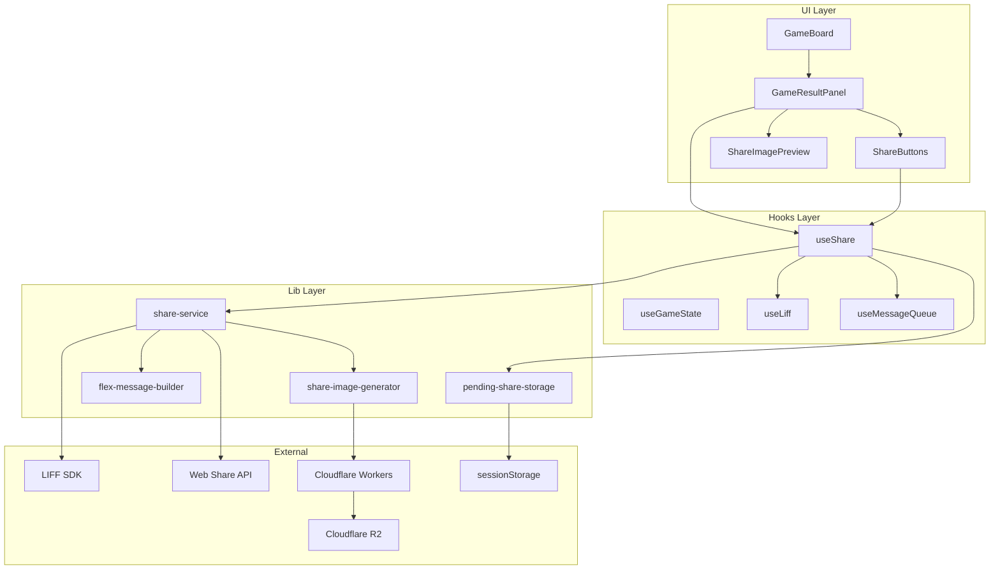

# Design Document: ゲーム結果シェア機能

## Overview

**Purpose**: リバーシゲーム終了時に、盤面・スコア・勝敗を含む画像を生成し、LINEまたはOS標準のシェア機能を通じて友人に共有する機能を提供する。

**Users**: リバーシをプレイしたユーザーが、ゲーム結果を友人やグループに共有し、ゲームへの招待を行う。

**Impact**: 既存のGameBoardコンポーネントのゲーム終了画面を拡張し、シェアボタンとシェア機能を追加する。新規インフラとしてCloudflare R2/Workersを導入。

### Goals

- ゲーム終了時に視覚的に魅力的なシェア画像を生成する
- LINEログイン済みユーザーはFlex Messageでリッチなシェアを実現する
- LINE非ログインでもOS標準シェア機能で画像共有を可能にする
- 非ログイン時のシェア操作をログイン後も継続可能にする
- シェア操作の成功/失敗をユーザーに適切にフィードバックする

### Non-Goals

- シェアテキストのカスタマイズ機能（将来検討）
- シェア履歴の保存
- シェア回数のトラッキング/分析
- 対人戦時の対戦相手情報表示
- サーバーサイドでの画像生成

## Architecture

### Existing Architecture Analysis

現在のアーキテクチャは以下の特徴を持つ：

- **静的エクスポート**: `output: 'export'` によりサーバーサイド処理なし
- **LIFF統合**: LiffProvider → LiffContext → useLiff パターン
- **メッセージ通知**: useMessageQueue + MessageBox による統一通知
- **ゲーム状態**: useGameState でゲーム状態・終了判定を管理

シェア機能は既存のLIFF統合パターンを拡張し、ゲーム終了画面（`gameStatus.type === 'finished'`）にシェアUIを追加する。

### Architecture Pattern & Boundary Map



**Architecture Integration**:

- **Selected pattern**: Hooks + Pure Functions（既存パターンに準拠）
- **Domain boundaries**: UI（Components）→ State Management（Hooks）→ Business Logic（Lib）の単方向依存
- **Existing patterns preserved**: useLiff, useMessageQueue, GameBoard構造を維持
- **New components rationale**: GameResultPanelがシェア関連UIを統合し、GameBoardの責務を軽減。シェア固有のロジックをuseShareに分離しテスタビリティと再利用性を確保
- **State persistence**: PendingShareStorageでログインリダイレクト間の状態を保持
- **Steering compliance**: Pure Logic vs Stateful Hooks の分離原則に準拠

**Component Hierarchy**:

```
GameBoard
├── useGameState (ゲーム状態管理)
├── 盤面表示、ユーザー入力処理
└── {gameStatus.type === 'finished' && <GameResultPanel />}

GameResultPanel (NEW)
├── useShare (シェア状態をカプセル化)
├── ShareButtons
├── ShareImagePreview
└── 勝敗表示、スコア表示
```

### Technology Stack

| Layer            | Choice / Version      | Role in Feature                  | Notes                    |
| ---------------- | --------------------- | -------------------------------- | ------------------------ |
| Frontend         | React 19.2.0          | UIコンポーネント、フック         | 既存                     |
| Image Generation | html2canvas ^1.4.1    | Canvas画像生成                   | 新規依存                 |
| LINE Integration | @line/liff 2.x        | shareTargetPicker, Flex Message  | 既存                     |
| Web Share        | Navigator.share() API | OS標準シェア                     | ブラウザAPI              |
| State Persist    | sessionStorage        | ログインリダイレクト間の状態保持 | ブラウザAPI              |
| Storage          | Cloudflare R2         | 画像ホスティング                 | 新規インフラ（許容済み） |
| Storage API      | Cloudflare Workers    | Presigned URL生成                | 新規インフラ（許容済み） |

**インフラ方針**: 静的エクスポート（`output: 'export'`）の方針を維持しつつ、画像ストレージ用に新規Cloudflare R2/Workersインフラの構築を許容。フロントエンドとストレージAPIは独立してデプロイ可能。

## System Flows

### シェアフロー概要

```mermaid
sequenceDiagram
    participant User
    participant GameBoard
    participant useShare
    participant ShareService
    participant R2
    participant LIFF
    participant WebShare

    User->>GameBoard: ゲーム終了を確認
    GameBoard->>ShareService: 画像生成開始
    ShareService->>ShareService: html2canvas で Canvas 生成
    ShareService->>R2: Presigned URL 取得
    R2-->>ShareService: Upload URL
    ShareService->>R2: 画像アップロード
    R2-->>ShareService: Public URL

    alt LINEでシェア
        User->>GameBoard: 「LINEでシェア」タップ
        GameBoard->>useShare: handleLineShare()
        useShare->>LIFF: liff.isLoggedIn()
        alt 未ログイン
            LIFF-->>useShare: false
            useShare->>LIFF: liff.login()
            LIFF-->>useShare: ログイン完了
        end
        useShare->>ShareService: buildFlexMessage(imageUrl)
        ShareService-->>useShare: FlexMessage
        useShare->>LIFF: liff.shareTargetPicker()
        LIFF-->>User: Target Picker 表示
        User->>LIFF: 送信先選択
        LIFF-->>useShare: success/cancel
        useShare->>GameBoard: 結果通知
    else その他でシェア
        User->>GameBoard: 「その他でシェア」タップ
        GameBoard->>useShare: handleWebShare()
        useShare->>WebShare: navigator.share(files)
        WebShare-->>User: OS Share Sheet 表示
        User->>WebShare: アプリ選択
        WebShare-->>useShare: success/error
        useShare->>GameBoard: 結果通知
    end
```



### 画像生成タイミング

ゲーム終了時（`gameStatus.type === 'finished'`）に画像生成を開始し、バックグラウンドでアップロードを完了する。ユーザーがシェアボタンをタップする時点で画像URLが利用可能であることを目指す。

### ログイン後シェア継続フロー

非ログイン状態で「LINEでシェア」をタップした場合、`liff.login()` によるページリダイレクトが発生する。リダイレクト間でゲーム状態を保持し、シェアフローを自動継続する。

```mermaid
sequenceDiagram
    participant User
    participant useShare
    participant PendingShareStorage
    participant useLiff
    participant LIFF
    participant ShareService

    User->>useShare: 「LINEでシェア」タップ（非ログイン）
    useShare->>useLiff: liff.isLoggedIn()
    useLiff-->>useShare: false

    Note over useShare,PendingShareStorage: 状態永続化
    useShare->>PendingShareStorage: save(board, scores, winner)
    PendingShareStorage->>PendingShareStorage: sessionStorage に保存

    useShare->>useLiff: liff.login()
    useLiff->>LIFF: リダイレクト開始
    LIFF-->>User: LINE ログイン画面

    Note over User,LIFF: ログイン完了後リダイレクト返却

    User->>useShare: ページロード（ログイン済み）
    useShare->>PendingShareStorage: load()
    PendingShareStorage-->>useShare: PendingShareData（有効）

    alt 有効期限内（1時間以内）
        useShare->>ShareService: シェアフロー自動継続
        ShareService->>LIFF: liff.shareTargetPicker()
        LIFF-->>User: Target Picker 表示
        User->>LIFF: 送信先選択
        LIFF-->>useShare: success
        useShare->>PendingShareStorage: clear()
    else 有効期限切れ
        useShare->>PendingShareStorage: clear()
        Note over useShare: シェアフローを継続せず終了
    end
```



**State Persistence選択理由（sessionStorage）**:

- LIFFリダイレクト後もデータ保持される（同一オリジン）
- 全ブラウザ環境（LINEアプリ内ブラウザ、Safari、Chrome）で安定動作
- タブを閉じると自動クリア（プライバシー配慮）
- localStorageと異なり永続化しないため、古いデータが残り続けるリスクが低い

## Requirements Traceability

| Requirement | Summary                    | Components                              | Interfaces                     | Flows                      |
| ----------- | -------------------------- | --------------------------------------- | ------------------------------ | -------------------------- |
| 1.1         | シェアボタン表示           | GameResultPanel, ShareButtons           | -                              | -                          |
| 1.2         | ボタン配置                 | GameResultPanel, ShareButtons           | -                              | -                          |
| 1.3         | LINEブランドカラー         | ShareButtons                            | -                              | -                          |
| 1.4         | ボタンサイズ               | ShareButtons                            | -                              | -                          |
| 1.5         | Web Share非対応時の非表示  | GameResultPanel, ShareButtons           | useShare.canWebShare           | -                          |
| 2.1         | ログイン済みでのシェア     | useShare                                | ShareService.shareViaLine      | シェアフロー               |
| 2.2         | 非ログイン時のログイン処理 | useShare                                | useLiff.login                  | シェアフロー               |
| 2.3         | ログイン後のシェア継続     | useShare                                | -                              | シェアフロー               |
| 2.4         | Flex Message形式           | FlexMessageBuilder                      | buildShareFlexMessage          | -                          |
| 2.5         | Flex Messageに画像含む     | FlexMessageBuilder                      | -                              | -                          |
| 2.6         | 結果テキスト・招待文       | FlexMessageBuilder                      | -                              | -                          |
| 2.7         | アプリ起動ボタン           | FlexMessageBuilder                      | -                              | -                          |
| 2.8         | 非ログイン時の状態保存     | useShare, PendingShareStorage           | PendingShareStorage.save       | ログイン後シェア継続フロー |
| 2.9         | ログイン後の状態復元       | useShare, PendingShareStorage           | PendingShareStorage.load/clear | ログイン後シェア継続フロー |
| 2.10        | 保存状態の有効期限         | PendingShareStorage                     | PendingShareStorage.isExpired  | ログイン後シェア継続フロー |
| 3.1         | Web Share API呼び出し      | ShareService                            | shareViaWebShare               | シェアフロー               |
| 3.2         | 画像ファイル共有           | ShareService                            | -                              | -                          |
| 3.3         | シェアテキスト             | ShareService                            | -                              | -                          |
| 3.4         | ログイン状態非依存         | GameResultPanel, ShareButtons, useShare | -                              | -                          |
| 4.1         | 画像生成開始               | GameResultPanel, ShareImageGenerator    | generateShareImage             | シェアフロー               |
| 4.2         | 盤面状態含む               | GameResultPanel, ShareImagePreview      | -                              | -                          |
| 4.3         | スコア表示                 | GameResultPanel, ShareImagePreview      | -                              | -                          |
| 4.4         | 勝敗テキスト               | GameResultPanel, ShareImagePreview      | -                              | -                          |
| 4.5         | ブランディング要素         | ShareImagePreview                       | -                              | -                          |
| 4.6         | 外部ストレージアップロード | ShareService, ShareImageGenerator       | uploadImage                    | シェアフロー               |
| 5.1-5.4     | シェアテキスト構成         | ShareService                            | buildShareText                 | -                          |
| 6.1         | シェア完了通知             | GameResultPanel, useShare               | useMessageQueue.addMessage     | -                          |
| 6.2         | エラー通知                 | GameResultPanel, useShare               | useMessageQueue.addMessage     | -                          |
| 6.3         | キャンセル時の挙動         | GameResultPanel, useShare               | -                              | -                          |
| 7.1-7.4     | クロスプラットフォーム     | 全コンポーネント                        | -                              | -                          |
| 8.1-8.2     | パフォーマンス             | GameResultPanel, ShareService           | -                              | シェアフロー               |

## Components and Interfaces

| Component           | Domain/Layer | Intent                         | Req Coverage                        | Key Dependencies                                                                | Contracts |
| ------------------- | ------------ | ------------------------------ | ----------------------------------- | ------------------------------------------------------------------------------- | --------- |
| GameResultPanel     | UI           | ゲーム結果画面の統合管理       | 1.1-1.5, 4.2-4.5, 6.1-6.3           | useShare (P0), ShareButtons (P0), ShareImagePreview (P0)                        | -         |
| ShareButtons        | UI           | シェアボタン表示・制御         | 1.1-1.5, 3.4                        | -                                                                               | -         |
| ShareImagePreview   | UI           | シェア画像DOM構築              | 4.2-4.5                             | -                                                                               | -         |
| useShare            | Hooks        | シェア状態・操作管理           | 2.1-2.3, 2.8-2.10, 3.1-3.4, 6.1-6.3 | useLiff (P0), useMessageQueue (P0), ShareService (P0), PendingShareStorage (P0) | State     |
| ShareService        | Lib          | シェア処理ビジネスロジック     | 2.4-2.7, 3.1-3.3, 4.1, 4.6, 5.1-5.4 | FlexMessageBuilder (P1), ShareImageGenerator (P1)                               | Service   |
| FlexMessageBuilder  | Lib          | Flex Message構築               | 2.4-2.7                             | -                                                                               | Service   |
| ShareImageGenerator | Lib          | 画像生成・アップロード         | 4.1, 4.6, 8.1-8.2                   | html2canvas (P0, External), Cloudflare Workers API (P0, External)               | Service   |
| PendingShareStorage | Lib          | ログインリダイレクト間状態保持 | 2.8, 2.9, 2.10                      | sessionStorage (External)                                                       | Service   |

### UI Layer

#### GameResultPanel

| Field        | Detail                                                     |
| ------------ | ---------------------------------------------------------- |
| Intent       | ゲーム終了時の結果表示とシェア機能を統合管理するパネル     |
| Requirements | 1.1, 1.2, 1.3, 1.4, 1.5, 4.2, 4.3, 4.4, 4.5, 6.1, 6.2, 6.3 |

**Responsibilities & Constraints**

- ゲーム終了状態（`gameStatus.type === 'finished'`）でのみレンダリング
- useShareフックを使用しシェア状態をカプセル化
- ShareButtons、ShareImagePreviewを子コンポーネントとして統合
- 勝敗表示、スコア表示のUI提供
- コンポーネントマウント時にprepareShareImageを自動呼び出し

**Dependencies**

- Inbound: GameBoard — ゲーム終了時のUI統合 (P0)
- Outbound: useShare — シェア状態・操作管理 (P0)
- Outbound: ShareButtons — シェアボタン表示 (P0)
- Outbound: ShareImagePreview — シェア画像DOM (P0)

**Contracts**: -

**Props Interface**

```typescript
interface GameResultPanelProps {
  /** 盤面状態 */
  readonly board: Board;
  /** 黒石の数 */
  readonly blackCount: number;
  /** 白石の数 */
  readonly whiteCount: number;
  /** 勝者（'black' | 'white' | 'draw'） */
  readonly winner: Player | 'draw';
  /** ゲームリセットハンドラ */
  readonly onReset: () => void;
}
```

**Implementation Notes**

- useShareフックを内部で使用し、シェア関連の状態と操作をカプセル化
- useEffectでコンポーネントマウント時にprepareShareImageを自動呼び出し
- ShareButtonsにはuseShareから取得したprops（isShareReady, onLineShare, onWebShare, canWebShare, isSharing）を渡す
- 既存の「新しいゲームを開始」ボタンとシェアボタンを横並びで配置
- 勝敗テキストパターン: `black` → 「あなたの勝ち!」、`white` → 「AIの勝ち!」、`draw` → 「引き分け」
  - ※アプリ上の表示は「あなた」視点（表示を見る人＝プレイヤー本人）

---

#### ShareButtons

| Field        | Detail                                             |
| ------------ | -------------------------------------------------- |
| Intent       | ゲーム終了時にLINEシェア・OS標準シェアボタンを表示 |
| Requirements | 1.1, 1.2, 1.3, 1.4, 1.5, 3.4                       |

**Responsibilities & Constraints**

- ゲーム終了状態でのみ表示
- 「LINEでシェア」ボタンはLINEブランドカラー（`#06C755`）で表示
- 「その他でシェア」ボタンはWeb Share API対応時のみ表示
- タップしやすいサイズ（最小44x44px）を確保

**Dependencies**

- Inbound: GameResultPanel — ゲーム終了時のUI統合 (P0)

**Contracts**: State [ ]

**Props Interface**

```typescript
interface ShareButtonsProps {
  /** シェア画像の準備完了状態 */
  readonly isShareReady: boolean;
  /** LINE シェアボタンのクリックハンドラ */
  readonly onLineShare: () => void;
  /** Web Share ボタンのクリックハンドラ */
  readonly onWebShare: () => void;
  /** Web Share API 対応状態 */
  readonly canWebShare: boolean;
  /** シェア処理中フラグ */
  readonly isSharing: boolean;
}
```

**Implementation Notes**

- 既存の `.reset-button` スタイルを基にLINEボタンスタイルを追加
- `disabled` 状態は `isShareReady === false` または `isSharing === true` 時

---

#### ShareImagePreview

| Field        | Detail                                               |
| ------------ | ---------------------------------------------------- |
| Intent       | シェア用画像のDOM構造を構築（html2canvasの描画対象） |
| Requirements | 4.2, 4.3, 4.4, 4.5                                   |

**Responsibilities & Constraints**

- 固定サイズ: 1200x630px（OGP比率）
- 横並びレイアウト: 左側に盤面、右側に結果情報
- 盤面サイズ: 560x560px（8x8グリッド、できるだけ大きく）
- スコア表示: 黒/白の石数を表示
- 勝敗テキストパターン:
  - 黒（プレーヤー）勝利: 「プレーヤーの勝ち!」
  - 白（AI）勝利: 「プレーヤーの負け...」
  - 引き分け: 「引き分け」
- ブランド名: 「かんたんリバーシ」
- 背景色: 濃緑系（#1a2f14）
- 絵文字は不使用

**レイアウト図**

```
┌──────────────────────────────────────────────────────┐
│  ┌──────────────┐   ┌─────────────────────────────┐  │
│  │              │   │   プレーヤーの勝ち!          │  │
│  │  [盤面 8x8]   │   │   ─────────────────         │  │
│  │  (560x560)   │   │   ● 36                      │  │
│  │              │   │   ○ 28                      │  │
│  │              │   │   ─────────────────         │  │
│  └──────────────┘   │   かんたんリバーシ           │  │
│                     └─────────────────────────────┘  │
└──────────────────────────────────────────────────────┘
```

**Dependencies**

- Inbound: ShareService — html2canvasキャプチャ対象 (P0)

**Contracts**: -

**Props Interface**

```typescript
interface ShareImagePreviewProps {
  /** 盤面状態 */
  readonly board: Board;
  /** 黒石の数 */
  readonly blackCount: number;
  /** 白石の数 */
  readonly whiteCount: number;
  /** 勝者（'black' | 'white' | 'draw'） */
  readonly winner: Player | 'draw';
  /** 参照用のref */
  readonly containerRef: React.RefObject<HTMLDivElement>;
}
```

**Implementation Notes**

- `visibility: hidden` でレンダリングするが画面には非表示
- 外部画像（プロフィール画像等）は含めない（CORS制約）
- インラインスタイルを使用しhtml2canvas互換性を確保
- winner プロパティから勝敗テキストを導出: `black` → 「プレーヤーの勝ち!」、`white` → 「プレーヤーの負け...」、`draw` → 「引き分け」
  - ※シェア画像は第三者視点（画像を見る人≠プレイヤー本人）のため、アプリ上の表示とは異なる表現を使用

### Hooks Layer

#### useShare

| Field        | Detail                                                           |
| ------------ | ---------------------------------------------------------------- |
| Intent       | シェア操作の状態管理と実行制御                                   |
| Requirements | 2.1, 2.2, 2.3, 2.8, 2.9, 2.10, 3.1, 3.2, 3.3, 3.4, 6.1, 6.2, 6.3 |

**Responsibilities & Constraints**

- シェア画像の準備状態を管理
- LINEログイン状態に応じたシェアフロー制御
- ログインリダイレクト間のゲーム状態保持・復元
- シェア結果のメッセージ通知
- 複数回シェア操作の排他制御

**Dependencies**

- Inbound: GameResultPanel — シェア操作の呼び出し (P0)
- Outbound: useLiff — ログイン状態・ログイン処理 (P0)
- Outbound: useMessageQueue — 通知表示 (P0)
- Outbound: ShareService — シェア実行 (P0)
- Outbound: PendingShareStorage — 状態永続化 (P0)

**Contracts**: State [x]

##### State Management

```typescript
interface UseShareReturn {
  /** シェア画像の準備完了状態 */
  readonly isShareReady: boolean;
  /** シェア処理中フラグ */
  readonly isSharing: boolean;
  /** Web Share API 対応状態 */
  readonly canWebShare: boolean;
  /** シェア画像URL（アップロード完了後） */
  readonly shareImageUrl: string | null;
  /** LINEシェア実行 */
  readonly handleLineShare: () => Promise<void>;
  /** Web Share実行 */
  readonly handleWebShare: () => Promise<void>;
  /** 画像生成開始（ゲーム終了時に呼び出し） */
  readonly prepareShareImage: (
    board: Board,
    blackCount: number,
    whiteCount: number,
    winner: Player | 'draw'
  ) => Promise<void>;
}
```

- State model: `isShareReady`, `isSharing`, `shareImageUrl`, `hasPendingShare`
- Persistence: PendingShareStorage経由でsessionStorageに一時保存
- Concurrency: `isSharing` フラグで排他制御

**Implementation Notes**

- `prepareShareImage`はGameResultPanelがマウントされた時点で自動的に呼び出される（GameResultPanelのuseEffect内で実行）
- LINEシェアは `liff.isLoggedIn()` → 未ログインなら状態保存後 `liff.login()` → リダイレクト返却後に状態復元 → `shareTargetPicker()`
- Web Share は `navigator.canShare()` で事前チェック
- フック初期化時に `PendingShareStorage.load()` でペンディング状態を確認し、有効なら自動シェアフローを開始

### Lib Layer

#### ShareService

| Field        | Detail                                                          |
| ------------ | --------------------------------------------------------------- |
| Intent       | シェア処理のビジネスロジックを提供                              |
| Requirements | 2.4, 2.5, 2.6, 2.7, 3.1, 3.2, 3.3, 4.1, 4.6, 5.1, 5.2, 5.3, 5.4 |

**Responsibilities & Constraints**

- 画像生成・アップロードの調整
- Flex Messageの構築
- シェアテキストの構築
- LIFF SDK / Web Share API の呼び出し

**Dependencies**

- Inbound: useShare — シェア処理の実行 (P0)
- Outbound: FlexMessageBuilder — Flex Message構築 (P1)
- Outbound: ShareImageGenerator — 画像生成 (P1)
- External: LIFF SDK — shareTargetPicker (P0)
- External: Web Share API — navigator.share (P0)

**Contracts**: Service [x]

##### Service Interface

```typescript
interface ShareServiceResult<T> {
  readonly success: boolean;
  readonly data?: T;
  readonly error?: ShareError;
}

type ShareError =
  | { type: 'upload_failed'; message: string }
  | { type: 'share_failed'; message: string }
  | { type: 'image_too_large'; message: string }
  | { type: 'cancelled' }
  | { type: 'not_supported' };

interface ShareService {
  /**
   * シェア画像を生成しアップロードする
   * @returns 画像の公開URL
   */
  prepareShareImage(
    containerRef: React.RefObject<HTMLDivElement>
  ): Promise<ShareServiceResult<string>>;

  /**
   * LINEでシェアを実行
   */
  shareViaLine(
    imageUrl: string,
    result: GameResult
  ): Promise<ShareServiceResult<void>>;

  /**
   * Web Share APIでシェアを実行
   */
  shareViaWebShare(
    imageBlob: Blob,
    result: GameResult
  ): Promise<ShareServiceResult<void>>;

  /**
   * シェアテキストを構築
   */
  buildShareText(result: GameResult): string;
}

// GameResult型はData Models（@/lib/share/types）で定義
// import type { GameResult } from '@/lib/share/types';
```

- Preconditions: containerRefがマウント済み、画像生成可能な状態
- Postconditions: 成功時はURL/void、失敗時はエラー情報を返す
- Invariants: 純粋関数として副作用は最小限に

**Implementation Notes**

- `shareViaLine` は `liff.isApiAvailable("shareTargetPicker")` で事前チェック
- `shareViaWebShare` は `navigator.canShare({ files })` で事前チェック
- アップロードエラー時はローカルダウンロードへのフォールバックを検討

---

#### FlexMessageBuilder

| Field        | Detail                              |
| ------------ | ----------------------------------- |
| Intent       | LINE Flex Messageオブジェクトを構築 |
| Requirements | 2.4, 2.5, 2.6, 2.7                  |

**Responsibilities & Constraints**

- Flex Message（Bubble）形式でメッセージを構築
- Hero: シェア画像
- Body: 3カラム構成で勝者を王冠で表示 + 招待文（「AIに勝てるかな？」）
- Footer: 「かんたんリバーシをプレイ」URIアクションボタン
- アクションは全てURI形式（shareTargetPicker制約）
- `aspectMode: "fit"` を使用（画像全体を表示）

**Dependencies**

- Inbound: ShareService — Flex Message構築 (P0)

**Contracts**: Service [x]

##### Service Interface

```typescript
import type { FlexMessage } from '@line/liff';

interface FlexMessageBuilder {
  /**
   * シェア用Flex Messageを構築
   */
  buildShareFlexMessage(
    imageUrl: string,
    result: GameResult,
    appUrl: string
  ): FlexMessage;
}
```

**Implementation Notes**

- `@line/liff` の FlexMessage 型を使用
- 画像URLはHTTPS必須
- `altText` は「リバーシの結果をシェア」等の代替テキスト
- `aspectMode: "fit"` を使用（画像全体を表示）
- Body部分は3カラム構成で勝者を王冠（テキスト）で表示
- 招待文: 「AIに勝てるかな？」
- ボタンラベル: 「かんたんリバーシをプレイ」

---

#### ShareImageGenerator

| Field        | Detail                                          |
| ------------ | ----------------------------------------------- |
| Intent       | DOM要素から画像を生成しストレージにアップロード |
| Requirements | 4.1, 4.6, 8.1, 8.2                              |

**Responsibilities & Constraints**

- html2canvasでDOM要素をCanvasに変換
- Canvas を Blob (PNG) に変換
- Cloudflare R2 へアップロードし公開URLを取得
- アップロード失敗時のエラーハンドリング

**Dependencies**

- Inbound: ShareService — 画像生成の実行 (P0)
- External: html2canvas — Canvas生成 (P0)
- External: Cloudflare R2 API — 画像アップロード (P0)

**Contracts**: Service [x]

##### Service Interface

```typescript
interface ShareImageGenerator {
  /**
   * DOM要素から画像Blobを生成
   */
  generateImageBlob(
    containerRef: React.RefObject<HTMLDivElement>,
    options?: ImageGenerationOptions
  ): Promise<Blob>;

  /**
   * 画像をストレージにアップロード
   */
  uploadImage(blob: Blob): Promise<string>;
}

interface ImageGenerationOptions {
  /** 解像度スケール（デフォルト: 2） */
  readonly scale?: number;
  /** 出力形式（デフォルト: 'image/png'） */
  readonly format?: 'image/png' | 'image/jpeg';
  /** JPEG品質（0-1、デフォルト: 0.9） */
  readonly quality?: number;
  /** 最大ファイルサイズ（バイト、デフォルト: 1MB = 1048576） */
  readonly maxSizeBytes?: number;
}
```

**Error Conditions**

- 生成画像が `maxSizeBytes`（デフォルト1MB）を超過した場合、`ShareError { type: 'image_too_large', message: '...' }` を返す

**Implementation Notes**

- `html2canvas(element, { scale: 2 })` で高解像度生成
- アップロードは Presigned URL を使用（Cloudflare Workers で生成）
- 画像サイズが `maxSizeBytes` を超過した場合は早期にエラーを返し、アップロードを試行しない

##### Presigned URL API Specification

Cloudflare Workers APIの最小仕様:

| Method | Endpoint              | Request                     | Response                              | Errors        |
| ------ | --------------------- | --------------------------- | ------------------------------------- | ------------- |
| POST   | /api/upload/presigned | `{ contentType, fileSize }` | `{ uploadUrl, publicUrl, expiresIn }` | 400, 413, 500 |

**Request Schema**:

```typescript
interface PresignedUrlRequest {
  /** MIMEタイプ（image/png のみ許可） */
  readonly contentType: 'image/png';
  /** ファイルサイズ（バイト） */
  readonly fileSize: number;
}
```

**Response Schema**:

```typescript
interface PresignedUrlResponse {
  /** R2への直接アップロードURL */
  readonly uploadUrl: string;
  /** アップロード後の公開URL */
  readonly publicUrl: string;
  /** アップロードURL有効期限（秒） */
  readonly expiresIn: number;
}
```

**Constraints**:

- 最大ファイルサイズ: 1MB（413 Payload Too Large）
- アップロードURL有効期限: 5分（300秒）
- 公開URL有効期間: 24時間（R2オブジェクトライフサイクル）
- Content-Type: `image/png` のみ許可

##### ローカル開発用モックAPI仕様

Cloudflare Workers/R2の初回セットアップが必要なため、フロントエンド開発を並行して進めるためのモックAPIを提供する。

**モックサーバー仕様**:

| Method | Endpoint              | Request                     | Response                              | Notes                    |
| ------ | --------------------- | --------------------------- | ------------------------------------- | ------------------------ |
| POST   | /api/upload/presigned | `{ contentType, fileSize }` | `{ uploadUrl, publicUrl, expiresIn }` | モックレスポンスを返却   |
| PUT    | /mock-upload/:id      | Binary (image data)         | 204 No Content                        | 画像データを受け取るのみ |

**モックレスポンス例**:

```typescript
// POST /api/upload/presigned のレスポンス
{
  uploadUrl: 'http://localhost:3001/mock-upload/test-image-id',
  publicUrl: 'http://localhost:3001/mock-images/test-image-id.png',
  expiresIn: 300
}
```

**環境変数による切り替え**:

```typescript
// 環境変数
NEXT_PUBLIC_SHARE_API_URL=http://localhost:3001  // 開発時（モック）
NEXT_PUBLIC_SHARE_API_URL=https://share-api.example.com  // 本番時（Cloudflare Workers）

// 使用例
const apiUrl = process.env.NEXT_PUBLIC_SHARE_API_URL || 'http://localhost:3001';
const response = await fetch(`${apiUrl}/api/upload/presigned`, { ... });
```

**モックサーバー実装方針**:

- `packages/mock-share-api/` に独立したパッケージとして配置
- Express.js または Hono で軽量に実装
- 開発時は `pnpm dev:mock` で並行起動
- 実際のファイル保存は不要（レスポンスを返すのみ）
- 画像プレビュー用に静的ファイルサーバー機能を含む

---

#### PendingShareStorage

| Field        | Detail                                                           |
| ------------ | ---------------------------------------------------------------- |
| Intent       | ゲーム終了状態をログインリダイレクト間で永続化するストレージ管理 |
| Requirements | 2.8, 2.9, 2.10                                                   |

**Responsibilities & Constraints**

- sessionStorageを使用した状態永続化
- 有効期限（1時間）の管理
- シェア完了またはユーザーキャンセル時のクリア

**Dependencies**

- Inbound: useShare — 状態保存・復元の呼び出し (P0)
- External: sessionStorage — ブラウザストレージAPI (P0)

**Contracts**: Service [x]

##### Service Interface

```typescript
import type { Cell } from '@/lib/game/types';

interface PendingShareData {
  /** 最終盤面 */
  readonly board: Cell[][];
  /** 黒石数 */
  readonly blackCount: number;
  /** 白石数 */
  readonly whiteCount: number;
  /** 勝者 */
  readonly winner: 'black' | 'white' | 'draw';
  /** 保存時刻（ミリ秒） */
  readonly timestamp: number;
}

interface PendingShareStorage {
  /** Storage Key */
  readonly STORAGE_KEY: 'pendingShareGame';

  /**
   * sessionStorageが利用可能かどうかを判定
   * @returns sessionStorageが利用可能ならtrue、不可ならfalse
   */
  isAvailable(): boolean;

  /**
   * ゲーム終了状態を保存
   * isAvailable() が false の場合、何もしない（グレースフルデグレード）
   */
  save(data: Omit<PendingShareData, 'timestamp'>): void;

  /**
   * 保存済み状態を読み出し
   * @returns 有効な状態があればPendingShareData、なければnull
   * isAvailable() が false の場合、常に null を返す
   */
  load(): PendingShareData | null;

  /**
   * 保存済み状態をクリア
   */
  clear(): void;

  /**
   * 保存状態が有効期限切れかどうかを判定
   * @param data 保存データ
   * @returns 1時間以上経過していればtrue
   */
  isExpired(data: PendingShareData): boolean;
}
```

- Preconditions: なし（`isAvailable()` で利用可否を確認可能）
- Postconditions:
  - `isAvailable()` が true の場合: save後はload可能、clear後はloadがnullを返す
  - `isAvailable()` が false の場合: save() は何もせず、load() は常に null を返す（グレースフルデグレード）
- Invariants: 有効期限（1時間 = 3600000ms）

**Implementation Notes**

- Storage Key: `pendingShareGame`
- JSONシリアライズ/デシリアライズでデータ永続化
- `isExpired` は `Date.now() - data.timestamp > 3600000` で判定
- sessionStorageはLIFFリダイレクト後も同一オリジンで保持される
- タブを閉じると自動クリアされるため、プライバシーに配慮
- クリアタイミング:
  - シェア完了時（成功）
  - ユーザーキャンセル時
  - 注: 新規ゲーム開始時の明示的クリアは不要（sessionStorageはタブクローズで自動クリア、1時間の有効期限あり、`save()`は新規ゲーム終了時に上書き）
- **グレースフルデグレード**: `isAvailable()` が false の場合（プライベートブラウジング等でsessionStorageが利用不可の場合）、ストレージ操作は静かに失敗し、ログインリダイレクト後のシェア継続機能は無効化されるが、シェア機能自体は引き続き利用可能

## Data Models

### Domain Model

#### GameResult Value Object

```typescript
interface GameResult {
  readonly winner: Player | 'draw';
  readonly blackCount: number;
  readonly whiteCount: number;
}
```

- GameStatus から抽出される勝敗情報
- シェアコンテンツ構築に使用

#### ShareState

```typescript
interface ShareState {
  readonly status: 'idle' | 'preparing' | 'ready' | 'sharing';
  readonly imageUrl: string | null;
  readonly imageBlob: Blob | null;
  readonly error: ShareError | null;
  /** ログインリダイレクト後の自動シェア待機状態 */
  readonly hasPendingShare: boolean;
}
```

#### PendingShareData Value Object

```typescript
interface PendingShareData {
  /** 最終盤面（Cell[][] 形式） */
  readonly board: Cell[][];
  /** 黒石数 */
  readonly blackCount: number;
  /** 白石数 */
  readonly whiteCount: number;
  /** 勝者 */
  readonly winner: 'black' | 'white' | 'draw';
  /** 保存時刻（Unix timestamp ミリ秒） */
  readonly timestamp: number;
}
```

- ログインリダイレクト間でゲーム終了状態を保持
- sessionStorageにJSON形式で永続化
- 有効期限: 1時間（3600000ms）

### Data Contracts & Integration

#### Flex Message Payload

```json
{
  "type": "flex",
  "altText": "リバーシの結果をシェア",
  "contents": {
    "type": "bubble",
    "hero": {
      "type": "image",
      "url": "https://r2.example.com/share-images/xxx.png",
      "size": "full",
      "aspectRatio": "1200:630",
      "aspectMode": "fit"
    },
    "body": {
      "type": "box",
      "layout": "vertical",
      "contents": [
        {
          "type": "box",
          "layout": "horizontal",
          "contents": [
            {
              "type": "box",
              "layout": "vertical",
              "contents": [
                {
                  "type": "box",
                  "layout": "horizontal",
                  "contents": [
                    { "type": "text", "text": "👑", "size": "sm", "flex": 0 },
                    {
                      "type": "text",
                      "text": "プレーヤー",
                      "size": "sm",
                      "flex": 0,
                      "margin": "xs"
                    }
                  ],
                  "justifyContent": "center"
                },
                {
                  "type": "box",
                  "layout": "horizontal",
                  "contents": [
                    { "type": "text", "text": "●", "size": "md", "flex": 0 },
                    {
                      "type": "text",
                      "text": "36",
                      "size": "xxl",
                      "weight": "bold",
                      "flex": 0,
                      "margin": "sm"
                    }
                  ],
                  "justifyContent": "center",
                  "margin": "sm",
                  "alignItems": "center"
                }
              ],
              "flex": 1,
              "alignItems": "center"
            },
            {
              "type": "box",
              "layout": "vertical",
              "contents": [
                {
                  "type": "text",
                  "text": "vs",
                  "size": "xs",
                  "color": "#888888",
                  "align": "center"
                },
                {
                  "type": "text",
                  "text": "-",
                  "size": "xl",
                  "color": "#888888",
                  "align": "center",
                  "margin": "sm"
                }
              ],
              "flex": 0,
              "justifyContent": "center",
              "margin": "lg"
            },
            {
              "type": "box",
              "layout": "vertical",
              "contents": [
                {
                  "type": "text",
                  "text": "AI",
                  "size": "sm",
                  "align": "center"
                },
                {
                  "type": "box",
                  "layout": "horizontal",
                  "contents": [
                    {
                      "type": "text",
                      "text": "28",
                      "size": "xxl",
                      "weight": "bold",
                      "flex": 0
                    },
                    {
                      "type": "text",
                      "text": "○",
                      "size": "md",
                      "flex": 0,
                      "margin": "sm"
                    }
                  ],
                  "justifyContent": "center",
                  "margin": "sm",
                  "alignItems": "center"
                }
              ],
              "flex": 1,
              "alignItems": "center",
              "margin": "lg"
            }
          ],
          "alignItems": "center"
        },
        { "type": "separator", "margin": "xl" },
        {
          "type": "text",
          "text": "AIに勝てるかな？",
          "size": "sm",
          "align": "center",
          "color": "#888888",
          "margin": "lg"
        }
      ],
      "paddingAll": "lg"
    },
    "footer": {
      "type": "box",
      "layout": "vertical",
      "contents": [
        {
          "type": "button",
          "action": {
            "type": "uri",
            "label": "かんたんリバーシをプレイ",
            "uri": "https://liff.line.me/xxxx"
          },
          "style": "primary",
          "color": "#06C755"
        }
      ]
    }
  }
}
```

## Error Handling

### Error Strategy

シェア機能は「成功すれば良い」オプショナル機能のため、致命的エラーよりもグレースフルデグラデーションを優先する。

### Error Categories and Responses

**User Errors (4xx)**:

- 未ログイン状態でLINEシェア → ログイン誘導フロー
- Web Share非対応環境 → ボタン非表示で回避

**System Errors (5xx)**:

- 画像生成失敗 → エラートースト表示、リトライ可能
- アップロード失敗 → エラートースト表示、ローカルダウンロード提案
- shareTargetPicker失敗 → エラートースト表示

**Business Logic Errors**:

- ユーザーキャンセル → 通知なし、元の画面に戻る

### Monitoring

- `console.error` によるエラーログ出力
- 将来的には分析用イベント送信を検討

## Testing Strategy

### Unit Tests

- `FlexMessageBuilder.buildShareFlexMessage`: 正しいFlex Message構造を生成
- `ShareService.buildShareText`: 勝敗・スコアに応じたテキスト生成
- `useShare`: 状態遷移（idle → preparing → ready → sharing）
- `PendingShareStorage.isAvailable`: sessionStorage利用可否判定
- `PendingShareStorage.save/load/clear`: sessionStorage操作の正確性
- `PendingShareStorage.isExpired`: 有効期限判定ロジック
- `ShareImageGenerator.generateImageBlob`: maxSizeBytes超過時のエラー返却

### Integration Tests

- `ShareImageGenerator.generateImageBlob`: html2canvasによる画像生成
- `ShareService.shareViaLine`: LIFF SDKモックでのshareTargetPicker呼び出し
- `ShareService.shareViaWebShare`: Web Share APIモックでのシェア実行
- `useShare` + `PendingShareStorage`: ログインリダイレクト後の状態復元・シェア継続

### E2E Tests

- ゲーム終了 → シェアボタン表示の確認
- Web Share非対応環境での「その他でシェア」ボタン非表示確認
- 非ログイン状態でのLINEシェア → ログイン後のシェアフロー継続（sessionStorage経由）

## E2E Test State Injection

### Purpose

ゲーム終了直前の状態をE2Eテストに注入し、シェア機能などの終了画面フローを効率的にテストする。完全なゲームプレイを毎回実行することなく、終了画面のテストを高速かつ確実に行う。

### Method: sessionStorage Injection

テスト開始時に `sessionStorage` を使用してゲーム状態を注入する:

```typescript
// E2Eテストでの状態注入
sessionStorage.setItem('e2e-game-state', JSON.stringify(state));

// ページリロード後に状態を復元
```

### GameStateSnapshot Type Definition

```typescript
interface GameStateSnapshot {
  /** 8x8盤面の状態 */
  readonly board: Board;
  /** 現在の手番プレイヤー */
  readonly currentPlayer: Player;
  /** 有効な着手位置リスト */
  readonly validMoves: Position[];
  /** ゲームステータス（進行中/終了） */
  readonly gameStatus: GameStatus;
  /** 黒石の数 */
  readonly blackCount: number;
  /** 白石の数 */
  readonly whiteCount: number;
}
```

### Integration Points

**useGameState Hook Integration**:

- フックのマウント時に `sessionStorage.getItem('e2e-game-state')` を確認
- 有効な状態が存在すれば、初期状態として使用
- 状態適用後、sessionStorageから該当キーを削除（テスト後のクリーンアップ）

**Environment Restriction**:

- **開発環境限定**: `process.env.NODE_ENV !== 'production'` でのみ有効化
- 本番ビルドではこの機能は完全に無効化され、セキュリティリスクを回避

**Usage Example (Playwright)**:

```typescript
test('ゲーム終了時にシェアボタンが表示される', async ({ page }) => {
  // ゲーム終了状態を注入
  await page.addInitScript(() => {
    const endGameState: GameStateSnapshot = {
      board: createFinishedBoard(), // 終了盤面
      currentPlayer: 'black',
      validMoves: [],
      gameStatus: { type: 'finished', winner: 'black' },
      blackCount: 36,
      whiteCount: 28,
    };
    sessionStorage.setItem('e2e-game-state', JSON.stringify(endGameState));
  });

  await page.goto('/');

  // シェアボタンの表示を確認
  await expect(
    page.getByRole('button', { name: 'LINEでシェア' })
  ).toBeVisible();
});
```

## Security Considerations

- **画像URL有効期限**: Presigned URLは5分の有効期限を設定し、長期間の不正利用を防止
- **公開URL有効期間**: R2オブジェクトは24時間のライフサイクルで自動削除
- **CORS設定**: R2バケットは特定オリジン（アプリドメイン）からのアップロードのみ許可
- **ユーザー入力なし**: シェアコンテンツはゲーム結果から自動生成されるため、XSSリスクは低い
- **sessionStorage使用**: ゲーム状態の一時保存はsessionStorageを使用し、タブを閉じると自動クリア。localStorageと異なり永続化しないため、プライバシーリスクを軽減
- **状態有効期限**: PendingShareDataは1時間で無効化し、古い状態の再利用を防止

## Performance & Scalability

### Target Metrics

- 画像生成: 500ms以内（html2canvas）
- 画像アップロード: 2秒以内（500KB以下のPNG）
- シェアボタン表示までの遅延: ゲーム終了から3秒以内

### Optimization Techniques

- ゲーム終了検出時にバックグラウンドで画像生成開始
- 画像サイズ最適化（1200x630px、PNG圧縮）
- アップロード中はローディング状態を表示しUXを維持
