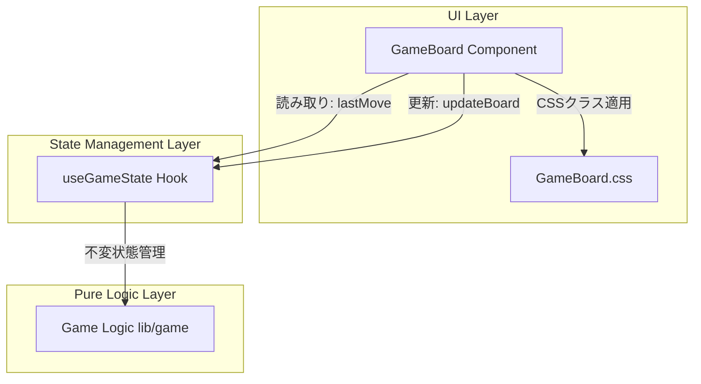
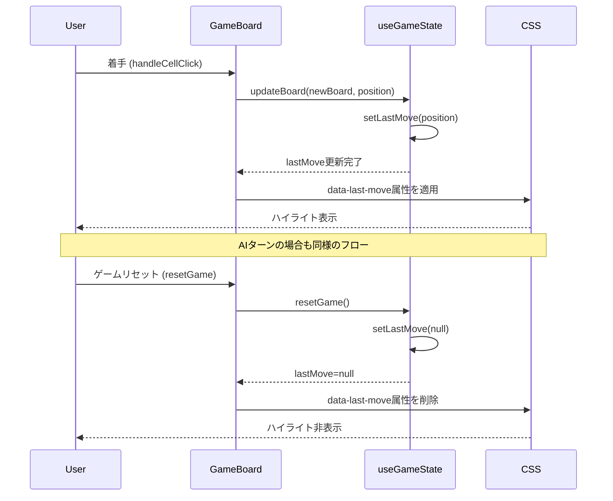

# 設計書

## Overview

本機能は、リバーシゲームの盤面において、最後に打たれた手（着手位置）を視覚的にハイライト表示することで、プレーヤーがゲームの流れを追いやすくする。人間プレーヤーとAIプレーヤーの双方の着手に対して一貫したハイライトスタイルを適用し、ゲームのフェーズ（開始・進行中・終了）に応じて適切にハイライト状態を管理する。

**Purpose**: プレーヤーが相手（または自分）の最終手を即座に把握できるようにし、戦略的な判断を支援する視覚的フィードバックを提供する。

**Users**: LINE Mini Appでリバーシゲームをプレイする全てのユーザー。特にモバイル環境での視認性を重視する。

**Impact**: 既存のGameBoardコンポーネントとuseGameStateフックを拡張し、最終手位置の状態管理と視覚表示機能を追加する。既存のゲームロジックや盤面レンダリングには影響を与えない。

### Goals

- 最終手の位置を状態として管理し、盤面上で視覚的に明確に識別できるハイライト表示を実現する
- 人間プレーヤーとAIプレーヤーの着手に対して一貫したハイライトスタイルを適用する
- ゲームの各フェーズ（開始・リセット・終了）で適切にハイライト状態を制御する
- モバイル環境とダークモード/ライトモードの両方で視認性を確保する
- CSSベースのアニメーションによりパフォーマンスへの影響を最小限に抑える

### Non-Goals

- 複数手の履歴ハイライト（最新の1手のみを対象とする）
- ハイライトのカスタマイズ機能（色・サイズ・スタイルの変更）
- クリック操作によるハイライトのインタラクション（表示のみ）
- 既存のアニメーション（駒の配置、パルスエフェクト）の変更

## Architecture

### Existing Architecture Analysis

現在のアーキテクチャは以下のパターンに従っている：

- **Pure Logic vs. Stateful Hooks**: ゲームロジックは `/lib/game` に純粋関数として実装され、状態管理は `/hooks` のReact hooksが担当し、UI描画は `/components` が行う
- **Immutable State Pattern**: 全ての状態遷移は新しいオブジェクトを返す不変パターンを採用
- **Domain-Driven Layering**: Components → Hooks → Lib の単方向依存フロー

既存の統合ポイント：

- `useGameState` フック: ゲーム状態（盤面、プレーヤー、着手履歴など）を管理
- `GameBoard` コンポーネント: 盤面の描画とユーザーインタラクションを担当
- `Position` 型: 既存の型定義を再利用（`{ row: number, col: number }`）

本機能は既存パターンを維持しながら、`useGameState` に最終手位置の状態を追加し、`GameBoard` でハイライト表示のCSSクラスを適用する形で統合する。

### Architecture Pattern & Boundary Map



**Architecture Integration**:

- **選択パターン**: Presentational/Container分離パターン（既存）を維持し、状態管理とUI描画の責務を明確に分離
- **ドメイン境界**: ゲーム状態管理（useGameState）と視覚表現（GameBoard + CSS）の境界を保持。最終手位置は不変な `Position | null` 型として状態に追加
- **既存パターンの維持**:
  - 不変状態管理: `lastMove` は `Position | null` として管理し、更新時は新しいオブジェクトを返す
  - 純粋関数パターン: 既存のゲームロジック関数には変更を加えず、状態管理層のみを拡張
  - CSSベースのアニメーション: 既存の `placeStone`, `pulse` アニメーションと同様にCSSで実装
- **新規コンポーネント根拠**: 新規コンポーネントは不要。既存のuseGameStateフックとGameBoardコンポーネントを拡張する
- **ステアリング準拠**:
  - Type Safety: `Position | null` 型を使用し、`any` 型は使用しない
  - Immutable State: 状態更新時は新しいオブジェクトを生成
  - CSS-based Animation: JavaScriptアニメーションではなくCSSトランジションを使用

### Technology Stack

| Layer          | Choice / Version        | Role in Feature                      | Notes                                        |
| -------------- | ----------------------- | ------------------------------------ | -------------------------------------------- |
| Frontend / CLI | React 18.x              | lastMoveの状態管理とハイライト描画   | 既存のReactフックとコンポーネントを拡張      |
| Frontend / CLI | TypeScript 5.x (strict) | Position型の型安全性を確保           | 既存のPosition型を再利用                     |
| Frontend / CLI | CSS3 (Transitions)      | ハイライトエフェクトのアニメーション | 既存のCSSパターン（placeStone, pulse）に準拠 |
| Frontend / CLI | Tailwind CSS            | ダークモード対応（既存のクラス利用） | 既存のTailwind設定を活用                     |

## System Flows

### 最終手ハイライトのライフサイクル



**フローレベルの決定事項**:

- `updateBoard` 呼び出し時に `position` パラメータを使用して `lastMove` を自動的に更新する
- ゲームリセット時、パスオペレーション時、ゲーム終了時の状態遷移ロジックは変更不要（`lastMove` は独立して管理）
- ハイライトのレンダリングは `data-last-move` 属性の有無でCSSセレクタによって制御

## Requirements Traceability

| Requirement | Summary                                          | Components              | Interfaces                   | Flows                            |
| ----------- | ------------------------------------------------ | ----------------------- | ---------------------------- | -------------------------------- |
| 1.1         | 着手後に最終手を記録                             | useGameState            | updateBoard(board, position) | 最終手ハイライトのライフサイクル |
| 1.2         | 盤面再レンダリング時にハイライト適用             | GameBoard               | data-last-move属性           | 最終手ハイライトのライフサイクル |
| 1.3         | 新しい着手時に前回のハイライトを削除             | useGameState, GameBoard | setLastMove(position)        | 最終手ハイライトのライフサイクル |
| 1.4         | 他のマスと明確に区別できる視覚スタイル           | GameBoard.css           | .board-cell[data-last-move]  | -                                |
| 2.1         | AIの着手位置をハイライト                         | useGameState, GameBoard | updateBoard(board, position) | 最終手ハイライトのライフサイクル |
| 2.2         | AIの着手アニメーション後にハイライト表示         | GameBoard               | -                            | -                                |
| 2.3         | AI/人間で同じハイライトスタイル                  | GameBoard.css           | .board-cell[data-last-move]  | -                                |
| 3.1         | ゲーム開始時はハイライト非表示                   | useGameState            | lastMove初期値: null         | -                                |
| 3.2         | ゲームリセット時にハイライトクリア               | useGameState            | resetGame()                  | 最終手ハイライトのライフサイクル |
| 3.3         | ゲーム終了時に最終手のハイライト保持             | useGameState, GameBoard | -                            | -                                |
| 4.1         | タッチスクリーンで視認可能なサイズとコントラスト | GameBoard.css           | CSS: box-shadow, border      | -                                |
| 4.2         | ダークモード/ライトモード両方で視認可能          | GameBoard.css           | CSS: rgba色指定              | -                                |
| 4.3         | 盤面サイズに応じてハイライトをスケーリング       | GameBoard.css           | CSS: メディアクエリ対応      | -                                |
| 5.1         | useGameStateで最終手位置を不変状態管理           | useGameState            | lastMove: Position \| null   | -                                |
| 5.2         | 着手時に最終手位置を更新                         | useGameState            | updateBoard(board, position) | 最終手ハイライトのライフサイクル |
| 5.3         | 最終手位置をオプショナル値として扱う             | useGameState            | lastMove: Position \| null   | -                                |
| 5.4         | GameBoardはuseGameStateから最終手位置取得        | GameBoard               | useGameState().lastMove      | -                                |
| 6.1         | CSSベースのアニメーション実装                    | GameBoard.css           | CSS transitions              | -                                |
| 6.2         | React.memoまたはメモ化で不要な再レンダリング防止 | GameBoard               | React.memoまたはuseMemo      | -                                |
| 6.3         | フレームレートに影響しないCSSトランジション      | GameBoard.css           | CSS: transition duration     | -                                |
| 6.4         | 既存のレンダリングロジックとの互換性保持         | GameBoard               | -                            | -                                |

## Components and Interfaces

### Component Summary

| Component     | Domain/Layer     | Intent                                         | Req Coverage                                               | Key Dependencies (P0/P1)              | Contracts |
| ------------- | ---------------- | ---------------------------------------------- | ---------------------------------------------------------- | ------------------------------------- | --------- |
| useGameState  | State Management | 最終手位置を不変状態として管理                 | 1.1, 1.3, 3.1, 3.2, 5.1, 5.2, 5.3                          | React.useState (P0)                   | State     |
| GameBoard     | UI               | 最終手のハイライトを視覚的に描画               | 1.2, 1.4, 2.1, 2.2, 2.3, 3.3, 4.1, 4.2, 4.3, 5.4, 6.2, 6.4 | useGameState (P0), GameBoard.css (P0) | State     |
| GameBoard.css | UI               | ハイライトの視覚スタイルとアニメーションを提供 | 1.4, 2.3, 4.1, 4.2, 4.3, 6.1, 6.3                          | -                                     | -         |

### State Management Layer

#### useGameState

| Field             | Detail                                                             |
| ----------------- | ------------------------------------------------------------------ |
| Intent            | ゲーム状態（盤面、プレーヤー、最終手位置など）を不変状態として管理 |
| Requirements      | 1.1, 1.3, 3.1, 3.2, 5.1, 5.2, 5.3                                  |
| Owner / Reviewers | Frontend Team                                                      |

**Responsibilities & Constraints**

- 最終手の位置（`Position | null`）を不変な状態として管理する
- 着手が行われた際、`updateBoard` 関数に渡された `position` を `lastMove` 状態に設定する
- ゲームリセット時、`lastMove` を `null` に初期化する
- 状態更新は常に新しいオブジェクトを返す不変パターンに従う

**Dependencies**

- Inbound: GameBoard コンポーネント — 最終手位置の取得と更新 (P0)
- Outbound: React.useState — 状態管理 (P0)
- External: なし

**Contracts**: State [x]

##### State Management

**State Model**:

```typescript
interface GameStateHook {
  // 既存の状態
  board: Board;
  currentPlayer: Player;
  validMoves: Position[];
  gameStatus: GameStatus;
  blackCount: number;
  whiteCount: number;
  isAIThinking: boolean;
  consecutivePassCount: number;
  moveHistory: readonly string[];
  notationString: string;

  // 新規追加: 最終手の位置
  lastMove: Position | null;

  // 既存の関数
  updateBoard: (newBoard: Board, lastMove?: Position) => void;
  switchPlayer: () => void;
  updateGameStatus: (status: GameStatus) => void;
  setAIThinking: (thinking: boolean) => void;
  incrementPassCount: () => void;
  resetPassCount: () => void;
  resetGame: () => void;
}
```

**Persistence & Consistency**:

- `lastMove` はReactの `useState` で管理され、コンポーネントのローカル状態として保持される
- `updateBoard` 関数のシグネチャを `(newBoard: Board, lastMove?: Position) => void` に変更し、オプショナルパラメータとして `lastMove` を受け取る
- `lastMove` が渡された場合は `setLastMove(lastMove)` を呼び出し、渡されない場合は状態を変更しない
- `resetGame` 関数内で `setLastMove(null)` を呼び出し、ハイライト状態をクリアする

**Concurrency Strategy**:

- Reactの状態更新メカニズムに依存し、複数の状態更新が発生した場合は自動的にバッチ処理される
- `lastMove` 状態の更新は他の状態（board, currentPlayerなど）と独立して管理される

**Implementation Notes**

- **Integration**: 既存の `useGameState` フックに `lastMove` 状態と `setLastMove` 関数を追加する。`updateBoard` 関数の内部で `lastMove` パラメータが存在する場合に `setLastMove` を呼び出すロジックを追加する。
- **Validation**: `lastMove` の型は `Position | null` として厳密に型付けされ、TypeScriptの型チェックで不正な値の代入を防ぐ。
- **Risks**: `updateBoard` 関数のシグネチャ変更により、既存の呼び出し箇所で `lastMove` を明示的に渡す必要がある。ただし、オプショナルパラメータとすることで後方互換性を維持する。

### UI Layer

#### GameBoard

| Field             | Detail                                                           |
| ----------------- | ---------------------------------------------------------------- |
| Intent            | useGameStateから最終手位置を取得し、盤面上でハイライト表示を行う |
| Requirements      | 1.2, 1.4, 2.1, 2.2, 2.3, 3.3, 4.1, 4.2, 4.3, 5.4, 6.2, 6.4       |
| Owner / Reviewers | Frontend Team                                                    |

**Responsibilities & Constraints**

- `useGameState` フックから `lastMove` を取得する
- 盤面の各セルをレンダリングする際、セルの位置が `lastMove` と一致する場合、`data-last-move` 属性を追加する
- 着手時（`handleCellClick`, AI着手のuseEffect）に `updateBoard` を呼び出す際、`position` パラメータを渡す
- 既存のレンダリングロジック（石の配置、有効手のヒント表示など）との互換性を維持する

**Dependencies**

- Inbound: なし
- Outbound: useGameState フック — 最終手位置の取得 (P0)
- Outbound: GameBoard.css — ハイライトスタイルの適用 (P0)

**Contracts**: State [x]

##### State Management

**State Model**: `useGameState` から `lastMove: Position | null` を取得する

**Implementation Notes**

- **Integration**: 既存の `useGameState` 呼び出しに `lastMove` を追加取得する。盤面セルのレンダリング部分で、`position.row === lastMove?.row && position.col === lastMove?.col` の条件を満たす場合に `data-last-move="true"` 属性を追加する。
- **Validation**: `lastMove` が `null` の場合は属性を追加せず、通常のセルとして描画する。TypeScriptのOptional Chaining (`?.`) により、安全に `lastMove` の値を参照する。
- **Risks**: セルのレンダリングロジックへの変更により、不要な再レンダリングが発生する可能性がある。`React.memo` または `useMemo` を使用してレンダリングを最適化する必要がある（Requirement 6.2）。

#### GameBoard.css

| Field             | Detail                                                                 |
| ----------------- | ---------------------------------------------------------------------- |
| Intent            | 最終手セルに対する視覚的なハイライトスタイルとアニメーションを定義する |
| Requirements      | 1.4, 2.3, 4.1, 4.2, 4.3, 6.1, 6.3                                      |
| Owner / Reviewers | Frontend Team                                                          |

**Responsibilities & Constraints**

- `.board-cell[data-last-move]` セレクタに対してハイライトスタイルを適用する
- タッチスクリーン対応のサイズと色のコントラストを確保する
- ダークモード/ライトモード両方で視認可能な色指定を行う
- 盤面のレスポンシブデザイン（メディアクエリ）に適合するスタイルを提供する
- CSSトランジションを使用し、フレームレートに影響を与えないアニメーションを実装する

**Implementation Notes**

- **Integration**: 既存の `GameBoard.css` ファイルに `.board-cell[data-last-move]` スタイル定義を追加する。既存のアニメーション（`placeStone`, `pulse`）と同様に、`transition` プロパティを使用する。
- **Validation**: ハイライトスタイルは既存の `.valid-move` スタイルと視覚的に区別可能であることを確認する。色のコントラスト比はWCAG AA基準（4.5:1以上）を満たす。
- **Risks**: 既存のCSSクラスとの競合により、意図しないスタイルが適用される可能性がある。特異度の高いセレクタ（`data-last-move` 属性セレクタ）を使用し、既存スタイルとの干渉を最小限に抑える。

**CSS Design Specification**:

```css
/* 最終手ハイライトスタイル */
.board-cell[data-last-move] {
  /* ハイライトエフェクト: 内側にグローエフェクトを適用 */
  box-shadow:
    inset 0 0 0 3px rgba(255, 69, 0, 0.7),
    /* 内側ボーダー（オレンジレッド） */ 0 0 12px rgba(255, 69, 0, 0.5); /* 外側グロー */

  /* トランジション: スムーズな表示/非表示 */
  transition: box-shadow 0.3s ease-in-out;
}

/* ダークモード対応 */
@media (prefers-color-scheme: dark) {
  .board-cell[data-last-move] {
    box-shadow:
      inset 0 0 0 3px rgba(255, 140, 0, 0.8),
      /* より明るいオレンジ */ 0 0 12px rgba(255, 140, 0, 0.6);
  }
}

/* モバイル対応: 小さい画面ではボーダー幅を調整 */
@media (max-width: 640px) {
  .board-cell[data-last-move] {
    box-shadow:
      inset 0 0 0 2px rgba(255, 69, 0, 0.7),
      0 0 8px rgba(255, 69, 0, 0.5);
  }
}

@media (max-width: 375px) {
  .board-cell[data-last-move] {
    box-shadow:
      inset 0 0 0 2px rgba(255, 69, 0, 0.7),
      0 0 6px rgba(255, 69, 0, 0.5);
  }
}
```

**色選定の根拠**:

- オレンジレッド（`rgb(255, 69, 0)` / `rgb(255, 140, 0)`）: 既存のゴールドの有効手ヒント（`rgba(255, 215, 0)`）と明確に区別でき、赤系統のアクセントカラーとしてゲーム盤面（緑系統）とのコントラストが高い
- `rgba` による透明度指定: 盤面のグリーンカラーと調和しつつ、視認性を確保
- ダークモードでより明るい色（`rgb(255, 140, 0)`）: 暗い背景でも視認性を維持

## Data Models

### Domain Model

本機能で導入される新しいドメインモデルは以下の通り：

**Entities and Value Objects**:

- `lastMove: Position | null` — 最終手の位置を表す値オブジェクト。`Position` 型は既存の型定義を再利用し、`{ row: number, col: number }` の構造を持つ。

**Business Rules & Invariants**:

- 着手が行われた場合、`lastMove` は必ず有効な `Position` 値に更新される
- ゲーム開始時とリセット時、`lastMove` は `null` に初期化される
- ゲーム終了時、最後に打たれた着手の `lastMove` 値は保持される
- `lastMove` は盤面の範囲内の位置（0 ≤ row < 8, 0 ≤ col < 8）を指す、または `null` である

### Logical Data Model

**Structure Definition**:

```typescript
// useGameState内部で管理される状態
interface UseGameStateInternal {
  // 既存の状態...
  lastMove: Position | null; // 最終手の位置
}

// Position型（既存の型定義を再利用）
interface Position {
  readonly row: number; // 0-7の範囲
  readonly col: number; // 0-7の範囲
}
```

**Attributes and Types**:

- `lastMove`: `Position | null` — 最終手の位置。ゲーム開始時は `null`、着手後は有効な `Position` オブジェクト

**Consistency & Integrity**:

- `lastMove` の更新は `updateBoard` 関数を通じて行われ、盤面の更新と同一のタイミングで発生する
- Reactの状態更新メカニズムにより、`lastMove` と `board` の整合性が保証される
- TypeScriptの型システムにより、`lastMove` が無効な値（範囲外の座標、不正な型など）を持つことを防ぐ

## Error Handling

### Error Strategy

本機能は既存のエラーハンドリング機構を活用し、独自のエラーハンドリングは実装しない。以下のエラーシナリオを考慮する：

**Type Safety Errors**:

- TypeScriptの型チェックにより、`lastMove` に不正な型の値が代入されることを防ぐ
- `Position | null` 型により、`null` チェックを強制し、ランタイムエラーを防ぐ

**Rendering Errors**:

- `lastMove` が `null` の場合、ハイライト属性を追加しないロジックにより、エラーを回避する
- Optional Chaining (`lastMove?.row`, `lastMove?.col`) を使用し、`null` 参照エラーを防ぐ

### Error Categories and Responses

**User Errors**: 該当なし（ユーザー操作によるエラーは発生しない）

**System Errors**:

- `lastMove` 状態の更新失敗 → Reactの状態管理エラーとして処理され、既存のエラーバウンダリでキャッチされる
- CSSスタイルの適用失敗 → ブラウザのレンダリングエンジンのエラーとして処理され、ハイライトが表示されないだけで、ゲーム全体の動作には影響しない

**Business Logic Errors**: 該当なし（ビジネスロジックの変更は発生しない）

### Monitoring

- 既存のReact DevToolsおよびブラウザの開発者ツールでデバッグ可能
- `lastMove` 状態はReact DevToolsで確認可能
- ハイライトの表示/非表示はブラウザのDOM inspectorで `data-last-move` 属性の有無を確認可能

## Testing Strategy

### Unit Tests

- `useGameState` フック:
  - `updateBoard` 呼び出し時、`lastMove` が正しく更新されることを確認
  - `resetGame` 呼び出し時、`lastMove` が `null` に初期化されることを確認
  - `lastMove` が `null` の場合、ハイライトが表示されないことを確認
  - `lastMove` が有効な `Position` の場合、正しい座標が設定されることを確認

### Integration Tests

- `GameBoard` コンポーネント:
  - 人間プレーヤーの着手後、該当セルに `data-last-move` 属性が追加されることを確認
  - AIプレーヤーの着手後、該当セルに `data-last-move` 属性が追加されることを確認
  - 新しい着手が行われた際、前回の `data-last-move` 属性が削除され、新しいセルに属性が追加されることを確認
  - ゲームリセット時、全ての `data-last-move` 属性が削除されることを確認
  - ゲーム終了時、最終手の `data-last-move` 属性が保持されることを確認

### E2E Tests

- 視覚的回帰テスト:
  - 人間プレーヤーが着手した後、該当セルが視覚的にハイライトされることを確認（スクリーンショット比較）
  - AIプレーヤーが着手した後、該当セルが視覚的にハイライトされることを確認（スクリーンショット比較）
  - ダークモード/ライトモード両方でハイライトが視認可能であることを確認
  - モバイル画面サイズ（640px以下、375px以下）でハイライトが適切にスケーリングされることを確認

### Performance Tests

- レンダリングパフォーマンス:
  - ハイライト表示/非表示時のフレームレートが60fps以上を維持することを確認（React DevTools Profilerで測定）
  - 盤面の再レンダリング回数が必要最小限（着手時のみ）であることを確認
  - `React.memo` または `useMemo` によるメモ化が適切に機能していることを確認

## Performance & Scalability

### Target Metrics

- **初期ロード時間**: 既存のロード時間（2秒未満）に影響を与えない（CSSファイルのサイズ増加が微小であるため）
- **レンダリングパフォーマンス**: ハイライト表示/非表示時のフレームレートが60fps以上を維持
- **再レンダリング最適化**: 着手時以外の不要な再レンダリングを防止

### Optimization Techniques

- **CSSベースのアニメーション**: `transition` プロパティを使用し、ブラウザのハードウェアアクセラレーションを活用
- **React.memo**: GameBoardコンポーネントまたはセルレンダリング部分にメモ化を適用し、`lastMove` が変更されない場合の再レンダリングを防止
- **Attribute Selector**: `data-last-move` 属性セレクタによるスタイル適用は、CSSエンジンによる高速な選択が可能

### Scalability Considerations

本機能は単一の盤面状態に対する表示のみを扱うため、スケーラビリティの懸念は発生しない。ゲーム全体のパフォーマンスに影響を与えないことを確認する。

## Migration Strategy

本機能は既存の状態管理とUIコンポーネントの拡張であり、データマイグレーションは不要。以下の段階的なロールアウトを実施する：

1. **Phase 1 - 状態管理の拡張** (リスク: 低)
   - `useGameState` フックに `lastMove` 状態を追加
   - `updateBoard` 関数のシグネチャ変更（オプショナルパラメータ）
   - 既存のテストスイートで回帰テストを実施

2. **Phase 2 - UI統合** (リスク: 低)
   - `GameBoard` コンポーネントで `lastMove` を取得し、`data-last-move` 属性を追加
   - CSSスタイル定義を追加
   - 視覚的回帰テストを実施

3. **Phase 3 - パフォーマンス最適化** (リスク: 低)
   - `React.memo` によるメモ化を適用
   - レンダリングパフォーマンステストを実施

**Rollback Triggers**:

- ハイライト表示によりゲームのフレームレートが低下する場合（60fps未満）
- 既存の盤面レンダリングロジックとの競合が発生する場合
- 視覚的なバグ（ハイライトが正しく表示されない、他のセルに干渉するなど）が発生する場合

**Validation Checkpoints**:

- Phase 1完了後: 単体テストおよび統合テストがパスすることを確認
- Phase 2完了後: E2E視覚的回帰テストがパスすることを確認
- Phase 3完了後: パフォーマンステストで60fps以上のフレームレートを確認
