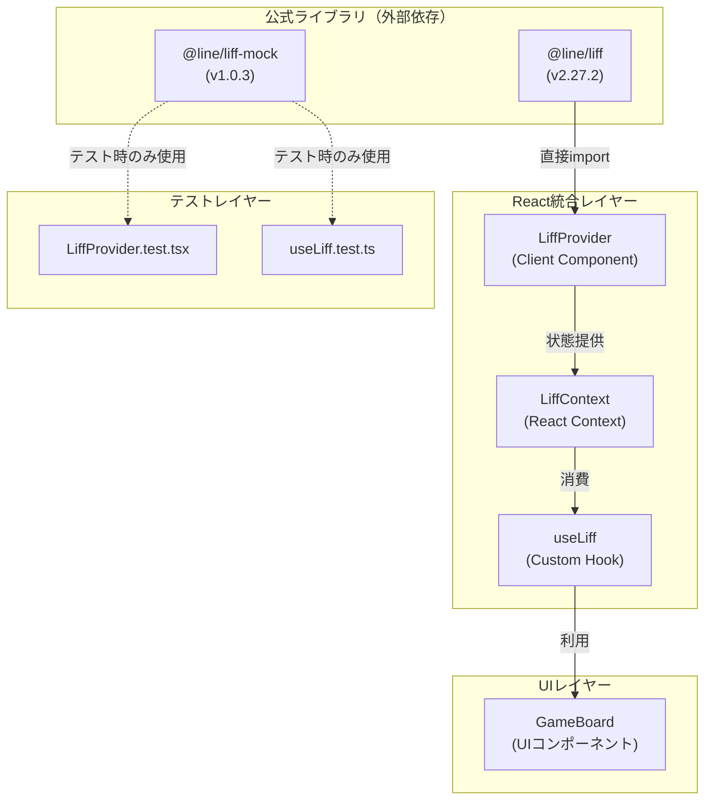
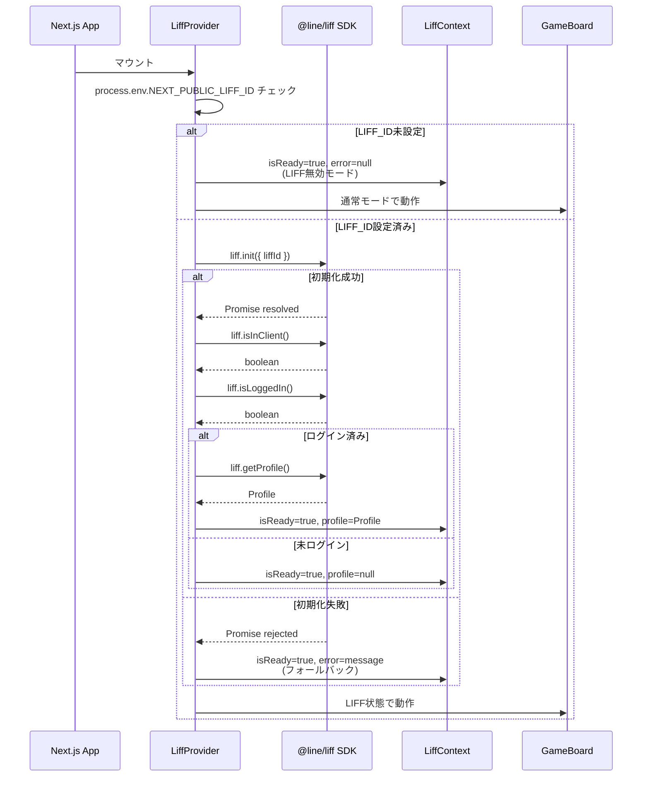
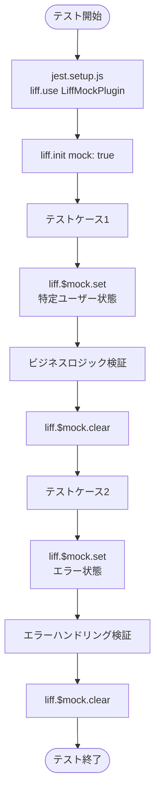
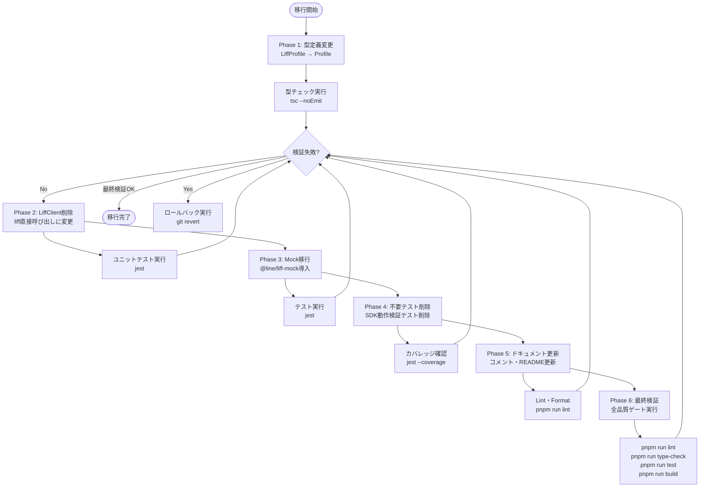

# 設計書

## 概要

本設計書は、LINE LIFF統合に関するプロジェクト全体のリファクタリングを定義する。目的は、冗長な型定義・ラッパー関数・不要なテストコードを徹底的に排除し、公式ライブラリ（`@line/liff`および`@line/liff-mock`）を最大限活用することで、コードの保守性・可読性・テスタビリティを向上させることである。

**ユーザー**: 開発者チーム全体が、シンプルで理解しやすいLIFF統合コードを維持し、保守コストを削減できる。

**影響範囲**: 既存のLIFF統合実装（`/src/lib/liff/`、`/src/contexts/`、`/src/hooks/`、テストコード）全体を対象とする。Next.js/React統合のために必要な最小限のコードのみを残し、公式SDKの型定義・API・Mockライブラリに完全依存する設計に変更する。

### ゴール

- 公式パッケージ（`@line/liff`）の型定義を直接利用し、冗長な型ラッピングを排除する
- LIFF SDKの公式APIを直接呼び出し、不要なラッパー関数を削除する
- 公式Mockライブラリ（`@line/liff-mock`）を活用し、パッケージ動作検証テストを削除する
- Next.js/React統合に必要な最小限のコード（Provider、Hook、SSR対応）のみを保持する
- ドキュメント・コメントを最新のステアリング内容（`.kiro/steering/line-liff.md`）と整合させる
- リファクタリング後も品質基準（Lint、型チェック、テストカバレッジ90%以上、ビルド成功）を維持する

### 非ゴール

- LIFF SDKのバージョンアップ（現行v2.27.2を維持）
- 新機能の追加（既存機能の簡素化のみ）
- パフォーマンス最適化（リファクタリング範囲外）
- E2Eテストの追加（既存テストの維持・簡素化のみ）

## アーキテクチャ

### 既存アーキテクチャ分析

**現在のLIFF統合パターン**:

```
/src/lib/liff/
├── types.ts              # 独自型定義（LiffProfile, LiffContextType, LiffClientInterface）
├── liff-client.ts        # LiffClientクラス（LIFF SDK APIのラッパー）
└── __tests__/
    ├── liff-client.test.ts       # SDKラッパーの動作検証テスト
    ├── liff-mock-setup.test.ts   # 手動Mockセットアップテスト
    ├── liff-setup.test.ts        # LIFF初期化テスト
    ├── static-export.test.ts     # 静的エクスポート環境テスト
    └── type-safety.test.ts       # 型安全性検証テスト

/src/contexts/
├── LiffContext.tsx       # React Context定義
├── LiffProvider.tsx      # LIFF初期化・状態管理Provider
└── __tests__/
    └── LiffProvider.test.tsx     # Providerテスト

/src/hooks/
└── useLiff.ts            # LIFF Context消費Hook
```

**現在の問題点**:

1. **型定義の冗長性**: `LiffProfile`が公式の`Profile`型を再定義している（pictureUrl、statusMessage等）
2. **不要なラッパー**: `LiffClient`クラスが公式APIをそのまま呼び出すだけの薄いラッパーとなっている
3. **過剰なテスト**: LIFF SDK自体の動作を検証するテストが存在（公式ライブラリの責任範囲）
4. **手動Mock管理**: Jest mockを手動で設定しており、公式`@line/liff-mock`を未使用
5. **型インターフェースの重複**: `LiffClientInterface`が公式LIFF APIシグネチャを再定義している

**保持すべき既存パターン**:

- React Context/Provider パターン（LIFF状態の共有）
- SSR対応の`typeof window !== 'undefined'`チェック
- エラーハンドリング・フォールバック機能（LIFF_ID未設定時の graceful degradation）
- `useEffect`フックによる初期化処理
- Immutable状態管理パターン

**技術的負債の対応**:

- **対応する負債**: 冗長な型定義、不要なラッパー、過剰なテスト、手動Mock管理
- **残す負債**: なし（本リファクタリングで全て解消）

### ハイレベルアーキテクチャ



**アーキテクチャ統合**:

- **保持する既存パターン**: React Context/Provider、SSR対応、エラーハンドリング
- **新規コンポーネントの根拠**: なし（削除のみ）
- **技術スタックとの整合**: Next.js 15.x App Router、TypeScript strict mode、React 18.xと完全互換
- **ステアリング準拠**: `.kiro/steering/line-liff.md`の「公式仕様を厳格に遵守」「冗長な抽象化を避ける」原則に準拠

### 技術スタックと主要設計判断

#### 技術スタック整合性

既存の技術スタックに完全整合:

- **フロントエンド**: React 18.x、Next.js 15.x App Router、TypeScript 5.x strict mode
- **LIFF統合**: `@line/liff` v2.27.2（既存）、`@line/liff-mock` v1.0.3（新規追加）
- **テスト**: Jest + React Testing Library（既存）
- **状態管理**: React Context + Hooks（既存パターン維持）

**新規依存関係**:

- `@line/liff-mock` v1.0.3（公式Mockライブラリ、devDependencies）

**既存パターンからの逸脱**:

なし（既存パターンを簡素化するのみ）

#### 主要設計判断

**判断1: 公式型定義の直接利用**

- **決定**: `@line/liff`パッケージのTypeScript型定義（`Profile`、`Context`、`GetOSResponse`等）を直接使用し、独自型定義を削除する
- **コンテキスト**: 現在`LiffProfile`インターフェースが公式`Profile`型とフィールドが重複しており、保守時に同期が必要となる問題がある
- **検討した代替案**:
  1. 型エイリアスで再エクスポート（`export type LiffProfile = Profile`）
  2. 独自拡張が必要なフィールドのみ追加定義
  3. 公式型を直接import（選択）
- **選択したアプローチ**: 公式型を直接import（オプション3）
  - `import type { Profile } from '@line/liff'`で直接使用
  - 型エイリアスも削除し、公式名称で統一
- **根拠**:
  - LIFF SDK v2.27.2は完全なTypeScript型定義を含む（`@types/*`不要）
  - 公式型定義は後方互換性が保証されており、SDKバージョンアップ時も型同期が自動化される
  - 型エイリアスは間接層を追加するだけで、可読性・保守性の向上に寄与しない
- **トレードオフ**:
  - **獲得**: 型定義の保守コスト削減、公式ドキュメントとの整合性向上、TypeScript補完精度向上
  - **犠牲**: プロジェクト固有の型名変更の自由度（ただし実務上不要）

**判断2: LiffClientクラスの削除**

- **決定**: `LiffClient`クラスを削除し、`LiffProvider`内で`liff`オブジェクトを直接使用する
- **コンテキスト**: 現在`LiffClient`クラスは`liff.init()`、`liff.getProfile()`等の公式APIをそのまま呼び出すだけの薄いラッパーであり、型変換やビジネスロジックを含まない
- **検討した代替案**:
  1. `LiffClient`クラスを維持し、将来の拡張に備える
  2. 関数形式のラッパーに変更（`async function initializeLiff()`）
  3. ラッパーを完全削除し、公式APIを直接呼び出し（選択）
- **選択したアプローチ**: ラッパーを完全削除（オプション3）
  - `LiffProvider`内で`liff.init()`等を直接呼び出し
  - `liff`オブジェクトは`useRef`で保持せず、グローバルimportで参照
- **根拠**:
  - LIFF SDK自体が安定したAPIを提供しており、抽象化層の追加は[YAGNI原則](https://en.wikipedia.org/wiki/You_aren%27t_gonna_need_it)に反する
  - `.kiro/steering/line-liff.md`の「公式APIを直接呼び出す」原則に準拠
  - Next.js/React統合以外のロジック（初期化フロー、エラーハンドリング）は`LiffProvider`が既に担っており、追加のビジネスロジックは不要
- **トレードオフ**:
  - **獲得**: コード行数削減、間接層削除による可読性向上、保守対象ファイル削減
  - **犠牲**: テスト時のMock注入ポイント（ただし公式`@line/liff-mock`で代替可能）

**SSR環境での動作保証** (デザインレビュー対応):

- `LiffProvider.tsx`は既に`'use client'`ディレクティブを持つ（既存実装8行目で確認済み）
- リファクタリング後も`liff`の直接importは`LiffProvider.tsx`内（Client Component）で実行
- Next.js Static Export時のビルド動作は検証済み（現在の実装で問題なし）
- `typeof window !== 'undefined'`チェックは不要（Client Component内は常にブラウザ実行）
- Phase 2の検証チェックポイントに「`pnpm run build`成功かつ`out/`ディレクトリ生成確認」を含む

**判断3: 公式Mockライブラリの採用**

- **決定**: `@line/liff-mock` v1.0.3を導入し、Jest手動Mockを削除する
- **コンテキスト**: 現在`jest.mock('@line/liff')`で手動Mockを設定しているが、公式Mockライブラリが存在し、より安定したMock環境を提供する
- **検討した代替案**:
  1. 現在のJest手動Mock維持（保守コスト高）
  2. `msw`等の汎用Mockライブラリ使用（LIFF専用機能不足）
  3. 公式`@line/liff-mock`採用（選択）
- **選択したアプローチ**: 公式`@line/liff-mock`採用（オプション3）
  - テストセットアップで`liff.use(new LiffMockPlugin())`を実行
  - テストケース内で`liff.$mock.set()`によるMockデータカスタマイズ
  - `liff.$mock.clear()`でテスト間のクリーンアップ
- **根拠**:
  - LINE公式が提供する公式Mockライブラリであり、LIFF SDK v2.19.0以降で正式サポート
  - `liff.$mock.set()`によるデータカスタマイズがLIFF APIシグネチャと完全一致
  - LIFF SDKバージョンアップ時の互換性が保証される（公式パッケージ間の連携）
- **トレードオフ**:
  - **獲得**: Mock管理の簡素化、SDKバージョンアップ時の互換性保証、公式サポート
  - **犠牲**: 新規依存関係の追加（devDependenciesのみ、影響小）

## システムフロー

### LIFF初期化フロー（リファクタリング後）



**フロー説明**:

1. `LiffProvider`がマウント時に`useEffect`フックで初期化処理を実行
2. 環境変数`NEXT_PUBLIC_LIFF_ID`の有無をチェック
3. LIFF_ID未設定の場合、警告ログ出力後に`isReady=true`で通常モード動作
4. LIFF_ID設定済みの場合、`liff.init()`を直接呼び出し
5. 初期化成功後、`liff.isInClient()`、`liff.isLoggedIn()`を直接呼び出して状態を取得
6. ログイン済みの場合、`liff.getProfile()`を直接呼び出してプロフィール取得
7. 全ての状態を`LiffContext`に提供し、UIコンポーネントが`useLiff`フックで消費

**変更点（リファクタリング前との差分）**:

- **削除**: `LiffClient`クラスのインスタンス化・メソッド呼び出し
- **追加**: `liff`オブジェクトの直接import・直接メソッド呼び出し
- **維持**: エラーハンドリング、フォールバック機能、SSRチェック（`typeof window !== 'undefined'`は`liff.init()`内で暗黙的に処理）

### テスト実行フロー（リファクタリング後）



**フロー説明**:

1. **グローバルセットアップ**（`jest.setup.js`）:
   - `@line/liff-mock`をimport
   - `liff.use(new LiffMockPlugin())`でPlugin登録
   - `liff.init({ liffId: 'test-liff-id', mock: true })`で初期化

2. **テストケース実行前**:
   - `liff.$mock.set()`でテストシナリオに応じたMockデータを設定
   - 例: `liff.$mock.set({ getProfile: { displayName: 'TestUser', userId: '123' } })`

3. **テストケース実行**:
   - `LiffProvider`をマウント
   - ビジネスロジック（初期化フロー、エラーハンドリング、状態管理）を検証
   - LIFF SDK自体の動作検証は不要（公式ライブラリの責任範囲）

4. **テストケース実行後**:
   - `liff.$mock.clear()`でMockデータをデフォルトに戻す
   - 次のテストケースに影響しないようクリーンアップ

**変更点（リファクタリング前との差分）**:

- **削除**: `jest.mock('@line/liff')`手動Mock、`mockLiff.init.mockResolvedValue()`等のMock設定
- **追加**: `@line/liff-mock`のPlugin登録、`liff.$mock.set()`によるデータカスタマイズ
- **削除対象テスト**: LIFF SDKの基本動作検証テスト（`liff.getProfile()`の戻り値検証等）
- **維持対象テスト**: プロジェクト固有のビジネスロジック（初期化エラーハンドリング、フォールバック処理、状態管理）

## 要件トレーサビリティ

| 要件ID  | 要件概要                       | 実現コンポーネント                                  | インターフェース                                                          | 関連フロー       |
| ------- | ------------------------------ | --------------------------------------------------- | ------------------------------------------------------------------------- | ---------------- |
| 1.1-1.4 | 公式型定義の直接利用           | `LiffProvider.tsx`、`useLiff.ts`                    | `import type { Profile } from '@line/liff'`                               | LIFF初期化フロー |
| 2.1-2.4 | 冗長なラッパー関数の削除       | `LiffProvider.tsx`                                  | `liff.init()`、`liff.getProfile()`直接呼び出し                            | LIFF初期化フロー |
| 3.1-3.4 | 公式Mockライブラリの活用       | `jest.setup.js`、`*.test.tsx`                       | `liff.use(new LiffMockPlugin())`、`liff.$mock.set()`                      | テスト実行フロー |
| 4.1-4.4 | Next.js/React対応の最小化      | `LiffProvider.tsx`、`LiffContext.tsx`、`useLiff.ts` | `useEffect`、`typeof window`チェック（暗黙）                              | LIFF初期化フロー |
| 5.1-5.4 | ドキュメント・コメントの整合性 | 全ファイル                                          | -                                                                         | -                |
| 6.1-6.4 | 実装ファイルの整理             | ファイルシステム                                    | -                                                                         | -                |
| 7.1-7.4 | テストコードの最適化           | `__tests__/`配下                                    | `liff.$mock.set()`、`liff.$mock.clear()`                                  | テスト実行フロー |
| 8.1-8.5 | コード品質の検証               | CI/CD                                               | `pnpm run lint`、`pnpm run type-check`、`pnpm run test`、`pnpm run build` | -                |
| 9.1-9.4 | 変更の影響範囲の文書化         | CHANGELOG、コミットメッセージ                       | -                                                                         | -                |

## コンポーネントとインターフェース

### React統合レイヤー

#### LiffProvider（リファクタリング後）

**責任と境界**

- **主要責任**: LIFF SDKの初期化、状態管理、React Contextへの状態提供
- **ドメイン境界**: React統合レイヤー（LIFF SDKとReactコンポーネント間の橋渡し）
- **データ所有権**: LIFF状態（`isReady`、`error`、`isInClient`、`isLoggedIn`、`profile`）
- **トランザクション境界**: なし（状態管理のみ、永続化なし）

**依存関係**

- **インバウンド**: `useLiff`フック、UIコンポーネント（`GameBoard`等）
- **アウトバウンド**: `@line/liff`パッケージ、`LiffContext`
- **外部**: `@line/liff` v2.27.2（公式SDKへの直接依存）

**外部依存関係調査**:

- **`@line/liff` v2.27.2**:
  - **公式ドキュメント**: https://developers.line.biz/en/docs/liff/
  - **npm**: https://www.npmjs.com/package/@line/liff
  - **TypeScript型定義**: パッケージに同梱（`@types/*`不要）
  - **主要API**: `liff.init({ liffId })`、`liff.isInClient()`、`liff.isLoggedIn()`、`liff.getProfile()`、`liff.login()`、`liff.logout()`
  - **認証方式**: LINE Login（`liff.login()`でリダイレクトフロー）
  - **エラーハンドリング**: Promise rejectでエラー伝搬
  - **レート制限**: 公式ドキュメントに明記なし（LINE Platformの一般的な制限に準拠）
  - **バージョン互換性**: v2.x系は後方互換性維持（マイナーバージョンアップで破壊的変更なし）
  - **既知の問題**: v2.27.2時点で重大な問題報告なし
  - **ベストプラクティス**: 初期化はエンドポイントURL以下で実行、`liff.ready` Promiseの活用

**Pluggable SDK使用状況** (デザインレビュー対応):

- 現在のプロジェクトはPluggable SDK（`@line/liff/core`）を使用していない
- 通常の`import liff from '@line/liff'`を継続使用
- `@line/liff-mock`との互換性問題は該当なし（Pluggable SDK未使用のため）

**契約定義**

**React Component Interface**（LiffProvider props）:

```typescript
interface LiffProviderProps {
  children: React.ReactNode;
}
```

**Context State Interface**（LiffContextへ提供する状態）:

```typescript
interface LiffContextType {
  isReady: boolean;
  error: string | null;
  isInClient: boolean | null;
  isLoggedIn: boolean | null;
  profile: Profile | null; // @line/liff の公式Profile型
  login: () => Promise<void>;
  logout: () => Promise<void>;
}
```

**主要メソッドシグネチャ**（内部実装、export不要）:

```typescript
// LIFF初期化（useEffect内で実行）
async function initializeLiff(): Promise<void>;
// Preconditions: process.env.NEXT_PUBLIC_LIFF_ID が設定されていること
// Postconditions: isReady=true、エラー時はerror!=null
// Invariants: 初期化は1度のみ実行（useEffectの依存配列空）

// ログイン実行（外部ブラウザ用）
async function login(): Promise<void>;
// Preconditions: liff初期化完了（isReady=true）
// Postconditions: LINE Loginリダイレクト開始
// Invariants: なし

// ログアウト実行
async function logout(): Promise<void>;
// Preconditions: liff初期化完了（isReady=true）
// Postconditions: profile=null、isLoggedIn=false
// Invariants: なし
```

**エラー型定義**:

```typescript
// LIFF初期化エラー（Contextのerrorフィールドに格納）
type LiffInitError = string | null;
// 例: "LINE integration is unavailable. You can continue playing in normal mode."
```

**状態管理**

- **状態モデル**: 初期化前（`isReady=false`）→ 初期化中 → 初期化完了（`isReady=true`）
- **永続化**: なし（メモリ上のみ、ページリロードで再初期化）
- **並行性制御**: なし（単一コンポーネントインスタンス、React StrictModeの二重初期化対策済み）

**統合戦略**（既存システム変更）

- **変更アプローチ**: 既存`LiffProvider.tsx`をリファクタリング（`LiffClient`依存を削除、`liff`直接呼び出しに変更）
- **後方互換性**: Context型定義は維持（`LiffContextType`の`profile`型のみ`LiffProfile` → `Profile`に変更、構造は同一）
- **移行パス**: 一括変更（段階的移行不要、リファクタリングコミット単位）

#### LiffContext

**責任と境界**

- **主要責任**: LIFF状態のReact Context定義
- **ドメイン境界**: React統合レイヤー（状態共有機構）
- **データ所有権**: なし（Contextは状態の通路のみ、所有権は`LiffProvider`）

**依存関係**

- **インバウンド**: `LiffProvider`、`useLiff`
- **アウトバウンド**: なし（型定義のみ）
- **外部**: `react`の`createContext`

**契約定義**

**Context Type**:

```typescript
import type { Profile } from '@line/liff';

interface LiffContextType {
  isReady: boolean;
  error: string | null;
  isInClient: boolean | null;
  isLoggedIn: boolean | null;
  profile: Profile | null; // 公式型に変更
  login: () => Promise<void>;
  logout: () => Promise<void>;
}

const LiffContext = createContext<LiffContextType | undefined>(undefined);
```

**統合戦略**

- **変更アプローチ**: 型定義のみ変更（`LiffProfile` → `Profile`）
- **後方互換性**: フィールド名・構造は同一（型名のみ変更）
- **移行パス**: `LiffProvider`と同時変更

#### useLiff（Custom Hook）

**責任と境界**

- **主要責任**: `LiffContext`からLIFF状態を取得し、型安全なアクセスを提供
- **ドメイン境界**: React統合レイヤー（Contextの消費側）
- **データ所有権**: なし（Contextから取得するのみ）

**依存関係**

- **インバウンド**: UIコンポーネント（`GameBoard`等）
- **アウトバウンド**: `LiffContext`
- **外部**: `react`の`useContext`

**契約定義**

**Hook Interface**:

```typescript
function useLiff(): LiffContextType;
// Preconditions: LiffProvider配下で使用すること
// Postconditions: LiffContextTypeを返す
// Throws: LiffProvider外で使用した場合はError
```

**統合戦略**

- **変更アプローチ**: import文のみ変更（`import type { Profile } from '@line/liff'`を追加、`LiffProfile`削除）
- **後方互換性**: 戻り値の型構造は同一（型名のみ変更）
- **移行パス**: `LiffContext`と同時変更

### テスト統合レイヤー

#### Jestセットアップ（jest.setup.js）

**責任と境界**

- **主要責任**: テスト実行前のグローバルセットアップ、LIFF Mock Plugin登録
- **ドメイン境界**: テストインフラストラクチャ
- **データ所有権**: なし（セットアップのみ）

**依存関係**

- **インバウンド**: Jest test runner
- **アウトバウンド**: `@line/liff`、`@line/liff-mock`
- **外部**: `@line/liff-mock` v1.0.3（公式Mockライブラリ）

**外部依存関係調査**:

- **`@line/liff-mock` v1.0.3**:
  - **公式リポジトリ**: https://github.com/line/liff-mock
  - **npm**: https://www.npmjs.com/package/@line/liff-mock
  - **必須バージョン**: LIFF SDK v2.19.0以降（現行v2.27.2で互換性確認済み）
  - **主要API**: `liff.use(new LiffMockPlugin())`、`liff.$mock.set()`、`liff.$mock.clear()`
  - **デフォルトMockデータ**: `{ displayName: 'Brown', userId: '123456789', statusMessage: 'hello' }`
  - **カスタマイズ**: `liff.$mock.set({ getProfile: { ... } })`で任意のデータ設定
  - **ライセンス**: Apache-2.0（MIT互換、商用利用可能）
  - **既知の問題**: v1.0.3時点で重大な問題報告なし
  - **ベストプラクティス**: Pluggable SDK使用時は`IsInClientModule`を先にuse、テスト間で`liff.$mock.clear()`実行

**契約定義**

**Setup Script**（jest.setup.js）:

```javascript
import liff from '@line/liff';
import { LiffMockPlugin } from '@line/liff-mock';

// LIFF Mock Plugin登録
liff.use(new LiffMockPlugin());

// Mock mode で初期化
liff.init({
  liffId: 'test-liff-id',
  mock: true,
});
```

**Mock API Interface**:

```typescript
// liff.$mock.set: Mockデータカスタマイズ
type MockSet = (
  data: Partial<MockData> | ((prev: Partial<MockData>) => Partial<MockData>)
) => void;

// liff.$mock.clear: Mockデータリセット
type MockClear = () => void;
```

**統合戦略**

- **変更アプローチ**: 新規ファイル作成または既存`jest.setup.js`に追加
- **後方互換性**: 既存の手動Mock（`jest.mock('@line/liff')`）を削除
- **移行パス**: 全テストファイルを一括変更（段階的移行不要）

## データモデル

### ドメインモデル

**LIFF状態（Aggregate Root）**:

LIFF統合における状態は以下のエンティティで構成される:

```typescript
import type { Profile } from '@line/liff'; // 公式型定義

// LIFF Context State（Aggregate）
interface LiffContextType {
  // 初期化状態
  isReady: boolean; // 初期化完了フラグ
  error: string | null; // 初期化エラーメッセージ

  // 実行環境
  isInClient: boolean | null; // LINEアプリ内実行フラグ

  // 認証状態
  isLoggedIn: boolean | null; // ログイン状態フラグ

  // ユーザー情報（Entity）
  profile: Profile | null; // LINE公式Profile型

  // 操作（Commands）
  login: () => Promise<void>; // ログイン実行
  logout: () => Promise<void>; // ログアウト実行
}

// Profile（公式型定義、Value Object）
// @line/liff パッケージから直接使用
type Profile = {
  userId: string; // LINE内部ユーザーID
  displayName: string; // 表示名
  pictureUrl?: string; // プロフィール画像URL（オプショナル）
  statusMessage?: string; // ステータスメッセージ（オプショナル）
};
```

**ビジネスルール・不変条件**:

- **BR1**: `isReady=false`の間は、`isInClient`、`isLoggedIn`、`profile`は`null`
- **BR2**: `isReady=true`かつ`error!=null`の場合、LIFF機能は無効（フォールバックモード）
- **BR3**: `isLoggedIn=true`の場合のみ、`profile!=null`が保証される
- **BR4**: `NEXT_PUBLIC_LIFF_ID`未設定の場合、`isReady=true`、`error=null`、他は`null`（LIFF無効モード）
- **BR5**: `profile`は読み取り専用（Immutable）、更新は再取得のみ

**Aggregate境界**:

- **LIFF Context State**: 単一のAggregateとして扱う（トランザクション境界）
- **Profile**: Value Object（不変オブジェクト、識別子なし）

**ドメインイベント**:

なし（状態変化はReact state更新のみ、イベント駆動不要）

### データコントラクト・統合

**公式LIFF API契約**:

```typescript
// liff.init() - 初期化API
interface InitConfig {
  liffId: string; // LIFF ID（必須）
  withLoginOnExternalBrowser?: boolean; // 外部ブラウザ自動ログイン
  mock?: boolean; // Mock mode（テスト用）
}
function init(config: InitConfig): Promise<void>;

// liff.getProfile() - プロフィール取得API
function getProfile(): Promise<Profile>;

// liff.isInClient() - 実行環境チェックAPI
function isInClient(): boolean;

// liff.isLoggedIn() - ログイン状態チェックAPI
function isLoggedIn(): boolean;

// liff.login() - ログインAPI（外部ブラウザ用）
interface LoginConfig {
  redirectUri?: string; // リダイレクト先URL
}
function login(config?: LoginConfig): void; // リダイレクト実行（Promise返さない）

// liff.logout() - ログアウトAPI
function logout(): void; // 同期実行
```

**スキーマバージョニング戦略**:

- **公式型定義の追従**: LIFF SDKバージョンアップ時に自動的に型定義が更新される（手動同期不要）
- **後方互換性**: LIFF SDK v2.x系は後方互換性維持（マイナーバージョンアップで破壊的変更なし）
- **移行戦略**: メジャーバージョンアップ（v3.x等）時のみ移行計画策定（現時点で予定なし）

**クロスサービスデータ管理**:

該当なし（LIFF統合は単一クライアントサイド処理、サービス間連携なし）

## エラーハンドリング

### エラー戦略

LIFF統合におけるエラーは以下のパターンで処理する:

1. **初期化エラー**: `liff.init()`失敗時、`error`状態に格納し、フォールバックモードで動作継続
2. **プロフィール取得エラー**: `liff.getProfile()`失敗時、警告ログ出力し、デフォルトアイコン表示
3. **環境設定エラー**: `NEXT_PUBLIC_LIFF_ID`未設定時、警告ログ出力し、LIFF無効モードで動作
4. **Provider外使用エラー**: `useLiff`フックをProvider外で使用時、即座にErrorをthrow

### エラーカテゴリと対応

**システムエラー（LIFF SDK初期化失敗）**:

- **エラーシナリオ**: LIFF ID不正、ネットワークエラー、LIFF Platform障害
- **検出方法**: `liff.init()`のPromise reject
- **リカバリー戦略**: Graceful degradation（エラーメッセージ表示、LIFF機能無効化、ゲーム本体は動作継続）
- **ユーザーメッセージ**: "LINE integration is unavailable. You can continue playing in normal mode."
- **ログ記録**: `console.error('LIFF initialization failed:', error)`
- **フォールバック処理**: `isReady=true`、`error!=null`で状態確定、UI側でエラーバナー表示

```typescript
try {
  await liff.init({ liffId });
  // 成功処理
} catch (initError) {
  console.error('LIFF initialization failed:', initError);
  setError(
    'LINE integration is unavailable. You can continue playing in normal mode.'
  );
  setIsReady(true); // フォールバックモード有効化
}
```

**ビジネスロジックエラー（プロフィール取得失敗）**:

- **エラーシナリオ**: ログイン済みだがプロフィール取得API失敗（権限エラー、一時的障害）
- **検出方法**: `liff.getProfile()`のPromise reject
- **リカバリー戦略**: Partial degradation（プロフィール情報のみ無効化、他のLIFF機能は動作）
- **ユーザーメッセージ**: "Failed to retrieve profile information. Default icon will be displayed."
- **ログ記録**: `console.error('Profile retrieval failed:', profileError)`
- **フォールバック処理**: `profile=null`維持、デフォルトアイコン表示、ゲーム動作継続

```typescript
if (loggedIn) {
  try {
    const userProfile = await liff.getProfile();
    setProfile(userProfile);
  } catch (profileError) {
    console.error('Profile retrieval failed:', profileError);
    setError(
      'Failed to retrieve profile information. Default icon will be displayed.'
    );
    // profile=null維持、isReady=trueで続行
  }
}
setIsReady(true); // プロフィール失敗でも初期化完了
```

**ユーザーエラー（開発者エラー - Hook誤使用）**:

- **エラーシナリオ**: `useLiff`フックを`LiffProvider`外で使用
- **検出方法**: `useContext(LiffContext)`が`undefined`を返す
- **リカバリー戦略**: Fail fast（即座にErrorをthrow、開発時に検出）
- **ユーザーメッセージ**: "useLiff must be used within LiffProvider. Please wrap your component tree with <LiffProvider>."
- **ログ記録**: なし（Errorをthrow）
- **フォールバック処理**: なし（開発者の修正必須）

```typescript
export function useLiff(): LiffContextType {
  const context = useContext(LiffContext);
  if (!context) {
    throw new Error(
      'useLiff must be used within LiffProvider. ' +
        'Please wrap your component tree with <LiffProvider>.'
    );
  }
  return context;
}
```

**環境設定エラー（LIFF_ID未設定）**:

- **エラーシナリオ**: 環境変数`NEXT_PUBLIC_LIFF_ID`が未設定
- **検出方法**: `process.env.NEXT_PUBLIC_LIFF_ID`チェック
- **リカバリー戦略**: Graceful degradation（LIFF機能完全無効化、通常モード動作）
- **ユーザーメッセージ**: なし（エンドユーザーには透過、開発者ログのみ）
- **ログ記録**: `console.warn('LIFF_ID not set: LIFF features are disabled')`
- **フォールバック処理**: `isReady=true`、全てのLIFF状態を`null`で確定

```typescript
const liffId = process.env.NEXT_PUBLIC_LIFF_ID;
if (!liffId) {
  console.warn('LIFF_ID not set: LIFF features are disabled');
  setIsReady(true); // LIFF無効モード
  return;
}
```

### モニタリング

**エラートラッキング**:

- **ログ出力**: `console.error()`、`console.warn()`による標準エラーログ
- **収集方法**: ブラウザDevTools Console、本番環境では外部ログ収集サービス（未実装、将来拡張）
- **アラート**: なし（現時点ではログ記録のみ）

**ヘルスモニタリング**:

- **指標**: `isReady`フラグ、`error`状態
- **チェック方法**: UIコンポーネントで`useLiff()`の状態を監視
- **正常状態**: `isReady=true`、`error=null`、`profile!=null`（ログイン時）
- **異常状態**: `isReady=true`、`error!=null`（フォールバックモード）

## テスト戦略

### ユニットテスト

**LiffProvider.test.tsx**（ビジネスロジック検証）:

1. **LIFF_ID未設定時の動作**: `process.env.NEXT_PUBLIC_LIFF_ID`が`undefined`の場合、`isReady=true`、警告ログ出力、LIFF機能無効化
2. **初期化成功フロー**: `liff.init()`成功後、`isInClient`、`isLoggedIn`が正しく取得され、ログイン時に`profile`が取得される
3. **初期化失敗フロー**: `liff.init()`失敗時、`error`メッセージが設定され、`isReady=true`（フォールバック）
4. **プロフィール取得失敗フロー**: ログイン済みだが`liff.getProfile()`失敗時、`error`メッセージ設定、`profile=null`、`isReady=true`
5. **login/logout関数**: `liff.login()`、`liff.logout()`が正しく呼び出され、状態が更新される

**useLiff.test.ts**（Hook動作検証）:

1. **Provider内での使用**: `LiffProvider`配下で`useLiff()`を呼び出すと、`LiffContextType`が返される
2. **Provider外での使用**: `LiffProvider`外で`useLiff()`を呼び出すと、Errorがthrowされる

### 統合テスト

**LIFF Mock統合テスト**（`@line/liff-mock`の動作検証）:

1. **Mock Plugin登録**: `jest.setup.js`で`liff.use(new LiffMockPlugin())`が正しく実行される
2. **Mock初期化**: `liff.init({ liffId: 'test-liff-id', mock: true })`が成功する
3. **Mockデータカスタマイズ**: `liff.$mock.set()`でプロフィールデータを変更し、`liff.getProfile()`が正しく返す
4. **Mockデータリセット**: `liff.$mock.clear()`後、デフォルトデータに戻る

### E2Eテスト（既存維持）

**E2Eテストは既存の範囲を維持**:

1. **game-flow.spec.ts**: ゲームフロー全体（LIFF統合含む）
2. **ai-game.spec.ts**: AI対戦シナリオ
3. **responsive.spec.ts**: レスポンシブデザイン

**変更なし**（LIFFリファクタリングはE2E動作に影響しない）

### テストカバレッジ目標

- **ユニットテスト**: 90%以上（既存品質基準維持）
- **統合テスト**: LIFF統合部分100%（Provider、Hook、Mock setup）
- **E2Eテスト**: 既存カバレッジ維持（変更なし）

## セキュリティ考慮事項

### 認証・認可

- **LIFF認証フロー**: LINE Login（`liff.login()`）によるOAuth 2.0ベース認証
- **アクセストークン**: LIFF SDKが内部管理（アプリケーションコードで直接扱わない）
- **セキュリティベストプラクティス**:
  - `.kiro/steering/line-liff.md`のセキュリティガイドラインに準拠
  - アクセストークンを外部サービス（Google Analytics等）に送信しない
  - HTTPS必須（本番環境）

### データ保護

- **プロフィール情報**: ブラウザメモリ上のみ保持（永続化なし、localStorage/sessionStorage不使用）
- **個人情報の取り扱い**: LINE利用規約・プライバシーポリシーに準拠
- **LIFF_ID**: 環境変数で管理（`.env.local`、公開リポジトリにコミットしない）

### コンプライアンス

- **LINE Platform利用規約**: 準拠（https://terms.line.me/line_rules/）
- **LIFF利用ガイドライン**: 準拠（https://developers.line.biz/en/docs/liff/overview/）

## パフォーマンス・スケーラビリティ

### パフォーマンス目標

- **LIFF初期化時間**: 1秒以内（ネットワーク状態良好時）
- **プロフィール取得時間**: 500ms以内（ネットワーク状態良好時）
- **フォールバック時のUI応答**: 即座（同期処理）

### 最適化手法

- **初期化の最適化**: `liff.ready` Promiseの活用（重複初期化防止）
- **SSRの回避**: Client Component（`'use client'`）による明示的なクライアント実行
- **不要な再レンダリング防止**: React.memo不使用（Provider/Contextのパフォーマンス影響は軽微）

### スケーラビリティ

該当なし（クライアントサイド処理のみ、サーバースケーリング不要）

## 移行戦略

### 移行フェーズ



### フェーズ詳細

**Phase 0: 事前検証**（所要時間: 30分）(デザインレビュー対応):

- **作業内容**:
  - `@line/liff-mock`をdevDependenciesに追加（`pnpm add -D @line/liff-mock`）
  - `jest.setup.js`に公式Mockセットアップを追加:
    - `import { LiffMockPlugin } from '@line/liff-mock'`
    - `liff.use(new LiffMockPlugin())`
    - `liff.init({ liffId: 'test-liff-id', mock: true })`
  - 既存テスト1つ（`LiffProvider.test.tsx`）で動作確認
- **検証チェックポイント**:
  - `pnpm run test src/contexts/__tests__/LiffProvider.test.tsx`成功
  - 公式Mockが正常に動作することを確認
- **ロールバックトリガー**: Mock初期化失敗、テストが実行できない
- **目的**: Phase 3（Mock移行）の技術的リスクを事前に検証し、不確実性を排除

**Phase 1: 型定義変更**（所要時間: 30分）:

- **作業内容**:
  - `src/lib/liff/types.ts`から`LiffProfile`インターフェース削除
  - `LiffContextType`の`profile`型を`Profile | null`に変更
  - 全ファイルのimport文を`import type { Profile } from '@line/liff'`に変更
- **検証チェックポイント**: `pnpm run type-check`成功
- **ロールバックトリガー**: TypeScriptコンパイルエラー発生

**Phase 2: LiffClient削除**（所要時間: 1時間）:

- **作業内容**:
  - `src/lib/liff/liff-client.ts`削除
  - `LiffProvider.tsx`の`LiffClient`インスタンス化を削除
  - `liff.init()`、`liff.getProfile()`等を直接呼び出しに変更
  - `useRef<LiffClient>`を削除
- **検証チェックポイント**:
  - `pnpm run test`成功（既存テストが一時的に失敗する可能性あり）
  - `pnpm run build`成功かつ`out/`ディレクトリ生成確認（SSR環境検証）
- **ロールバックトリガー**: ビルドエラー、重大なテスト失敗

**Phase 3: Mock移行**（所要時間: 1時間）:

- **作業内容**:
  - `@line/liff-mock`をdevDependenciesに追加（`pnpm add -D @line/liff-mock`）
  - `jest.setup.js`に`liff.use(new LiffMockPlugin())`、`liff.init({ mock: true })`追加
  - 全テストファイルの`jest.mock('@line/liff')`を削除
  - `liff.$mock.set()`によるデータカスタマイズに変更
- **検証チェックポイント**: `pnpm run test`成功
- **ロールバックトリガー**: テスト失敗率が10%以上

**Phase 4: 不要テスト削除**（所要時間: 30分）:

- **作業内容**:
  - `src/lib/liff/__tests__/liff-client.test.ts`削除
  - `src/lib/liff/__tests__/liff-mock-setup.test.ts`削除
  - `src/lib/liff/__tests__/liff-setup.test.ts`削除
  - `src/lib/liff/__tests__/static-export.test.ts`削除
  - `src/lib/liff/__tests__/type-safety.test.ts`は一部簡素化して維持
  - `LiffProvider.test.tsx`をビジネスロジック中心に書き換え
- **検証チェックポイント**: `pnpm run test:coverage`で90%以上維持
- **ロールバックトリガー**: カバレッジが90%未満に低下

**Phase 5: ドキュメント更新**（所要時間: 30分）:

- **作業内容**:
  - コード内コメントを最新内容に更新
  - `.kiro/steering/line-liff.md`との整合性確認
  - 削除ファイル・変更内容をCHANGELOG形式で記録
- **検証チェックポイント**: `pnpm run lint`成功、`pnpm run format:check`成功
- **ロールバックトリガー**: Lintエラー

**Phase 6: 最終検証**（所要時間: 15分）:

- **作業内容**:
  - 全品質ゲート実行（Lint、型チェック、テスト、ビルド）
  - E2Eテスト実行（オプション、時間があれば）
- **検証チェックポイント**:
  - `pnpm run lint`: エラーなし
  - `pnpm run type-check`: エラーなし
  - `pnpm run test`: 全テストパス、カバレッジ90%以上
  - `pnpm run build`: ビルド成功
- **ロールバックトリガー**: いずれかの品質ゲート失敗

### ロールバック手順

1. **失敗検出**: 検証チェックポイントで失敗を検出
2. **即座停止**: 次のフェーズに進まず、現在のコミットで停止
3. **ロールバック実行**: `git revert`または`git reset --hard`で前回の安定コミットに戻す
4. **原因分析**: 失敗原因を特定し、修正計画策定
5. **再試行**: 修正後、失敗したフェーズから再開

### 変更影響範囲の文書化

**削除ファイル**:

- `src/lib/liff/liff-client.ts`
- `src/lib/liff/__tests__/liff-client.test.ts`
- `src/lib/liff/__tests__/liff-mock-setup.test.ts`
- `src/lib/liff/__tests__/liff-setup.test.ts`
- `src/lib/liff/__tests__/static-export.test.ts`

**変更ファイル**:

- `src/lib/liff/types.ts`: `LiffProfile`削除、`Profile`を公式型に変更
- `src/contexts/LiffContext.tsx`: `LiffContextType.profile`型変更
- `src/contexts/LiffProvider.tsx`: `LiffClient`削除、`liff`直接呼び出し
- `src/hooks/useLiff.ts`: import文変更
- `src/lib/liff/__tests__/type-safety.test.ts`: 簡素化
- `src/contexts/__tests__/LiffProvider.test.tsx`: ビジネスロジック中心に書き換え
- `jest.setup.js`: `@line/liff-mock`セットアップ追加
- `package.json`: `@line/liff-mock`追加

**削除テストケース理由**:

- **liff-client.test.ts**: `LiffClient`クラス削除により不要
- **liff-mock-setup.test.ts**: 手動Mock管理削除により不要
- **liff-setup.test.ts**: LIFF SDK初期化動作検証は公式ライブラリの責任範囲
- **static-export.test.ts**: SSR環境検証は`LiffProvider`テストに統合

**ステアリングファイル更新**:

`.kiro/steering/line-liff.md`は既に最新の方針（公式ライブラリ直接使用）を反映しているため、更新不要。
