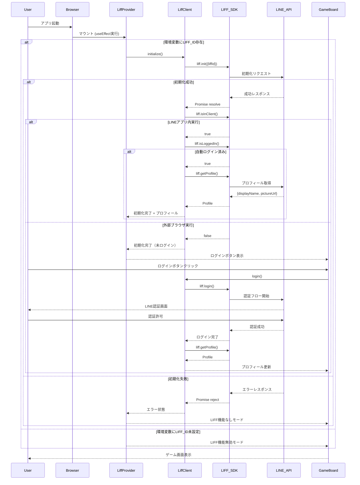
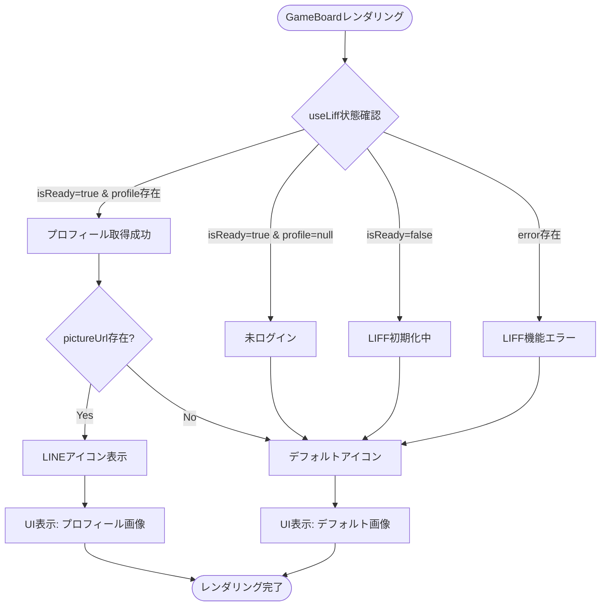
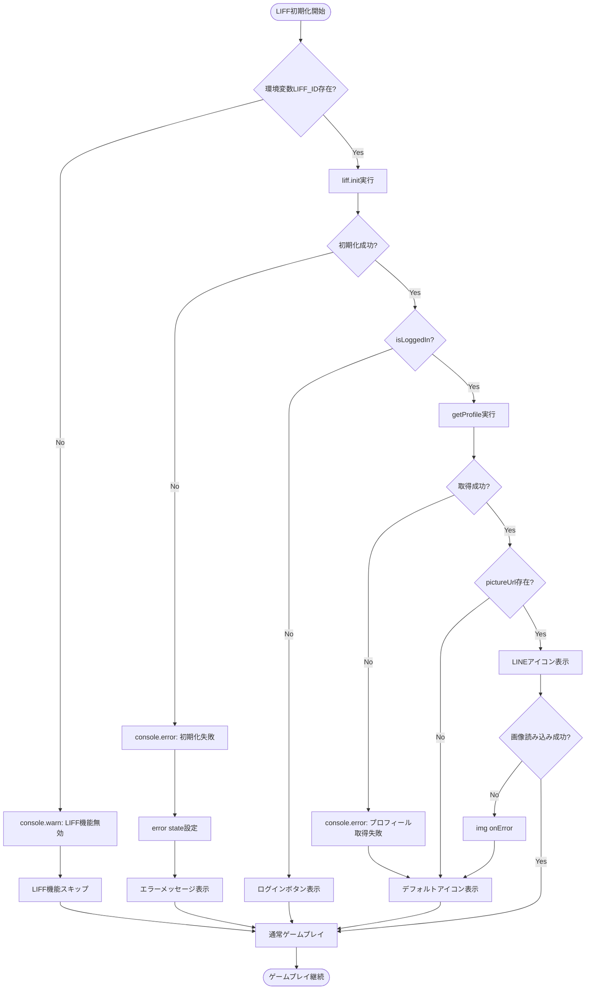

# 技術設計書: LINE ミニアプリ対応

## Overview

本設計は、既存のリバーシWebアプリケーションにLIFF (LINE Front-end Framework) SDK統合を追加し、LINEアプリ内でのシームレスなゲーム体験とLINEプロフィール情報を活用したパーソナライズ機能を実現する。

**Purpose**: LINEユーザーが公式アプリ内で手軽にゲームを楽しめるよう、LIFF SDKを統合してLINE認証とプロフィール連携を提供する。

**Users**: LINEアプリユーザー（自動ログイン）および外部ブラウザユーザー（任意ログイン）がリバーシゲームを利用する。

**Impact**: 既存のスタンドアロンWebアプリに対し、LIFF統合レイヤーを追加することで、LINE環境下での自動認証とプロフィール表示を実現しつつ、LIFF機能なしでも従来通りゲームプレイ可能な状態を維持する。

### Goals

- LIFF SDK (最新バージョン) の導入と環境変数による柔軟な管理
- LINEアプリ内外の実行環境に応じた適切なログインフロー提供
- LINEプロフィールアイコンをゲームUI内に表示
- LIFF機能失敗時でもゲームプレイ継続可能なフォールバック機能
- Next.js Static Export対応を維持した型安全な実装

### Non-Goals

- LINEユーザー同士のマルチプレイヤー対戦機能
- ゲーム履歴のLINEサーバー永続化
- LINE通知やメッセージ送信機能
- LIFF SDK機能の包括的なテストカバレッジ（テスト除外ポリシー適用）

## Architecture

### Existing Architecture Analysis

**現在のアーキテクチャ**:

- **Presentation Layer**: Next.js App Router (Server Component: `page.tsx`, Client Component: `GameBoard.tsx`)
- **Game Logic Layer**: Pure Functions (`/src/lib/game/`)
- **AI Engine Layer**: WASM統合 (`/src/lib/ai/`, `/src/workers/ai-worker.ts`)
- **State Management**: React Hooks (`useGameState`, `useAIPlayer`, `useGameErrorHandler`)
- **Error Handling**: ErrorBoundary, WASMErrorHandler, Fallback AI

**既存の統合制約**:

- Next.js Static Export (`output: 'export'`) 維持が必須
- Server/Client Component分離パターン継続
- Pure Functions重視のGame Logicレイヤーへの依存禁止
- カスタムフックを通じた状態管理パターン踏襲

**統合ポイント**:

- `GameBoard.tsx`: プロフィールアイコン表示領域の追加（石数カウント表示部分）
- `/src/hooks/`: 新規カスタムフック `useLiff` 追加
- `/src/lib/liff/`: 新規レイヤー追加（LIFF統合ロジック）
- `/src/contexts/`: 新規ディレクトリ（LiffContext, LiffProvider）
- `app/layout.tsx`: LiffProvider追加（グローバル初期化管理）

**実装アプローチ**:

本設計は、ギャップ分析で推奨された **Option B: 新規コンポーネント作成** アプローチを採用しています。完全に独立したLIFF統合レイヤーを新規作成することで、明確な責任分離、テスト容易性、既存パターンとの整合性を実現します。

### High-Level Architecture

```mermaid
graph TB
    subgraph "Presentation Layer"
        Layout[layout.tsx - Server]
        Page[page.tsx - Server]
        GameBoard[GameBoard.tsx - Client]
        LiffProvider[LiffProvider - Client]
    end

    subgraph "LIFF Integration Layer (新規)"
        LiffContext[LiffContext - React Context]
        UseLiff[useLiff - Custom Hook]
        LiffClient[LiffClient - LIFF API Wrapper]
    end

    subgraph "State Management"
        UseGameState[useGameState]
        UseAIPlayer[useAIPlayer]
        UseGameError[useGameErrorHandler]
    end

    subgraph "Game Logic Layer (既存)"
        GameLogic[game-logic.ts]
        GameEnd[game-end.ts]
    end

    subgraph "External"
        LIFF_SDK[@line/liff SDK]
        LINE_API[LINE API]
    end

    Layout --> LiffProvider
    LiffProvider --> Page
    Page --> GameBoard
    LiffProvider --> LiffContext
    GameBoard --> UseLiff
    UseLiff --> LiffContext
    UseLiff --> LiffClient
    LiffClient --> LIFF_SDK
    LIFF_SDK --> LINE_API
    GameBoard --> UseGameState
    GameBoard --> UseAIPlayer
    GameBoard --> UseGameError
    UseGameState --> GameLogic
    GameLogic --> GameEnd
```

**アーキテクチャ統合方針**:

- **既存パターン維持**: Server/Client Component分離、React Hooksベース状態管理継続
- **新規コンポーネント追加理由**: LIFF SDKはクライアントサイド専用APIであり、Context Provider + Custom Hookパターンで既存フック設計と統一感を保つ
- **技術スタック整合性**: TypeScript strict mode、Result型エラーハンドリング、Pure Functions原則を踏襲
- **ステアリング準拠**: `.kiro/steering/tech.md` のClient Component使用指針（`"use client"`ディレクティブ）に従い、SSG最適化を維持

### Type Definition Strategy

**型定義の配置方針** (Critical Issue #1 対応):

すべてのLIFF関連型定義を `/src/lib/liff/types.ts` に集約することで、循環依存を回避し、既存の型定義パターン（`/src/lib/game/types.ts`等）と整合性を保ちます。

**型定義ファイル構成**:

- `/src/lib/liff/types.ts`:
  - `LiffProfile` - LINEプロフィール情報
  - `LiffContextType` - Context型定義
  - `LiffClientInterface` - LiffClient公開インターフェース

- `/src/contexts/LiffContext.tsx`:
  - `createContext<LiffContextType>` のみ（型は`/src/lib/liff/types.ts`からインポート）

- `/src/contexts/LiffProvider.tsx`:
  - Provider実装のみ（型は`/src/lib/liff/types.ts`からインポート）

**インポート依存関係** (単一方向):

```
/src/lib/liff/types.ts  (型定義のみ、依存なし)
  ↑
/src/lib/liff/liff-client.ts  (LiffClientInterface実装)
  ↑
/src/contexts/LiffContext.tsx  (Context定義)
  ↑
/src/contexts/LiffProvider.tsx  (Provider実装)
  ↑
/src/hooks/useLiff.ts  (カスタムフック)
  ↑
/src/components/GameBoard.tsx  (UI統合)
```

この配置により、循環依存リスクを完全に排除し、既存の`/src/lib/game/types.ts`パターンとの一貫性を維持します。

### Technology Alignment

本機能は既存システムへの拡張として実装されるため、以下の技術スタック整合性を維持する。

**新規依存パッケージ**:

- `@line/liff`: ^2.27.2（最新安定版、TypeScript型定義同梱）
  - 選定理由: LINE公式SDKであり、型定義が同梱されているため追加の`@types`パッケージ不要
  - 代替案検討: `react-liff-hooks`等のラッパーライブラリは採用せず、公式SDKを直接使用して依存を最小化

**既存技術スタックとの整合性**:

- **TypeScript 5.x (strict mode)**: LIFF SDKの型定義を活用し、`any`型使用禁止を継続
- **Next.js 15.x Static Export**: LIFF初期化は`"use client"`コンポーネント内でのみ実行し、SSG互換性維持
- **React 18.x Hooks**: `useLiff`カスタムフックを追加し、既存の`useGameState`等と同様のパターン採用
- **pnpm 9.x**: パッケージ管理の一貫性を維持

**既存パターンからの逸脱なし**:

- エラーハンドリングは既存の`useGameErrorHandler`パターンを踏襲（Result型）
- 状態管理はReact Hooks（useState, useContext）のみ使用
- Pure Functions分離原則を遵守（LIFF APIはPure Functionレイヤーに漏れ出さない）

### Key Design Decisions

#### Decision 1: Context Provider + Custom Hook パターンの採用

**Context**: LIFF SDKは初期化が必要なクライアントサイド専用APIであり、アプリケーション全体で状態共有が必要。

**Alternatives**:

1. **グローバルシングルトンオブジェクト**: `window.liff`に直接アクセス
2. **各コンポーネントでローカル初期化**: `useEffect`で個別に`liff.init()`実行
3. **React Context Provider + Custom Hook** (選択)

**Selected Approach**:

React Context APIでLIFF初期化状態とプロフィール情報を管理し、`useLiff`カスタムフックを通じてアクセスする。

**Rationale**:

- **既存パターン整合性**: `useGameState`, `useAIPlayer`等の既存カスタムフック設計と統一
- **テスタビリティ**: Contextをモック化することでテスト容易性向上（LIFF SDKテストは除外だが、コンポーネントテストは可能）
- **型安全性**: TypeScript型定義を活用し、`liff`オブジェクトの存在チェックを型レベルで強制

**Trade-offs**:

- **利点**: 一元管理によるバグ削減、状態共有の明示化、既存設計との一貫性
- **欠点**: 小規模アプリには若干のボイラープレート増加（LiffProvider, Context定義）

#### Decision 2: LIFF機能のOptional化とFallback戦略

**Context**: LIFF初期化失敗、プロフィール取得失敗時でもゲームプレイ継続を保証する必要がある。

**Alternatives**:

1. **LIFF初期化必須**: 失敗時はエラー画面表示のみ
2. **LIFF機能Optional**: 失敗時はデフォルトUI表示でゲーム継続（選択）
3. **部分的Fallback**: 一部機能のみフォールバック

**Selected Approach**:

LIFF初期化・プロフィール取得は全てOptionalとし、失敗時はデフォルトアイコン表示とログインなしモードでゲーム継続。

**Rationale**:

- **要件準拠**: Requirement 10「LIFF機能失敗でもゲームプレイ可能」に対応
- **UX維持**: LINE連携の問題がコアゲーム体験を妨げない
- **既存パターン**: AI Fallback戦略（WASM失敗時のランダム手）と同様のエラー回復思想

**Trade-offs**:

- **利点**: ロバスト性向上、ネットワークエラー耐性、開発環境での動作保証
- **欠点**: ログイン状態の境界条件処理が増加

#### Decision 3: Test除外ポリシーの適用

**Context**: Requirement 9でLIFF SDK動作テストは明示的に除外対象と定義されている。

**Alternatives**:

1. **LIFF SDKをモック化して包括的テスト作成**
2. **LIFF統合コードをテスト除外** (選択)
3. **E2EテストのみでLIFF統合を検証**

**Selected Approach**:

JestユニットテストではLIFF関連モジュールをモック化し、ロジックテストに集中。PlaywrightE2Eテストでも明示的にLIFF機能をスキップ。

**Rationale**:

- **要件準拠**: Requirement 9のテスト除外方針に従う
- **開発効率**: リバーシゲームロジックの品質保証に集中
- **実用性**: LIFF SDKは外部APIであり、統合テストよりも手動動作確認が効率的

**Trade-offs**:

- **利点**: テスト実装コスト削減、ゲームロジックへの集中
- **欠点**: LIFF統合バグは手動QAで発見する必要がある

## System Flows

### Sequence Diagram: LIFF初期化とログインフロー



### Process Flow: プロフィールアイコン表示ロジック



## Requirements Traceability

| Requirement | 要件概要                           | 実装コンポーネント       | インターフェース                  | フロー参照                                   |
| ----------- | ---------------------------------- | ------------------------ | --------------------------------- | -------------------------------------------- |
| 1           | LIFF SDK統合とバージョン管理       | LiffClient               | `initialize()`                    | 初期化フロー                                 |
| 2           | LIFF ID環境変数管理                | LiffProvider             | `process.env.NEXT_PUBLIC_LIFF_ID` | 初期化フロー                                 |
| 3           | LIFF SDK初期化とエラーハンドリング | LiffClient, LiffProvider | `initialize()`, Context State     | 初期化フロー                                 |
| 4           | LINEアプリ内外の実行環境判定       | LiffClient               | `checkEnvironment()`              | 初期化フロー（isInClient分岐）               |
| 5           | LINEアプリ内での自動ログイン       | LiffProvider             | 自動実行（useEffect）             | 初期化フロー（自動ログイン済み）             |
| 6           | 外部ブラウザでの任意ログイン       | GameBoard, LiffClient    | `login()`, ログインボタン         | 初期化フロー（外部ブラウザ）                 |
| 7           | LINEプロフィールアイコン表示       | GameBoard, useLiff       | `profile.pictureUrl`              | プロフィールアイコン表示フロー               |
| 8           | ログイン状態管理とUI反映           | LiffContext, useLiff     | Context State                     | 全フロー                                     |
| 9           | LIFF機能のテスト除外               | テスト設定               | Jestモック設定                    | N/A                                          |
| 10          | エラーハンドリングとフォールバック | LiffProvider, GameBoard  | `error` state, デフォルトUI       | プロフィールアイコン表示フロー（エラー分岐） |
| 11          | TypeScript型安全性                 | 全コンポーネント         | LIFF SDK型定義、LiffContextType   | N/A                                          |
| 12          | Next.js Static Export対応          | LiffProvider             | `"use client"`ディレクティブ      | N/A                                          |

## Components and Interfaces

### LIFF Integration Layer

#### LiffProvider (Client Component)

**Responsibility & Boundaries**

- **Primary Responsibility**: LIFF SDKの初期化管理とアプリケーション全体へのLIFF状態提供
- **Domain Boundary**: LIFF統合レイヤー（Presentation Layerとの境界）
- **Data Ownership**: LIFF初期化状態（`isReady`, `error`）、ログイン状態（`isLoggedIn`, `isInClient`）、プロフィール情報（`profile`）
- **Transaction Boundary**: N/A（クライアントサイド状態管理のみ）

**Dependencies**

- **Inbound**: `app/layout.tsx`（Server Component）からマウント、`GameBoard.tsx`が`useLiff`経由で参照
- **Outbound**: `LiffClient`（LIFF API Wrapper）、React Context API
- **External**: なし（LiffClientを通じて間接的に`@line/liff`使用）

**Contract Definition**

**Service Interface**:

```typescript
// Context提供インターフェース
interface LiffContextType {
  // LIFF SDK初期化完了フラグ
  isReady: boolean;

  // LIFF初期化エラー（nullの場合は正常）
  error: string | null;

  // LINEアプリ内実行判定（nullは未確定）
  isInClient: boolean | null;

  // ログイン状態（nullは未確定）
  isLoggedIn: boolean | null;

  // プロフィール情報（null: 未取得/未ログイン、Profile: 取得成功）
  profile: LiffProfile | null;

  // ログイン実行関数（外部ブラウザ用）
  login: () => Promise<void>;

  // ログアウト実行関数
  logout: () => Promise<void>;
}

// LINEプロフィール型定義（LIFF SDK Profile型のサブセット）
interface LiffProfile {
  userId: string;
  displayName: string;
  pictureUrl?: string;
  statusMessage?: string;
}

// Provider Props
interface LiffProviderProps {
  children: React.ReactNode;
}
```

**Preconditions**:

- `NEXT_PUBLIC_LIFF_ID`環境変数が設定されているか、設定されていない場合はLIFF機能無効化モード
- React 18.x以上の環境で動作

**Postconditions**:

- `isReady=true`の場合、LIFF SDKが使用可能状態
- `error`が非nullの場合、LIFF機能は無効化されデフォルトUI表示
- `profile`が非nullの場合、LINEプロフィール情報が取得済み

**Invariants**:

- `isReady=false`の間、`isInClient`, `isLoggedIn`, `profile`は全て`null`または未確定状態
- `error`が非nullの場合、`isReady=true`だが機能は無効化

**State Management**:

- **State Model**: 初期化中 → 初期化完了（成功/失敗） → ログイン状態変化
- **Persistence**: なし（全てメモリ内状態管理、ページリロード時に再初期化）
- **Concurrency**: N/A（シングルスレッドUI状態）

**Integration Strategy**:

- **Modification Approach**: `app/layout.tsx`に新規Providerを追加（既存ErrorBoundaryラップ構造を維持）
- **Backward Compatibility**: LIFF機能なしでも既存ゲームプレイ継続可能（Optional統合）
- **Migration Path**: 段階的導入（Phase 1: Provider追加、Phase 2: UI統合）

#### LiffClient (LIFF API Wrapper)

**Responsibility & Boundaries**

- **Primary Responsibility**: LIFF SDK APIの型安全なラッパー提供とエラー境界管理
- **Domain Boundary**: LIFF統合レイヤー（Pure Functions非依存）
- **Data Ownership**: なし（状態保持せず、API呼び出しのみ）
- **Transaction Boundary**: N/A

**Dependencies**

- **Inbound**: LiffProvider
- **Outbound**: なし
- **External**: `@line/liff` (v2.27.2)

**External Dependencies Investigation**:

**@line/liff SDK**:

- **公式ドキュメント**: https://developers.line.biz/en/reference/liff/
- **npm パッケージ**: https://www.npmjs.com/package/@line/liff（最新: v2.27.2）
- **TypeScript型定義**: パッケージに同梱（`@types`不要）
- **API署名検証**:
  - `liff.init(config: {liffId: string}): Promise<void>` - 初期化
  - `liff.isInClient(): boolean` - 環境判定（初期化前実行可能）
  - `liff.isLoggedIn(): boolean` - ログイン状態（初期化前実行可能）
  - `liff.login(options?: {redirectUri: string}): void` - ログインフロー開始
  - `liff.logout(): void` - ログアウト
  - `liff.getProfile(): Promise<Profile>` - プロフィール取得（要ログイン）
    - `Profile`: `{userId: string, displayName: string, pictureUrl?: string, statusMessage?: string}`
- **認証方式**: OAuth 2.0（LIFF SDK内部で処理、トークン管理不要）
- **レート制限**: 公式ドキュメントに明示的な記載なし（一般的なAPI使用範囲では問題なし）
- **バージョン互換性**: v2.x系は安定版、Breaking Changesは公式Release Notesで確認可能
- **移行ガイド**: v1→v2移行は完了済み（本プロジェクトは新規導入のためv2のみ使用）
- **パフォーマンス考慮事項**:
  - `liff.init()`は約100-300msの初期化時間（ネットワーク状況依存）
  - `liff.getProfile()`はAPI呼び出しのため500ms-1s程度（非同期処理必須）
- **セキュリティ**:
  - LIFF IDは公開情報（クライアントサイド環境変数で問題なし）
  - アクセストークンはSDK内部管理（自前管理不要）
- **既知の問題**:
  - `liff.init()`は正しいURL階層でのみ動作（v2.27.2で警告強化）
  - プロフィール画像URLは有効期限あり（数時間〜数日、都度取得推奨）
- **ベストプラクティス**:
  - 初期化は1度のみ実行（useRefで重複防止）
  - エラーハンドリング必須（ネットワークエラー、権限エラー）
  - 外部ブラウザでは`withLoginOnExternalBrowser: true`推奨（未使用の場合はログインボタン手動実装）

**未確定事項**:

- 実装時要確認: プロフィール画像URLのキャッシュ戦略（本設計ではキャッシュなし、都度取得）

**Contract Definition**

**Service Interface**:

```typescript
// LiffClient公開インターフェース
interface LiffClientInterface {
  /**
   * LIFF SDK初期化
   * @param liffId - LIFF ID (環境変数から取得)
   * @returns Promise<void> - 成功時resolve、失敗時reject
   * @throws Error - LIFF ID未設定、初期化失敗時
   */
  initialize(liffId: string): Promise<void>;

  /**
   * LINEアプリ内実行判定
   * @returns boolean - LINEアプリ内: true, 外部ブラウザ: false
   */
  isInClient(): boolean;

  /**
   * ログイン状態確認
   * @returns boolean - ログイン済み: true, 未ログイン: false
   */
  isLoggedIn(): boolean;

  /**
   * ログイン実行（外部ブラウザ用）
   * @returns Promise<void> - ログインフロー開始
   */
  login(): Promise<void>;

  /**
   * ログアウト実行
   * @returns Promise<void> - ログアウト完了
   */
  logout(): Promise<void>;

  /**
   * プロフィール取得
   * @returns Promise<LiffProfile> - プロフィール情報
   * @throws Error - 未ログイン、API呼び出し失敗時
   */
  getProfile(): Promise<LiffProfile>;
}
```

**Preconditions**:

- `initialize()`呼び出し前: `isInClient()`, `isLoggedIn()`のみ実行可能
- `initialize()`呼び出し後: 全メソッド実行可能
- `getProfile()`呼び出し時: `isLoggedIn() === true`が必須

**Postconditions**:

- `initialize()`成功後、LIFF SDKの全機能が使用可能
- `login()`実行後、ユーザーはLIFF OAuth認証フローへリダイレクト
- `getProfile()`成功後、LiffProfile型のプロフィール情報を返却

**Invariants**:

- `initialize()`は1度のみ実行（重複初期化防止）
- LIFF SDK APIエラーは全てPromise rejectで返却（Result型への変換はLiffProvider責務）

### Presentation Layer (既存拡張)

#### GameBoard (Client Component 拡張)

**Responsibility & Boundaries**

- **既存責務**: ゲームUI管理、ユーザー操作ハンドリング、AI対戦フロー
- **追加責務**: LINEプロフィールアイコン表示、ログインボタン表示（外部ブラウザ時）

**Dependencies**

- **Inbound**: `app/page.tsx`（Server Component）
- **Outbound（既存）**: `useGameState`, `useAIPlayer`, `useGameErrorHandler`
- **Outbound（追加）**: `useLiff`（新規カスタムフック）
- **External**: なし

**Contract Definition**

**追加インターフェース**:

```typescript
// GameBoardコンポーネント拡張（既存プロパティは変更なし）
interface GameBoardProps {
  initialSettings?: Record<string, unknown>; // 既存（将来の拡張用）
}

// 内部状態追加なし（useLiff経由でLIFF状態取得）
```

**State Management**:

- **既存状態**: `board`, `currentPlayer`, `validMoves`, `gameStatus`, `blackCount`, `whiteCount`, `isAIThinking`
- **追加状態なし**: LIFF状態は`useLiff`フックから取得（Context経由）

**Integration Strategy**:

- **Modification Approach**: 既存`GameBoard.tsx`に以下を追加
  - `useLiff`フックインポート
  - 石数カウント表示部分にプロフィールアイコン追加（``）
  - 外部ブラウザ未ログイン時にログインボタン追加（ゲームステータス表示領域）
- **Backward Compatibility**: LIFF機能なし（`useLiff`がnull返却）時はデフォルトアイコン表示
- **Migration Path**: 既存UIレイアウトを維持しつつ、条件分岐で追加要素を表示

**Error Handling Integration** (Critical Issue #3 対応):

LIFF関連エラーは `useLiff` 内部で完結し、既存の `useGameErrorHandler` とは分離します:

- **LIFF初期化エラー**: `useLiff`の`error`状態に記録、開発者コンソールにログ出力
- **UIレベルのエラー表示**: GameBoard内で`useLiff().error`を確認し、必要に応じて軽量な通知を表示（オプション）
- **ErrorBoundaryとの分離**: LIFF関連エラーはPromise rejectで処理済みのため、ErrorBoundaryではキャッチ不要
- **既存エラーパターンとの整合性**: LIFF機能はゲームロジックと無関係なため、`useGameErrorHandler`には含めない

この方針により、ゲームロジックエラーとLIFF統合エラーの境界が明確化され、既存のエラーハンドリングパターンとの整合性を保ちます。

#### useLiff (Custom Hook 新規)

**Responsibility & Boundaries**

- **Primary Responsibility**: LiffContextへのアクセスインターフェース提供
- **Domain Boundary**: Presentation Layer（Hooksレイヤー）
- **Data Ownership**: なし（Context経由で取得）
- **Transaction Boundary**: N/A

**Dependencies**

- **Inbound**: GameBoard, 将来の他コンポーネント
- **Outbound**: LiffContext
- **External**: React Context API

**Contract Definition**

**Service Interface**:

```typescript
/**
 * useLiffカスタムフック
 * LiffContextからLIFF状態を取得
 * @returns LiffContextType - LIFF状態とAPI関数
 * @throws Error - LiffProvider外で使用時
 */
function useLiff(): LiffContextType;
```

**Preconditions**:

- `LiffProvider`内のコンポーネントツリーで使用される必要がある

**Postconditions**:

- `LiffContextType`インターフェースに従った状態とAPI関数を返却

**Invariants**:

- Provider外で使用時は明確なエラーメッセージを投げる（開発者エクスペリエンス向上）

## Data Models

### Domain Model

**Core Concepts**:

本機能で新規追加されるドメイン概念は以下の通り。

**Entities**:

- **LiffSession**: LIFF初期化セッション情報（エンティティではなく状態として管理）

**Value Objects**:

- **LiffProfile**: LINEユーザープロフィール情報（Immutable）
  - `userId: string` - LINE内部ユーザーID
  - `displayName: string` - 表示名
  - `pictureUrl?: string` - プロフィール画像URL（Optional）
  - `statusMessage?: string` - ステータスメッセージ（Optional）

**Domain Events**:

なし（クライアントサイド状態変化のみ、イベント駆動アーキテクチャ不使用）

**Business Rules & Invariants**:

- **プロフィール表示ルール**: `pictureUrl`が存在しない、または画像読み込み失敗時はデフォルトアイコン表示
- **ログイン状態ルール**: LINEアプリ内では自動ログイン、外部ブラウザでは任意ログイン
- **LIFF機能Optional性**: LIFF初期化・プロフィール取得失敗時でもゲームプレイ継続可能

### Logical Data Model

本機能はクライアントサイド状態管理のみであり、永続化は行わないため、論理データモデルはReact状態構造として定義する。

**LiffContext State Structure**:

```typescript
// LiffContext内部状態
interface LiffContextState {
  // 初期化状態
  isReady: boolean; // LIFF SDK初期化完了
  error: string | null; // 初期化エラーメッセージ

  // 環境情報
  isInClient: boolean | null; // LINEアプリ内判定

  // ログイン状態
  isLoggedIn: boolean | null; // ログイン済み判定
  profile: LiffProfile | null; // プロフィール情報
}
```

**State Transitions**:

```
初期状態（全null/false）
  ↓ liff.init() 開始
初期化中（isReady=false）
  ↓ liff.init() 成功
初期化完了（isReady=true, isInClient/isLoggedIn確定）
  ↓ liff.getProfile() 成功
プロフィール取得完了（profile非null）
  ↓ liff.logout()
ログアウト（profile=null, isLoggedIn=false）
```

**エラー状態**:

```
初期状態
  ↓ liff.init() 失敗
エラー状態（isReady=true, error非null）
  → LIFF機能無効化、デフォルトUI表示
```

### Data Contracts & Integration

**React Context Data Contract**:

```typescript
// LiffProvider → useLiff 間のデータ契約
interface LiffContextType {
  isReady: boolean;
  error: string | null;
  isInClient: boolean | null;
  isLoggedIn: boolean | null;
  profile: LiffProfile | null;
  login: () => Promise<void>;
  logout: () => Promise<void>;
}
```

**LIFF SDK API Contract** (External):

```typescript
// @line/liff SDK型定義（外部ライブラリ）
// 本設計で使用するサブセット
interface LiffSDK {
  init(config: { liffId: string }): Promise<void>;
  isInClient(): boolean;
  isLoggedIn(): boolean;
  login(): void;
  logout(): void;
  getProfile(): Promise<{
    userId: string;
    displayName: string;
    pictureUrl?: string;
    statusMessage?: string;
  }>;
}
```

**Environment Variable Contract**:

```bash
# .env.local (開発環境)
NEXT_PUBLIC_LIFF_ID=1234567890-abcdefgh

# Vercel Environment Variables (本番環境)
NEXT_PUBLIC_LIFF_ID=1234567890-production
```

- **Validation Rules**: LIFF IDは文字列型、空文字列の場合はLIFF機能無効化
- **Serialization Format**: プレーンテキスト（Next.js環境変数仕様に準拠）

## Error Handling

### Error Strategy

LIFF統合における具体的なエラーハンドリング戦略を以下に定義する。

**エラーカテゴリと対応方針**:

1. **LIFF初期化エラー** (System Error)
   - **原因**: LIFF ID不正、ネットワーク障害、LINE APIダウン
   - **対応**: エラーメッセージ表示、LIFF機能無効化、デフォルトUIでゲーム継続
   - **ログ**: `console.error('LIFF初期化失敗:', error)`

2. **プロフィール取得エラー** (System Error)
   - **原因**: 未ログイン、API呼び出し失敗、権限不足
   - **対応**: デフォルトアイコン表示、ゲームプレイ継続
   - **ログ**: `console.error('プロフィール取得失敗:', error)`

3. **環境変数未設定エラー** (Configuration Error)
   - **原因**: `NEXT_PUBLIC_LIFF_ID`未定義
   - **対応**: コンソール警告表示、LIFF機能無効化
   - **ログ**: `console.warn('LIFF_ID未設定: LIFF機能は無効です')`

4. **画像読み込みエラー** (User Error / Network Error)
   - **原因**: `pictureUrl`無効、ネットワーク障害、CORS問題
   - **対応**: ``でフォールバック画像表示
   - **ログ**: なし（ユーザー影響最小）

### Error Categories and Responses

**System Errors (LIFF SDK関連)**:

| エラー種別           | 検出方法                           | レスポンス           | UI表示                     | ログ出力        |
| -------------------- | ---------------------------------- | -------------------- | -------------------------- | --------------- |
| 初期化失敗           | `liff.init()` Promise reject       | `error` state設定    | "LINE連携が利用できません" | `console.error` |
| プロフィール取得失敗 | `liff.getProfile()` Promise reject | `profile=null`維持   | デフォルトアイコン         | `console.error` |
| ログイン失敗         | `liff.login()` 例外                | エラーメッセージ表示 | "ログインに失敗しました"   | `console.error` |

**Configuration Errors**:

| エラー種別    | 検出方法         | レスポンス       | UI表示                   | ログ出力       |
| ------------- | ---------------- | ---------------- | ------------------------ | -------------- |
| LIFF ID未設定 | 環境変数チェック | LIFF機能スキップ | なし（通常ゲームプレイ） | `console.warn` |

**Network Errors**:

| エラー種別       | 検出方法        | レスポンス         | UI表示             | ログ出力 |
| ---------------- | --------------- | ------------------ | ------------------ | -------- |
| 画像読み込み失敗 | `` | フォールバック画像 | デフォルトアイコン | なし     |

**エラーハンドリングコード例** (概念設計、Critical Issue #2 対応):

```typescript
// LiffProvider内部エラーハンドリング
try {
  await liffClient.initialize(liffId);
  setIsReady(true);

  if (liffClient.isLoggedIn()) {
    try {
      const profile = await liffClient.getProfile();
      setProfile(profile);
    } catch (profileError) {
      // プロフィール取得エラー時もエラー状態に記録
      console.error('プロフィール取得失敗:', profileError);
      setError(
        'プロフィール情報の取得に失敗しました。デフォルトアイコンで表示します。'
      );
      setProfile(null); // デフォルトアイコン表示を保証
      // isReady=trueは維持（LIFF機能自体は有効）
    }
  }
} catch (error) {
  console.error('LIFF初期化失敗:', error);
  setError('LINE連携が利用できません。通常モードでゲームを続けられます。');
  setIsReady(true); // エラーでも準備完了状態（機能無効化）
}
```

**エラー状態の詳細化**:

- LIFF初期化エラー: `isReady=true`, `error`非null → LIFF機能完全無効化
- プロフィール取得エラー: `isReady=true`, `error`非null, `profile=null` → デフォルトアイコン表示、ゲーム継続

### Process Flow Visualization

**エラーハンドリングフロー**:



### Monitoring

**エラートラッキング**:

- **ログ出力**: ブラウザコンソールに`console.error`/`console.warn`
- **エラー分類**: 初期化エラー、プロフィール取得エラー、画像読み込みエラー
- **将来的拡張**: Sentry等のエラートラッキングサービス統合（本設計スコープ外）

**ヘルスモニタリング**:

- **LIFF機能利用率**: 本番環境でのLIFF初期化成功率（将来的な分析用、現時点では実装なし）
- **プロフィール画像表示率**: デフォルトアイコン vs LINEアイコン表示比率（同上）

**開発者向けデバッグ情報**:

- LIFF初期化完了ログ: `console.log('LIFF初期化完了: isInClient=', isInClient)`
- プロフィール取得ログ: `console.log('プロフィール取得:', profile)`

## Testing Strategy

**注意**: Requirement 9により、LIFF SDK機能の動作テストは明示的に除外対象となる。以下は除外されないテスト領域のみを定義する。

### Unit Tests

**LIFF統合レイヤーのロジックテスト** (3-5項目):

1. **useLiffフック**: LiffProvider外で使用時にエラーを投げることを確認
2. **LiffContextデフォルト値**: Contextが正しいデフォルト値を保持することを確認
3. **環境変数未設定時の挙動**: `NEXT_PUBLIC_LIFF_ID`が未定義時に警告ログが出ることを確認（モック）

**モック戦略**:

```typescript
// Jestモック例（概念）
jest.mock('@line/liff', () => ({
  init: jest.fn().mockResolvedValue(undefined),
  isInClient: jest.fn().mockReturnValue(true),
  isLoggedIn: jest.fn().mockReturnValue(true),
  getProfile: jest.fn().mockResolvedValue({
    userId: 'U1234567890',
    displayName: 'テストユーザー',
    pictureUrl: 'https://example.com/pic.jpg',
  }),
}));
```

### Integration Tests

**LIFFとUI統合のテスト** (3-5項目):

1. **GameBoardコンポーネント**: `useLiff`からプロフィール取得時、画像が表示されることを確認（`@testing-library/react`）
2. **デフォルトアイコン表示**: `profile=null`時にデフォルト画像が表示されることを確認
3. **ログインボタン表示**: `isInClient=false && isLoggedIn=false`時にログインボタンが表示されることを確認

**テスト除外項目** (Requirement 9準拠):

- ❌ LIFF SDK `liff.init()`の実際の動作確認
- ❌ LINE APIへの実際のプロフィール取得リクエスト
- ❌ LIFF IDバリデーション（LIFF SDK内部動作）

### E2E/UI Tests (Playwright)

**手動QA項目** (E2Eテストスコープ外、手動確認):

1. LINEアプリ内で起動し、自動ログイン確認
2. 外部ブラウザで起動し、ログインボタン表示確認
3. プロフィールアイコンの視覚的確認
4. LIFF初期化失敗時のフォールバック動作確認

**Playwright E2Eテスト除外**: LIFF機能は外部API依存のため、E2Eテストでは明示的にスキップ（モックLIFF使用またはテスト無効化）

### Performance/Load Tests

本機能はクライアントサイドのみであり、負荷テストは不要。

**パフォーマンス考慮事項**:

- LIFF初期化: 100-300ms（ユーザー体験への影響最小）
- プロフィール画像読み込み: 非同期ロード（ゲームプレイをブロックしない）

## Security Considerations

**認証とアクセス制御**:

- **LINE OAuth 2.0**: LIFF SDKが内部で処理、本実装でトークン管理不要
- **アクセストークン**: LIFF SDKが自動管理、手動保存しない（セキュリティベストプラクティス）

**データ保護**:

- **プロフィール情報**: メモリ内のみ保持、LocalStorage/SessionStorageに保存しない
- **LIFF ID**: 公開情報であり、環境変数として管理（秘密情報ではない）

**CORS対策**:

- **プロフィール画像**: LINEサーバーから配信されるため、CORS設定不要
- **LIFF API**: LINE公式APIドメインのため、Same-Origin Policy適用外

**脅威モデル**:

- **XSS攻撃**: React DOMエスケープにより緩和、`pictureUrl`はIMGタグsrc属性のみ使用
- **CSRF攻撃**: LIFF SDKがトークンベース認証で対応、カスタム実装不要

**セキュリティベストプラクティス**:

- LIFF IDを`.env.local`で管理し、`.gitignore`で除外（Requirement 2準拠）
- プロフィール画像URLを信頼し、追加のサニタイズ不要（LINE公式URL）

## Performance & Scalability

**最適化戦略**:

- **遅延ロード**: プロフィール画像は非同期ロード、ゲームプレイをブロックしない
- **初期化最適化**: `liff.init()`は1度のみ実行（useRefで重複防止）

---

**設計書終了**
