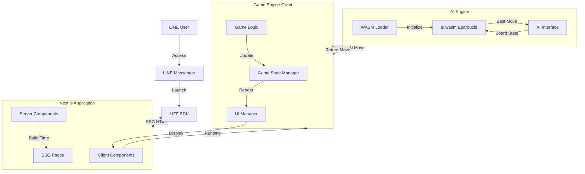
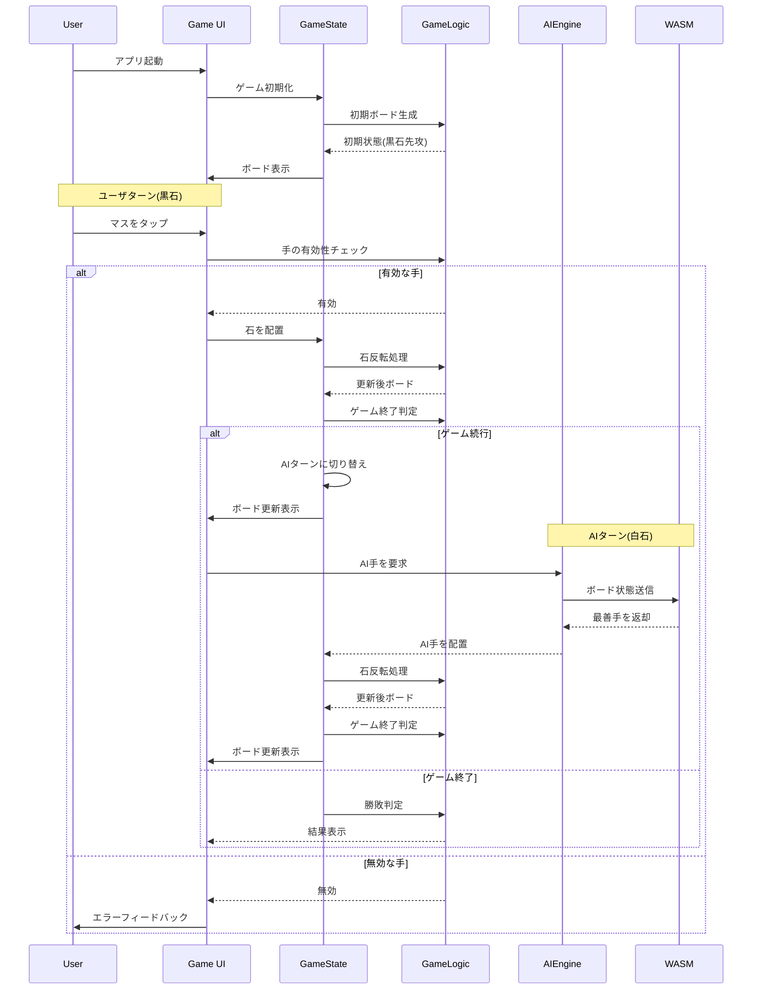
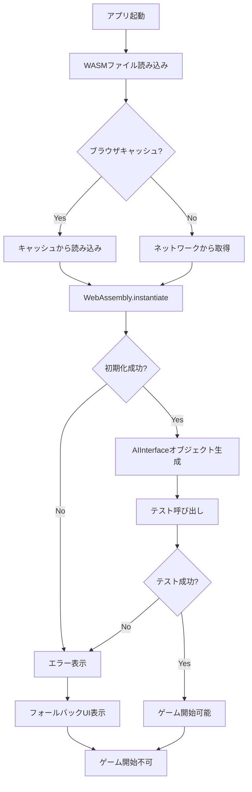
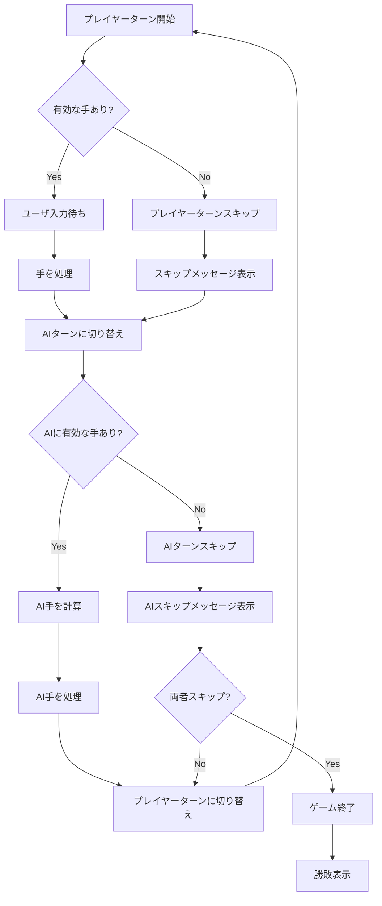
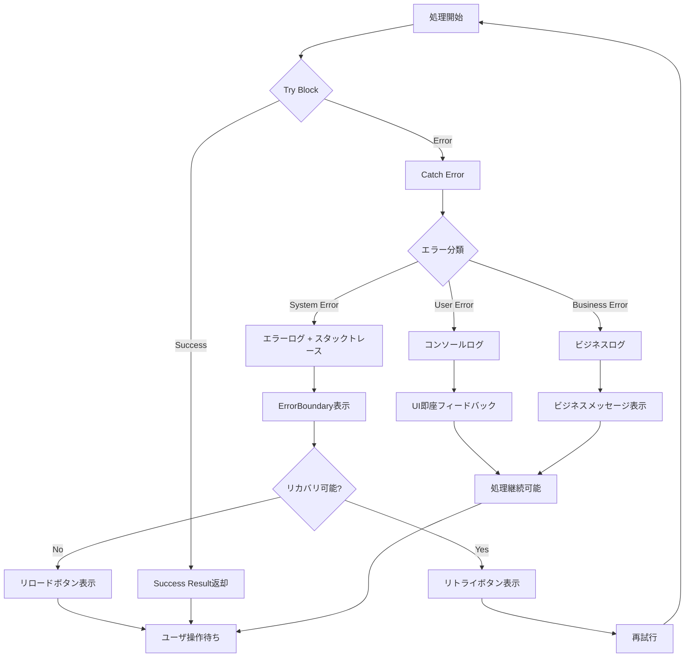

# 設計書

## Overview

本機能は、LINEミニアプリプラットフォーム上で動作するリバーシ(オセロ)ゲームを提供します。ユーザはLINEアプリ内でAIと対戦し、シンプルで直感的なゲーム体験を得ることができます。本アプリケーションはNext.jsフレームワークを使用して構築され、WebAssemblyで実装されたEgaroucid AIエンジンを統合します。

**Purpose**: LINEユーザに対し、アプリを離れることなく手軽に楽しめるリバーシゲーム体験を提供し、AIとの戦略的な対戦を通じて娯楽価値を届けます。

**Users**: LINEアプリを利用する全てのユーザが対象であり、特にスマートフォンでカジュアルゲームを楽しみたいユーザに最適化されています。

**Impact**: 新規機能として、LINEミニアプリエコシステムに参加し、ユーザのアプリ内滞在時間を増やすとともに、WebAssemblyを活用した高性能なゲーム体験を実現します。

### Goals

- LINEミニアプリとして動作する完全機能的なリバーシゲームを提供
- WebAssembly AIエンジン(Egaroucid)を統合し、挑戦的なゲーム体験を実現
- スマートフォンに最適化された直感的なUI/UXを実装
- Next.js App Routerを使用し、SSGによる高速な初期表示を達成
- サーバサイドとクライアントサイドの実装を明確に分離した保守性の高いアーキテクチャを構築

### Non-Goals

- マルチプレイヤー対戦機能(ユーザ同士の対戦)
- ゲーム履歴の永続化やプレイヤーランキング
- AIの難易度選択や設定変更
- アプリケーションの将来的な機能拡張(初期リリースはシンプルな実装に集中)
- デスクトップ環境への最適化

## Architecture

### High-Level Architecture



**Architecture Integration**:

- **Existing patterns preserved**: 該当なし(新規プロジェクト)
- **New components rationale**:
  - Server ComponentsはSSG対応と初期HTML生成のため必須
  - Client Componentsはゲームロジックと動的UIのため必須
  - WASM統合はAI機能実現のため必須
  - 明確な分離により、ビルド時とランタイムの責務を区別
- **Technology alignment**: Next.js 14+ App Router、React 18+、TypeScript、WebAssembly
- **Steering compliance**: シンプル設計原則、型安全性、明確な境界定義を遵守

### Technology Stack and Design Decisions

#### Frontend Framework

**選定**: Next.js 14+ (App Router)

**理由**:

- SSG(Static Site Generation)により初期表示を高速化(要件8: 2秒以内)
- Server ComponentsとClient Componentsの明確な分離をフレームワークレベルでサポート
- LINEミニアプリとの統合が実証済み
- TypeScriptネイティブサポート

**代替案検討**:

- Create React App: SSGサポートなし、ビルド最適化が不十分
- Vite + React: SSGは手動設定が必要、App Routerのような構造的分離なし

#### UI State Management

**選定**: React Hooks (useState, useReducer)

**理由**:

- ゲーム状態は単一コンポーネントツリー内で完結
- 外部ライブラリ不要でシンプル
- ゲームロジックとUIの密結合を回避できる

**代替案検討**:

- Redux/Zustand: 過剰なボイラープレート、シンプルなゲームには不要
- Jotai/Recoil: グローバル状態共有が不要なため導入メリットなし

#### AI Engine Integration

**選定**: WebAssembly (Egaroucid ai.wasm)

**理由**:

- 高性能なリバーシAIアルゴリズムを提供(C++からコンパイル)
- ブラウザネイティブ実行でサーバリクエスト不要
- Emscripten経由でJavaScriptから呼び出し可能

**代替案検討**:

- JavaScript実装AI: パフォーマンス不足(要件8: 3秒以内のAI応答)
- サーバサイドAI: ネットワークレイテンシ、サーバコスト増加
- 既存のAI: 要件でai.wasmの使用が指定済み

#### LINE Platform Integration

**選定**: LIFF (LINE Front-end Framework) SDK 2.x

**理由**:

- LINEミニアプリの公式SDK
- ユーザ認証、プロフィール取得機能を提供
- LINEアプリUIとの統合をサポート

**代替案検討**:

- なし(LINEミニアプリ開発には必須)

#### Styling Solution

**選定**: CSS Modules + Tailwind CSS

**理由**:

- CSS Modulesはスコープ分離とNext.jsネイティブサポート
- Tailwind CSSはモバイル最適化とレスポンシブデザインを迅速に実装
- アニメーション実装が容易

**代替案検討**:

- Styled Components: ランタイムオーバーヘッド、SSGとの相性に課題
- Vanilla CSS: 大規模化時の保守性に課題

#### Type Safety

**選定**: TypeScript 5.x (strict mode)

**理由**:

- WASM境界での型安全性確保
- ゲームロジックの複雑さに対する堅牢性
- Next.jsエコシステムとの親和性

**代替案検討**:

- JavaScript: 型エラーによるバグリスク、保守性の低下

#### Node.js Runtime Environment

**選定**: Node.js 24.x (Active/Current) + nodenv

**理由**:

- **Node.js 24.x**: 最新機能の活用、間もなくActiveステータスに移行予定
- **nodenv**: プロジェクトごとのNode.jsバージョン管理、チーム開発での環境統一
- `.node-version`ファイルでバージョンを明示、自動切り替え対応
- Next.js 14+との完全な互換性、最新のパフォーマンス改善を享受
- 本番環境との一貫性確保

**バージョン管理方針**:

- プロジェクトルートに`.node-version`ファイルを配置
- 記載バージョン: Node.js 24.x (2025年10月時点で間もなくActive)
- マイナー/パッチバージョンの自動更新を許可(セキュリティパッチ適用のため)
- メジャーバージョンアップは明示的なレビューと承認が必要

**代替案検討**:

- nvm: シェル起動時のオーバーヘッド、nodenvより設定が複雑
- asdf: 汎用的だが、Node.js専用ツールとしては過剰
- Dockerのみ: 開発環境のオーバーヘッド、ローカル開発の複雑化

#### Package Manager

**選定**: pnpm

**理由**:

- 高速なインストール速度とディスク効率
- ストリクトな依存関係管理(phantom dependenciesの防止)
- Next.js/React開発におけるデファクトスタンダードの1つ
- モノレポ対応(将来的な拡張に備えて)

**代替案検討**:

- npm: ディスク使用量が多い、インストール速度が遅い
- yarn: pnpmと比較して依存解決が緩い

#### Development Tools

**選定**: ESLint + Prettier + TypeScript Compiler

**理由**:

- **ESLint**: コード品質チェック、Next.js推奨設定(`eslint-config-next`)を使用
- **Prettier**: コードフォーマット自動化、チーム内の一貫性確保
- **TypeScript Compiler**: 型チェック必須実行、ビルド前検証
- 標準的なNext.jsアプリケーションのベストプラクティスに準拠

**具体的なツール構成**:

- `eslint-config-next`: Next.js公式のESLint設定
- `eslint-plugin-react-hooks`: React Hooksのルール検証
- `prettier`: コードフォーマッター
- `typescript`: 型チェックとコンパイル

**開発ワークフロー統合**:

- Pre-commit hook: `lint-staged`で変更ファイルのみlint/format実行
- CI/CDチェック: lint, format, typecheckをビルド前に実行
- IDEサポート: VSCode等での自動フォーマット・リアルタイムエラー表示

**代替案検討**:

- TSLintのみ: フォーマットルールが不十分、Prettier併用が標準
- 手動チェックのみ: 属人的なコード品質、チーム開発で問題

### Key Design Decisions

#### Decision 1: Server/Client Component境界の設計

**Context**: Next.js App Routerではデフォルトで全てがServer Componentだが、ゲームはインタラクティブな動作が必須であり、適切な境界設定が重要。

**Alternatives**:

1. 全てClient Component: SSGの利点を失い、初期表示が遅延
2. 細かく分割: 複雑さ増加、バンドルサイズ最適化は困難
3. ページレベル分離: Server Componentで静的シェル、Client Componentでゲーム本体

**Selected Approach**: ページレベル分離(Option 3)

- `page.tsx`: Server Component (SSG)、静的レイアウト、メタデータ提供
- `GameBoard.tsx`: Client Component ("use client")、全ゲームロジック含む
- メリット: SSGによる高速初期表示とゲームロジックの明確な分離

**Rationale**:

- 要件4: 初期表示はSSG対応を明示
- 要件5: サーバ/クライアント分離の徹底
- バンドルサイズとパフォーマンスのバランスが最適

**Trade-offs**:

- 利点: 初期表示高速化、SEO最適化、明確なアーキテクチャ境界
- 欠点: Client Component内のコード量が増加、コンポーネント分割の柔軟性は制限

#### Decision 2: WebAssembly インタフェース設計

**Context**: Egaroucid ai.wasmはEmscriptenでコンパイルされたC++コードであり、JavaScriptとのメモリ共有とデータ変換が必要。

**Alternatives**:

1. 直接Emscripten APIを使用: Module.\_malloc, HEAP8直接操作
2. 薄いラッパー関数を作成: メモリ管理とエラーハンドリングをカプセル化
3. TypeScript型定義と高レベルAPI: 型安全なインタフェース層を構築

**Selected Approach**: TypeScript型定義と高レベルAPI(Option 3)

- `AIEngineInterface`: TypeScript型定義でWASM関数のシグネチャを定義
- `WASMBridge`: メモリアロケーション、データ変換、エラーハンドリングを隠蔽
- `AIEngine`: ゲームロジックから呼び出される高レベルAPI

**Rationale**:

- 要件4: ai.jsのサンプルコードを参考にしたインタフェース構築
- 型安全性原則: WASM境界での型エラーを防止
- 保守性: WASM実装の変更がゲームロジックに波及しない

**Trade-offs**:

- 利点: 型安全性、テスタビリティ、エラーハンドリングの一元化
- 欠点: 抽象化レイヤーの追加でわずかなパフォーマンスオーバーヘッド

#### Decision 3: ゲーム状態管理パターン

**Context**: リバーシゲームは複雑な状態遷移(ボード状態、ターン、有効手、勝敗判定)を持ち、UI更新と同期が必要。

**Alternatives**:

1. useState複数使用: 各状態を個別管理
2. useReducer単一使用: 全ゲーム状態を単一Reducerで管理
3. カスタムフックでカプセル化: useGameStateフックで状態とロジックを分離

**Selected Approach**: カスタムフックでカプセル化(Option 3)

- `useGameState`: ゲーム状態(board, currentPlayer, validMoves, gameStatus)を管理
- `useGameLogic`: ゲームルール(石配置、反転、有効手計算、勝敗判定)を提供
- `useAIPlayer`: AI対戦ロジック(WASM呼び出し、非同期処理)をカプセル化

**Rationale**:

- 単一責任原則: 状態管理、ゲームロジック、AI統合を分離
- テスタビリティ: 各フックを独立してテスト可能
- 再利用性: ロジックをUIから分離

**Trade-offs**:

- 利点: 保守性、テスタビリティ、コードの可読性向上
- 欠点: フック間の依存関係管理が必要、初期学習コストがわずかに増加

## System Flows

### Primary Game Flow



### WebAssembly Initialization Flow



### Turn Skip Flow



## Requirements Traceability

| Requirement | Summary                  | Components                                       | Interfaces                                    | Flows                             |
| ----------- | ------------------------ | ------------------------------------------------ | --------------------------------------------- | --------------------------------- |
| 1           | ゲームボード表示と初期化 | GameBoard, BoardRenderer, Server Component       | BoardState, InitialGameState                  | -                                 |
| 2           | 石の配置とゲームロジック | GameLogic, MoveValidator, StoneFlip              | validateMove(), flipStones(), getValidMoves() | Primary Game Flow, Turn Skip Flow |
| 3           | AI対戦機能               | AIEngine, AIPlayer                               | calculateAIMove(), requestMove()              | Primary Game Flow                 |
| 4           | WebAssembly統合          | WASMLoader, WASMBridge, AIEngineInterface        | loadWASM(), callWASM(), encodeBoard()         | WASM Initialization Flow          |
| 5           | クライアント/サーバ分離  | Server Components, Client Components             | (アーキテクチャ境界)                          | -                                 |
| 6           | UI/UX                    | UIManager, AnimationController, FeedbackProvider | renderBoard(), showAnimation()                | Primary Game Flow                 |
| 7           | LINEミニアプリ統合       | LIFFInitializer, LIFFAdapter                     | initializeLIFF(), getUserProfile()            | -                                 |
| 8           | パフォーマンス           | SSG, useCallback, useMemo, WASM                  | (最適化戦略)                                  | -                                 |
| 9           | エラーハンドリング       | ErrorBoundary, ErrorHandler                      | handleError(), showErrorMessage()             | WASM Initialization Flow          |

## Components and Interfaces

### Presentation Layer

#### GamePage (Server Component)

**Responsibility & Boundaries**

- **Primary Responsibility**: SSGによる静的HTMLの生成とメタデータ提供
- **Domain Boundary**: プレゼンテーション層(サーバサイド)
- **Data Ownership**: 静的コンテンツ、メタタグ、初期HTMLレイアウト
- **Transaction Boundary**: なし(静的生成のみ)

**Dependencies**

- **Inbound**: Next.js App Routerから呼び出し
- **Outbound**: GameBoardコンポーネント(Client Component)
- **External**: Next.js Metadata API

**Contract Definition**

**Component Interface**:

```typescript
// app/page.tsx (Server Component)
export const metadata: Metadata = {
  title: string;
  description: string;
  viewport: string;
  themeColor: string;
};

export default function GamePage(): JSX.Element;
```

- **Preconditions**: Next.jsビルドプロセスが実行される
- **Postconditions**: 静的HTMLファイルが生成され、GameBoardコンポーネントをマウントする
- **Invariants**: サーバサイドでのみ実行され、クライアントサイドコードを含まない

#### GameBoard (Client Component)

**Responsibility & Boundaries**

- **Primary Responsibility**: ゲーム全体のUI管理とユーザインタラクション処理
- **Domain Boundary**: プレゼンテーション層(クライアントサイド)
- **Data Ownership**: UI状態、アニメーション状態、ユーザ入力
- **Transaction Boundary**: なし(ローカル状態のみ)

**Dependencies**

- **Inbound**: GamePageから呼び出し
- **Outbound**: GameState管理フック、GameLogic、AIEngine
- **External**: React Hooks、LIFF SDK(初期化のみ)

**Contract Definition**

**Component Interface**:

```typescript
'use client';

interface GameBoardProps {
  initialSettings?: GameSettings;
}

export default function GameBoard(props: GameBoardProps): JSX.Element;
```

**State Management**:

```typescript
interface GameState {
  board: Board;
  currentPlayer: Player;
  validMoves: Position[];
  gameStatus: GameStatus;
  blackCount: number;
  whiteCount: number;
  isAIThinking: boolean;
}

type GameStatus =
  | { type: 'playing' }
  | { type: 'finished'; winner: Player | 'draw' }
  | { type: 'error'; message: string };
```

- **Preconditions**: ブラウザ環境で実行され、WASMが正常にロード済み
- **Postconditions**: ゲームの全ライフサイクルを管理し、ユーザ操作に応答する
- **Invariants**: ゲーム状態は常に整合性を保つ(無効な状態遷移を防止)

#### BoardRenderer

**Responsibility & Boundaries**

- **Primary Responsibility**: 8×8ボードの視覚的レンダリングとアニメーション管理
- **Domain Boundary**: プレゼンテーション層(UI描画)
- **Data Ownership**: レンダリング用の一時的なビュー状態
- **Transaction Boundary**: なし

**Dependencies**

- **Inbound**: GameBoardから呼び出し
- **Outbound**: なし(Pure Presentational Component)
- **External**: CSS Modules、Tailwind CSS

**Contract Definition**

```typescript
interface BoardRendererProps {
  board: Board;
  validMoves: Position[];
  onCellClick: (position: Position) => void;
  highlightLastMove?: Position;
  animatingPositions?: Position[];
}

export function BoardRenderer(props: BoardRendererProps): JSX.Element;
```

- **Preconditions**: 有効なBoard状態が渡される
- **Postconditions**: ボードの現在状態を視覚的に表示する
- **Invariants**: プロパティの変更のみに反応する(内部状態なし)

### Game Logic Layer

#### GameLogic

**Responsibility & Boundaries**

- **Primary Responsibility**: リバーシのゲームルール実装(手の有効性、石反転、勝敗判定)
- **Domain Boundary**: ゲームドメインロジック
- **Data Ownership**: ゲームルールの実装(データは保持しない)
- **Transaction Boundary**: なし(Pure Functions)

**Dependencies**

- **Inbound**: GameBoard、useGameStateから呼び出し
- **Outbound**: なし(Pure Functions)
- **External**: なし

**Contract Definition**

**Service Interface**:

```typescript
interface GameLogicService {
  // 手の有効性を検証
  validateMove(
    board: Board,
    position: Position,
    player: Player
  ): Result<boolean, InvalidMoveError>;

  // 石を配置して反転処理を実行
  applyMove(
    board: Board,
    position: Position,
    player: Player
  ): Result<Board, MoveApplicationError>;

  // プレイヤーの全有効手を計算
  calculateValidMoves(board: Board, player: Player): Position[];

  // ゲーム終了判定と勝者決定
  checkGameEnd(
    board: Board,
    blackValidMoves: Position[],
    whiteValidMoves: Position[]
  ): GameEndResult;

  // 石数カウント
  countStones(board: Board): StoneCount;
}

type Board = ReadonlyArray<ReadonlyArray<Cell>>;
type Cell = Player | null;
type Player = 'black' | 'white';

interface Position {
  readonly row: number;
  readonly col: number;
}

interface StoneCount {
  readonly black: number;
  readonly white: number;
}

type GameEndResult =
  | { ended: false }
  | { ended: true; winner: Player | 'draw' };

// Error types
interface InvalidMoveError {
  readonly type: 'invalid_move';
  readonly reason: 'out_of_bounds' | 'occupied' | 'no_flips';
}

interface MoveApplicationError {
  readonly type: 'move_application_error';
  readonly reason: string;
}

type Result<T, E> = { success: true; value: T } | { success: false; error: E };
```

- **Preconditions**: Board状態は8×8の有効な配列、Positionは0-7の範囲
- **Postconditions**: ゲームルールに従った正確な結果を返す、元のBoardを変更しない(Immutable)
- **Invariants**: 純粋関数として実装され、副作用なし

#### MoveValidator

**Responsibility & Boundaries**

- **Primary Responsibility**: 特定の手が有効かを判定し、反転される石の位置を計算
- **Domain Boundary**: ゲームドメインロジック(検証特化)
- **Data Ownership**: なし(Pure Functions)
- **Transaction Boundary**: なし

**Dependencies**

- **Inbound**: GameLogicServiceから呼び出し
- **Outbound**: なし
- **External**: なし

**Contract Definition**

```typescript
interface MoveValidatorService {
  // 指定方向に反転可能な石を検索
  findFlipsInDirection(
    board: Board,
    position: Position,
    player: Player,
    direction: Direction
  ): Position[];

  // 全方向の反転可能な石を収集
  findAllFlips(board: Board, position: Position, player: Player): Position[];
}

type Direction =
  | { dx: -1; dy: -1 } // 左上
  | { dx: -1; dy: 0 } // 上
  | { dx: -1; dy: 1 } // 右上
  | { dx: 0; dy: -1 } // 左
  | { dx: 0; dy: 1 } // 右
  | { dx: 1; dy: -1 } // 左下
  | { dx: 1; dy: 0 } // 下
  | { dx: 1; dy: 1 }; // 右下
```

- **Preconditions**: Board、Position、Playerは有効な値
- **Postconditions**: リバーシルールに従った反転位置リストを返す
- **Invariants**: 元のBoardを変更しない

### AI Engine Layer

#### AIEngine

**Responsibility & Boundaries**

- **Primary Responsibility**: WebAssemblyモジュールとの高レベルインタフェース提供
- **Domain Boundary**: AI統合層
- **Data Ownership**: WASM初期化状態、エラー状態
- **Transaction Boundary**: なし(ステートレス計算)

**Dependencies**

- **Inbound**: GameBoardから呼び出し
- **Outbound**: WASMBridge、AIEngineInterface
- **External**: WebAssembly Runtime、ai.wasm

**Egaroucid WASM Integration** (C++ソースコード解析完了):

完全なWASM統合の仕様とインタフェース詳細は、別途作成された解析ドキュメントを参照してください:

- **[WASM Source Analysis](./wasm-source-analysis/)**: C++ソースコードの完全な解析レポートとインタフェース仕様
  - **[analysis-report.md](./wasm-source-analysis/analysis-report.md)**: Egaroucid C++コードの包括的な解析、全5つのエクスポート関数の詳細動作、ビットボード実装、座標系マッピング、Emscriptenビルド構成
  - **[interface-spec.md](./wasm-source-analysis/interface-spec.md)**: WASM統合のための実装仕様、ボードエンコーディング/デコーディング、メモリ管理、エラーハンドリング、実装例

**統合の概要**:

- **WASM Binary**: `ai.wasm` (~1.4 MB、Emscripten 3.1.20でコンパイルされたC++ Reversi Engine)
- **Emscripten Glue Code**: `ai.js` (~94 KB、Emscriptenランタイム + グルーコード)
  - **必須**: `ai.wasm`単体では動作せず、`ai.js`を経由してロードする必要がある
  - **理由**: EmscriptenはWASMインポートオブジェクト（メモリ管理、システムコールなど）を提供
  - **ロード方法**: `import()`または動的スクリプトロードで`ai.js`をロードし、Moduleオブジェクトを取得
- **主要エクスポート**: `_init_ai()`, `_calc_value()`, `_ai_js()`, `_stop()`, `_resume()`, `_malloc()`, `_free()`
- **ボードエンコーディング**: Int32Array (64要素、256 bytes)、セル値: -1=empty, 0=black, 1=white
- **座標系**: ビット位置 = `63 - (row * 8 + col)` (座標系変換に注意)
- **Level System**: 61レベル (0-60)、Level 0はランダム（非決定的）
- **実行モデル**: 同期ブロッキング → Web Worker必須、3秒タイムアウト推奨

**Emscripten統合の重要性**:

Emscripten WASMは通常のWASMと異なり、以下の依存関係があります:

1. **インポートオブジェクト**: メモリ管理、環境変数、システムコールのエミュレーション
2. **ランタイム初期化**: `onRuntimeInitialized`コールバックで初期化完了を待機
3. **HEAP管理**: `HEAP8`, `HEAP32`などのTypedArrayビューを提供

直接`WebAssembly.instantiate()`を使用すると、以下のエラーが発生します:

```text
WebAssembly.instantiate(): Import #0 "a": module is not an object or function
```

正しいロード方法はTask 6で実装されます。

詳細な実装ガイド、エラーハンドリング戦略、パフォーマンス考慮事項については上記のドキュメントを参照してください。

**Contract Definition**

**Service Interface**:

```typescript
interface AIEngineService {
  // WASM初期化(アプリ起動時に1回実行)
  initialize(): Promise<Result<void, InitializationError>>;

  // AI手を計算(非同期でUIブロック回避)
  calculateMove(
    board: Board,
    player: Player,
    timeoutMs?: number
  ): Promise<Result<Position, AICalculationError>>;

  // WASM状態確認
  isReady(): boolean;

  // リソース解放
  dispose(): void;
}

interface InitializationError {
  readonly type: 'initialization_error';
  readonly reason:
    | 'wasm_load_failed'
    | 'wasm_instantiation_failed'
    | 'test_call_failed';
  readonly message: string;
}

interface AICalculationError {
  readonly type: 'ai_calculation_error';
  readonly reason:
    | 'not_initialized'
    | 'timeout'
    | 'invalid_response'
    | 'wasm_error';
  readonly message: string;
}
```

- **Preconditions**: initialize()が成功済み、Boardは有効な状態
- **Postconditions**: 有効な手を返すか、明確なエラーを返す
- **Invariants**: 初期化後はスレッドセーフ(WebAssemblyモジュールは再利用可能)

#### WASMBridge

**Responsibility & Boundaries**

- **Primary Responsibility**: JavaScriptとWASM間のデータ変換、メモリ管理、エラーハンドリング
- **Domain Boundary**: WASM統合層(低レベル)
- **Data Ownership**: WASMメモリアロケーション、Module参照
- **Transaction Boundary**: なし

**Dependencies**

- **Inbound**: AIEngineServiceから呼び出し
- **Outbound**: WebAssembly Module(ai.wasm)
- **External**: Emscripten Runtime API(Module.\_malloc, Module.\_free, Module.ccall)

**Contract Definition**

```typescript
interface WASMBridgeService {
  // WASMモジュールロードと初期化
  loadWASM(
    wasmPath: string
  ): Promise<Result<EgaroucidWASMModule, WASMLoadError>>;

  // ボード状態をWASMメモリに書き込み(256 bytes allocation = 64 Int32 elements)
  // Cell values: -1=empty, 0=black, 1=white (Int32Array)
  encodeBoard(
    module: EgaroucidWASMModule,
    board: Board,
    player: Player
  ): Result<WASMPointer, EncodeError>;

  // WASM関数呼び出し(_ai_js wrapper)
  // Signature: _ai_js(boardPtr: number, level: number, ai_player: number): number
  // Returns: 1000 * (63 - policy) + 100 + value
  callAIJSFunction(
    module: EgaroucidWASMModule,
    boardPointer: WASMPointer,
    level: number,
    ai_player: number
  ): Result<number, WASMCallError>;

  // WASM応答をデコード(1000*(63-policy)+100+value -> {row, col})
  // policy = 63 - Math.floor((result - 100) / 1000)
  // index = 63 - policy
  decodeAIJSResponse(encodedResult: number): Result<Position, DecodeError>;

  // メモリ解放
  freeMemory(module: EgaroucidWASMModule, pointer: WASMPointer): void;

  // WASM初期化確認
  isModuleReady(module: EgaroucidWASMModule | null): boolean;
}

// Note: EgaroucidWASMModuleの完全な型定義は上記の「WASM Module Exports」セクションを参照

type WASMPointer = number; // Pointer to allocated WASM memory

// Board encoding: 256 bytes (8x8 grid, Int32Array)
// Values: -1=empty, 0=black, 1=white
// Memory layout: Int32Array (64 elements × 4 bytes/element = 256 bytes)
type BoardEncoding = Int32Array; // length must be 64

interface WASMLoadError {
  readonly type: 'wasm_load_error';
  readonly reason:
    | 'fetch_failed'
    | 'instantiation_failed'
    | 'initialization_timeout';
  readonly message: string;
}

interface EncodeError {
  readonly type: 'encode_error';
  readonly reason:
    | 'invalid_board'
    | 'memory_allocation_failed'
    | 'invalid_player';
  readonly message: string;
}

interface WASMCallError {
  readonly type: 'wasm_call_error';
  readonly reason: 'module_not_ready' | 'execution_failed' | 'null_pointer';
  readonly message: string;
}

interface DecodeError {
  readonly type: 'decode_error';
  readonly reason: 'invalid_response';
}
```

- **Preconditions**: EmscriptenModuleが正常にロード済み
- **Postconditions**: WASMメモリは適切に解放される、エラー時も例外を投げずResultを返す
- **Invariants**: メモリリークを防止するため、必ずfreeMemory()を呼び出す

#### Web Worker Integration (UI Thread Isolation)

**Rationale**:
Egaroucid WASMの`_calc_value()`は同期的(blocking)で、計算に0.5-2秒かかるため、メインスレッドで実行するとUI全体がフリーズします。Web Workerで実行することで、UIの応答性を維持しながらAI計算を行います。

**Architecture**:

```
Main Thread (React)          Worker Thread
┌─────────────────┐         ┌──────────────────┐
│  AIEngine       │────────▶│  ai-worker.ts    │
│  (Service)      │ message │  (WASM executor) │
└─────────────────┘◀────────└──────────────────┘
        │                             │
        │                             ▼
        │                    ┌──────────────────┐
        │                    │  WASMBridge      │
        │                    │  + Egaroucid     │
        │                    └──────────────────┘
        ▼
  Update UI state
```

**Worker Contract**:

```typescript
// src/workers/ai-worker.ts - Web Worker implementation

// Message types
interface AIWorkerRequest {
  type: 'calculate';
  payload: {
    board: Board; // 8x8 grid
    currentPlayer: Player; // 'black' | 'white'
    timeoutMs?: number; // Default 3000
  };
}

interface AIWorkerResponse {
  type: 'success' | 'error';
  payload: {
    move?: Position; // { row, col } if success
    error?: string; // Error message if error
    calculationTimeMs?: number; // Performance metric
  };
}

// Worker message handler
self.onmessage = async (event: MessageEvent<AIWorkerRequest>) => {
  const { type, payload } = event.data;

  if (type === 'calculate') {
    try {
      // Initialize WASM if needed (one-time)
      if (!wasmModule) {
        wasmModule = await WASMBridge.loadWASM('/ai.wasm');
        // Note: 実際のシグネチャは_init_ai(a0?)だが、パラメータなしで呼び出し可能と想定
        wasmModule._init_ai();
      }

      const startTime = performance.now();

      // Encode board to WASM memory (256 bytes)
      const boardPtr = WASMBridge.encodeBoard(
        wasmModule,
        payload.board,
        payload.currentPlayer
      );

      // Call WASM (synchronous, but in worker thread)
      // Signature: _ai_js(boardPtr, level, ai_player)
      // ai_player: 0=black, 1=white
      const level = 15; // Default level
      const ai_player = payload.currentPlayer === 'black' ? 0 : 1;
      const encodedResult = wasmModule._ai_js(boardPtr, level, ai_player);

      // Free memory immediately
      wasmModule._free(boardPtr);

      // Decode response (1000*(63-policy)+100+value format)
      const move = WASMBridge.decodeAIJSResponse(encodedResult);

      const calculationTimeMs = performance.now() - startTime;

      // Send result back to main thread
      self.postMessage({
        type: 'success',
        payload: { move, calculationTimeMs },
      } as AIWorkerResponse);
    } catch (error) {
      self.postMessage({
        type: 'error',
        payload: { error: String(error) },
      } as AIWorkerResponse);
    }
  }
};
```

**Main Thread Integration (React Hook)**:

```typescript
// src/hooks/useAIPlayer.ts

export function useAIPlayer() {
  const workerRef = useRef<Worker | null>(null);

  useEffect(() => {
    // Initialize worker on mount
    workerRef.current = new Worker(
      new URL('../workers/ai-worker.ts', import.meta.url),
      { type: 'module' }
    );

    // Cleanup on unmount
    return () => {
      workerRef.current?.terminate();
    };
  }, []);

  const calculateMove = useCallback(
    async (board: Board, player: Player): Promise<Position> => {
      return new Promise((resolve, reject) => {
        if (!workerRef.current) {
          reject(new Error('Worker not initialized'));
          return;
        }

        // Set up timeout (3 seconds per requirement 8)
        const timeout = setTimeout(() => {
          reject(new Error('AI calculation timeout (>3s)'));
        }, 3000);

        // Set up message listener
        const handleMessage = (event: MessageEvent<AIWorkerResponse>) => {
          clearTimeout(timeout);
          workerRef.current?.removeEventListener('message', handleMessage);

          if (event.data.type === 'success') {
            resolve(event.data.payload.move!);
          } else {
            reject(new Error(event.data.payload.error));
          }
        };

        workerRef.current.addEventListener('message', handleMessage);

        // Send calculation request to worker
        workerRef.current.postMessage({
          type: 'calculate',
          payload: { board, currentPlayer: player, timeoutMs: 3000 },
        } as AIWorkerRequest);
      });
    },
    []
  );

  return { calculateMove };
}
```

**Error Handling in Worker Context**:

- **WASM Load Failure**: Worker初期化時にWASMロード失敗 → main threadにerror送信、UIでエラー表示
- **Calculation Timeout**: Main threadで3秒タイムアウト → workerを中断しないが、新しいrequestを送信
- **Invalid Response**: Worker内で検証し、invalid responseはerrorとして返す
- **Memory Allocation Failure**: `_malloc()`が0を返した場合、即座にerrorを返す

**Performance Characteristics**:
| Metric | Target | Notes |
|--------|--------|-------|
| Worker Message Overhead | <10ms | postMessage serialization cost |
| WASM Calculation (typical) | 0.5-2s | Depends on board complexity |
| WASM Calculation (max) | <3s | Requirement 8.1, timeout enforced |
| UI Response Time | <100ms | UI remains responsive during calc |

- **Preconditions**: Web Worker APIが利用可能(全モダンブラウザでサポート)
- **Postconditions**: メインスレッドがブロックされない、計算中もUIインタラクション可能
- **Invariants**: 1つのworkerインスタンスを再利用、計算中の複数リクエストは順次処理

### LINE Integration Layer

#### LIFFInitializer

**Responsibility & Boundaries**

- **Primary Responsibility**: LIFF SDKの初期化とLINE認証管理
- **Domain Boundary**: プラットフォーム統合層
- **Data Ownership**: LIFF初期化状態、ユーザプロフィール
- **Transaction Boundary**: なし

**Dependencies**

- **Inbound**: GameBoard初期化時に呼び出し
- **Outbound**: LIFF SDK
- **External**: LIFF SDK 2.x、LINEサーバ

**External Dependencies Investigation**:

- **LIFF SDK**: LINE公式のJavaScript SDK、CDNまたはnpm経由で導入
- **初期化**: liff.init({ liffId: 'YOUR_LIFF_ID' })で非同期初期化
- **認証**: liff.isLoggedIn()でログイン状態確認、liff.login()でLINE認証
- **ユーザ情報**: liff.getProfile()でユーザID、表示名、プロフィール画像取得可能
- **エラーハンドリング**: 初期化失敗、ログイン失敗、非LINEブラウザでの動作をハンドリング
- **Version**: LIFF SDK 2.x系を使用(最新安定版、2025年時点で2.24.x)

**Contract Definition**

```typescript
interface LIFFInitializerService {
  // LIFF初期化
  initialize(liffId: string): Promise<Result<LIFFContext, LIFFInitError>>;

  // ログイン状態確認
  isLoggedIn(): boolean;

  // ユーザプロフィール取得
  getUserProfile(): Promise<Result<UserProfile, ProfileError>>;
}

interface LIFFContext {
  readonly type: 'line_app' | 'external_browser';
  readonly language: string;
}

interface UserProfile {
  readonly userId: string;
  readonly displayName: string;
  readonly pictureUrl?: string;
}

interface LIFFInitError {
  readonly type: 'liff_init_error';
  readonly reason: 'init_failed' | 'not_line_browser';
  readonly message: string;
}

interface ProfileError {
  readonly type: 'profile_error';
  readonly reason: 'not_logged_in' | 'api_error';
}
```

- **Preconditions**: LIFF SDKがロード済み、有効なLIFF IDが提供される
- **Postconditions**: LINEアプリ内またはLINE外ブラウザで適切に動作する
- **Invariants**: 初期化は1回のみ実行される(複数回呼び出しはべき等)

## Data Models

### Domain Model

#### Core Concepts

**Entities**:

1. **Game (ゲーム全体)**
   - Identity: ゲームセッションID(必要に応じて)
   - Lifecycle: 初期化 → プレイ中 → 終了
   - Aggregates: Board、Player、GameStatus

2. **Board (ボード状態)**
   - Identity: なし(Value Object)
   - Immutable: 各手で新しいBoardインスタンスを生成
   - Structure: 8×8 Cellの2次元配列

**Value Objects**:

1. **Position (座標)**
   - Immutable: row(0-7), col(0-7)
   - Validation: 範囲外の値を許可しない

2. **Cell (マス状態)**
   - Immutable: Player | null
   - Values: 'black', 'white', null

3. **Player (プレイヤー)**
   - Immutable: 'black' | 'white'

4. **GameStatus (ゲーム状態)**
   - Discriminated Union: 'playing' | 'finished' | 'error'

**Business Rules & Invariants**:

1. **Board Consistency**:
   - ボードは常に8×8のサイズ
   - 初期配置: 中央4マスに白黒2個ずつ配置
   - 全Cellは常にnull | 'black' | 'white'のいずれか

2. **Move Validity**:
   - 手は空きマスにのみ配置可能
   - 少なくとも1個以上の相手石を反転できる手のみ有効
   - 反転は8方向(縦横斜め)を探索

3. **Turn Rules**:
   - 黒石(ユーザ)が先攻
   - 有効な手がない場合、ターンをスキップ
   - 両者が連続でスキップした場合、ゲーム終了

4. **Game End Conditions**:
   - ボード全体が埋まる
   - 両プレイヤーに有効な手がない
   - 一方の石が0個になる

5. **Winner Determination**:
   - 黒石と白石の数を比較
   - 多い方が勝者、同数は引き分け

### Logical Data Model

#### Game State Structure

```mermaid
erDiagram
    GameState ||--|| Board : contains
    GameState ||--|| CurrentPlayer : has
    GameState ||--|{ ValidMoves : calculates
    GameState ||--|| GameStatus : has

    Board ||--|{ Cell : "8x8 grid"
    Cell ||--o| Player : "occupied by"

    ValidMoves }|--|| Position : "list of"

    GameStatus ||--o| Winner : "determines"
    Winner }o--|| Player : "is"

    GameState {
        Board board
        Player currentPlayer
        Position[] validMoves
        GameStatus gameStatus
        int blackCount
        int whiteCount
        boolean isAIThinking
    }

    Board {
        Cell[8][8] cells
    }

    Cell {
        Player? value
    }

    Position {
        int row
        int col
    }

    GameStatus {
        string type
        Player? winner
        string? errorMessage
    }
```

#### Consistency & Integrity

**Transaction Boundaries**:

- ゲーム状態の更新は単一コンポーネント内で完結(分散トランザクション不要)
- Boardの変更は常にImmutableパターンで新しいインスタンスを生成
- React Stateの更新により自動的に一貫性が保証される

**Referential Integrity**:

- 全てのPositionはBoard範囲内(0-7)を保証
- ValidMovesは常にBoardの現在状態と整合
- CurrentPlayerとGameStatusは同期される

**Temporal Aspects**:

- ゲーム履歴の保存なし(要件外)
- 各手のタイムスタンプは記録しない
- ゲームリセット時に全状態を初期化

### Physical Data Model

#### Browser Storage

本アプリケーションはデータの永続化を行わないため、物理データモデルはブラウザメモリ内のReact State管理のみです。

**Memory Structure**:

```typescript
// React State (useReducer推奨)
interface GameStateInMemory {
  board: Board; // 8x8x1 byte (64 bytes) + オブジェクトオーバーヘッド
  currentPlayer: Player; // 8 bytes (string reference)
  validMoves: Position[]; // 可変(最大60 positions = 480 bytes)
  gameStatus: GameStatus; // 24 bytes (discriminated union)
  blackCount: number; // 8 bytes
  whiteCount: number; // 8 bytes
  isAIThinking: boolean; // 8 bytes
  history?: Move[]; // オプション(アニメーション用に直近数手)
}

// 推定メモリ使用量: 約1KB(ゲーム状態) + 数MB(WASM module)
```

**WASM Memory Layout**:

- ai.wasmは独自のメモリ空間を持つ(WebAssembly.Memory)
- JavaScript側からHEAP8/HEAP32経由でアクセス
- ボード状態は64バイト配列として転送(0=空, 1=黒, 2=白)

**Cache Strategy**:

- WASM moduleはブラウザHTTPキャッシュに保存(Cache-Control指定)
- 静的アセット(CSS, JS)はNext.jsビルドハッシュでキャッシュバスティング

### Data Contracts & Integration

#### WASM Data Contract

```typescript
// JavaScript -> WASM
interface BoardEncoding {
  // 256 bytes (8x8 grid, Int32Array)
  // -1 = empty, 0 = black, 1 = white
  cells: Int32Array; // length = 64
  ai_player: 0 | 1; // 0 = black, 1 = white
}

// WASM -> JavaScript (_ai_js response)
interface AIJSResponse {
  encodedResult: number; // 1000 * (63 - policy) + 100 + value
  policy: number; // 0-63 (bit position)
  value: number; // evaluation score
  row: number; // 0-7
  col: number; // 0-7
}
```

**Validation Rules**:

- cells配列は正確に64要素 (Int32Array)
- 各要素は-1, 0, 1のいずれか
- ai_playerは0 (black) または 1 (white)
- rowとcolは0-7の範囲

**Serialization Format**:

- Binary(Int32Array)で転送 (256 bytes)

**Schema Versioning**:

- ai.wasmのバージョンは固定(requirements指定のファイル使用)
- インタフェース変更時は新しいバージョンを別ファイルとして配置

## Error Handling

### Error Strategy

本アプリケーションでは、**Result型パターン**と**React Error Boundary**を組み合わせた包括的なエラーハンドリング戦略を採用します。

**設計原則**:

1. **Fail Fast**: 無効な入力は早期に検証し、明確なエラーを返す
2. **Graceful Degradation**: WASM初期化失敗時はエラーUI表示だが、アプリクラッシュは回避
3. **User Context**: ユーザに実行可能なエラーメッセージを提供
4. **Observability**: 全エラーをコンソールログに記録(将来的な監視対応)

### Error Categories and Responses

#### User Errors (ユーザ入力エラー)

| Error Type  | Scenario                   | Handling               | User Feedback                                        |
| ----------- | -------------------------- | ---------------------- | ---------------------------------------------------- |
| InvalidMove | 無効なマスをタップ         | UI即座にフィードバック | マスを赤くハイライト、"ここには置けません"メッセージ |
| OutOfBounds | 範囲外座標(通常発生しない) | ログに記録、無視       | なし(UIレベルで防止)                                 |

#### System Errors (システムエラー)

| Error Type           | Scenario                   | Handling         | User Feedback                                                           |
| -------------------- | -------------------------- | ---------------- | ----------------------------------------------------------------------- |
| WASMLoadFailed       | ai.wasmのロード失敗        | エラー画面表示   | "ゲームを読み込めませんでした。リロードしてください。" + リロードボタン |
| WASMInitFailed       | WASM初期化失敗             | エラー画面表示   | "ゲームの初期化に失敗しました。ブラウザを確認してください。"            |
| AICalculationTimeout | AI計算が3秒超過            | ランダム手を選択 | "AIの思考時間超過、ランダムに手を選びました"                            |
| NetworkError         | (該当なし: オフライン動作) | -                | -                                                                       |

#### Business Logic Errors (ビジネスロジックエラー)

| Error Type             | Scenario                 | Handling           | User Feedback                                      |
| ---------------------- | ------------------------ | ------------------ | -------------------------------------------------- |
| NoValidMoves           | プレイヤーに有効な手なし | ターン自動スキップ | "有効な手がありません。ターンをスキップします。"   |
| GameStateInconsistency | ボード状態の不整合       | ゲームリセット     | "エラーが発生しました。ゲームを最初から始めます。" |

### Error Flow Diagram



### Monitoring

**実装内容**:

1. **Error Logging**: 全エラーを`console.error()`に出力(本番環境では外部ログサービスに送信可能)
2. **Error Categorization**: エラータイプ、発生場所、タイムスタンプを記録
3. **User Actions**: エラー発生時のユーザアクション(タップ位置、ゲーム状態)を記録

**ログフォーマット**:

```typescript
interface ErrorLog {
  timestamp: string;
  errorType: string;
  errorCategory: 'user' | 'system' | 'business';
  message: string;
  stack?: string;
  gameState?: Partial<GameState>;
  userAction?: string;
}
```

**Health Check**: 該当なし(サーバレスアプリケーションのため)

## Testing Strategy

### Unit Tests

**対象**: Pure Functions、ビジネスロジック

1. **GameLogic.validateMove()**:
   - 有効な手の正確な判定
   - 8方向の反転検出ロジック
   - 境界条件(ボード端、角)

2. **GameLogic.applyMove()**:
   - 石配置と反転処理の正確性
   - Immutabilityの保証(元のBoardが変更されないこと)

3. **GameLogic.calculateValidMoves()**:
   - 全有効手の網羅的な計算
   - 有効な手がない場合の空配列返却

4. **GameLogic.checkGameEnd()**:
   - ゲーム終了条件の正確な判定
   - 勝敗判定ロジック

5. **MoveValidator.findAllFlips()**:
   - 複雑な反転パターンの検証
   - エッジケース(複数方向同時反転)

**ツール**: Jest、@testing-library/react

**カバレッジ目標**: GameLogicレイヤーは90%以上

### Integration Tests

**対象**: コンポーネント間の連携

1. **GameBoard + GameLogic統合**:
   - ユーザがマスをクリックして石が配置される一連のフロー
   - 無効な手をクリックした際のエラーフィードバック

2. **AIEngine + WASMBridge統合**:
   - WASM初期化からAI手計算までの完全なフロー
   - WASM初期化失敗時のエラーハンドリング
   - AI計算タイムアウトのシミュレーション

3. **GameBoard + AIEngine統合**:
   - ユーザターン → AI計算 → AIターンの完全なゲームループ
   - 両者スキップ時のゲーム終了フロー

4. **LIFFInitializer統合**:
   - LIFF SDK初期化とモックLIFF環境での動作確認
   - 非LINEブラウザでのフォールバック動作

5. **ErrorBoundary統合**:
   - 予期しないエラー発生時のUI表示
   - リカバリアクション(リトライ、リロード)の動作確認

**ツール**: Jest、React Testing Library、MSW(Mock Service Worker for LIFF)

**カバレッジ目標**: 主要フロー80%以上

### E2E Tests

**対象**: ユーザ視点の完全なゲームフロー

1. **ゲーム起動から終了までの完全プレイ**:
   - アプリ起動 → ボード表示 → ユーザ手 → AI手 → ゲーム終了 → 結果表示 → 再開

2. **有効手ハイライト表示**:
   - ターン開始時に有効手が視覚的に示される
   - 無効手をクリックしてもエラーフィードバックが表示される

3. **ターンスキップフロー**:
   - プレイヤーに有効手がない場合のスキップメッセージ表示
   - 両者スキップ時のゲーム終了

4. **WASM初期化失敗シナリオ**:
   - WASMファイルが見つからない場合のエラー画面表示
   - リロードボタンの動作確認

5. **レスポンシブデザイン**:
   - 各種スマートフォン画面サイズでの表示確認
   - タッチ操作の正確性

**ツール**: Playwright または Cypress

**実行環境**: 実際のブラウザ環境(Chrome, Safari)

### WASM Integration Tests (Black-box Testing)

**目的**: ai.wasmの実動作検証（コンパイル済みバイナリのブラックボックステスト）

**実装優先度**: ⚠️ **Phase 1 (Critical Path)** - AI対戦機能の本実装前に完了させること

**理由**:

- `_calc_value(a0, a1, a2, a3)`の追加パラメータ(a1, a2, a3)の用途が未確認
- 実際の関数シグネチャが想定と異なる場合、AIEngine実装の大幅な手戻りが発生
- ブラックボックステストで実動作を確認してから、WASMBridge/AIEngineの実装を進めることで手戻りリスクを最小化

**背景**:

- 既存のテストは全てモックベース（WASMモジュール、Worker、fetch）
- 実際のai.wasmファイル（1.4MB）を使った動作検証が不足
- コンパイル済みWASMのため、インタフェースの実際の挙動が未検証

**テストすべきai.wasmインタフェース（完全リスト）**:

1. **必須インタフェース（Critical Path）**:
   - `_init_ai(config?: unknown)` - AI初期化が正常に完了するか
   - `_calc_value(boardPtr: number, ...args: unknown[])` - 有効なボード状態から合法手を返すか
   - `_malloc(size: number)` - メモリアロケーションが正常に動作するか
   - `_free(ptr: number)` - メモリ解放が正常に動作するか
   - `memory: WebAssembly.Memory` - メモリオブジェクトにアクセス可能か
   - `HEAP8: Int8Array` / `HEAPU8: Uint8Array` - ヒープビューでメモリ操作が可能か

2. **計算制御インタフェース**:
   - `_resume()` - 計算再開機能（使用状況要確認）
   - `_stop()` - 計算停止機能（タイムアウト実装に使用可能か検証）

3. **オプションインタフェース（使用状況不明）**:
   - `_ai_js?(board: unknown, level?: number, other?: unknown)` - 代替AI計算関数（ai-ex.jsで発見、Web版で使用か？）

4. **追加パラメータの検証**:
   - `_calc_value()`の追加パラメータ（a1, a2, a3）の用途特定
   - 難易度レベル、探索深度、タイムアウト設定等の可能性を検証

**テストアプローチ**:

1. **E2Eテスト（Playwright + Real Browser）**:
   - **対象**: 実ブラウザでのWASM実行とUI統合の検証
   - **テストケース**:
     - ゲーム起動からAI対戦までの完全フロー
     - AI計算中のUI応答性（Web Worker動作確認）
     - 複数回のAI計算（メモリリーク検証）
     - エラーケース（WASMロード失敗、タイムアウト）
   - **実行環境**: Chrome, Firefox, Safariでクロスブラウザテスト
   - **CI/CD**: ヘッドレスブラウザでの自動実行

2. **Node.js統合テスト（将来的な拡張）**:
   - **制約**: Emscriptenグルーコード（ai.js）の統合が必要
   - **現状**: E2Eテストで実動作を担保し、Node.js環境は将来的な課題とする

**検証項目**:

1. **インタフェース適合性**:
   - 全エクスポート関数が正常に呼び出し可能か
   - 型定義と実際の挙動が一致しているか

2. **AI計算の正確性**:
   - 初期ボード、中盤、終盤の各状態で合法手を返すか
   - 返り値が0-63の範囲内か
   - AIが提案した手が実際に配置可能か

3. **メモリ管理**:
   - `_malloc()` → `_free()`のペアが正常に動作するか
   - 10回連続計算でメモリリークがないか
   - WASM Memoryの適切な管理

4. **パフォーマンス**:
   - AI計算時間が3秒以内か（要件8.1）
   - 計算時間のばらつき測定
   - 複雑なボード状態での性能

5. **エラーハンドリング**:
   - 不正なボードサイズ（7×7など）
   - 不正なセル値
   - メモリアロケーション失敗時の挙動

**ツール**: Playwright（E2E）、Jest（将来的なNode.js統合テスト）

**カバレッジ目標**: 主要インタフェース100%（全エクスポート関数の実行確認）

**ファイル構成**:

```text
e2e/
├── ai-wasm.spec.ts          # AI計算E2Eテスト
└── game-flow.spec.ts        # ゲーム全体フロー
```

**期待される成果**:

- ai.wasmの全インタフェースが実動作で検証される
- ブラックボックステストでコンパイル済みWASMの品質保証
- メモリリーク、パフォーマンス問題の早期発見
- 追加パラメータの用途が明確化
- CI/CDで自動的に実WASMテストが実行される

### Performance Tests

**対象**: 要件8のパフォーマンス要件達成確認

1. **初期表示速度**:
   - First Contentful Paint (FCP) 2秒以内
   - SSG生成HTMLのサイズとロード時間測定

2. **UI応答速度**:
   - ユーザクリックからUI更新まで100ms以内
   - React re-renderパフォーマンス測定

3. **AI計算速度**:
   - 各ターンでのAI応答時間3秒以内
   - 様々なボード状態での計算時間測定

4. **メモリリーク検証**:
   - 長時間プレイ(10ゲーム連続)後のメモリ使用量
   - WASM meモリの適切な解放確認

**ツール**: Lighthouse、Chrome DevTools Performance、React Profiler

**合格基準**:

- FCP < 2秒
- UI応答 < 100ms
- AI計算 < 3秒
- メモリリーク検出なし

## Security Considerations

### Authentication and Authorization

**LINE認証統合**:

- LIFF SDKによる自動認証(liff.init() → liff.isLoggedIn())
- ユーザIDはLINE側で管理、アプリ側では保存しない
- 認証トークンはLIFF SDKが内部管理、アプリコードでは扱わない

**認可**:

- 本アプリは単一ユーザのローカルゲームのため、認可処理は不要
- 全機能はログイン済みユーザのみアクセス可能

### Data Protection

**個人情報**:

- ユーザプロフィール(表示名、プロフィール画像)はLIFF SDKから取得
- ゲームデータは永続化しないため、個人情報の保存なし
- ブラウザメモリ上のみで動作

**通信セキュリティ**:

- 全通信はHTTPS経由(LINEミニアプリの要件)
- WASMファイルも署名付きHTTPSで配信

### Content Security Policy (CSP)

**Next.js CSP設定**:

```typescript
// next.config.js
const cspHeader = `
  default-src 'self';
  script-src 'self' 'unsafe-eval' 'unsafe-inline' https://static.line-scdn.net;
  style-src 'self' 'unsafe-inline';
  img-src 'self' blob: data: https:;
  font-src 'self';
  connect-src 'self' https://*.line.me;
  frame-ancestors https://liff.line.me;
`;
```

**WASM実行**:

- `wasm-unsafe-eval`ディレクティブは不要(WebAssembly.instantiateは許可される)

### Known Risks and Mitigations

| Risk              | Impact             | Mitigation                              |
| ----------------- | ------------------ | --------------------------------------- |
| WASM コード改ざん | AI動作異常         | Subresource Integrity (SRI)ハッシュ検証 |
| XSS攻撃           | ユーザデータ漏洩   | React自動エスケープ、CSP設定            |
| CSRF攻撃          | 不正リクエスト     | 該当なし(サーバサイドAPI呼び出しなし)   |
| メモリ枯渇攻撃    | ブラウザクラッシュ | WASM メモリ上限設定、タイムアウト実装   |

## Performance & Scalability

### Target Metrics

| Metric                        | Target         | Measurement                          |
| ----------------------------- | -------------- | ------------------------------------ |
| First Contentful Paint (FCP)  | < 2秒          | Lighthouse、WebPageTest              |
| Time to Interactive (TTI)     | < 3秒          | Lighthouse                           |
| UI Response Time              | < 100ms        | Chrome DevTools Performance          |
| AI Calculation Time (typical) | 0.5-2秒        | Worker thread, performance.now()     |
| AI Calculation Time (max)     | < 3秒          | Timeout enforced, fallback to random |
| Bundle Size (JS)              | < 500KB (gzip) | Next.js Build Analyzer               |
| WASM Binary Size              | ~1-3 MB        | ai.wasm (uncompressed, lazy loaded)  |
| WASM Memory Overhead          | ~1-2 MB        | WebAssembly.Memory allocation        |

### Optimization Techniques

**SSG(Static Site Generation)**:

- `app/page.tsx`をServer Componentとして実装
- ビルド時に完全なHTMLを生成
- CDN配信により世界中で高速アクセス

**Code Splitting**:

- Client Component(GameBoard)を動的インポート
- WASMファイルを遅延ロード(初回表示に必須ではない)
- Next.jsの自動コード分割を活用

**React Performance**:

- `useMemo`: 有効手計算結果をメモ化
- `useCallback`: コールバック関数を安定化(不要な再レンダリング防止)
- `React.memo`: BoardRendererコンポーネントを最適化

**WASM Performance**:

- **Lazy Loading**: WASMは初回AI計算時にロード(FCP/TTIに影響しない)
- **Module Reuse**: 初期化後のWASMモジュールをWorker内で再利用
- **Web Worker Isolation**: `_calc_value()`はWeb Worker内で実行(UIスレッド非ブロック)
- **Memory Management**: 計算ごとに64 bytes割り当て、即座に解放(メモリリーク防止)
- **Timeout Protection**: 3秒タイムアウトでランダムmoveにフォールバック(UX保証)

**Asset Optimization**:

- 画像なし(CSS/SVGで描画)
- Tailwind CSSをPurgeでサイズ削減
- フォントはシステムフォントスタックを使用

### Scalability

**クライアントサイドスケーラビリティ**:

- 全処理はブラウザローカルで完結
- サーバ負荷ゼロ(静的ファイル配信のみ)
- ユーザ数増加に対してスケーラブル

**CDN戦略**:

- Next.js Static ExportをCDNに配置
- 地理的分散により全世界で低レイテンシ

**制限事項**:

- 同時接続数はCDNの制限に依存(通常問題なし)
- ブラウザのメモリ制限(WASMは数MB程度で問題なし)
