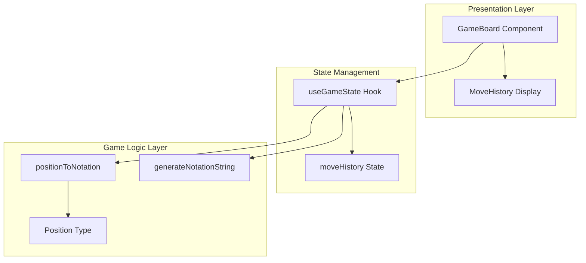
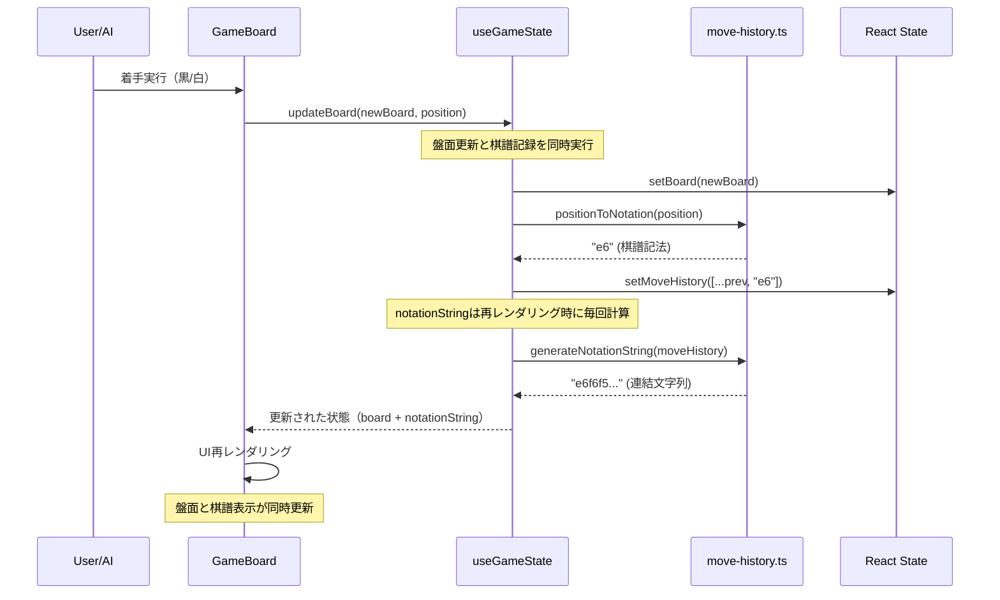
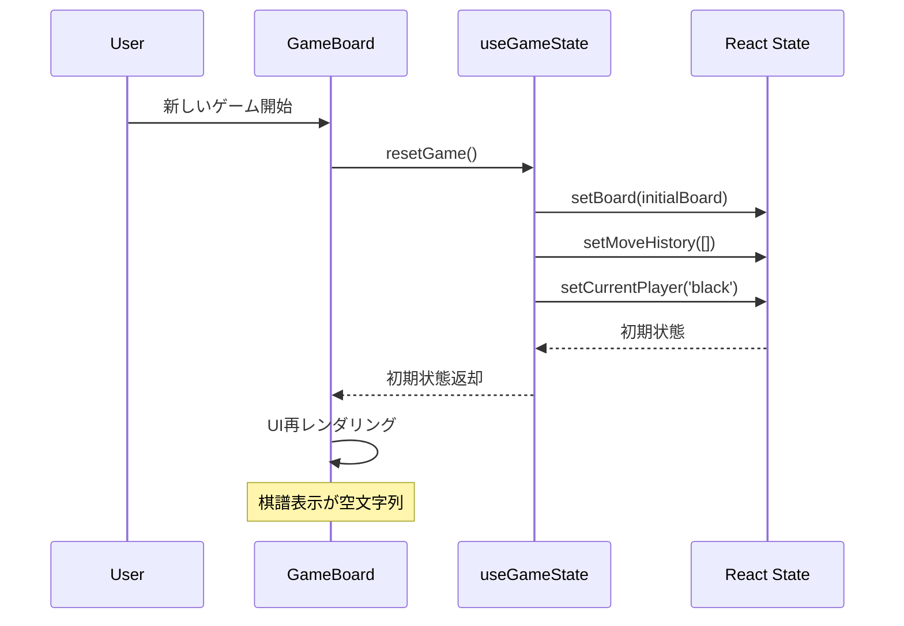

# Design Document

## Overview

この機能は、リバーシゲームの着手履歴（棋譜）を画面下部にシンプルなテキスト形式で表示する機能を提供します。プレイヤーとAIが打った手を標準的な棋譜記法（`[a-h][1-8]`形式）で記録し、ゲーム進行に応じてリアルタイムに更新される単一の棋譜文字列を表示します。

**ユーザー**: リバーシゲームをプレイする全てのユーザーが、自分とAIの着手履歴を視覚的に確認できます。

**影響**: 既存のGameBoardコンポーネントと関連するゲーム状態管理（useGameState）に、棋譜記録・表示機能が追加されます。既存のゲームロジックやUI構造には最小限の変更のみが必要です。

### Goals

- 着手位置を標準的な棋譜記法（`[a-h][1-8]`）に変換する機能を提供
- 全ての着手を順番に記録し、連結した単一文字列として管理
- ゲームボード画面下部に控えめなスタイルで棋譜を表示
- ゲーム状態の更新に応じてリアルタイムに棋譜を更新
- TypeScript strict modeに準拠した型安全な実装

### Non-Goals

- 棋譜の永続化（ローカルストレージやサーバー保存）
- 棋譜のコピー、共有、エクスポート機能
- 棋譜から盤面を再現する機能
- 棋譜の詳細な視覚化（盤面座標のハイライトなど）
- 棋譜の履歴一覧表示（1手ごとの行表示）

## Architecture

### Existing Architecture Analysis

現在のアーキテクチャは以下のパターンに従っています：

- **Layer Separation**: Presentation（UI Components）→ Logic（Game Logic/Hooks）→ Domain（Types/Pure Functions）
- **State Management**: React HooksベースのカスタムHook（useGameState）でゲーム状態を管理
- **Pure Functions First**: ゲームロジックは全てImmutableなPure Functionsとして実装
- **Type Safety**: TypeScript strict mode、`any`型の使用禁止、Result型パターンでエラーハンドリング
- **Test Co-location**: `__tests__/`ディレクトリを実装と同階層に配置、90%カバレッジ目標

既存の主要コンポーネント：

- `src/lib/game/types.ts`: ゲームドメイン型定義（Player, Board, Position, GameState）
- `src/lib/game/game-logic.ts`: 手の有効性・石配置・反転処理
- `src/hooks/useGameState.ts`: ゲーム状態管理（board, player, validMoves）
- `src/components/GameBoard.tsx`: メインゲームボードUI、ユーザー操作管理

### High-Level Architecture



**Architecture Integration**:

- **既存パターンの保持**: Pure Functions（positionToNotation, generateNotationString）をGame Logic層に配置
- **新規コンポーネントの追加理由**:
  - `move-history.ts`: 棋譜変換・生成の責務を明確に分離
  - useGameStateへのmoveHistory状態追加: ゲーム状態との一元管理
  - GameBoard内への表示領域追加: 既存UIの最小限拡張
- **技術スタック整合性**: TypeScript strict mode、Immutable pattern、React Hooks、Tailwind CSS
- **Steering準拠**: Layer Separation、Pure Functions First、Test Co-locationの原則を維持

### Technology Alignment

既存の技術スタックと完全に整合します：

- **Language**: TypeScript 5.x (strict mode)
- **Framework**: Next.js 15.x (App Router) + React 18.x
- **UI**: Tailwind CSS（既存スタイルパターンに従う）
- **State Management**: React Hooks（既存のuseGameStateを拡張）
- **Testing**: Jest + React Testing Library（既存のテスト構造に従う）

**新規依存関係**: なし（既存のReact、TypeScript、Tailwind CSSのみ使用）

**既存パターンからの逸脱**: なし

### Key Design Decisions

#### Decision 1: 棋譜管理の状態配置

- **Decision**: 棋譜履歴（`moveHistory: string[]`）を既存のuseGameStateフックに追加
- **Context**: 棋譜はゲーム状態の一部として、盤面・プレイヤー・手数と同期して管理される必要がある
- **Alternatives**:
  - 専用のuseMoveHistoryフックを作成（状態の分散）
  - GameBoardコンポーネント内でローカル状態管理（責務の混在）
- **Selected Approach**: useGameStateに統合し、ゲーム状態との一貫性を保証
  - `moveHistory: string[]`をstate追加
  - `addMoveToHistory(position: Position)`をアクション追加
  - `resetGame()`で棋譜もクリア
- **Rationale**:
  - ゲーム状態との同期が自動的に保証される
  - リセット・初期化のロジックが一箇所に集約
  - 既存の状態管理パターンに整合
- **Trade-offs**:
  - **得るもの**: 状態の一貫性、保守性の向上、テスト容易性
  - **失うもの**: useGameStateの責務がわずかに増加（許容範囲内）

#### Decision 2: Pure Functionsによる棋譜変換

- **Decision**: 座標変換（`positionToNotation`）と文字列生成（`generateNotationString`）をPure Functionsとして実装
- **Context**: 棋譜記法の変換はビジネスロジックであり、副作用なく再現可能である必要がある
- **Alternatives**:
  - useGameState内でインライン実装（テスタビリティ低下）
  - classベースのMoveHistoryManager（過剰な複雑化）
- **Selected Approach**: `/src/lib/game/move-history.ts`に独立したPure Functionsを配置
  ```typescript
  positionToNotation(position: Position): string
  generateNotationString(history: string[]): string
  ```
- **Rationale**:
  - 既存のGame Logic層のパターンに完全に整合
  - 単体テストが容易（入力→出力の検証のみ）
  - 他の機能から再利用可能
- **Trade-offs**:
  - **得るもの**: テスタビリティ、保守性、再利用性、型安全性
  - **失うもの**: なし（Pure Functionsはプロジェクト標準）

#### Decision 3: 表示領域の配置とスタイル

- **Decision**: GameBoard下部、パスボタンの下に棋譜表示領域を配置、Tailwind CSSで控えめなスタイル適用
- **Context**: 要件では「画面下部に目立たないようにテキスト表示」が求められている
- **Alternatives**:
  - サイドバー表示（モバイルファーストのレイアウトに不適）
  - モーダル/折りたたみUI（要件の「シンプル表示」に反する）
- **Selected Approach**:
  - 固定位置（board-grid → pass-button → move-history-display）
  - 横スクロール可能（`overflow-x: auto`）
  - 控えめなスタイル（`text-sm text-gray-600`）
- **Rationale**:
  - 既存のGameBoardレイアウト構造を最小限の変更で拡張
  - モバイルファーストの設計に適合
  - 要件の「目立たない」「シンプル」を満たす
- **Trade-offs**:
  - **得るもの**: シンプルな実装、既存UIとの整合、レスポンシブ対応
  - **失うもの**: 詳細な棋譜表示機能（Non-Goalsに含まれる）

#### Decision 4: 棋譜記録の統合タイミングと方法

- **Decision**: 着手適用成功後、即座にuseGameState内で棋譜を自動記録する（GameBoardからの明示的な呼び出しは不要）
- **Context**: ユーザー着手とAI着手の両方で確実に棋譜を記録し、着手数と棋譜数の一貫性を保証する必要がある（Requirement 5.2, 5.5）
- **Alternatives**:
  - GameBoardコンポーネントで明示的に`addMoveToHistory`を呼び出す（統合箇所が分散、呼び出し漏れのリスク）
  - 専用のミドルウェアパターンを導入（過剰な複雑化）
- **Selected Approach**:
  - useGameState内の既存`updateBoard`関数を拡張し、盤面更新と同時に棋譜記録を行う
  - 実装詳細:
    ```typescript
    const updateBoard = useCallback((newBoard: Board, lastMove?: Position) => {
      setBoard(newBoard);
      if (lastMove) {
        const notation = positionToNotation(lastMove);
        setMoveHistory((prev) => [...prev, notation]);
      }
    }, []);
    ```
  - **既存呼び出し箇所の影響範囲**:
    - `src/components/GameBoard.tsx`内の`handleCellClick`関数: ユーザー着手時に`updateBoard(newBoard, position)`を呼び出す（引数追加）
    - `src/components/GameBoard.tsx`内のAI着手useEffect: AI着手時に`updateBoard(newBoard, move)`を呼び出す（引数追加）
    - パス処理: 既存の`updateBoard(newBoard)`呼び出しはそのまま（`lastMove`はundefined、棋譜記録なし）
  - **後方互換性**: `lastMove`引数はオプショナルのため、既存の呼び出し（パス処理）はそのまま動作する
- **Rationale**:
  - 着手処理の単一のチョークポイントで棋譜記録を保証
  - GameBoardコンポーネントは既存の`updateBoard`呼び出しに`lastMove`引数を追加するだけ
  - 着手数と棋譜数の一貫性が自動的に保証される
  - テスタビリティが向上（useGameStateの統合テストで完全に検証可能）
  - パス処理は引数なしで呼び出すことで、意図的に棋譜記録をスキップできる
- **Trade-offs**:
  - **得るもの**: 統合の一貫性、呼び出し漏れリスクの排除、シンプルなAPI、後方互換性の維持
  - **失うもの**: `updateBoard`の責務がわずかに増加（ただし、着手適用と棋譜記録は密接に関連する処理）

#### Decision 5: エラー検出とハンドリングの方針

- **Decision**: 最小限のエラー検出（開発時のみ警告ログ出力）、ランタイムエラー検出は実装しない
- **Context**: この機能は表示のみでゲーム進行に影響しないため、複雑なエラーハンドリングは不要
- **Selected Approach**:
  - `positionToNotation`内で座標範囲検証: 範囲外の場合は開発時にconsole.warnを出力し、フォールバック値"??"を返す
  - **着手数と棋譜数の不一致検出は実装しない**: パスは棋譜に記録されないため、単純な石数での検証は不正確。Requirement 5.5の検証はテストコード（統合テスト・E2Eテスト）で対応する
  - 実装例:
    ```typescript
    // positionToNotation内
    if (
      position.row < 0 ||
      position.row > 7 ||
      position.col < 0 ||
      position.col > 7
    ) {
      if (process.env.NODE_ENV === 'development') {
        console.warn(
          `Invalid position: row=${position.row}, col=${position.col}`
        );
      }
      return '??'; // フォールバック
    }
    ```
- **Rationale**:
  - 既存のゲームロジックは常に有効な座標のみを生成するため、本番環境でのエラーは極めて低確率
  - 開発時の警告により、バグを早期に検出可能
  - 棋譜表示の失敗がゲームプレイを妨げない
  - パスを考慮した正確なエラー検出は複雑化するため、テストで品質を保証する方が適切
- **Trade-offs**:
  - **得るもの**: シンプルな実装、ゲームプレイへの影響なし、過剰な検証ロジックの回避
  - **失うもの**: ランタイムでのエラー検出（ただし、テストで十分カバー可能）

## System Flows

### Move Recording Flow



### Game Reset Flow



## Components and Interfaces

### Game Logic Layer

#### move-history.ts

**Responsibility & Boundaries**

- **Primary Responsibility**: 着手位置を棋譜記法に変換し、棋譜文字列を生成する
- **Domain Boundary**: Game Logicドメイン（Pure Functions層）
- **Data Ownership**: 変換ロジックのみ所有、状態は持たない
- **Transaction Boundary**: なし（Stateless関数）

**Dependencies**

- **Inbound**: useGameState、テストコード
- **Outbound**: `src/lib/game/types.ts`（Position型）
- **External**: なし

**Contract Definition**

**Service Interface**:

```typescript
/**
 * 盤面座標を棋譜記法（[a-h][1-8]）に変換
 */
export function positionToNotation(position: Position): string;

/**
 * 棋譜履歴配列を連結した単一文字列を生成
 */
export function generateNotationString(history: readonly string[]): string;
```

- **Preconditions**:
  - `positionToNotation`: position.row, position.colが0-7の範囲内
  - `generateNotationString`: historyが有効な棋譜記法文字列の配列
- **Postconditions**:
  - `positionToNotation`: 2文字の棋譜記法文字列（例: "e6"）を返す
  - `generateNotationString`: 区切り文字なしの連結文字列を返す（空配列の場合は空文字列）
- **Invariants**:
  - Pure Functions（同じ入力には常に同じ出力）
  - Immutable（入力を変更しない）
  - 副作用なし

### State Management Layer

#### useGameState Hook Extension

**Responsibility & Boundaries**

- **Primary Responsibility**: ゲーム状態の管理（既存）+ 棋譜履歴の管理（追加）
- **Domain Boundary**: State Managementレイヤー
- **Data Ownership**: board, currentPlayer, validMoves, **moveHistory（追加）**
- **Transaction Boundary**: React State更新のスコープ

**Dependencies**

- **Inbound**: GameBoard Component
- **Outbound**:
  - 既存: `src/lib/game/board.ts`, `src/lib/game/game-logic.ts`
  - **追加**: `src/lib/game/move-history.ts`
- **External**: React（useState, useCallback）

**Contract Definition**

**Service Interface**（既存に追加・変更）:

```typescript
export interface GameState {
  // 既存フィールド
  board: Board;
  currentPlayer: Player;
  validMoves: Position[];
  gameStatus: GameStatus;
  blackCount: number;
  whiteCount: number;
  isAIThinking: boolean;
  consecutivePassCount: number;

  // 追加フィールド
  moveHistory: readonly string[]; // 棋譜履歴配列
  notationString: string; // 連結された棋譜文字列

  // 既存アクション（変更）
  updateBoard: (newBoard: Board, lastMove?: Position) => void; // lastMove引数を追加
  switchPlayer: () => void;
  updateGameStatus: (status: GameStatus) => void;
  setAIThinking: (thinking: boolean) => void;
  incrementPassCount: () => void;
  resetPassCount: () => void;
  resetGame: () => void;
}
```

**重要な設計変更**:

- `updateBoard`関数に`lastMove?: Position`引数を追加し、盤面更新と同時に棋譜記録を行う
- `addMoveToHistory`アクションは削除（`updateBoard`内で自動処理されるため不要）
- これにより、GameBoardコンポーネントは単に`updateBoard(newBoard, position)`を呼び出すだけで棋譜が自動記録される

- **Preconditions**:
  - `updateBoard`: newBoardが有効な盤面状態、lastMoveが指定される場合は有効な着手位置
- **Postconditions**:
  - `updateBoard`: boardが更新され、lastMoveが指定された場合はmoveHistoryに棋譜記法が追加される
  - `resetGame`: moveHistoryが空配列、notationStringが空文字列にリセットされる
- **Invariants**:
  - moveHistoryの要素数は着手数と一致（パスは記録されない）
  - notationStringはmoveHistoryの連結結果と一致

**State Management**:

- **State Model**:
  ```typescript
  const [moveHistory, setMoveHistory] = useState<string[]>([]);
  // notationStringは導出値（generateNotationStringで毎回計算）
  // 注: 最大128文字の連結は瞬時のため、useMemoによるメモ化は不要
  const notationString = generateNotationString(moveHistory);
  ```
- **Persistence**: なし（Non-Goals）
- **Concurrency**: React State更新の標準的なバッチ処理

**Integration Strategy**:

- **Modification Approach**: 既存のuseGameStateフックを拡張
- **Backward Compatibility**: 既存のインターフェースは変更なし、新しいフィールドとアクションのみ追加
- **Migration Path**: 既存コードは影響なし、GameBoardコンポーネントで新しいフィールドを使用開始

### Presentation Layer

#### GameBoard Component Extension

**Responsibility & Boundaries**

- **Primary Responsibility**: ゲームUI表示・ユーザー操作管理（既存）+ 棋譜表示（追加）
- **Domain Boundary**: Presentationレイヤー
- **Data Ownership**: UIローカル状態のみ（imageError等）
- **Transaction Boundary**: なし（表示のみ）

**Dependencies**

- **Inbound**: Next.js App Router（page.tsx）
- **Outbound**: useGameState（既存 + 拡張）
- **External**: React, Tailwind CSS

**Contract Definition**

**UI Structure**（既存構造に追加）:

```tsx
<div className="game-board">
  {/* 既存: エラー表示、ステータス、盤面 */}
  {/* ... */}

  {/* 既存: パスボタン */}
  {gameStatus.type === 'playing' && (
    <button className="pass-button">パス</button>
  )}

  {/* 追加: 棋譜表示領域 */}
  {gameStatus.type === 'playing' && notationString && (
    <div className="move-history-display" data-testid="move-history">
      <div className="move-history-text">{notationString}</div>
    </div>
  )}

  {/* 既存: ゲームオーバー画面 */}
  {/* ... */}
</div>
```

- **Preconditions**: notationStringが空でない場合のみ表示
- **Postconditions**: 棋譜が画面下部に控えめなスタイルで表示される
- **Invariants**: ゲーム進行中のみ表示（finished状態では非表示）

**State Management**:

- **State Model**: Stateless（useGameStateから受け取ったnotationStringをそのまま表示）

**Integration Strategy**:

- **Modification Approach**: GameBoard.tsxに表示領域を追加、既存ロジックは変更なし
- **Backward Compatibility**: 既存のUI構造は変更なし
- **Migration Path**: 段階的なUI追加（既存コンポーネントへの影響なし）

## Data Models

### Domain Model

**Core Concepts**:

- **Value Object: MoveNotation** - 棋譜記法を表す文字列（例: "e6", "f6"）
  - 形式: `[a-h][1-8]`（列 + 行）
  - Immutable、識別子なし
  - 検証ルール: 長さ2、1文字目a-h、2文字目1-8

- **Entity: MoveHistory** - 着手履歴の集合
  - 属性: `history: readonly string[]`（棋譜記法の配列）
  - ライフサイクル: ゲーム開始で初期化、着手ごとに追加、リセットでクリア
  - Immutable操作（新しい配列を生成）

**Business Rules & Invariants**:

- 棋譜履歴の要素数は盤面の着手数と一致する
- 棋譜記法は黒・白・黒...の順序で記録される（プレイヤー順序を反映）
- 座標(row=0, col=0)は常に"a1"、(row=7, col=7)は常に"h8"に変換される
- 空の履歴は空文字列として表現される

### Logical Data Model

**Structure Definition**:

```typescript
// 既存型（参照のみ）
interface Position {
  readonly row: number; // 0-7
  readonly col: number; // 0-7
}

// 新規型（型エイリアス）
type MoveNotation = string; // [a-h][1-8]形式

type MoveHistory = readonly MoveNotation[];

// useGameStateの状態拡張
interface GameStateData {
  // 既存フィールド...
  moveHistory: MoveHistory; // 棋譜履歴
  notationString: string; // 導出値（履歴の連結）
}
```

**Entity Relationships**:

- `Position` → `MoveNotation` (変換関数: positionToNotation)
- `MoveHistory` → `notationString` (変換関数: generateNotationString)
- `GameState.moveHistory` 1:N `MoveNotation`（順序付きコレクション）

**Referential Integrity**:

- Positionの座標範囲制約（0-7）がMoveNotationの有効性を保証
- moveHistoryの要素順序はゲーム進行順序を保証

**Temporal Aspects**:

- バージョニング: なし（Non-Goals）
- 履歴の永続化: なし（Non-Goals）
- 監査ログ: 開発時のコンソールログのみ

### Data Contracts & Integration

**Internal Data Transfer** (useGameState → GameBoard):

```typescript
// Hook戻り値の型（既存に追加）
{
  moveHistory: readonly string[];
  notationString: string;
  addMoveToHistory: (position: Position) => void;
}
```

**Validation Rules**:

- `positionToNotation`入力検証: row, colが0-7の範囲内（実行時アサーション）
- `generateNotationString`入力検証: なし（空配列も有効）

**Serialization Format**:

- 内部: TypeScript配列（`string[]`）
- 表示: プレーンテキスト（連結文字列）
- 永続化: なし（Non-Goals）

## Error Handling

### Error Strategy

この機能はシンプルなデータ変換と表示のため、エラー発生の可能性は極めて低いです。既存のReact State管理とPure Functionsの型安全性により、エラーは開発時に検出されます。

### Error Categories and Responses

**開発時エラー（検出時期: 開発・テスト）**:

- **Invalid Position Input**: positionToNotationに範囲外の座標が渡される
  - **検出**: TypeScript型チェック + ユニットテスト
  - **対応**: 実行時アサーション（開発環境のみ、console.errorで警告）
  - **Recovery**: 既存のゲームロジックが有効な座標のみを生成するため、本番では発生しない

- **State Inconsistency**: moveHistoryの要素数と盤面の着手数が不一致
  - **検出**: ユニットテスト、E2Eテスト
  - **対応**: Requirement 5のテスト項目でカバー
  - **Recovery**: resetGame()で状態を初期化

**ランタイムエラー（可能性: 極めて低い）**:

- **React State Update Error**: moveHistory更新失敗
  - **検出**: Reactのエラー境界（既存のErrorBoundary.tsx）
  - **対応**: 既存のエラーハンドリング機構でキャッチ
  - **Recovery**: エラー画面表示 + リセットボタン提供

**ユーザーエクスペリエンス**:

- エラー発生時も既存のゲームロジックは継続可能
- 棋譜表示のみが失敗した場合、ゲームプレイには影響なし
- エラーメッセージ: 「棋譜の表示に失敗しました」（既存ErrorBoundaryで表示）

### Monitoring

**Logging Strategy**:

- **開発環境**: console.logで座標変換・履歴更新を記録
- **本番環境**: エラー発生時のみconsole.errorで記録
- **監視対象**:
  - moveHistory更新頻度（着手ごとに1回）
  - notationString生成時間（パフォーマンス影響なし想定）

**Health Check**:

- 既存のGameBoardコンポーネントのレンダリング正常性に含まれる
- 独立したヘルスチェックは不要（シンプルな表示機能のため）

## Testing Strategy

### Unit Tests (move-history.ts)

1. **positionToNotation - 境界値テスト**
   - (0, 0) → "a1"（左上隅）
   - (7, 7) → "h8"（右下隅）
   - (2, 6) → "c7"（要件の例）
   - (3, 4) → "d5"（中央付近）

2. **positionToNotation - 全座標変換**
   - 8x8=64通りの全座標が正しく変換されることを検証
   - 列a-h、行1-8の範囲網羅

3. **generateNotationString - 基本ケース**
   - 空配列 → ""（空文字列）
   - ["e6"] → "e6"（1手のみ）
   - ["e6", "f6", "f5"] → "e6f6f5"（要件の例）

4. **generateNotationString - エッジケース**
   - 長い履歴（60手以上）でも正常に連結
   - ReadonlyArrayの不変性検証

5. **型安全性テスト**
   - TypeScript strict mode準拠
   - readonly modifiersの検証

### Integration Tests (useGameState)

1. **addMoveToHistory統合テスト**
   - 着手実行 → moveHistoryに追加 → notationString更新を検証
   - 複数手の連続追加が正しく記録されることを確認

2. **resetGame統合テスト**
   - resetGame実行 → moveHistory空配列、notationString空文字列を検証

3. **ゲーム進行との同期テスト**
   - 盤面の着手数 === moveHistory.length を検証
   - プレイヤー交代時も履歴が正しく記録されることを確認

4. **AI着手との統合**
   - AIの手もmoveHistoryに記録されることを検証

5. **エラー検出テスト**
   - 着手数と履歴数の不一致を検出（Requirement 5.5）

### E2E/UI Tests (Playwright)

1. **棋譜表示の視覚的検証**
   - 画面下部に棋譜表示領域が存在することを確認
   - 初期状態では空文字列が表示されることを確認

2. **着手後の棋譜更新**
   - ユーザーが1手打つ → 棋譜が更新されることを確認
   - AIが1手打つ → 棋譜が更新されることを確認

3. **複数手の進行**
   - 3手進行後に"e6f6f5"（要件の例）が表示されることを確認

4. **横スクロール動作**
   - 長い棋譜（40手以上）が表示領域を超える場合に横スクロール可能を確認

5. **ゲームリセット**
   - リセット後に棋譜表示が空になることを確認

### Performance Tests

1. **notationString生成パフォーマンス**
   - 60手（満局）の履歴を連結する処理が1ms未満で完了
   - useMemoによるメモ化が機能し、不要な再計算が発生しないことを確認

2. **React State更新頻度**
   - 1着手あたりのState更新回数が想定範囲内（1-2回）

3. **UI再レンダリング影響**
   - 棋譜表示追加によるGameBoardの再レンダリング時間が5ms以内の増加に収まる

## Security Considerations

この機能はクライアント側の表示機能のみのため、セキュリティリスクは極めて限定的です。

**考慮事項**:

- **XSS対策**: notationStringはユーザー入力ではなく、Pure Functionsが生成した検証済み文字列（`[a-h][1-8]`のみ）のため、XSSリスクなし
- **データ永続化**: 棋譜は永続化されないため、データ漏洩リスクなし
- **外部通信**: 外部APIやサーバーとの通信なし

**既存のセキュリティ機構**:

- React自動エスケープによるテキスト表示の安全性
- TypeScript strict modeによる型安全性

## Performance & Scalability

### Target Metrics

**パフォーマンス最適化は不要**と判断：

- **棋譜文字列の最大長**: 2文字/手 × 最大64手 = **最大128文字**
- **メモリ使用量**: moveHistory配列（64要素 × 2バイト）= 約128バイト（無視可能）
- **文字列連結コスト**: JavaScriptの配列`.join('')`操作は128文字程度では1ms未満で完了（最適化不要）

### Implementation Approach

**シンプルな実装を優先**:

- **notationString生成**: `generateNotationString(history: readonly string[]): string { return history.join(''); }`
- **useMemoは使用しない**: moveHistory更新は1手ごとに1回のみ発生し、文字列連結コストが無視できるレベルのため、メモ化は不要
- **増分更新は不要**: 全体再計算でも十分高速（最大128文字の連結は瞬時）

### Scaling Considerations

- **ゲーム規模**: リバーシは最大60手で終了するため、スケーリング不要
- **同時実行**: クライアント側のみの処理のため、同時実行の制約なし
- **ブラウザ互換性**: 標準的なTypeScript/React/Tailwind CSSの使用のため、互換性問題なし

**結論**: この機能のパフォーマンス影響は極めて小さく、特別な最適化は不要。シンプルで可読性の高い実装を優先する。
