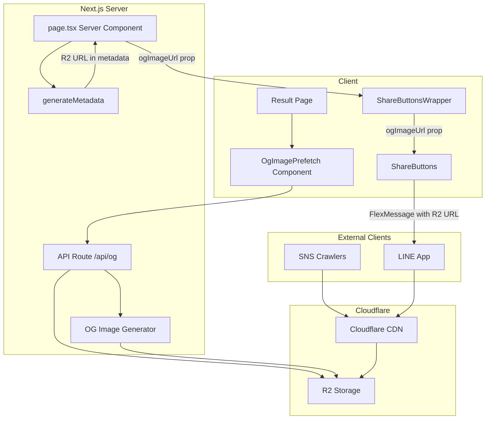
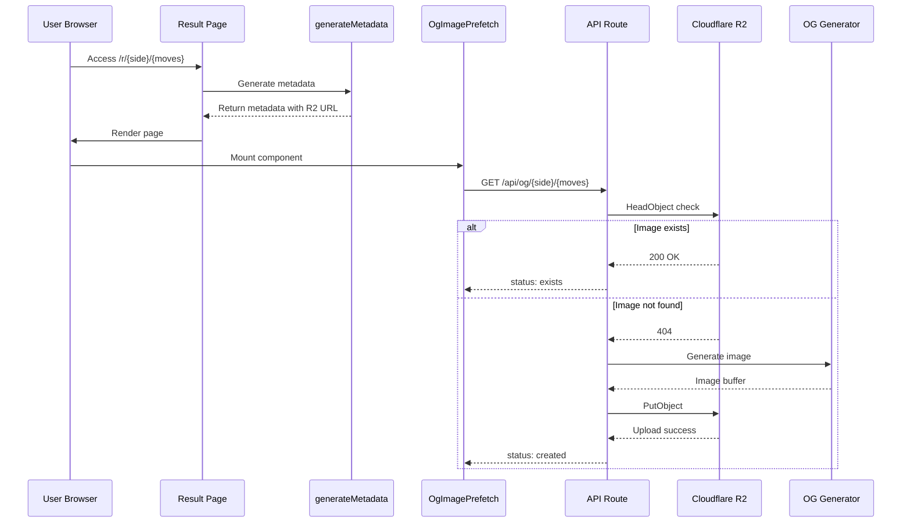
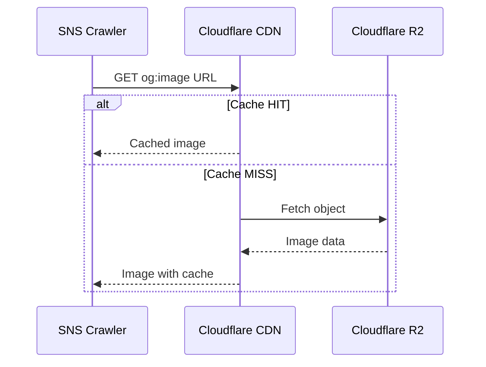

# Design Document

## Overview

**Purpose**: OGP画像のキャッシュ問題を解決し、SNSシェア時の画像プレビュー表示を高速化する。Cloudflare R2を永続ストレージとして活用し、2回目以降のアクセスで画像を即座に返却する仕組みを構築する。

**Users**: ゲーム結果ページの訪問者、SNSクローラー（Facebook/Twitter/LINE）、LINEでシェアを受信するユーザー

**Impact**: 現行の`opengraph-image.tsx`規約ファイルを廃止し、R2ベースの永続キャッシュアーキテクチャに移行する。`generateMetadata()`を純粋関数として維持しつつ、クライアントサイドprefetchパターンで画像生成をトリガーする。

### Goals

- OGP画像の2回目以降のアクセスで即座に返却（Vercel CDNキャッシュ問題の解消）
- `og:image`にリダイレクトなしの直接URLを使用（SNSクローラー互換性確保）
- `generateMetadata()`の純粋関数性を維持（責務分離）
- 既存のモノリポ構成を維持（最小限の変更）

### Non-Goals

- 初回生成時間（11-17秒）の短縮（許容範囲として受け入れ）
- R2以外のストレージサービスの検討
- OGP画像のデザイン変更（現行opengraph-image.tsxと同一を維持）
- Cloudflare Cache Rules/Transform Rulesのカスタマイズ（デフォルト設定を使用）
- 初回シェア時のSNSクローラーアクセスにおける画像不在（クライアントサイドprefetch完了前のクローラーアクセスでは画像が存在しない可能性を許容）

## Architecture

### Existing Architecture Analysis

現行システムはNext.js App Routerの`opengraph-image.tsx`規約ファイルを使用してOGP画像を動的生成している。問題点:

- Vercel CDNで`x-vercel-cache: MISS`が継続し、`revalidate = false`が効かない
- 毎リクエスト11-17秒の画像生成が発生
- SNSクローラーアクセス時のタイムアウトリスク

維持すべきパターン:

- `generateMetadata()`の純粋関数パターン
- ISR（Incremental Static Regeneration）によるオンデマンド生成
- LINE Flex Messageでの画像共有

### Architecture Pattern & Boundary Map



**Architecture Integration**:

- **Selected pattern**: API Route + クライアントサイドprefetchパターン。`generateMetadata()`を純粋関数に維持しつつ、画像生成をAPI Routeに委譲
- **R2 URL passing pattern**: Server Component（page.tsx）で`R2_PUBLIC_DOMAIN`環境変数を使用してR2 URLを構築し、`ogImageUrl` propsとしてShareButtonsWrapper経由でClient Componentに伝播。既存の`serverBaseUrl`パターンを踏襲
- **Domain boundaries**: R2クライアント（`/lib/r2`）、OG画像生成（`/lib/og`）、API Route（`/app/api/og`）を独立ドメインとして分離
- **Existing patterns preserved**: ISRパターン、Flex Message構築、URL Builder、serverBaseUrl受渡しパターン
- **New components rationale**: R2クライアントはS3互換API操作をカプセル化。OG画像生成は既存opengraph-image.tsxからロジックを抽出
- **Steering compliance**: TypeScript strict mode、純粋関数パターン、モノリポ構成を維持

### Technology Stack

| Layer              | Choice / Version         | Role in Feature       | Notes                                           |
| ------------------ | ------------------------ | --------------------- | ----------------------------------------------- |
| Data / Storage     | Cloudflare R2            | OGP画像永続ストレージ | S3互換API、カスタムドメイン経由のPublicアクセス |
| Backend / Services | `@aws-sdk/client-s3`     | R2操作クライアント    | HeadObject、PutObject操作                       |
| Backend / Services | Next.js 16.1.0 API Route | 画像生成トリガー      | `/api/og/[side]/[encodedMoves]`                 |
| Backend / Services | `next/og` ImageResponse  | 画像生成              | 既存実装を継続使用                              |
| Frontend           | React Client Component   | Prefetchトリガー      | `OgImagePrefetch`コンポーネント                 |
| Infrastructure     | Cloudflare CDN           | 画像キャッシュ配信    | カスタムドメイン経由、デフォルトキャッシュ設定  |

## System Flows

### OGP画像生成・キャッシュフロー



### SNSクローラーアクセスフロー



**Key Decisions**:

- `generateMetadata()`は副作用なしでR2 URLを直接返却
- 画像生成はクライアントサイドのprefetchで非同期トリガー
- SNSクローラーはCloudflare CDN経由でキャッシュ済み画像を取得

## Requirements Traceability

| Requirement        | Summary                 | Components                                                      | Interfaces            | Flows                       |
| ------------------ | ----------------------- | --------------------------------------------------------------- | --------------------- | --------------------------- |
| 1.1, 1.2, 1.3      | OGP画像永続キャッシュ   | R2Client, R2Operations, OgImageGenerator                        | R2 API, API Route     | 画像生成・キャッシュフロー  |
| 2.1, 2.2, 2.3      | リダイレクトなし直接URL | generateMetadata                                                | Metadata API          | SNSクローラーアクセスフロー |
| 3.1, 3.2           | Flex Message画像URL     | page.tsx, ShareButtonsWrapper, ShareButtons, FlexMessageBuilder | Props chain           | -                           |
| 4.1, 4.2, 4.3, 4.4 | R2ストレージ構成        | R2Client                                                        | Environment Variables | -                           |
| 5.1, 5.2, 5.3      | 環境別R2構成            | R2Client                                                        | Environment Variables | -                           |
| 6.1, 6.2, 6.3, 6.4 | 画像生成トリガー        | OgImagePrefetch, API Route                                      | API Route, useEffect  | 画像生成・キャッシュフロー  |
| 7.1, 7.2, 7.3      | 既存システム互換性      | -                                                               | -                     | -                           |
| 8.1, 8.2, 8.3, 8.4 | 視覚的再現性            | OgImageGenerator                                                | ImageResponse         | -                           |
| 9.1, 9.2, 9.3      | 無効な棋譜エラー処理    | generateMetadata, API Route                                     | Error Response        | -                           |

## Components and Interfaces

| Component           | Domain/Layer | Intent                       | Req Coverage            | Key Dependencies                                                   | Contracts |
| ------------------- | ------------ | ---------------------------- | ----------------------- | ------------------------------------------------------------------ | --------- |
| R2Client            | lib/r2       | S3互換クライアント初期化     | 4.1-4.3, 5.1-5.3        | @aws-sdk/client-s3 (External, P0)                                  | Service   |
| R2Operations        | lib/r2       | R2操作ユーティリティ         | 1.1-1.3, 6.3, 6.4       | R2Client (Inbound, P0)                                             | Service   |
| OgImageGenerator    | lib/og       | OG画像生成ロジック           | 8.1-8.4                 | next/og (External, P0), move-encoder (Inbound, P1)                 | Service   |
| OgApiRoute          | app/api/og   | 画像生成API Route            | 1.2, 6.3, 6.4, 9.2, 9.3 | R2Operations (Outbound, P0), OgImageGenerator (Outbound, P0)       | API       |
| OgImagePrefetch     | components   | クライアントサイドprefetch   | 6.2                     | OgApiRoute (Outbound, P1)                                          | State     |
| generateMetadata    | app/r        | メタデータ生成・R2 URL構築   | 2.1, 2.2, 6.1, 9.1      | R2_PUBLIC_DOMAIN (External, P0)                                    | -         |
| page.tsx            | app/r        | 結果ページ・ogImageUrl受渡し | 3.1, 3.2                | generateMetadata (Inbound, P0), ShareButtonsWrapper (Outbound, P0) | -         |
| ShareButtonsWrapper | app/r        | ogImageUrl受渡しラッパー     | 3.1, 3.2                | ShareButtons (Outbound, P0)                                        | Props     |
| FlexMessageBuilder  | lib/share    | Flex Message構築             | 3.1, 3.2                | ogImageUrl prop (Inbound, P1)                                      | Service   |

### lib/r2 Domain

#### R2Client

| Field        | Detail                                                |
| ------------ | ----------------------------------------------------- |
| Intent       | Cloudflare R2のS3互換クライアントを環境変数から初期化 |
| Requirements | 4.1, 4.2, 5.1, 5.2, 5.3                               |

**Responsibilities & Constraints**

- S3Clientインスタンスを環境変数から構成
- バケット名と公開ドメインを環境変数から取得
- 環境別設定（開発/Preview vs 本番）を透過的に処理

**Dependencies**

- External: `@aws-sdk/client-s3` - S3互換API操作 (P0)

**Contracts**: Service [x]

##### Service Interface

```typescript
import { S3Client } from '@aws-sdk/client-s3';

/** R2 S3 Client instance */
export const r2Client: S3Client;

/** R2 bucket name from environment */
export const R2_BUCKET: string;

/** R2 public domain from environment */
export const R2_PUBLIC_DOMAIN: string;
```

- Preconditions: 環境変数`R2_ACCOUNT_ID`, `R2_ACCESS_KEY_ID`, `R2_SECRET_ACCESS_KEY`, `R2_BUCKET`, `R2_PUBLIC_DOMAIN`が設定済み
- Postconditions: 有効なS3Clientインスタンスが返却される
- Invariants: クライアントはregion: "auto"で構成される

**Implementation Notes**

- Integration: 環境変数未設定時はランタイムエラー（Vercel環境では必須設定）
- Validation: 環境変数の存在チェックはモジュール読み込み時に実行
- Risks: ローカル開発時はR2 S3互換APIが使用不可（wrangler dev制限）

#### R2Operations

| Field        | Detail                                           |
| ------------ | ------------------------------------------------ |
| Intent       | R2オブジェクトの存在確認とアップロード操作を提供 |
| Requirements | 1.1, 1.3, 6.3, 6.4, 9.3                          |

**Responsibilities & Constraints**

- HeadObjectによるオブジェクト存在確認
- PutObjectによる画像アップロード
- エラーハンドリング（NotFound vs その他のエラー）

**Dependencies**

- Inbound: R2Client - S3クライアントインスタンス (P0)
- External: `@aws-sdk/client-s3` HeadObjectCommand, PutObjectCommand (P0)

**Contracts**: Service [x]

##### Service Interface

```typescript
/**
 * Check if object exists in R2
 * @returns true if exists, false if not found
 * @throws Error on connection failure
 */
export async function checkR2Exists(key: string): Promise<boolean>;

/**
 * Upload buffer to R2
 * @throws Error on upload failure
 */
export async function uploadToR2(key: string, body: Buffer): Promise<void>;

/**
 * Build R2 public URL for object
 */
export function buildR2Url(key: string): string;
```

- Preconditions: keyはバリデーション済みの文字列
- Postconditions: checkR2Existsはboolean、uploadToR2は成功時void
- Invariants: ContentTypeは`image/png`固定

**Implementation Notes**

- Integration: HeadObjectの404はfalseとして処理、他のエラーはthrow
- Validation: keyフォーマットは呼び出し元で保証
- Risks: R2接続エラー時のリトライは実装しない（非同期prefetchのため許容）

### lib/og Domain

#### OgImageGenerator

| Field        | Detail                                                            |
| ------------ | ----------------------------------------------------------------- |
| Intent       | 既存opengraph-image.tsxのロジックを抽出し、Buffer形式で画像を生成 |
| Requirements | 8.1, 8.2, 8.3, 8.4                                                |

**Responsibilities & Constraints**

- 既存のCOLORS定数、renderCell、renderBoard、renderScore、renderBrandを移植
- ImageResponseを使用してJSXから画像を生成
- 1200x630 PNG形式を維持

**Dependencies**

- External: `next/og` ImageResponse (P0)
- Inbound: `@/lib/share/move-encoder` decodeMoves, replayMoves, determineWinner (P1)

**Contracts**: Service [x]

##### Service Interface

```typescript
/**
 * Generate OG image buffer from encoded moves
 * @throws Error if moves are invalid or replay fails
 */
export async function generateOgImageBuffer(
  encodedMoves: string
): Promise<Buffer>;
```

- Preconditions: encodedMovesはBase64URL形式の文字列
- Postconditions: 1200x630 PNG画像のBufferが返却される
- Invariants: 画像レイアウト（左=盤面、右=スコア+ブランド）は固定

**Implementation Notes**

- Integration: ImageResponse.arrayBuffer()からBufferに変換
- Validation: decodeMoves/replayMovesの失敗時はErrorをthrow
- Risks: ImageResponseの内部実装変更リスク（Next.js依存）

### app/api/og Domain

#### OgApiRoute

| Field        | Detail                                            |
| ------------ | ------------------------------------------------- |
| Intent       | OGP画像の生成・R2アップロードをHTTP API経由で提供 |
| Requirements | 1.2, 6.3, 6.4, 9.2, 9.3                           |

**Responsibilities & Constraints**

- R2存在確認 → 存在すればスキップ
- 存在しなければ画像生成 → R2アップロード
- 無効な棋譜は400エラーを返却

**Dependencies**

- Outbound: R2Operations - 存在確認・アップロード (P0)
- Outbound: OgImageGenerator - 画像生成 (P0)

**Contracts**: API [x]

##### API Contract

| Method | Endpoint                        | Request     | Response      | Errors   |
| ------ | ------------------------------- | ----------- | ------------- | -------- |
| GET    | `/api/og/[side]/[encodedMoves]` | Path params | OgApiResponse | 400, 500 |

```typescript
/** API Response type */
type OgApiResponse =
  | { status: 'exists'; key: string }
  | { status: 'created'; key: string }
  | { status: 'error'; message: string };
```

**Implementation Notes**

- Integration: Dynamic route segmentsはPromise<{side, encodedMoves}>で受け取り
- Validation: sideは'b'|'w'のみ許可、encodedMovesはデコード可否で検証
- Risks: 初回生成の11-17秒は許容（非同期prefetchのため）

### components Domain

#### OgImagePrefetch

| Field        | Detail                                                    |
| ------------ | --------------------------------------------------------- |
| Intent       | ページマウント時にAPI Routeを呼び出して画像生成をトリガー |
| Requirements | 6.2                                                       |

**Responsibilities & Constraints**

- Client Componentとして実装
- useEffectでAPI Route呼び出し
- fire-and-forget（レスポンスは無視）

**Dependencies**

- Outbound: OgApiRoute - 画像生成トリガー (P1)

**Contracts**: State [x]

##### State Management

```typescript
interface OgImagePrefetchProps {
  readonly side: 'b' | 'w';
  readonly encodedMoves: string;
}
```

- State model: 状態なし（fire-and-forget）
- Persistence: なし
- Concurrency: useEffectのcleanupでabort不要（レスポンス無視）

**Implementation Notes**

- Integration: fetch()はキャッシュ無効（毎回API呼び出し）
- Validation: propsは親コンポーネントでバリデーション済み
- Risks: ネットワークエラーは無視（ユーザー体験に影響なし）

**Note on Duplicate Requests**: React Strict Modeやページ再訪問による重複リクエストは許容する。重複排除メカニズムは不要。R2のHeadObjectチェックにより、既存画像への重複アップロードは防止される。

### app/r Domain (Modification)

#### generateMetadata

| Field        | Detail                                        |
| ------------ | --------------------------------------------- |
| Intent       | OGP画像URLをR2直接URLに変更、ogImageUrlを構築 |
| Requirements | 2.1, 2.2, 6.1, 9.1                            |

**Modifications**:

- `og:image`と`twitter:image`をR2公開ドメイン経由のURLに変更
- 既存の`opengraph-image`規約ファイルパスへの参照を削除
- 無効な棋譜時は`og:image`を含まないデフォルトメタデータを返却
- R2 URLは環境変数`R2_PUBLIC_DOMAIN`を使用してServer Component内で構築

```typescript
// Before
const ogImageUrl = `${baseUrl}/r/${side}/${encodedMoves}/opengraph-image`;

// After
const imageKey = `og/${side}/${encodedMoves}.png`;
const ogImageUrl = `https://${process.env.R2_PUBLIC_DOMAIN}/${imageKey}`;
```

#### page.tsx

| Field        | Detail                                                  |
| ------------ | ------------------------------------------------------- |
| Intent       | 結果ページ表示、ogImageUrlをShareButtonsWrapperに受渡し |
| Requirements | 3.1, 3.2                                                |

**Modifications**:

- Server ComponentでR2 URLを構築し、`ogImageUrl`としてShareButtonsWrapperにprops渡し
- 既存の`serverBaseUrl`パターンと同様のアプローチでR2 URLを下位コンポーネントに伝播

```typescript
// Server Component (page.tsx)
const imageKey = `og/${side}/${encodedMoves}.png`;
const ogImageUrl = `https://${process.env.R2_PUBLIC_DOMAIN}/${imageKey}`;

<ShareButtonsWrapper
  result={result}
  serverBaseUrl={getBaseUrl()}
  ogImageUrl={ogImageUrl}  // 追加
/>
```

#### ShareButtonsWrapper (Modification)

| Field        | Detail                                   |
| ------------ | ---------------------------------------- |
| Intent       | ogImageUrlを受け取りShareButtonsに受渡し |
| Requirements | 3.1, 3.2                                 |

**Modifications**:

- `ogImageUrl` propを追加で受け取る
- ShareButtonsコンポーネントに`ogImageUrl`を伝播
- 既存の`serverBaseUrl`パターンを踏襲

```typescript
interface Props {
  result: ShareResult;
  serverBaseUrl: string;
  ogImageUrl: string;  // 追加
}

export function ShareButtonsWrapper({ result, serverBaseUrl, ogImageUrl }: Props) {
  return (
    <ShareButtons
      result={result}
      baseUrl={baseUrl}
      liffId={liffId}
      ogImageUrl={ogImageUrl}  // 追加
    />
  );
}
```

### lib/share Domain (Modification)

#### FlexMessageBuilder

| Field        | Detail                                       |
| ------------ | -------------------------------------------- |
| Intent       | Flex Message画像URLをprops経由のR2 URLに変更 |
| Requirements | 3.1, 3.2                                     |

**Modifications**:

- `ogImageUrl`パラメータはprops経由でR2公開ドメインURLを受け取る
- 既存のインターフェースは維持（呼び出し元で変更）
- FlexMessageBuilder自体はURL構築を行わず、渡されたURLをそのまま使用

**Implementation Notes**:

- `buildFlexMessage()`のシグネチャは変更なし
- `ogImageUrl`引数にprops経由のR2 URLが渡される

## Data Models

### Domain Model

**OGP Image Key Format**:

```
og/{side}/{encodedMoves}.png
```

- `side`: プレーヤー側 ('b' | 'w')
- `encodedMoves`: Base64URL形式の棋譜

**Invariants**:

- キーは一意（同一の棋譜は同一のキー）
- 画像は不変（一度生成されたら更新されない）

### Data Contracts & Integration

**R2 Object Metadata**:

```typescript
{
  ContentType: 'image/png',
  // Cache-ControlはCloudflareデフォルト設定を使用
}
```

**Environment Variables**:

| Variable               | Description           | Example                        |
| ---------------------- | --------------------- | ------------------------------ |
| `R2_ACCOUNT_ID`        | Cloudflare Account ID | `abc123def456`                 |
| `R2_ACCESS_KEY_ID`     | R2 API Access Key     | `...`                          |
| `R2_SECRET_ACCESS_KEY` | R2 API Secret Key     | `...`                          |
| `R2_BUCKET`            | Bucket name           | `lineminiapp-reversi-images`   |
| `R2_PUBLIC_DOMAIN`     | Public domain         | `images.reversi.line-mini.dev` |

**Environment-specific Configuration**:

| Environment         | R2_BUCKET                        | R2_PUBLIC_DOMAIN                   |
| ------------------- | -------------------------------- | ---------------------------------- |
| Development/Preview | `lineminiapp-reversi-images-dev` | `dev.images.reversi.line-mini.dev` |
| Production          | `lineminiapp-reversi-images`     | `images.reversi.line-mini.dev`     |

## Error Handling

### Error Strategy

- **Fail Fast**: 環境変数未設定時はモジュール読み込み時にエラー
- **Graceful Degradation**: 画像生成失敗時もページ表示は継続
- **User Context**: APIエラーレスポンスに明確なステータスを含める

### Error Categories and Responses

**User Errors (4xx)**:

- 無効な棋譜 → 400 Bad Request (`{ status: 'error', message: 'Invalid encoded moves' }`)
- 無効なside → 400 Bad Request

**System Errors (5xx)**:

- R2接続失敗 → 500 Internal Server Error（ログ記録）
- 画像生成失敗 → 500 Internal Server Error

**generateMetadata Errors**:

- 無効な棋譜 → `og:image`なしのデフォルトメタデータを返却（エラーは発生させない）

### Monitoring

- R2操作エラーはconsole.errorでログ記録
- API Route 400/500レスポンスはVercel Functionsログで追跡可能

## Testing Strategy

### Unit Tests

- `R2Operations.checkR2Exists`: 存在時true、404時false、エラー時throw
- `R2Operations.uploadToR2`: 成功時void、失敗時throw
- `R2Operations.buildR2Url`: 正しいURL形式を返却
- `OgImageGenerator.generateOgImageBuffer`: 有効な棋譜でBuffer返却、無効な棋譜でthrow

### Integration Tests

- API Route: R2存在時はexists返却、未存在時はcreated返却
- API Route: 無効な棋譜で400返却
- API Route: R2エラー時の適切なエラーハンドリング

## Optional Sections

### Security Considerations

- R2 API認証情報は環境変数で管理（コードにハードコードしない）
- R2 APIトークンはObject Read/Write権限のみ付与
- 公開ドメインはHTTPS必須

### Performance & Scalability

**Target Metrics**:

- 初回画像生成: 11-17秒（許容）
- 2回目以降: Cloudflare CDNキャッシュから即座返却
- R2ストレージ: 無制限（従量課金）

**Caching Strategy**:

- Cloudflare CDN: デフォルトキャッシュ設定を使用
- カスタムCache-Controlヘッダーは設定しない

### Migration Strategy

1. **Phase 1**: R2クライアント・OG画像生成ロジック実装
2. **Phase 2**: API Route実装・OgImagePrefetchコンポーネント追加
3. **Phase 3**: generateMetadata・FlexMessageBuilder更新
4. **Phase 4**: opengraph-image.tsx削除
5. **Phase 5**: 本番デプロイ

**Rollback Trigger**: R2接続エラーが継続する場合は既存のopengraph-image.tsxにロールバック

## Supporting References

### AWS SDK S3 for R2 Configuration

```typescript
import { S3Client } from '@aws-sdk/client-s3';

export const r2Client = new S3Client({
  region: 'auto',
  endpoint: `https://${process.env.R2_ACCOUNT_ID}.r2.cloudflarestorage.com`,
  credentials: {
    accessKeyId: process.env.R2_ACCESS_KEY_ID!,
    secretAccessKey: process.env.R2_SECRET_ACCESS_KEY!,
  },
});
```

### File Changes Summary

| File                                                      | Operation | Description                                                |
| --------------------------------------------------------- | --------- | ---------------------------------------------------------- |
| `src/lib/r2/client.ts`                                    | Create    | R2 S3クライアント設定                                      |
| `src/lib/r2/operations.ts`                                | Create    | R2操作ユーティリティ                                       |
| `src/lib/r2/index.ts`                                     | Create    | バレルエクスポート                                         |
| `src/lib/og/generate-image.ts`                            | Create    | OG画像生成ロジック                                         |
| `src/lib/og/index.ts`                                     | Create    | バレルエクスポート                                         |
| `src/app/api/og/[side]/[encodedMoves]/route.ts`           | Create    | OG画像生成API Route                                        |
| `src/components/OgImagePrefetch.tsx`                      | Create    | Prefetchコンポーネント                                     |
| `src/app/r/[side]/[encodedMoves]/page.tsx`                | Modify    | generateMetadata純粋関数化、prefetch追加、ogImageUrl受渡し |
| `src/app/r/[side]/[encodedMoves]/ShareButtonsWrapper.tsx` | Modify    | ogImageUrl prop追加                                        |
| `src/components/ShareButtons.tsx`                         | Modify    | ogImageUrl prop追加                                        |
| `src/app/r/[side]/[encodedMoves]/opengraph-image.tsx`     | Delete    | 規約ファイル廃止                                           |
| `.env.example`                                            | Modify    | R2環境変数追加                                             |

### Dependencies

```bash
pnpm add @aws-sdk/client-s3
```
