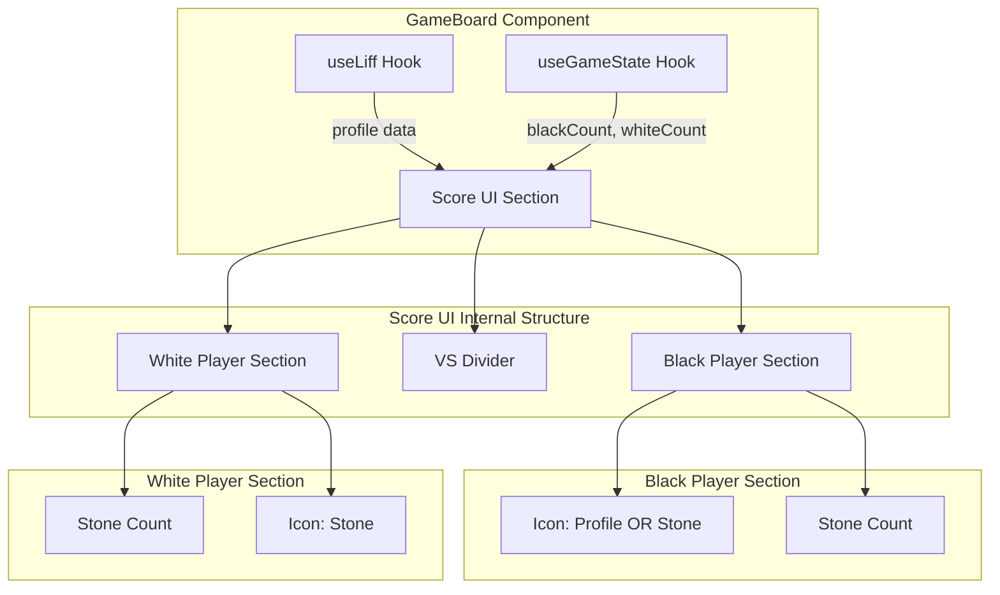
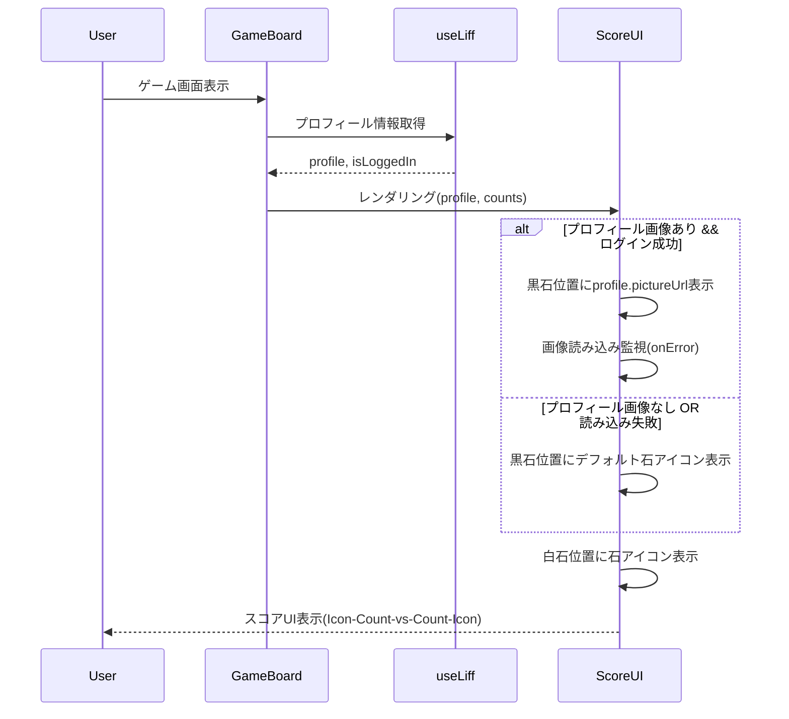
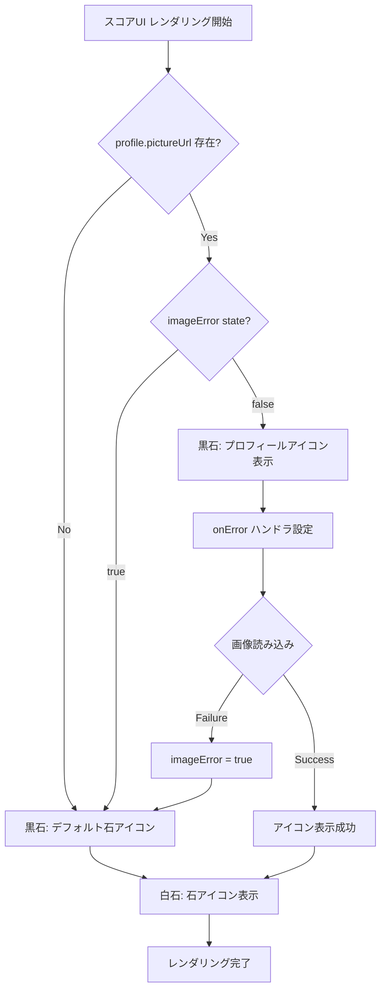
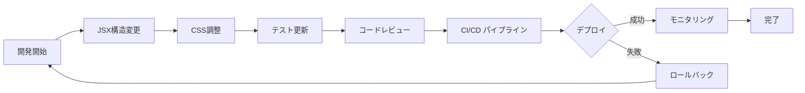

# Design Document: スコア表示UI最適化

## Overview

スコア表示UIのシンプル化と視覚的な理解しやすさを向上させる機能です。LINE統合環境において不要な情報(displayName)を削除し、スコア要素の並び順を直感的な配置に変更します。これにより、ユーザーはゲーム盤面に集中でき、スコアを素早く確認できるようになります。

**対象ユーザー**: リバーシゲームプレイヤー(LINE環境/非LINE環境)

**影響範囲**: GameBoard.tsx内のスコア表示部分(lines 390-422)とGameBoard.css内の関連スタイル定義を変更します。既存のLIFF統合機能やゲームロジックには影響を与えません。

### Goals

- displayNameテキスト要素の完全削除による視覚的ノイズの削減
- スコア要素の並び順を「黒石アイコン → 黒石数 → vs → 白石数 → 白石アイコン」に変更
- プロフィールアイコンと石アイコンの表示ロジックを維持
- モバイル対応のレスポンシブレイアウトを保持
- 既存のLIFF統合とエラーハンドリングを破壊しない

### Non-Goals

- 新規アニメーション効果の追加
- スコア表示位置の変更(ゲームボード上部を維持)
- LIFF SDK機能の拡張
- 新規プロフィール情報の取得や表示

## Architecture

### Existing Architecture Analysis

**現在のスコア表示構造**:

- `GameBoard.tsx` lines 390-422: スコア表示JSX構造
- `GameBoard.css` lines 17-56: スコア表示スタイリング
- LIFF統合: `useLiff` hookによるプロフィール情報取得と表示
- エラーハンドリング: 画像読み込み失敗時のフォールバック(`imageError` state)

**保持すべき既存パターン**:

- React Client Component("use client")のアーキテクチャ
- カスタムフック(`useLiff`, `useGameState`)による状態管理分離
- Tailwind CSS + CSS Modulesハイブリッドスタイリング
- 画像読み込み失敗時のフォールバック機構

**変更対象の統合点**:

- スコア表示JSX構造の再編成
- CSS flexboxレイアウトの調整
- displayName要素の削除(現在lines 410-414)

### High-Level Architecture



### Technology Alignment

**既存技術スタックとの整合性**:

- **React 18.x**: 既存のClient Componentパターンを維持し、JSX構造のみ変更
- **TypeScript strict mode**: 型安全性を保持、新規型定義は不要(既存の`LiffProfile`型を利用)
- **Tailwind CSS + CSS Modules**: ハイブリッドスタイリングパターンを踏襲
- **LIFF SDK 2.x**: 既存のLIFF統合を変更せず、表示層のみ修正

**新規依存関係**: なし

**既存パターンからの逸脱**: なし

### Key Design Decisions

#### Decision 1: displayName削除と視覚的階層の最適化

**Context**: 現在のスコア表示では、プロフィールアイコン・石数・displayNameが縦方向に配置されており、視覚的なノイズが多い。LINE環境では既にアイコンでユーザー識別が可能。

**Alternatives**:

1. displayNameを残しつつ、より小さいフォントで表示
2. ホバー時のみdisplayNameを表示
3. displayNameを完全削除(選択)

**Selected Approach**: displayNameを完全削除し、アイコンとスコア数値のみに焦点を当てる。

**Rationale**:

- アイコン表示で十分にユーザー識別が可能
- ゲーム中はスコア数値が最重要情報
- モバイル画面での視覚的余裕を確保

**Trade-offs**:

- **Gain**: 視覚的シンプルさ、スコアへの集中、画面スペース節約
- **Sacrifice**: テキストによる明示的なユーザー名表示

#### Decision 2: 水平配置への変更とFlexbox再構成

**Context**: 現在の縦方向配置(flex-col)から、直感的な左右対称の水平配置(flex-row)への変更が必要。

**Alternatives**:

1. CSS Gridで左右対称レイアウト
2. Flexboxで水平配置(選択)
3. 絶対配置(position: absolute)で固定配置

**Selected Approach**: Flexboxの水平配置(`flex-direction: row`)と`justify-content: center`を使用。

**Rationale**:

- 既存のFlexboxパターンとの一貫性
- レスポンシブ対応が容易(flexbox wrap対応)
- メンテナンス性の高さ

**Trade-offs**:

- **Gain**: 既存コードとの整合性、シンプルなCSS、レスポンシブ対応の容易さ
- **Sacrifice**: Gridの精密な配置制御は不要と判断

## System Flows

### Score Display Rendering Flow



### Icon Display Logic Flow



## Components and Interfaces

### UI Components

#### Score Display Component (GameBoard.tsx内セクション)

**Responsibility & Boundaries**:

- **Primary Responsibility**: スコア数値とプレイヤーアイコンの視覚的表示
- **Domain Boundary**: Presentationレイヤー(UI表示のみ、状態管理なし)
- **Data Ownership**: なし(親コンポーネントから受け取ったprops/stateを表示)

**Dependencies**:

- **Inbound**: GameBoardコンポーネント(親)
- **Outbound**: `useLiff` hook(プロフィール情報)、`useGameState` hook(スコア数値)
- **External**: LIFF SDK(間接的、useLiff hook経由)

**Contract Definition**:

```typescript
// スコア表示に必要なデータ構造(既存型の再利用)
interface ScoreDisplayProps {
  // useLiff hookから取得
  profile: LiffProfile | null;

  // useGameState hookから取得
  blackCount: number;
  whiteCount: number;

  // ローカルstate
  imageError: boolean;
  setImageError: (error: boolean) => void;
}

// LiffProfile型は既存(/src/lib/liff/types.ts)を利用
interface LiffProfile {
  userId: string;
  displayName: string; // 使用しない(削除対象)
  pictureUrl?: string;
  statusMessage?: string;
}
```

**DOM構造変更**:

現在の構造(lines 390-422):

```
.stone-count (flex container)
  ├─ .stone-count-item (black - flex-col)
  │   ├─ Icon (profile OR stone)
  │   └─ div (flex-col)
  │       ├─ blackCount
  │       └─ displayName  ← 削除対象
  ├─ .stone-count-divider (vs)
  └─ .stone-count-item (white)
      ├─ Icon (stone)
      └─ whiteCount
```

新しい構造:

```
.stone-count (flex container - row)
  ├─ .stone-count-item (black - flex-row)
  │   ├─ Icon (profile OR stone)
  │   └─ blackCount
  ├─ .stone-count-divider (vs)
  └─ .stone-count-item (white - flex-row)
      ├─ whiteCount
      └─ Icon (stone)
```

**Preconditions**:

- `blackCount`と`whiteCount`が有効な数値(0-64)である
- `profile`がnullまたは有効な`LiffProfile`型である

**Postconditions**:

- スコア要素が左から右に「黒アイコン → 黒数 → vs → 白数 → 白アイコン」の順序で表示される
- displayNameテキストが表示されない

**Invariants**:

- 画像読み込み失敗時は必ずデフォルト石アイコンにフォールバック
- 白石側は常に石アイコンを表示(プロフィールアイコン不使用)

#### CSS Style Modules

**Responsibility & Boundaries**:

- **Primary Responsibility**: スコア表示の視覚的スタイリングとレスポンシブ対応
- **Domain Boundary**: Presentationレイヤー(スタイリングのみ)

**修正対象のCSSクラス**:

1. `.stone-count-item` (lines 29-33):

```css
/* 現在: flex-col (縦方向) */
.stone-count-item {
  display: flex;
  align-items: center;
  gap: 0.75rem;
}

/* 変更後: flex-row (横方向) - 既にflexboxなので方向のみ調整 */
/* gap値は維持して適切なスペーシング確保 */
```

2. **新規クラス追加**: `.stone-count-item--reversed` (白石用の順序反転)

```css
.stone-count-item--reversed {
  flex-direction: row-reverse; /* アイコンを右側に配置 */
}
```

3. レスポンシブ調整(lines 260-282, 296-309):

- 既存のブレークポイント(@media max-width: 640px, 375px)を維持
- `gap`値の調整のみ(必要に応じて)

**Integration Strategy**:

- **Modification Approach**: 既存CSSクラスの拡張(新規プロパティ追加、既存値の微調整)
- **Backward Compatibility**: 他のコンポーネントは`.stone-count-item`を使用していないため影響なし
- **Migration Path**: 段階的変更不要(単一コミットで完結)

## Data Models

このフィーチャーはデータモデルの変更を伴いません。既存の型定義(`LiffProfile`, `GameState`)をそのまま利用します。

**使用する既存型**:

- `LiffProfile` (from `/src/lib/liff/types.ts`): プロフィール情報
- `blackCount`, `whiteCount` (number型): `useGameState` hookから提供

**displayName参照の削除**:

- JSXから`profile.displayName`の参照を削除
- `LiffProfile`型定義自体は変更しない(他の用途で使用される可能性)

## Error Handling

### Error Strategy

既存のエラーハンドリング機構を維持し、新規エラーケースは発生しません。

### Error Categories and Responses

**User Errors**: なし(表示のみのためユーザー操作エラーなし)

**System Errors**:

- **画像読み込み失敗** (既存): `` elementの`onError`ハンドラで`imageError` stateを`true`に設定 → デフォルト石アイコンにフォールバック
- **LIFF初期化失敗** (既存): `useLiff` hookのエラーハンドリングに依存、Score UIは`profile: null`として処理

**Business Logic Errors**: なし(表示ロジックのみ)

### Monitoring

新規モニタリング要件なし。既存のReactコンポーネントエラーバウンダリ(`ErrorBoundary.tsx`)で十分。

## Testing Strategy

### Unit Tests

既存のテストファイルに追加・修正を加える:

1. **GameBoard-liff.test.tsx** (既存ファイル拡張):
   - `displayName`が表示されないことを検証
   - プロフィールアイコンの表示位置を検証(left側)
   - 石アイコンの表示順序を検証(黒 → vs → 白)

2. **GameBoard.test.tsx** (既存ファイル拡張):
   - スコア数値の表示順序を検証
   - レスポンシブレイアウトのスナップショットテスト(既存)

**追加テストケース例**:

```typescript
describe('Score UI Optimization', () => {
  it('should NOT display displayName text', () => {
    // profile with displayName
    mockLiffState = {
      profile: { displayName: 'Test User', pictureUrl: 'url' },
      // ...
    };
    render(<GameBoard />);

    expect(screen.queryByText('Test User')).not.toBeInTheDocument();
  });

  it('should display score elements in correct order: black icon → black count → vs → white count → white icon', () => {
    const { container } = render(<GameBoard />);
    const stoneCount = container.querySelector('.stone-count');
    const children = Array.from(stoneCount?.children || []);

    // 順序検証: icon(0) → count(1) → divider(2) → count(3) → icon(4)
    expect(children[0]).toHaveClass('stone-count-item'); // black section
    expect(children[1]).toHaveClass('stone-count-divider'); // vs
    expect(children[2]).toHaveClass('stone-count-item'); // white section
  });
});
```

### Integration Tests

既存の統合テスト(`GameBoard.integration.test.tsx`)で以下を検証:

- LIFF統合が正常に動作し、プロフィールアイコンが表示される
- スコア更新時にUI要素が正しく再レンダリングされる

### E2E Tests

既存のPlaywright E2Eテスト(`e2e/game-flow.spec.ts`)で以下を検証:

- スコア表示が視覚的に正しく表示される
- モバイルビューポートでのレスポンシブ表示

**追加E2Eテストケース例**:

```typescript
test('Score UI displays in optimized layout', async ({ page }) => {
  await page.goto('/');

  // スコア表示の順序をDOMから検証
  const scoreItems = await page.locator('.stone-count > *').all();
  expect(scoreItems.length).toBe(3); // black section, divider, white section

  // displayNameが表示されないことを確認
  const displayName = page.getByText(/Test User/i);
  await expect(displayName).not.toBeVisible();

  // スクリーンショット比較(visual regression)
  await expect(page).toHaveScreenshot('score-ui-optimized.png');
});
```

### Performance Tests

**レンダリングパフォーマンス**:

- 既存の`GameBoard-pass-performance.test.tsx`パターンに従い、スコアUI再レンダリング時間を計測
- 目標: 16ms以内(60fps維持)

```typescript
test('Score UI renders within performance budget', () => {
  const { rerender } = render(<GameBoard />);

  const start = performance.now();
  rerender(<GameBoard />); // スコア更新を模擬
  const end = performance.now();

  expect(end - start).toBeLessThan(16); // 60fps = 16.67ms
});
```

## Optional Sections

### Security Considerations

**該当なし**: このフィーチャーはUI表示の変更のみで、新規のデータ処理やAPI呼び出しを行いません。

既存のLIFF統合のセキュリティ機構(LIFF SDKの認証・認可)に依存します。

### Performance & Scalability

**Target Metrics**:

- スコアUI再レンダリング: 16ms以内(60fps)
- 初期レンダリング: 変更前と同等(2秒以内の初期表示目標を維持)

**Optimization Techniques**:

- React.memo不要(GameBoardは既にClient Componentで最適化済み)
- 画像読み込みの遅延読み込み(lazy loading)は既存実装で対応済み
- CSS変更のみのためJavaScript実行コストは増加しない

**Scalability**: スケーラビリティへの影響なし(表示ロジックのみ)

### Migration Strategy

段階的な移行は不要。単一のPull Requestで以下を実施:



**Phase Breakdown**:

1. **Phase 1: 開発** (1-2時間)
   - GameBoard.tsx: displayName削除、JSX構造変更
   - GameBoard.css: Flexbox調整、新規クラス追加
2. **Phase 2: テスト** (1-2時間)
   - 既存テストの更新
   - 新規テストケース追加
   - E2Eテスト実行
3. **Phase 3: レビュー・デプロイ** (1日)
   - PRレビュー
   - CI/CDパイプライン通過
   - プロダクションデプロイ

**Rollback Triggers**:

- CI/CDパイプラインのテスト失敗
- E2Eテストでの視覚的回帰(visual regression)検出
- プロダクション環境でのレンダリングエラー

**Validation Checkpoints**:

- ✅ 全てのユニットテストがパス
- ✅ E2Eテストがパス(スクリーンショット比較含む)
- ✅ モバイル/デスクトップでの手動確認
- ✅ LIFFログイン状態での動作確認
