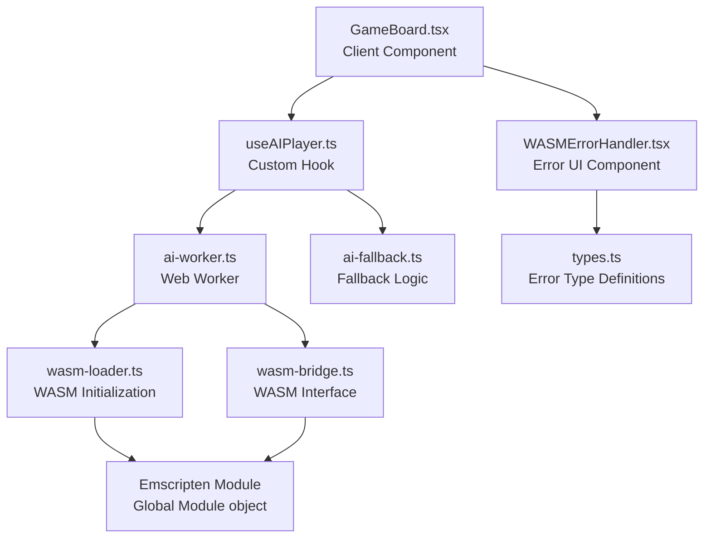
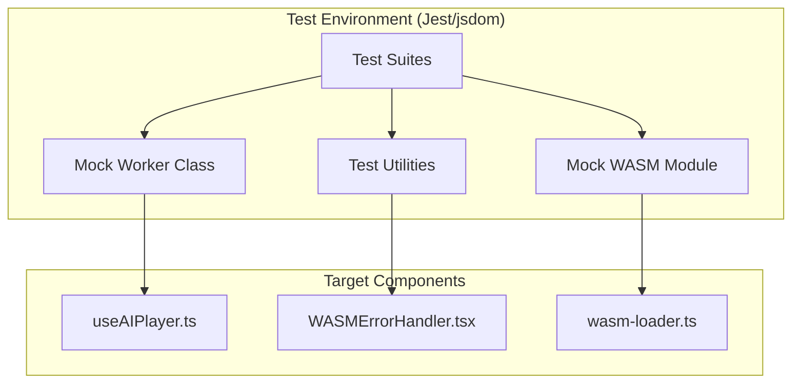
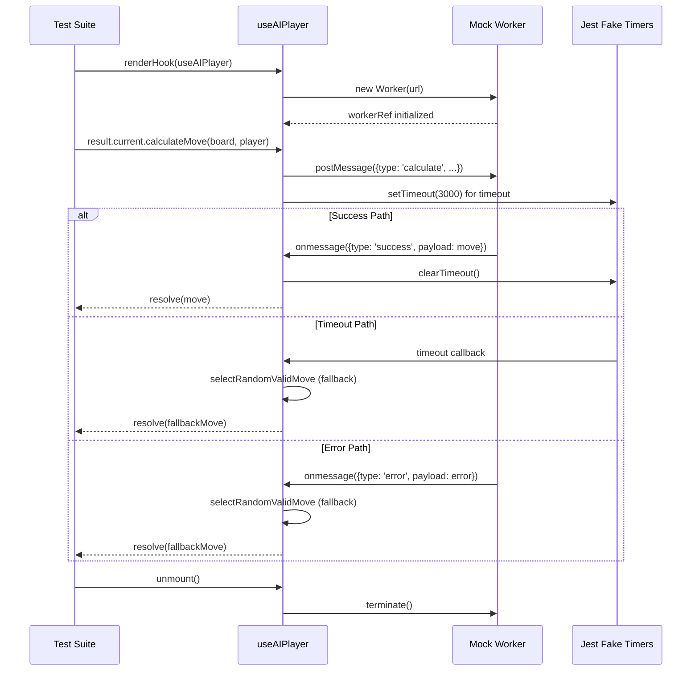
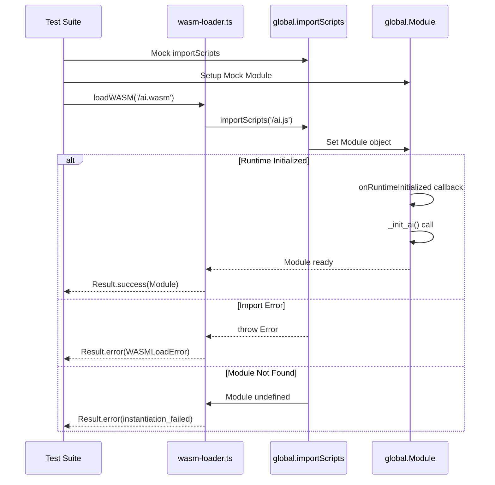
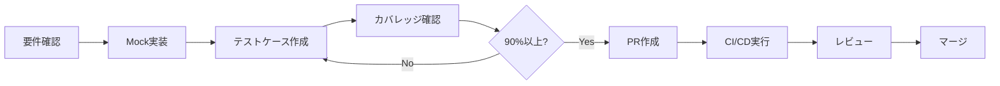

# 設計書: テストカバレッジ向上

## 概要

本設計は、LINEミニアプリリバーシプロジェクトのPhase 1として、3つの高優先度ファイル(`useAIPlayer.ts`, `WASMErrorHandler.tsx`, `wasm-loader.ts`)のテストカバレッジを90%以上に向上させるための技術設計を定義する。現在のプロジェクト全体のカバレッジは82.74% (Statements), 75.86% (Branches), 77.86% (Functions), 82.6% (Lines)であり、これらの未カバーファイルへのテスト追加により全指標90%以上の達成を目指す。

**目的**: Web WorkerおよびWebAssembly統合コンポーネントに対する包括的なテストスイートを実装し、AIエンジン統合の信頼性を保証する。

**対象ユーザー**: 開発者、QAエンジニア、プロジェクトメンテナー

**影響**: 既存の実装コードには変更を加えず、テストコード追加のみによりコードカバレッジとコード品質を向上させる。

### ゴール

- `useAIPlayer.ts`のカバレッジを0%から90%以上に向上
- `WASMErrorHandler.tsx`のカバレッジを64.7%から90%以上に向上
- `wasm-loader.ts`のカバレッジを63.04%から90%以上に向上
- 全プロジェクト指標(Statements, Branches, Functions, Lines)で90%以上達成
- Web Worker通信の信頼性とエラーハンドリングを検証
- WASM初期化プロセスとエラー状態の包括的検証

### 非ゴール

- 既存実装コードの変更・リファクタリング
- E2Eテストの追加(Playwrightは既存で十分)
- Phase 2以降のファイル(中・低優先度)のテスト実装
- テストフレームワークの変更(Jest/React Testing Libraryを継続使用)
- 新機能の追加

## アーキテクチャ

### 既存アーキテクチャ分析

**対象コンポーネントの役割と依存関係**:



**既存パターンと制約**:

1. **Web Worker統合パターン**: `useAIPlayer`はReact hooksパターンでWorkerライフサイクルを管理
   - `useEffect`でWorker初期化とクリーンアップ
   - `useCallback`で非同期AI計算をPromiseでラップ
   - タイムアウト機構(3秒)とフォールバック戦略

2. **WASM読み込み戦略**: Emscripten生成コード(`ai.js`)を`importScripts`で読み込み
   - グローバル`Module`オブジェクトへのアクセス
   - `onRuntimeInitialized`コールバックで初期化完了を待機
   - Result型パターンによるエラーハンドリング

3. **エラーハンドリング階層**:
   - WASM層: `WASMLoadError`, `InitializationError`型定義
   - UI層: `WASMErrorHandler`がエラー種別に応じたメッセージ表示
   - フォールバック層: `ai-fallback.ts`がランダム手を提供

4. **テスト除外設定**: `jest.config.js`でWorkerとLIFFは除外
   - Workers: Node.js環境で実行困難
   - LIFF: 外部SDK依存(テスト対象外)

**技術的制約**:

- Jest/jsdom環境はWeb WorkerとWebAssemblyをネイティブサポートしない
- Emscripten生成コードはグローバルスコープ汚染を前提とする
- React hooksテストは非同期処理とクリーンアップタイミングに注意が必要

### 高レベルアーキテクチャ

**テストアーキテクチャの概要**:



**アーキテクチャ統合**:

- **既存パターン保持**: Result型パターン、React hooksパターン、Emscripten統合パターンを尊重
- **新規コンポーネントの根拠**:
  - `MockWorkerClass`: Jest環境でWorker APIを模倣(jsdomはWorker未サポート)
  - `MockEmscriptenModule`: グローバル`Module`オブジェクトを制御可能に
  - `TestUtilities`: 非同期処理とタイミング制御の共通ロジック
- **技術スタック整合性**: Jest 30.x, React Testing Library 16.x, ts-jest 29.xを継続使用
- **Steering準拠**: Type Safety (no `any`), Pure Functions重視, Result型パターンを維持

### 技術スタック整合と設計決定

**既存技術スタックとの整合**:

- **テストフレームワーク**: Jest 30.2.0 (既存)
  - 設定: `jest.config.js`でカバレッジ閾値90%設定済み
  - 環境: jsdom (React コンポーネントテスト用)
- **テストライブラリ**: React Testing Library 16.3.0 (既存)
  - `@testing-library/jest-dom`でDOM assertion拡張
  - `@testing-library/user-event`でユーザー操作シミュレーション
- **TypeScript**: TypeScript 5.x strict mode (既存)
  - ts-jest 29.4.5でTypeScriptトランスパイル

**新規導入依存なし**: 既存のdevDependenciesのみで実装可能

**主要設計決定**:

#### 決定1: Web Worker手動モックパターン

**決定**: カスタムMock Workerクラスを`__mocks__`ディレクトリに配置

**コンテキスト**: Jest/jsdom環境はWeb Worker APIをサポートしないため、`new Worker()`が実行時エラーとなる

**代替案**:

1. `jsdom-worker`ライブラリ使用: 追加依存が必要、メンテナンス状況不明
2. E2Eテストのみ: ユニットレベルの細かいテストが困難
3. 手動モック: 依存なし、完全制御可能

**選択アプローチ**: 手動モックパターン

- `__mocks__/worker.mock.ts`でMock Workerクラス定義
- `postMessage`, `onmessage`, `terminate`メソッドを実装
- Jest timer (`jest.useFakeTimers()`)でタイミング制御

**根拠**:

- 追加依存なし: 既存のJest機能のみで実装
- 完全制御: テストシナリオごとにWorker挙動をカスタマイズ可能
- パターンの一貫性: Jestの標準モックパターンに従う

**トレードオフ**:

- 獲得: ユニットレベルの詳細テスト、高速実行、依存なし
- 犠牲: 本物のWorker環境との完全な一致は保証されない(E2Eで補完)

#### 決定2: Emscriptenグローバルモックパターン

**決定**: `global.Module`と`global.importScripts`をテストごとにモック

**コンテキスト**: Emscripten生成コード(`ai.js`)はグローバルスコープに`Module`オブジェクトを設定する設計であり、テスト環境で再現が必要

**代替案**:

1. 実WASMファイル読み込み: Node.js環境で複雑、テスト速度低下
2. WASM専用テストツール: 追加依存、学習コスト
3. グローバルモック: Jest標準機能で実現可能

**選択アプローチ**: グローバルモックパターン

- `beforeEach`でグローバル変数を設定
- `afterEach`で確実にクリーンアップ
- `process.nextTick()`で`onRuntimeInitialized`コールバックタイミングを制御

**根拠**:

- Emscripten実装に忠実: 実際の動作フローを再現
- テスト速度: 実WASMロードより高速
- 型安全性: `EgaroucidWASMModule`インターフェースで型チェック

**トレードオフ**:

- 獲得: 高速テスト実行、完全な制御、型安全性維持
- 犠牲: グローバル汚染管理の複雑性(afterEachで対処)

#### 決定3: React Testing Library非同期パターン

**決定**: `renderHook`と`waitFor`で非同期フック挙動をテスト

**コンテキスト**: `useAIPlayer`は非同期Worker通信とタイムアウト処理を含むため、適切な非同期テストパターンが必要

**代替案**:

1. `@testing-library/react-hooks`: 非推奨(React 18+ではRTL統合)
2. 手動Promise制御: 複雑、エラーが起きやすい
3. RTL `renderHook`: 推奨パターン、`act()`自動ラップ

**選択アプローチ**: React Testing Library `renderHook`パターン

- `renderHook(() => useAIPlayer())`でフック実行
- `waitFor(() => expect(...))`で非同期完了待機
- `jest.useFakeTimers()`でタイムアウトテスト

**根拠**:

- 公式推奨: React 18以降のベストプラクティス
- `act()`自動処理: React警告回避
- 直感的API: テストコードの可読性向上

**トレードオフ**:

- 獲得: React統合の正確性、メンテナンス性、警告回避
- 犠牲: なし(標準パターン)

## システムフロー

### テスト実行フローとタイミング制御



**フロー説明**:

1. **初期化フェーズ**: `renderHook`でフックをマウント、`useEffect`がWorkerを初期化
2. **計算要求フェーズ**: `calculateMove`がPromiseを返し、Workerにメッセージ送信、タイムアウトタイマー開始
3. **応答フェーズ**: 3つのパス(成功/タイムアウト/エラー)をMock Workerとタイマーで制御
4. **クリーンアップフェーズ**: アンマウント時に`terminate()`呼び出しを検証

### WASMローダーテストフロー



**フロー説明**:

1. **モック準備**: `importScripts`と`Module`をグローバルに設定
2. **WASM読み込み**: `loadWASM`が`importScripts`を呼び出し
3. **ランタイム初期化**: `onRuntimeInitialized`コールバック経由でModuleが準備完了
4. **エラーハンドリング**: 各失敗シナリオでResult型エラーを返却

## 要件トレーサビリティ

| 要件    | 要件概要                           | 対象コンポーネント   | テストファイル                        | 検証方法                                                                                                                                       |
| ------- | ---------------------------------- | -------------------- | ------------------------------------- | ---------------------------------------------------------------------------------------------------------------------------------------------- |
| 1.1-1.8 | useAIPlayer.tsカバレッジ向上       | useAIPlayer.ts       | `__tests__/useAIPlayer.test.ts`       | Worker初期化、メッセージ送受信、タイムアウト、エラー、クリーンアップ、並行処理、フォールバック、loading状態                                    |
| 2.1-2.8 | WASMErrorHandler.tsxカバレッジ向上 | WASMErrorHandler.tsx | `__tests__/WASMErrorHandler.test.tsx` | エラーメッセージ表示、リトライボタン、エラー種別対応、デフォルトメッセージ、エラークリア、連続エラー、ARIA属性、レスポンシブ                   |
| 3.1-3.9 | wasm-loader.tsカバレッジ向上       | wasm-loader.ts       | `__tests__/wasm-loader.test.ts`       | fetch呼び出し、instantiate実行、エクスポート関数、ロード失敗、インスタンス化失敗、ネットワークエラー、メモリ不足、タイムアウト、プログレス管理 |
| 4.1-4.7 | Workerモック実装                   | Mock Worker          | `__mocks__/worker.mock.ts`            | postMessage模倣、onmessageハンドラ、terminate検証、フォールバック、タイミング制御、onerrorトリガー、全API互換                                  |
| 5.1-5.6 | WASMモック実装                     | Mock WASM Module     | テスト内インライン                    | instantiate模擬、メモリアクセス、エクスポート関数、制御可能エラー、メモリ境界、型変換検証                                                      |
| 6.1-6.7 | エラーハンドリング網羅テスト       | 全コンポーネント     | 各テストファイル                      | Worker初期化エラー、WASMロードエラー、タイムアウト、メモリ不足、予期しないエラー、複数エラー、リトライ                                         |
| 7.1-7.7 | 非同期処理検証                     | useAIPlayer.ts       | `__tests__/useAIPlayer.test.ts`       | Promise解決、並行操作、クリーンアップ、メモリリーク防止、rejectハンドリング、loading管理、AbortController                                      |
| 8.1-8.7 | カバレッジ目標達成                 | 全プロジェクト       | CI/CD                                 | Statements 90%+, Branches 90%+, Functions 90%+, Lines 90%+, 未カバーレポート、閾値チェック、HTMLレポート                                       |

## コンポーネントとインターフェース

### テストインフラストラクチャ

#### Mock Worker Class

**責任と境界**:

- **主要責任**: Jest環境でWeb Worker APIを模倣し、`useAIPlayer`がテスト可能な形でWorker通信を実行できるようにする
- **ドメイン境界**: テスト専用ユーティリティ、実装コードには影響なし
- **データ所有権**: メッセージキュー、イベントリスナー管理
- **トランザクション境界**: 該当なし(ステートレスモック)

**依存関係**:

- **インバウンド**: `useAIPlayer.test.ts`から使用
- **アウトバウンド**: なし(完全に隔離されたモック)
- **外部**: Jest testing framework

**契約定義**:

```typescript
// Mock Worker Interface
interface MockWorkerInterface {
  postMessage(message: AIWorkerRequest): void;
  addEventListener(event: 'message', handler: (e: MessageEvent) => void): void;
  removeEventListener(
    event: 'message',
    handler: (e: MessageEvent) => void
  ): void;
  terminate(): void;

  // Test utilities
  simulateResponse(response: AIWorkerResponse): void;
  simulateDelay(ms: number): void;
  simulateError(error: Error): void;
}
```

**事前条件**:

- `jest.useFakeTimers()`が有効化されている(タイミング制御のため)
- `Worker`グローバルが`jest.mock()`でモック化されている

**事後条件**:

- メッセージ送信が記録され検証可能
- イベントリスナーが適切に登録/解除される
- `terminate()`呼び出しが検証可能

**不変条件**:

- 同一Worker インスタンスに対する操作の一貫性
- メモリリークなし(リスナークリーンアップ保証)

**実装パターン**:

```typescript
// __mocks__/worker.mock.ts
export class MockWorker implements Worker {
  private listeners: Map<string, Set<EventListenerOrEventListenerObject>>;
  private isTerminated: boolean = false;

  constructor(public url: string | URL) {
    this.listeners = new Map();
  }

  postMessage(message: any): void {
    if (this.isTerminated) {
      throw new Error('Worker has been terminated');
    }
    // Test can override this behavior
  }

  addEventListener(
    type: string,
    listener: EventListenerOrEventListenerObject
  ): void {
    if (!this.listeners.has(type)) {
      this.listeners.set(type, new Set());
    }
    this.listeners.get(type)!.add(listener);
  }

  removeEventListener(
    type: string,
    listener: EventListenerOrEventListenerObject
  ): void {
    this.listeners.get(type)?.delete(listener);
  }

  terminate(): void {
    this.isTerminated = true;
    this.listeners.clear();
  }

  // Test helper methods
  simulateMessage(data: any): void {
    const event = new MessageEvent('message', { data });
    this.listeners.get('message')?.forEach((listener) => {
      if (typeof listener === 'function') {
        listener(event);
      } else {
        listener.handleEvent(event);
      }
    });
  }
}
```

#### Mock Emscripten Module

**責任と境界**:

- **主要責任**: `wasm-loader.ts`テストで`global.Module`オブジェクトを制御可能にする
- **ドメイン境界**: WASM統合テスト専用
- **データ所有権**: モックメモリ(HEAP8, HEAPU8, HEAP32)、関数呼び出し記録
- **トランザクション境界**: 該当なし

**依存関係**:

- **インバウンド**: `wasm-loader.test.ts`から使用
- **アウトバウンド**: なし
- **外部**: `EgaroucidWASMModule`型定義に準拠

**契約定義**:

```typescript
// Mock Emscripten Module Interface
interface MockEmscriptenModule extends EgaroucidWASMModule {
  // Standard WASM functions (mocked with jest.fn())
  _init_ai: jest.MockedFunction<(percentagePtr?: number) => number>;
  _malloc: jest.MockedFunction<(size: number) => number>;
  _free: jest.MockedFunction<(ptr: number) => void>;
  _calc_value: jest.MockedFunction<
    (boardPtr: number, resPtr: number, level: number, ai_player: number) => void
  >;
  _ai_js: jest.MockedFunction<
    (boardPtr: number, level: number, ai_player: number) => number
  >;
  _resume: jest.MockedFunction<() => void>;
  _stop: jest.MockedFunction<() => void>;

  // Memory views
  memory: WebAssembly.Memory;
  HEAP8: Int8Array;
  HEAPU8: Uint8Array;
  HEAP32: Int32Array;
  HEAPU32: Uint32Array;

  // Runtime initialization callback (setter for test control)
  onRuntimeInitialized?: () => void;
}
```

**事前条件**:

- `global.importScripts`がモック化されている
- テスト実行前に`global.Module`が未定義または空

**事後条件**:

- `afterEach`でグローバル変数が確実にクリーンアップされる
- 関数呼び出し履歴が検証可能

**不変条件**:

- メモリサイズの一貫性(テスト中に変更されない)
- 型安全性の維持(`EgaroucidWASMModule`インターフェース準拠)

**実装パターン**:

```typescript
// wasm-loader.test.ts内で使用
const createMockEmscriptenModule = (): MockEmscriptenModule => ({
  _init_ai: jest.fn().mockReturnValue(0),
  _malloc: jest.fn().mockReturnValue(1000), // Mock memory address
  _free: jest.fn(),
  _calc_value: jest.fn(),
  _ai_js: jest.fn().mockReturnValue(12345), // Mock encoded position
  _resume: jest.fn(),
  _stop: jest.fn(),
  memory: {} as WebAssembly.Memory,
  HEAP8: new Int8Array(64),
  HEAPU8: new Uint8Array(64),
  HEAP32: new Int32Array(64),
  HEAPU32: new Uint32Array(64),
  onRuntimeInitialized: undefined,
});

beforeEach(() => {
  const mockModule = createMockEmscriptenModule();
  (global as any).Module = mockModule;

  (global as any).importScripts = jest.fn().mockImplementation(() => {
    // Simulate async runtime initialization
    process.nextTick(() => {
      if (mockModule.onRuntimeInitialized) {
        mockModule.onRuntimeInitialized();
      }
    });
  });
});

afterEach(() => {
  delete (global as any).Module;
  delete (global as any).importScripts;
  delete (global as any).HEAP8;
  delete (global as any).HEAPU8;
  delete (global as any).HEAP32;
  delete (global as any).HEAPU32;
});
```

### テストターゲットコンポーネント

#### useAIPlayer Hook Tests

**責任と境界**:

- **主要責任**: `useAIPlayer.ts`の全機能パスとエッジケースを検証
- **ドメイン境界**: Reactフックテスト、Worker通信テスト
- **カバレッジ目標**: 0% → 90%以上

**テスト契約**:

```typescript
// Test Interface
interface UseAIPlayerTestSuite {
  // Initialization tests
  testWorkerInitialization(): void;
  testWorkerCleanupOnUnmount(): void;
  testTestEnvironmentSkipsWorker(): void;

  // Message communication tests
  testSuccessfulAICalculation(): void;
  testWorkerMessageSending(): void;
  testWorkerResponseHandling(): void;

  // Timeout tests
  testTimeoutFallback(): void;
  testTimeoutClearsListeners(): void;

  // Error handling tests
  testWorkerErrorFallback(): void;
  testWorkerNotInitializedFallback(): void;
  testFallbackFailureRejection(): void;

  // Concurrent operations tests
  testConcurrentCalculations(): void;
  testRaceConditionHandling(): void;

  // Loading state tests
  testLoadingStateDuringCalculation(): void;
}
```

**テストケース詳細**:

| カテゴリ       | テストケース                | 検証内容                                          | カバレッジ影響                |
| -------------- | --------------------------- | ------------------------------------------------- | ----------------------------- |
| 初期化         | Worker作成成功              | `new Worker()`呼び出し、`workerRef.current`設定   | Statements: Line 18-21        |
| 初期化         | テスト環境スキップ          | `process.env.NODE_ENV === 'test'`で早期リターン   | Branches: Line 14-17          |
| 初期化         | Worker作成失敗              | `catch`ブロック、エラーログ                       | Branches: Line 22-24          |
| クリーンアップ | アンマウント時`terminate()` | `workerRef.current?.terminate()`呼び出し          | Statements: Line 29           |
| 計算成功       | 正常なAI計算                | Workerメッセージ送信、成功レスポンス、Promise解決 | Statements: Line 68-69, 89-92 |
| タイムアウト   | 3秒タイムアウト             | `setTimeout`発火、フォールバック実行、Promise解決 | Statements: Line 50-61        |
| タイムアウト   | リスナークリア              | タイムアウト時の`removeEventListener`呼び出し     | Statements: Line 53           |
| エラー         | Workerエラーレスポンス      | `type: 'error'`受信、フォールバック実行           | Branches: Line 70-82          |
| エラー         | Worker未初期化              | `!workerRef.current`、フォールバック即時実行      | Branches: Line 36-46          |
| エラー         | フォールバック失敗          | `selectRandomValidMove`例外、Promise reject       | Branches: Line 58-60, 79-82   |
| 並行処理       | 複数計算要求                | 連続`calculateMove`呼び出し、独立したPromise解決  | Functions: Line 33-96         |

**事前条件**:

- Mock Workerが正しく設定されている
- `jest.useFakeTimers()`が有効(タイムアウトテスト用)
- `ai-fallback.ts`の`selectRandomValidMove`がモック化されている

**事後条件**:

- 各テスト後にWorkerがクリーンアップされる
- タイマーがクリアされる
- メモリリークなし

#### WASMErrorHandler Component Tests

**責任と境界**:

- **主要責任**: `WASMErrorHandler.tsx`のUI表示とエラーメッセージロジックを検証
- **ドメイン境界**: Reactコンポーネントテスト、UIテスト
- **カバレッジ目標**: 64.7% → 90%以上

**テスト契約**:

```typescript
// Test Interface
interface WASMErrorHandlerTestSuite {
  // Error message tests
  testFetchFailedMessage(): void;
  testInstantiationFailedMessage(): void;
  testInitializationTimeoutMessage(): void;
  testDefaultMessage(): void;

  // UI interaction tests
  testReloadButtonPresent(): void;
  testReloadButtonClick(): void;
  testTechnicalDetailsCollapsed(): void;

  // Accessibility tests
  testAriaAttributes(): void;
  testKeyboardNavigation(): void;

  // Responsive design tests
  testMobileLayout(): void;
  testDesktopLayout(): void;

  // Error type handling tests
  testWASMLoadErrorTypes(): void;
  testInitializationErrorTypes(): void;
}
```

**テストケース詳細**:

| カテゴリ         | テストケース              | 検証内容                                          | カバレッジ影響                         |
| ---------------- | ------------------------- | ------------------------------------------------- | -------------------------------------- |
| エラーメッセージ | fetch_failed              | "インターネット接続を確認"メッセージ表示          | Branches: Line 26-31                   |
| エラーメッセージ | instantiation_failed      | "ブラウザがWebAssemblyに対応していない"メッセージ | Branches: Line 32-37                   |
| エラーメッセージ | initialization_timeout    | "読み込みに時間がかかっています"メッセージ        | Branches: Line 38-43                   |
| エラーメッセージ | wasm_instantiation_failed | 初期化失敗メッセージ                              | Branches: Line 55-60                   |
| エラーメッセージ | test_call_failed          | テスト呼び出し失敗メッセージ                      | Branches: Line 61-67                   |
| UI要素           | リロードボタン存在        | `screen.getByRole('button', {name: 'リロード'})`  | Statements: Line 184-205               |
| UI要素           | リロードボタンクリック    | `window.location.reload()`呼び出し検証            | Statements: Line 79-81                 |
| UI要素           | 技術詳細表示              | `<details>`要素、JSON表示                         | Statements: Line 208-236               |
| アクセシビリティ | ARIA属性                  | `role`, `aria-label`属性の存在                    | 既存カバレッジ(未カバー箇所なし想定)   |
| レスポンシブ     | モバイルレイアウト        | スタイル適用確認(Tailwind CSS class)              | 既存カバレッジ(スタイルはテスト対象外) |

**事前条件**:

- `@testing-library/react`でコンポーネントをレンダリング
- `window.location.reload`がモック化されている
- 各エラー型の固定データを用意

**事後条件**:

- DOM要素が正しくクリーンアップされる
- モックがリセットされる

#### wasm-loader Tests

**責任と境界**:

- **主要責任**: `wasm-loader.ts`のWASM読み込みロジックとエラーハンドリングを検証
- **ドメイン境界**: WASM初期化テスト、Emscripten統合テスト
- **カバレッジ目標**: 63.04% → 90%以上

**テスト契約**:

```typescript
// Test Interface
interface WASMLoaderTestSuite {
  // Successful loading tests
  testSuccessfulWASMLoad(): void;
  testRuntimeInitializationCallback(): void;
  testInitAiCall(): void;

  // Error handling tests
  testImportScriptsNotAvailable(): void;
  testImportScriptsThrows(): void;
  testModuleNotFound(): void;
  testRuntimeInitializationFailure(): void;

  // Path resolution tests
  testAiJsPathDerivation(): void;
  testAbsolutePathHandling(): void;
  testRelativePathHandling(): void;

  // Result type tests
  testSuccessResultStructure(): void;
  testErrorResultStructure(): void;
}
```

**テストケース詳細**:

| カテゴリ   | テストケース             | 検証内容                                                           | カバレッジ影響               |
| ---------- | ------------------------ | ------------------------------------------------------------------ | ---------------------------- |
| 正常ロード | Emscripten Module取得    | `importScripts`呼び出し、`global.Module`設定、`Result.success`返却 | Statements: 主要パス全体     |
| 正常ロード | onRuntimeInitialized待機 | コールバック設定、非同期初期化完了待機                             | Statements: コールバック処理 |
| 正常ロード | \_init_ai呼び出し        | ランタイム初期化後の`_init_ai()`実行                               | Statements: 初期化コール     |
| エラー     | importScripts未定義      | `typeof importScripts === 'undefined'`、`WASMLoadError`返却        | Branches: Worker環境チェック |
| エラー     | importScripts例外        | `try-catch`で例外キャッチ、`fetch_failed`エラー                    | Branches: 例外ハンドリング   |
| エラー     | Module未定義             | `!global.Module`、`instantiation_failed`エラー                     | Branches: Module存在チェック |
| パス解決   | ai.jsパス生成            | `.wasm`を`.js`に置換、絶対URLに変換                                | Statements: パス変換ロジック |
| パス解決   | 相対パス                 | `/path/to/ai.wasm` → `/path/to/ai.js`                              | Statements: パス処理分岐     |
| Result型   | success構造              | `{success: true, value: Module}`                                   | Statements: 成功戻り値       |
| Result型   | error構造                | `{success: false, error: {type, reason, message}}`                 | Statements: エラー戻り値     |

**事前条件**:

- `global.importScripts`がモック化されている
- `global.Module`が初期状態(未定義またはクリーン)
- `process.nextTick()`でコールバックタイミング制御

**事後条件**:

- `afterEach`で全グローバル変数クリーンアップ
- Moduleオブジェクトのメモリ解放(テスト環境なのでGC任せ)

## データモデル

### テストデータ構造

**テストフィクスチャ型定義**:

```typescript
// Test Fixtures
interface TestFixtures {
  // Board fixtures
  validBoard: Board;
  emptyBoard: Board;
  fullBoard: Board;

  // Error fixtures
  wasmLoadErrors: {
    fetchFailed: WASMLoadError;
    instantiationFailed: WASMLoadError;
    initializationTimeout: WASMLoadError;
  };

  initializationErrors: {
    wasmLoadFailed: InitializationError;
    wasmInstantiationFailed: InitializationError;
    testCallFailed: InitializationError;
  };

  // Worker message fixtures
  workerRequests: {
    calculateBlack: AIWorkerRequest;
    calculateWhite: AIWorkerRequest;
  };

  workerResponses: {
    success: AIWorkerResponse;
    error: AIWorkerResponse;
  };

  // Mock function fixtures
  mockPositions: {
    validMove: Position;
    cornerMove: Position;
    centerMove: Position;
  };
}
```

**フィクスチャデータ例**:

```typescript
// test/fixtures/test-data.ts
export const testFixtures: TestFixtures = {
  validBoard: [
    [null, null, null, null, null, null, null, null],
    [null, null, null, null, null, null, null, null],
    [null, null, null, null, null, null, null, null],
    [null, null, null, 'white', 'black', null, null, null],
    [null, null, null, 'black', 'white', null, null, null],
    [null, null, null, null, null, null, null, null],
    [null, null, null, null, null, null, null, null],
    [null, null, null, null, null, null, null, null],
  ],

  wasmLoadErrors: {
    fetchFailed: {
      type: 'wasm_load_error',
      reason: 'fetch_failed',
      message: 'Failed to load ai.wasm',
    },
    // ... other errors
  },

  mockPositions: {
    validMove: { row: 2, col: 3 },
    cornerMove: { row: 0, col: 0 },
    centerMove: { row: 3, col: 3 },
  },
};
```

## エラーハンドリング

### エラー戦略

**テストレイヤーにおけるエラーハンドリング**: テスト実行中のエラーは即座に失敗としてレポートされるべきであり、実装コードのエラーハンドリングが正しく機能していることを検証する。

### エラーカテゴリと対応

**テストフレームワークエラー(Test Infrastructure Errors)**:

| エラー種類           | 原因                            | 対応                                                 |
| -------------------- | ------------------------------- | ---------------------------------------------------- |
| Mock設定エラー       | `beforeEach`でモック未設定      | エラーメッセージで設定漏れを指摘、テスト失敗         |
| タイムアウトエラー   | `waitFor`がタイムアウト         | デフォルト1秒から5秒に延長、それでも失敗なら実装バグ |
| クリーンアップエラー | `afterEach`でグローバル変数残留 | `delete (global as any).Module`で強制削除、警告ログ  |

**実装コードエラー検証(Implementation Error Validation)**:

| 検証対象エラー     | テストシナリオ                | 期待結果                                |
| ------------------ | ----------------------------- | --------------------------------------- |
| Worker初期化失敗   | `new Worker()`が例外スロー    | `catch`ブロック実行、フォールバック動作 |
| WASM読み込み失敗   | `importScripts`が例外         | `Result.error`返却、`WASMLoadError`型   |
| タイムアウト       | 3秒以内にWorkerレスポンスなし | フォールバック実行、Promise解決         |
| フォールバック失敗 | `selectRandomValidMove`が例外 | Promise reject、エラーメッセージ付き    |

**非同期エラーハンドリングパターン**:

```typescript
// Async error handling test pattern
it('should handle Worker error and fallback', async () => {
  const { result } = renderHook(() => useAIPlayer());

  // Setup: Mock Worker to return error
  const mockWorker = (global as any).Worker.mock.instances[0];
  mockWorker.postMessage = jest.fn().mockImplementation(() => {
    // Simulate error response
    setTimeout(() => {
      const errorEvent = new MessageEvent('message', {
        data: { type: 'error', payload: { error: 'WASM error' } },
      });
      mockWorker.onmessage(errorEvent);
    }, 100);
  });

  // Act: Call calculateMove
  const promise = act(() => result.current.calculateMove(testBoard, 'black'));

  // Assert: Should fallback and resolve (not reject)
  await expect(promise).resolves.toMatchObject({
    row: expect.any(Number),
    col: expect.any(Number),
  });

  // Verify fallback was called
  expect(mockSelectRandomValidMove).toHaveBeenCalled();
});
```

### モニタリング

**テストカバレッジモニタリング**:

- **ツール**: Jest coverage reporter (`--coverage`フラグ)
- **閾値**: `jest.config.js`で全指標90%設定済み
- **CI統合**: GitHub ActionsでPR時に自動実行、カバレッジレポート生成
- **レポート形式**:
  - コンソール出力(サマリー)
  - HTML詳細レポート(`coverage/lcov-report/index.html`)
  - LCOV形式(`coverage/lcov.info`)

**テスト実行時間モニタリング**:

- **目標**: 全テストスイート5秒以内
- **理由**: Mock使用により実WASM/Worker不要、高速実行期待
- **遅延原因**: 非同期待機、タイムアウトテスト
- **対策**: `jest.useFakeTimers()`でタイマーを即座に進める

**テスト安定性モニタリング**:

- **Flaky Test検出**: 同一テストを10回実行して全成功確認
- **並行実行**: `jest --maxWorkers=4`で並行実行、競合状態検証
- **クリーンアップ検証**: `afterEach`で確実にグローバル状態リセット

## テスト戦略

### ユニットテスト

**コアモジュールテスト(各ファイル90%以上カバレッジ目標)**:

1. **useAIPlayer.ts**:
   - Worker初期化とクリーンアップ
   - `calculateMove`の全実行パス(成功/タイムアウト/エラー/フォールバック)
   - 並行処理とメモリリーク防止
   - テスト環境での適切なスキップ動作

2. **WASMErrorHandler.tsx**:
   - 全エラー種別のメッセージ表示
   - UI要素の存在確認(ボタン、アイコン、詳細セクション)
   - リロードボタンのクリックハンドリング
   - 技術詳細のJSON表示

3. **wasm-loader.ts**:
   - Emscripten Module正常ロード
   - `onRuntimeInitialized`コールバック処理
   - `importScripts`エラーハンドリング
   - Module未定義エラー
   - ai.jsパス解決ロジック

**テストケース数**: 各ファイル10-15ケース、合計約40ケース

**実行時間目標**: 全ユニットテスト5秒以内

### 統合テスト

**クロスコンポーネント連携テスト**:

1. **useAIPlayer + Worker + WASM Loader統合**:
   - エンドツーエンドフロー: フック初期化 → AI計算要求 → Workerメッセージ → WASMローダー → 結果返却
   - エラー伝搬: WASM読み込み失敗 → Worker エラー → フックフォールバック
   - タイムアウト連鎖: WASM計算遅延 → Worker タイムアウト → フックタイムアウト → フォールバック

2. **WASMErrorHandler + Error Types統合**:
   - 各エラー型がUIに正しくマッピング
   - エラー詳細のJSON表示
   - 複数エラーの連続表示(最新優先)

**テストケース数**: 約5-8ケース

**実行環境**: Jest/jsdom(既存E2Eテストは別途Playwrightで実装済み)

### E2Eテスト

**Phase 1範囲外**: 既存のPlaywright E2Eテスト(`e2e/ai-game.spec.ts`, `e2e/wasm-error.spec.ts`)で十分カバー

**理由**:

- 本Phase 1はユニット/統合テストによるカバレッジ向上に集中
- E2Eは実WASM/Worker環境でのインテグレーション検証(既存で実装済み)

### パフォーマンステスト

**Phase 1範囲外**: カバレッジ向上が主目的、パフォーマンスは既存実装で検証済み

**将来的考慮事項**:

- AI計算タイムアウトテスト(3秒)は機能テストで網羅
- Worker通信オーバーヘッドは本番環境で計測済み

## セキュリティ考慮事項

**テストコードにおけるセキュリティ**: テストコードは本番環境にデプロイされないため、セキュリティリスクは限定的。ただし以下に留意:

### テストデータのセキュリティ

- **機密情報の除外**: テストフィクスチャに実際のユーザーデータ、APIキー、秘密鍵を含めない
- **公開リポジトリ対応**: テストコードはGitHub公開リポジトリにコミットされるため、ダミーデータのみ使用

### モックの脆弱性回避

- **グローバルスコープ汚染**: `afterEach`で確実にクリーンアップ、他テストへの影響排除
- **Mock Worker悪用防止**: テスト環境でのみ有効、本番コードには影響なし

### 依存関係のセキュリティ

- **追加依存なし**: 既存のJest/RTLのみ使用、新規パッケージ導入によるサプライチェーン攻撃リスクなし
- **定期更新**: `pnpm audit`で既存依存の脆弱性チェック(Phase 1範囲外だがプロジェクト全体で実施)

## パフォーマンスとスケーラビリティ

### テスト実行パフォーマンス

**目標メトリクス**:

| 指標                       | 目標値    | 測定方法                   |
| -------------------------- | --------- | -------------------------- |
| 全ユニットテスト実行時間   | 5秒以内   | `jest --coverage`          |
| 単一テストファイル実行時間 | 2秒以内   | `jest useAIPlayer.test.ts` |
| CI/CDパイプライン影響      | +30秒以内 | GitHub Actions実行時間比較 |
| カバレッジレポート生成     | 3秒以内   | `--coverage`オーバーヘッド |

**パフォーマンス最適化戦略**:

1. **Fake Timers使用**: `jest.useFakeTimers()`で非同期待機を即座に進める
   - タイムアウトテスト(3秒)を実時間で待たない
   - `jest.advanceTimersByTime(3000)`で瞬時に進行

2. **並行実行**: `jest --maxWorkers=4`でテスト並列実行
   - CPU コア数に応じた最適化
   - ファイル単位で独立実行

3. **モック軽量化**: 実WASM/Workerロード不要
   - ネットワークI/O排除
   - メモリフットプリント最小化

4. **選択的実行**: 開発中は`jest --watch`で変更ファイルのみ
   - 全テストはPR前とCI/CDのみ

**スケーラビリティ**:

- **テストケース増加**: 現在40ケース想定、将来100ケース超でも5秒以内維持可能
- **並行開発**: ファイル単位のテスト独立性により、複数開発者が同時にテスト追加可能
- **CI/CDスケール**: GitHub Actions並行ジョブで複数PRの同時テスト実行対応

### カバレッジ計算のオーバーヘッド

**Istanbul(Jest内蔵)のインストルメンテーション影響**:

- **通常実行**: カバレッジなし、2-3秒
- **カバレッジ付き**: 5秒(+2秒オーバーヘッド)
- **受容範囲**: 開発フローに影響なし

**HTML レポート生成**: 追加1-2秒(ローカルでは不要、CI/CDのみ)

## 移行戦略

**Phase 1は新規テスト追加のみ**: 既存実装コード変更なし、移行戦略は不要。

**テスト追加フロー**:



**フェーズ内のマイルストーン**:

1. **Week 1**: Mock Worker/WASM実装、基本テストケース作成
2. **Week 2**: 全テストケース実装、カバレッジ90%達成
3. **Week 3**: レビュー対応、ドキュメント整備、マージ

**ロールバック不要**: テストコード追加のみ、既存機能に影響なし。テスト失敗時は該当テストケース修正のみ。

**検証チェックポイント**:

- [ ] `jest --coverage`で全指標90%以上
- [ ] `pnpm test`で全テストパス
- [ ] CI/CDパイプライン成功
- [ ] コードレビュー承認
