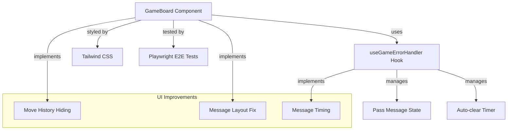
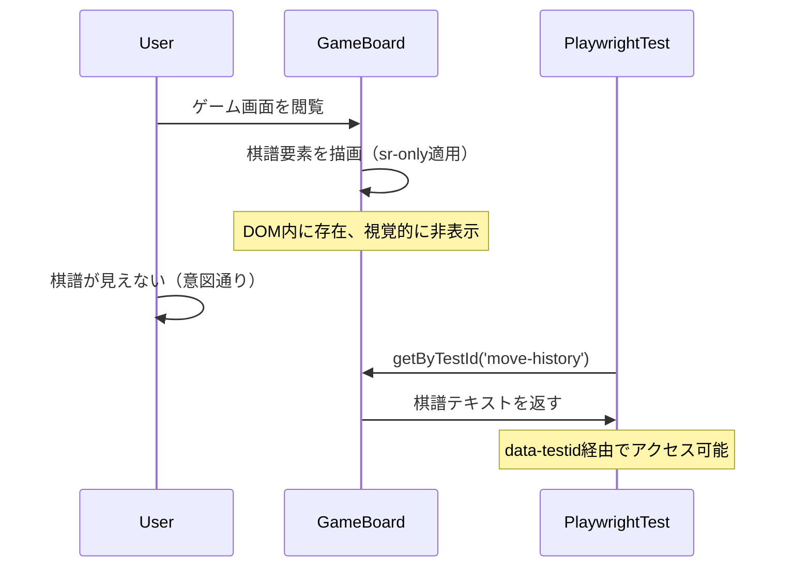
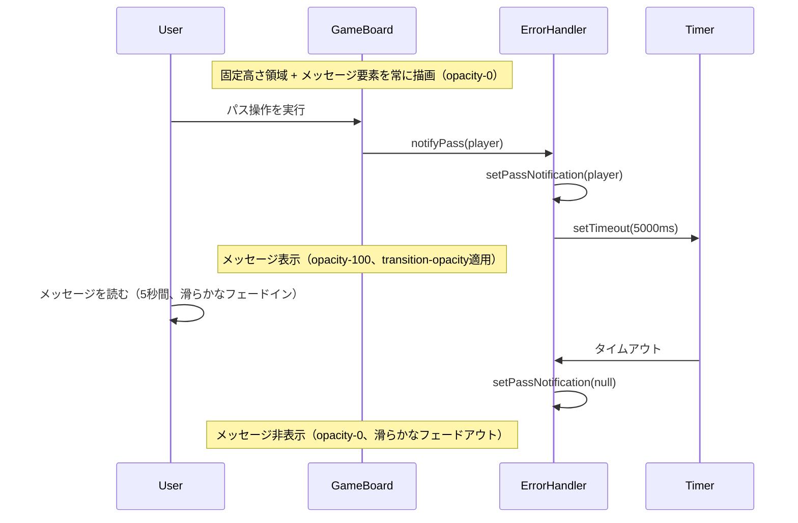

# UI ユーザビリティ改善 - 技術設計書

## 概要

本機能は、リバーシゲームボードのユーザビリティを向上させるため、棋譜表示の視覚的非表示化とメッセージ表示体験の改善を実装します。具体的には、デバッグ用棋譜をユーザから隠蔽しつつテストアクセス可能性を維持し、パス通知メッセージのレイアウトシフト防止および表示時間の最適化を行います。

**目的**: エンドユーザにとってクリーンな画面表示を提供しながら、開発・テスト環境での検証機能を保持する。
**対象ユーザ**: リバーシゲームをプレイする全てのユーザ（一般ユーザ、開発者、QAエンジニア）
**影響**: 既存のGameBoardコンポーネントとuseGameErrorHandlerフックの軽微な修正。UI表示ロジックのみの変更で、ゲームロジックは無影響。

### ゴール

- 棋譜要素をDOM内に保持しつつ視覚的に非表示化（Playwright E2Eテスト互換性維持）
- パス通知メッセージ表示時のCumulative Layout Shift（CLS）を完全に防止
- メッセージ表示時間を3秒から5秒に延長し、ユーザの可読性を向上
- 既存のテストスイート（Jest、Playwright）が全て成功することを保証

### 非ゴール

- 棋譜生成ロジック（move-history.ts）の変更
- メッセージ通知ロジック（useGameErrorHandler）のエラーハンドリング機能の変更
- 新しいUI要素の追加
- レスポンシブデザインのブレークポイント変更

## アーキテクチャ

### 既存アーキテクチャ分析

**現在のパターン**:

- **Presentation Layer**: GameBoard.tsx（Client Component、Tailwind CSSスタイリング）
- **State Management**: useGameErrorHandler（カスタムReact Hook、エラー/通知状態管理）
- **Testing Infrastructure**: Playwright（data-testid属性によるE2Eテスト）、Jest（コンポーネント/フックのユニットテスト）

**維持すべき既存パターン**:

- Tailwind CSSによるスタイリング（CSS Modulesやインラインスタイルのミックスなし）
- data-testid属性によるテスト要素識別
- カスタムフックによる状態管理分離
- Immutabilityパターン（状態更新時の新しいインスタンス生成）

**統合ポイント**:

- GameBoard.tsx: 行484-495（棋譜表示要素）、行321-325（パス通知メッセージ）
- useGameErrorHandler.ts: 行128（メッセージ自動消去タイマー）

### 高レベルアーキテクチャ



**アーキテクチャ統合**:

- 既存パターン保持: Tailwind CSSスタイリング、React Hooksパターン、data-testid属性
- 新規コンポーネント不要: 既存コンポーネント/フック内の軽微な修正のみ
- 技術スタック適合: React 18.x、TypeScript 5.x strict mode、Next.js 15.x App Router
- Steering準拠: Type Safety（明示的な型定義）、Immutability（状態更新パターン）

### 技術適合性

本機能は既存システムへの拡張であり、以下の技術スタックに適合します：

**使用する既存技術**:

- **Frontend Framework**: React 18.x（Client Component）
- **Styling**: Tailwind CSS（ユーティリティクラスベース）
- **State Management**: React Hooks（useState、useRef、useCallback、useEffect）
- **Testing**: Playwright（E2Eテスト）、Jest + React Testing Library（ユニットテスト）
- **Type System**: TypeScript 5.x strict mode

**新規依存関係**: なし

**既存パターンからの逸脱**: なし

### 主要な技術的決定

#### 決定1: CSS視覚的非表示戦略

**決定**: `sr-only`（Screen Reader Only）Tailwindクラスを使用した棋譜の視覚的非表示化

**コンテキスト**:

- 要件: 棋譜要素をDOM内に保持しつつ、一般ユーザから視覚的に隠蔽
- 制約: Playwright E2Eテストが`data-testid="move-history"`経由でアクセス可能である必要
- 追加要件: スクリーンリーダーからも除外（アクセシビリティツリーの汚染防止）

**代替案**:

1. `display: none` - DOM要素を完全に削除（E2Eテストがアクセス不可）
2. `visibility: hidden` - レイアウトスペースを保持（不要な空白が発生）
3. `opacity: 0` - 透明化のみ（スクリーンリーダーが読み上げる可能性）
4. `position: absolute; left: -9999px` - 画面外配置（レイアウトへの影響あり）

**選択したアプローチ**: Tailwind CSS `sr-only`クラス + `aria-hidden="true"`属性

実装詳細:

```typescript
<div
  id="history"
  data-testid="move-history"
  aria-label="着手履歴"
  aria-hidden="true"
  className="sr-only"
>
  <div className="text-sm text-gray-600 whitespace-nowrap">
    {notationString}
  </div>
</div>
```

`sr-only`の内部実装（Tailwind CSS）:

```css
.sr-only {
  position: absolute;
  width: 1px;
  height: 1px;
  padding: 0;
  margin: -1px;
  overflow: hidden;
  clip: rect(0, 0, 0, 0);
  white-space: nowrap;
  border-width: 0;
}
```

**根拠**:

- DOM内に要素が存在するため、Playwrightの`getByTestId('move-history')`が正常に動作
- 視覚的に完全に非表示（1px × 1px、画面外配置、overflow隠蔽）
- `aria-hidden="true"`でスクリーンリーダーからも除外
- Tailwind CSSの標準クラスで、プロジェクトのスタイリング規約に準拠
- クロスブラウザ互換性が高い（モダンブラウザ全般、LINE LIFF browser含む）

**トレードオフ**:

- 獲得: 視覚的非表示、テストアクセス性、アクセシビリティ適切性、保守性
- 犠牲: なし（要件を完全に満たし、副作用なし）

#### 決定2: レイアウトシフト防止戦略

**決定**: 固定高さ領域 + DOM常時レンダリング + opacity切り替えによるCLS防止

**コンテキスト**:

- 問題: 現在のメッセージ要素は条件付きレンダリング（`{getPassMessage() && <div>...</div>}`）により、表示/非表示時にレイアウトシフトが発生
- 目標: Cumulative Layout Shift（CLS）を完全に除去し、ゲームボード要素の位置を固定
- 追加要件: CSS transitionによる滑らかなフェード効果を実現

**代替案**:

1. 条件付きレンダリング継続（現状維持）- CLSが発生し続ける、transition効果が適用できない
2. `position: absolute`で固定配置 - レイアウトフローから除外され、他要素との重なりリスク
3. 最小高さ設定（`min-h-[XX]`）- 内容により高さが変動し、CLSが部分的に残る

**選択したアプローチ**: 固定高さコンテナ + DOM常時レンダリング + opacity切り替え

実装詳細:

```typescript
{/* Fixed-height container to prevent layout shift */}
<div className="h-16 flex items-center justify-center">
  <div
    className={`notification-message bg-yellow-100 border border-yellow-400 text-yellow-700 px-4 py-3 rounded transition-opacity duration-200 ${
      getPassMessage() ? 'opacity-100' : 'opacity-0'
    }`}
  >
    {getPassMessage() || '\u00A0'}
  </div>
</div>
```

**根拠**:

- `h-16`（4rem = 64px）で固定高さを確保し、メッセージ表示/非表示に関わらず領域サイズ不変
- `flex items-center justify-center`でメッセージの中央配置（視覚的な安定性向上）
- DOM常時レンダリング: メッセージ要素が常にDOM内に存在するため、transition-opacityが正常に機能
- `opacity-100` / `opacity-0`による可視性切り替え: レイアウトに影響なし
- `transition-opacity duration-200`でフェードイン/アウトのスムーズな視覚効果（UX向上）
- `{getPassMessage() || '\u00A0'}`: 非表示時でも高さを維持（non-breaking space）
- Tailwindクラスのみで実装（プロジェクト規約準拠）

**根拠の詳細説明**:

- **レイアウトシフトゼロ**: 親コンテナの高さが常に固定、子要素も常に描画
- **CSS Transition対応**: DOM要素が常に存在するため、opacity変更時にtransitionが適用可能
- **パフォーマンス**: opacity変更はGPU加速されるため、レンダリングコストが低い
- **視覚的な滑らかさ**: transition-opacityにより自然なフェード効果
- **保守性**: Tailwindクラスのみで完結、カスタムCSSなし

**トレードオフ**:

- 獲得: CLS完全防止、UX向上、滑らかなtransition効果
- 犠牲: 非表示時でもDOM要素が存在（わずかなメモリ使用量増加、実用上は無視可能）

#### 決定3: 固定高さ値の選択

**決定**: `h-16`（64px）を固定高さとして採用

**コンテキスト**:

- 要件: メッセージ領域の固定高さを確保
- 懸念: 長いメッセージがオーバーフローする可能性
- 判断: ユーザビリティ改善の優先順位を考慮し、影響を許容

**代替案**:

1. `min-h-16` - 内容に応じて高さが変動し、CLSが部分的に残る
2. より大きい固定高さ（`h-20`など）- 画面スペースの過剰消費
3. オーバーフロー処理追加（スクロール、省略記号など）- 複雑性の増加

**選択したアプローチ**: `h-16`固定高さ、オーバーフロー対策なし

**根拠**:

- 現在のパス通知メッセージは短いテキスト（例: "白がパスしました"）であり、64pxで十分
- CLS防止の目標達成を優先
- 実装のシンプルさを重視
- 将来的にメッセージが長くなる場合でも、その時点で対応可能

**トレードオフ**:

- 獲得: 実装のシンプルさ、CLS完全防止、明確な高さ保証
- 犠牲: 非常に長いメッセージの場合のオーバーフロー可能性（現状のメッセージでは発生しない）

#### 決定4: メッセージ表示時間の最適化

**決定**: タイマー時間を3秒から5秒に変更

**コンテキスト**:

- 問題: 現在の3秒間の表示時間がユーザにとって短すぎる（Requirements段階で意思決定済み）
- 目標: ユーザがメッセージを確実に読み取れる時間を提供

**代替案**:

1. 3秒維持（現状維持）- ユーザビリティ問題が継続
2. 7秒以上 - メッセージが長く残りすぎ、視覚的な邪魔になる可能性
3. ユーザ設定可能 - 過度な複雑性、本機能のスコープ外

**選択したアプローチ**: 固定5秒のタイマー時間

実装詳細:

```typescript
const notifyPass = useCallback((player: Player) => {
  // Clear existing timer
  if (passNotificationTimerRef.current) {
    clearTimeout(passNotificationTimerRef.current);
  }

  // Set notification
  setPassNotification(player);

  // Auto-clear after 5 seconds (changed from 3 seconds)
  passNotificationTimerRef.current = setTimeout(() => {
    setPassNotification(null);
  }, 5000);
}, []);
```

**根拠**:

- 5秒間はユーザが通知テキストを読み取り、理解するのに十分な時間
- 業界標準のトーストメッセージ表示時間（一般的に4-6秒）に準拠
- タイマーの上書きロジックは維持（新しいメッセージが前のタイマーをキャンセル）

**トレードオフ**:

- 獲得: ユーザの可読性向上、通知の見逃し防止
- 犠牲: メッセージがわずかに長く画面に残る（2秒増加）

## システムフロー

本機能は既存のゲームフロー内での軽微なUI修正であり、新しいフローは発生しません。既存フローへの影響を以下に示します。

### 棋譜非表示フロー（既存フローの修正なし）



### メッセージ表示フロー（既存フローの改善）



## 要件トレーサビリティ

| 要件    | 要件概要               | コンポーネント                 | インターフェース                     | フロー               |
| ------- | ---------------------- | ------------------------------ | ------------------------------------ | -------------------- |
| 1.1     | 棋譜要素のDOM保持      | GameBoard                      | data-testid="move-history"           | 棋譜非表示フロー     |
| 1.2     | CSS視覚的非表示        | GameBoard                      | className="sr-only"                  | 棋譜非表示フロー     |
| 1.3     | E2Eテストアクセス      | GameBoard                      | data-testid="move-history"           | 棋譜非表示フロー     |
| 1.4     | ユーザ視覚隠蔽         | GameBoard                      | sr-only（画面外配置）                | 棋譜非表示フロー     |
| 1.5     | スクリーンリーダー除外 | GameBoard                      | aria-hidden="true"                   | 棋譜非表示フロー     |
| 2.1     | メッセージ領域固定高さ | GameBoard                      | className="h-16"                     | メッセージ表示フロー |
| 2.2     | opacity表示            | GameBoard                      | opacity-100クラス                    | メッセージ表示フロー |
| 2.3     | opacity非表示          | GameBoard                      | opacity-0クラス                      | メッセージ表示フロー |
| 2.4     | 領域高さ不変           | GameBoard                      | h-16固定 + DOM常時レンダリング       | メッセージ表示フロー |
| 2.5     | 後続要素位置固定       | GameBoard                      | h-16固定 + opacity切り替え           | メッセージ表示フロー |
| 2.6     | Tailwind CSS使用       | GameBoard                      | h-16, flex, items-center, opacity-\* | メッセージ表示フロー |
| 3.1     | タイマー5秒設定        | useGameErrorHandler            | setTimeout(5000)                     | メッセージ表示フロー |
| 3.2     | 5秒後自動消去          | useGameErrorHandler            | setPassNotification(null)            | メッセージ表示フロー |
| 3.3     | タイマー上書き         | useGameErrorHandler            | clearTimeout()                       | メッセージ表示フロー |
| 4.1     | 棋譜生成ロジック不変   | move-history.ts                | 変更なし                             | -                    |
| 4.2     | エラーハンドリング維持 | useGameErrorHandler            | 既存メソッド保持                     | -                    |
| 4.3-4.6 | 既存テスト成功         | 全コンポーネント               | 既存インターフェース保持             | 全フロー             |
| 5.1-5.4 | クロスブラウザ互換性   | GameBoard, useGameErrorHandler | Tailwind CSS, React標準API           | 全フロー             |

## コンポーネントとインターフェース

### Presentation Layer

#### GameBoard Component

**責任と境界**

- **主要責任**: ゲームボードのUI描画およびユーザ操作ハンドリング。本機能では棋譜の視覚的非表示化とメッセージ領域のレイアウトシフト防止を担当。
- **ドメイン境界**: Presentation Layer（UIコンポーネント）
- **データ所有権**: UI表示状態のみ（ゲーム状態はuseGameStateが管理）
- **トランザクション境界**: なし（State更新はReact Hooks経由）

**依存関係**

- **Inbound**: なし（ルートレベルClient Component）
- **Outbound**:
  - useGameErrorHandler（メッセージ状態取得）
  - useGameState（ゲーム状態取得）
  - Tailwind CSS（スタイリング）
- **External**: React 18.x、Next.js 15.x

**契約定義**

**Props Interface**:

```typescript
export interface GameBoardProps {
  initialSettings?: Record<string, unknown>; // Future extensibility
}
```

**Test Contract**:

- `data-testid="move-history"`: 棋譜要素へのテストアクセスポイント
  - **前提条件**: notationStringが非nullかつゲーム進行中
  - **事後条件**: DOM内に棋譜テキストを含む要素が存在
  - **不変条件**: sr-onlyクラス適用、aria-hidden="true"設定

**UI Contract**:
| 要素 | セレクタ | スタイリング | 表示条件 |
|------|----------|------------|----------|
| 棋譜要素 | data-testid="move-history" | sr-only, aria-hidden="true" | notationString && playing |
| メッセージ領域 | なし（固定高さコンテナ） | h-16 flex items-center justify-center | 常に描画 |
| パス通知 | .notification-message | bg-yellow-100 border px-4 py-3 rounded transition-opacity opacity-100/0 | 常に描画、opacity切り替え |

**統合戦略**

- **修正アプローチ**: 既存コード拡張（新規コンポーネント不要）
- **後方互換性**:
  - data-testid属性維持（Playwright E2Eテスト互換性）
  - className構造維持（既存Jest単体テスト互換性）
  - 既存propsインターフェース不変
- **移行パス**: なし（単一コミットでの原子的変更）

#### useGameErrorHandler Hook

**責任と境界**

- **主要責任**: ゲーム内のエラー状態および通知状態の管理。本機能ではパス通知メッセージの自動消去タイマーを5秒に変更。
- **ドメイン境界**: State Management Layer（React Hook）
- **データ所有権**: passNotification状態、invalidMove状態、タイマー参照
- **トランザクション境界**: なし（ローカル状態管理のみ）

**依存関係**

- **Inbound**: GameBoard（フックの利用者）
- **Outbound**: React（useState, useCallback, useRef, useEffect）
- **External**: なし

**契約定義**

**Service Interface**:

```typescript
interface UseGameErrorHandlerReturn {
  // Invalid move state
  invalidMovePosition: Position | null;
  invalidMoveReason: InvalidMoveReason | null;
  handleInvalidMove: (position: Position, reason: InvalidMoveReason) => void;
  getErrorMessage: () => string | null;

  // Pass notification state
  passNotification: Player | null;
  notifyPass: (player: Player) => void; // 5秒タイマーで自動消去
  getPassMessage: () => string | null;

  // Game state inconsistency
  hasInconsistency: boolean;
  inconsistencyReason: InconsistencyReason | null;
  detectInconsistency: (reason: InconsistencyReason) => void;
  clearInconsistency: () => void;
  getInconsistencyMessage: () => string | null;
}
```

**Event Contract**:

- **notifyPass**: パス操作の通知
  - **トリガー条件**: ユーザまたはAIがパス操作を実行
  - **副作用**: setPassNotification(player)、5秒後のsetTimeout実行
  - **べき等性**: 新しい通知が既存タイマーを上書き（前のタイマーはクリア）
  - **リカバリ**: unmount時にタイマー自動クリーンアップ

**State Management**:

- **状態モデル**:
  - passNotification: null（非表示） ↔ Player（表示中）
  - タイマー: 非アクティブ ↔ アクティブ（5秒カウント）
- **永続化**: なし（揮発性状態）
- **並行性**: タイマー上書きロジック（前のタイマーをclearTimeout）

**統合戦略**

- **修正アプローチ**: タイマー定数のみ変更（3000 → 5000）
- **後方互換性**:
  - インターフェース不変（UseGameErrorHandlerReturnの型定義変更なし）
  - メソッドシグネチャ不変（notifyPassの引数・戻り値変更なし）
- **移行パス**: なし（定数変更のみ）

## データモデル

### 論理データモデル

本機能は既存データモデルに変更を加えません。UI状態のみを修正します。

**変更なしの既存モデル**:

- Board: Cell[][] - ゲーム盤面状態
- Position: { row: number; col: number } - マス座標
- Player: 'black' | 'white' - プレイヤー識別子
- notationString: string - 棋譜文字列（move-history.tsが生成）

**UI状態（React Hook内部状態）**:

- passNotification: Player | null - パス通知表示状態（5秒タイマーで自動クリア）
- passNotificationTimerRef: NodeJS.Timeout | null - タイマー参照

## エラーハンドリング

### エラー戦略

本機能は既存のエラーハンドリング機構を変更せず、UIレベルの改善のみを実施します。

**既存エラーハンドリング（保持）**:

- Invalid Move Errors: handleInvalidMove → 2秒後自動クリア
- Game State Inconsistency: detectInconsistency → ユーザによる手動リセット
- AI Errors: console.errorログ + フォールバック（スキップ）

**本機能でのエラー考慮点**:

- **CSS非対応ブラウザ**: Tailwind CSSのsr-onlyクラスは全モダンブラウザでサポート済み（リスク: 極小）
- **タイマーリーク**: useEffect cleanupで全タイマーをクリアアップ（既存実装済み）
- **レンダリングエラー**: DOM常時レンダリングパターンは既存Reactパターンと同等（リスク: なし）

### エラーカテゴリと対応

**ユーザエラー（4xx相当）**:

- 該当なし（本機能はUI表示のみ）

**システムエラー（5xx相当）**:

- React Rendering Error: ErrorBoundaryでキャッチ（既存実装）
- タイマー障害: 自動クリーンアップ機構で対処（既存実装）

**ビジネスロジックエラー（422相当）**:

- 該当なし（本機能はゲームロジック変更なし）

### モニタリング

**既存モニタリング（保持）**:

- console.error: 重大なエラーのブラウザコンソールログ
- React DevTools: コンポーネント状態検査
- Playwright Test Reports: E2Eテスト結果レポート

**本機能での追加モニタリング**:

- なし（既存モニタリング機構で十分）

## テスト戦略

### ユニットテスト（Jest + React Testing Library）

**GameBoard Component Tests**:

1. 棋譜要素にsr-onlyクラスが適用されていることを確認
2. 棋譜要素にaria-hidden="true"属性が設定されていることを確認
3. data-testid="move-history"属性が保持されていることを確認
4. メッセージ領域の固定高さ（h-16）が適用されていることを確認
5. メッセージ要素が常にDOM内に存在することを確認
6. パス通知メッセージ表示時にopacity-100が適用されることを確認
7. パス通知メッセージ非表示時にopacity-0が適用されることを確認
8. transition-opacityクラスが適用されていることを確認

**useGameErrorHandler Hook Tests**:

1. notifyPassが5秒後にpassNotificationをnullにクリアすることを確認
2. 新しいnotifyPass呼び出しが前のタイマーをキャンセルすることを確認
3. unmount時にタイマーがクリーンアップされることを確認

### 統合テスト（Jest）

1. GameBoard + useGameErrorHandlerの統合: パス操作後に5秒間メッセージが表示され、その後自動消去されることを確認
2. メッセージ表示中に新しいパス操作が発生した場合、メッセージが更新されタイマーがリセットされることを確認
3. メッセージ表示/非表示切り替え時にレイアウトシフトが発生しないことを確認（スナップショットテスト）

### E2Eテスト（Playwright）

1. **棋譜非表示テスト**:
   - ゲーム開始後、棋譜要素がDOM内に存在することを確認（`getByTestId('move-history')`）
   - 棋譜要素がビューポート外に配置されていることを確認（`isVisible()`がfalse）
   - 棋譜テキストが正確に取得できることを確認（既存E2Eテストの継続実行）

2. **メッセージレイアウトテスト**:
   - パス操作前後でゲームボード要素のbounding boxが変化しないことを確認
   - メッセージ表示中にゲームボードのY座標が固定されていることを確認
   - メッセージ要素が常にDOM内に存在することを確認

3. **メッセージ表示時間テスト**:
   - パス操作後、メッセージが5秒間表示されることを確認（wait 4秒後も表示、wait 6秒後は非表示）
   - 複数回のパス操作でタイマーがリセットされることを確認

4. **CSSトランジションテスト**:
   - メッセージ表示時にopacity-100クラスが適用されることを確認
   - メッセージ非表示時にopacity-0クラスが適用されることを確認
   - transition-opacityクラスが適用されていることを確認

### クロスブラウザテスト（Playwright）

**自動テスト**:

- Desktop Chrome: 全E2Eテスト実行
- Mobile Chrome: レスポンシブUI + 全E2Eテスト実行
- Mobile Safari: レスポンシブUI + 全E2Eテスト実行

**手動検証のみ（LIFF Browser）**:

- LINE LIFF browser（iOS WKWebView）: 実機での視覚確認
- LINE LIFF browser（Android WebView）: 実機での視覚確認
- 注記: LIFF Browserに対する自動テストは要求されない

### パフォーマンステスト

- レイアウトシフトメトリクス: Chrome DevTools Lighthouse でCLSスコア測定（目標: 0.0）
- メッセージ表示パフォーマンス: React DevTools Profiler でレンダリング時間測定（目標: 16ms以下）

## セキュリティ考慮事項

本機能はUI表示の変更のみであり、セキュリティ影響はありません。

- データ露出: 棋譜は既に公開情報（ゲーム進行状態）であり、非表示化はUX改善のみ
- XSS脆弱性: 既存のReact自動エスケープ機構を維持（変更なし）
- CSRF: 該当なし（サーバ通信なし）
- 認証/認可: 該当なし（クライアント側UIのみ）

## パフォーマンスとスケーラビリティ

### ターゲットメトリクス

- **Cumulative Layout Shift（CLS）**: 0.0（メッセージ表示/非表示時のシフト完全除去）
- **First Contentful Paint（FCP）**: 影響なし（SSG時の静的HTML生成変更なし）
- **Time to Interactive（TTI）**: 影響なし（JavaScriptバンドルサイズ変更なし）
- **React Component Render Time**: < 16ms（60fps維持）

### スケーリングアプローチ

本機能は単一クライアントUIの改善であり、スケーラビリティ要件はありません。

### キャッシング戦略

- 変更なし: 既存のSSG（Static Site Generation）およびCDN配信パターンを維持
- Tailwind CSS: ビルド時の静的CSS生成（実行時オーバーヘッドなし）

### 最適化技術

- **sr-onlyクラス**: 視覚的非表示でもDOM要素は存在するが、レンダリングコストは極小（1px × 1px）
- **DOM常時レンダリング + opacity切り替え**: GPU加速されるため、パフォーマンスへの影響は無視可能
- **タイマー管理**: useRefによるタイマー参照保持（不要な再レンダリング防止）

## 移行戦略

本機能は既存機能の段階的改善であり、明示的な移行フェーズは不要です。単一デプロイでの原子的適用が可能です。

### デプロイフロー

```mermaid
flowchart LR
    Start[開始] --> CodeChange[コード変更適用]
    CodeChange --> TestLocal[ローカルテスト実行]
    TestLocal --> TestCI[CI/CDパイプライン]
    TestCI --> BuildSSG[SSGビルド]
    BuildSSG --> DeployStaging[ステージング環境デプロイ]
    DeployStaging --> ManualQA[手動QA検証]
    ManualQA --> DeployProd[本番環境デプロイ]
    DeployProd --> MonitorCLS[CLSメトリクス監視]
    MonitorCLS --> Complete[完了]
```



### フェーズ分解

**Phase 1: コード変更および自動テスト（CI/CD）**

- GameBoard.tsx修正: 棋譜要素にsr-onlyクラス追加、メッセージ領域固定高さ化 + DOM常時レンダリング + opacity切り替え
- useGameErrorHandler.ts修正: タイマー時間3000 → 5000
- Jest単体テスト実行（全テスト成功）
- Playwright E2Eテスト実行（全テスト成功、Desktop + Mobile）

**Phase 2: ステージング検証**

- ステージング環境デプロイ
- 手動QA: 視覚的な棋譜非表示、メッセージ表示5秒、レイアウトシフトなし、滑らかなtransition効果を確認
- クロスブラウザ検証（Chrome, Safari, Firefox, Edge）- 自動テストで検証済み
- LIFF browser実機検証（LINEアプリ内、iOS WKWebView + Android WebView）- 手動検証のみ

**Phase 3: 本番デプロイおよび監視**

- 本番環境デプロイ（SSGビルド → CDN配信）
- CLSメトリクス監視（Chrome User Experience Report経由）
- ユーザフィードバック収集（サポート問い合わせ監視）

### ロールバックトリガー

- Jest/Playwrightテスト失敗 → Phase 1で中止
- ステージングQA不合格 → Phase 2で中止、コード修正後再試行
- 本番CLSスコア悪化 → 即座にロールバック（前バージョンの静的ファイルに切り替え）

### 検証チェックポイント

**Phase 1完了条件**:

- [ ] 全Jestテスト成功（90%カバレッジ維持）
- [ ] 全Playwright E2Eテスト成功（Desktop + Mobile）
- [ ] TypeScriptコンパイルエラーなし
- [ ] ESLint/Prettierエラーなし

**Phase 2完了条件**:

- [ ] 棋譜が視覚的に非表示（手動確認）
- [ ] data-testid経由で棋譜アクセス可能（E2Eテスト成功）
- [ ] メッセージ表示/非表示時のレイアウトシフトなし（手動確認 + Lighthouseスコア）
- [ ] メッセージ表示時に滑らかなフェードイン効果（手動確認）
- [ ] メッセージ非表示時に滑らかなフェードアウト効果（手動確認）
- [ ] メッセージ表示時間が5秒（ストップウォッチ計測）
- [ ] クロスブラウザ動作確認（Chrome, Safari, Firefox, Edge）- 自動テスト結果確認
- [ ] LIFF browser動作確認（iOS WKWebView, Android WebView）- 手動検証のみ

**Phase 3完了条件**:

- [ ] 本番環境で全機能正常動作（smoke test）
- [ ] CLSメトリクス改善確認（改善前後の比較）
- [ ] ユーザからのエラー報告なし（デプロイ後24時間監視）

---

**作成日**: 2025-11-12
**最終更新**: 2025-11-12
**バージョン**: 2.0
**承認状態**: レビュー待ち
**変更履歴**:

- v2.0 (2025-11-12): 設計検証フィードバックに基づく更新
  - レイアウトシフト防止戦略を条件付きレンダリングからDOM常時レンダリング + opacity切り替えパターンに変更
  - LIFF Browser自動テスト要件を削除、手動検証のみに変更
  - 固定高さh-16を許容、オーバーフロー対策を不要と判断
- v1.0 (2025-11-12): 初版作成
