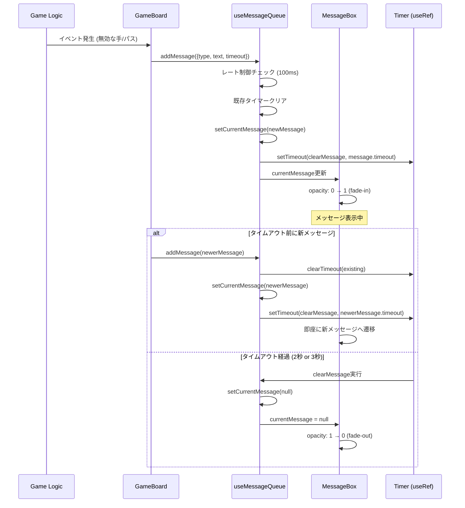

# 技術設計書: 統一メッセージボックス

## Overview

本機能は、リバーシミニアプリにおける分散した複数のメッセージ表示（パス通知、無効な手の警告、ゲーム状態不整合エラー等）を統合し、単一の統一メッセージボックスコンポーネントとして提供する。現在、GameBoardコンポーネント内に3種類の独立したメッセージ表示エリアが存在しているが、これらを`MessageBox`プレゼンテーショナルコンポーネントと`useMessageQueue`カスタムフックに集約することで、一貫性のあるユーザー体験と保守性の向上を実現する。

統一メッセージボックスは、ページ上部の固定高さ領域（64px）に配置され、メッセージの表示/非表示時にレイアウトシフト（Cumulative Layout Shift: CLS）を引き起こさない。表示制御はopacity遷移のみで実現し、最新メッセージのみを表示するシンプルな戦略を採用する。メッセージは目的に応じた自動消去タイマーを持ち（パス通知: 3秒、無効な手警告: 2秒）、新しいメッセージが発行されると既存メッセージを即座に置き換える。

本設計は、既存の`useGameErrorHandler`フックのパターンを拡張し、プロジェクトのアーキテクチャ原則（Components → Hooks → Lib）に準拠した実装を提供する。TypeScript strict modeによる型安全性を確保し、discriminated unionsによるメッセージタイプの明確な区別を実現する。

### Goals

- GameBoard内の分散したメッセージ表示を単一のMessageBoxコンポーネントに統合
- レイアウトシフト（CLS）をゼロに保つ固定高さレイアウトの実装
- 通常メッセージと警告メッセージの視覚的区別（控えめな配色）
- 目的別タイムアウト戦略の実装（パス通知: 3秒、無効な手警告: 2秒）と最新メッセージ優先表示のロジック
- TypeScript strict modeでの型安全な実装（`any`型の排除）
- 既存のhooksパターンとの整合性維持

### Non-Goals

- 複数メッセージの同時表示やキューイング表示
- メッセージ履歴の保存や再表示機能
- グローバルなContext APIによる共有メッセージシステム（現時点では単一コンポーネントでの使用）
- メッセージの手動閉じるボタン（自動消去のみ）
- アニメーションの高度なカスタマイズオプション
- 多言語対応（現時点では日本語のみ）

## Architecture

### Existing Architecture Analysis

**現在のメッセージ処理パターン**:

- `useGameErrorHandler`フックが基本的なメッセージ管理を実装済み
  - 無効な手の警告（2秒間の自動消去）
  - パス通知（3秒間の自動消去）
  - ゲーム状態不整合の検出
  - `useState`、`useCallback`、`useRef`を用いたタイマー管理
- GameBoard.tsx内に3種類の独立したメッセージ表示領域:
  - エラーメッセージ（条件付きレンダリング、Tailwind CSS）
  - パス通知メッセージ（固定高さ`h-16`領域、opacity遷移）
  - 不整合エラー（リセットボタン付き）

**統合によるアーキテクチャ改善**:

- `useGameErrorHandler`の機能を`useMessageQueue`に統合または再設計
- 散在するメッセージ表示ロジックを`MessageBox`コンポーネントに集約
- 固定高さコンテナによるCLS対策を全メッセージに適用
- discriminated unionsによる型安全なメッセージタイプシステム導入

**保持すべき既存パターン**:

- `/hooks`ディレクトリでの状態管理ロジック
- `/components`ディレクトリでのプレゼンテーショナルコンポーネント
- `useRef`によるタイマー管理とクリーンアップ
- GameBoard.cssのkeyframesアニメーションスタイル

### Architecture Pattern & Boundary Map

**Architecture Integration**:

- **選択パターン**: Presentation/Container分離パターン（既存のReact hooksパターン拡張）
- **ドメイン/機能境界**:
  - **MessageBoxコンポーネント** (`/components`): UIレンダリング専念、propsからメッセージを受け取り表示のみ
  - **useMessageQueueフック** (`/hooks`): メッセージキュー状態管理、タイマー制御、メッセージ追加/削除API提供
  - **GameBoardコンポーネント**: ゲームロジックイベントからメッセージを発行（`addMessage`呼び出し）
- **保持される既存パターン**:
  - 単方向データフロー: GameBoard → useMessageQueue → MessageBox
  - Pure functionsとStateful hooksの分離
  - Co-locatedテスト（`__tests__`ディレクトリ）
- **新規コンポーネントの根拠**:
  - `MessageBox`: 再利用可能なプレゼンテーションレイヤーとして独立
  - `useMessageQueue`: メッセージ状態とタイマーロジックをGameBoardから分離
- **Steering準拠**:
  - Domain-Driven Layering（structure.md）に従ったディレクトリ配置
  - Pure Logic vs. Stateful Hooksの原則維持（structure.md）
  - TypeScript strict modeとno `any`ポリシー（tech.md）


### Technology Stack

| Layer                    | Choice / Version        | Role in Feature                                       | Notes                                                      |
| ------------------------ | ----------------------- | ----------------------------------------------------- | ---------------------------------------------------------- |
| Frontend / UI            | React 18.x              | MessageBoxコンポーネントのレンダリング（client component） | 既存のクライアントコンポーネントパターンを踏襲             |
| Frontend / UI            | Tailwind CSS 3.x        | 主要スタイリング（レイアウト、色、間隔、遷移）          | 既存のutility-firstアプローチを継続                        |
| Frontend / UI            | Plain CSS (optional)    | 複雑なkeyframesアニメーション（必要な場合）            | GameBoard.cssパターンに準拠、Tailwindで不足する場合のみ使用 |
| State Management         | React Hooks (useState等) | メッセージキュー状態管理、タイマー制御                 | 既存のuseGameStateパターンと整合                           |
| Language / Type System   | TypeScript 5.x (strict) | 型安全なメッセージインターフェース定義                 | discriminated unions使用、`any`型禁止                      |
| Testing                  | Jest + React Testing Library | MessageBoxコンポーネントとuseMessageQueueのユニットテスト | 既存テスト戦略を踏襲                                       |

> **Rationale**: 既存の技術スタック（tech.md）に完全準拠し、新規依存関係を追加しない。Tailwind CSSとPlain CSSの組み合わせは、GameBoard.cssの既存パターンと一貫性を保つ。React Context APIは不要（単一コンポーネントでの使用のため）。詳細な調査結果は`research.md`参照。

## System Flows

### Message Lifecycle Flow



**Key Decisions**:

- タイマー管理には`useRef`を使用し、コンポーネント再レンダリングの影響を受けない
- 新メッセージ追加時は既存タイマーを即座にクリアし、新タイマーを開始（timeout値を使用）
- レート制御監視（100ms間隔）で高頻度発行をログ出力、ただし最新メッセージは常に処理
- フェードアニメーションはCSS `transition-opacity`で実現し、JavaScriptは状態変更のみ担当

## Requirements Traceability

| Requirement | Summary                                | Components                    | Interfaces                              | Flows                     |
| ----------- | -------------------------------------- | ----------------------------- | --------------------------------------- | ------------------------- |
| 1.1         | ページ上部の固定位置に表示             | MessageBox                    | MessageBoxProps                         | -                         |
| 1.2         | 最新のメッセージのみを表示             | useMessageQueue               | addMessage, currentMessage state        | Message Lifecycle         |
| 1.3         | タイムアウト期間内の新メッセージで既存を破棄 | useMessageQueue          | addMessage, timer management            | Message Lifecycle         |
| 1.4         | 目的別タイムアウト後に自動非表示       | useMessageQueue               | timer management, clearMessage          | Message Lifecycle         |
| 1.5         | メッセージ不在時は非表示を維持         | MessageBox, useMessageQueue   | currentMessage state (null handling)    | Message Lifecycle         |
| 2.1         | 固定の高さを持ち、高さが変動しない     | MessageBox                    | CSS fixed height (h-16)                 | -                         |
| 2.2         | 表示/非表示でCLSを引き起こさない       | MessageBox                    | CSS opacity transition only             | -                         |
| 2.3         | 初期レンダリング時から固定領域を確保   | MessageBox                    | CSS fixed height, always rendered       | -                         |
| 2.4         | 不透明度のみ変化、レイアウト寸法不変   | MessageBox                    | CSS opacity transition                  | -                         |
| 3.1         | 通常/警告の2種類のメッセージタイプ     | Message type                  | Message discriminated union             | -                         |
| 3.2         | 通常メッセージ用の控えめな背景色       | MessageBox                    | CSS conditional styling (type-based)    | -                         |
| 3.3         | 警告メッセージ用の識別可能な背景色     | MessageBox                    | CSS conditional styling (type-based)    | -                         |
| 3.4         | 派手な色を使用しない                   | MessageBox                    | CSS color palette (low saturation)      | -                         |
| 3.5         | モバイルで視認可能なフォントとコントラスト | MessageBox                | CSS font-size, color contrast           | -                         |
| 4.1         | メッセージ表示時にフェードイン         | MessageBox                    | CSS transition-opacity (fade-in)        | Message Lifecycle         |
| 4.2         | メッセージ非表示時にフェードアウト     | MessageBox                    | CSS transition-opacity (fade-out)       | Message Lifecycle         |
| 4.3         | アニメーション持続時間0.3秒以下        | MessageBox                    | CSS transition-duration: 0.3s           | Message Lifecycle         |
| 4.4         | アニメーション中にCLSを引き起こさない  | MessageBox                    | CSS opacity transition only             | -                         |
| 4.5         | アニメーション中の新メッセージで中断   | useMessageQueue               | timer cancellation, immediate replace   | Message Lifecycle         |
| 5.1         | パス通知メッセージを表示               | GameBoard, useMessageQueue    | addMessage API                          | Message Lifecycle         |
| 5.2         | 無効な打ち手位置の警告メッセージを表示 | GameBoard, useGameErrorHandler | addMessage API (refactored)            | Message Lifecycle         |
| 5.3         | 汎用テキストメッセージ受け入れ         | Message type                  | Message.text: string                    | -                         |
| 5.4         | 日本語テキストを適切にレンダリング     | MessageBox                    | CSS font rendering, lang attribute      | -                         |
| 5.5         | 長文メッセージの切り詰め               | MessageBox                    | CSS text-overflow: ellipsis, line-clamp | -                         |
| 6.1         | React 18のクライアントコンポーネント   | MessageBox, GameBoard         | 'use client' directive                  | -                         |
| 6.2         | Tailwind CSSを主要スタイリング手段     | MessageBox                    | Tailwind utility classes                | -                         |
| 6.3         | 必要に応じてPlain CSSファイル使用      | MessageBox.css (optional)     | CSS keyframes (if needed)               | -                         |
| 6.4         | TypeScript strict modeで型安全性確保   | All TypeScript files          | Message, MessageBoxProps types          | -                         |
| 6.5         | カスタムフックでstate管理を分離        | useMessageQueue               | Hook interface                          | -                         |
| 6.6         | Presentationalコンポーネント配置       | MessageBox                    | /components directory                   | -                         |
| 6.7         | Jest + React Testing Libraryでテスト   | All components/hooks          | Test suites                             | -                         |

## Components and Interfaces

| Component        | Domain/Layer | Intent                                           | Req Coverage                         | Key Dependencies (P0/P1)                  | Contracts       |
| ---------------- | ------------ | ------------------------------------------------ | ------------------------------------ | ----------------------------------------- | --------------- |
| MessageBox       | UI           | メッセージの視覚的表示（type別のスタイリング）   | 1.1, 2.1-2.4, 3.2-3.5, 4.1-4.4, 5.4-5.5, 6.1-6.3, 6.6 | React (P0), Tailwind CSS (P0)             | Props           |
| useMessageQueue  | State Mgmt   | メッセージキュー状態管理とタイマー制御           | 1.2-1.5, 4.5, 5.1-5.3, 6.4-6.5       | React hooks (P0)                          | Service         |
| GameBoard        | UI           | メッセージ発行元（既存コンポーネントの拡張）     | 5.1-5.2                              | useMessageQueue (P0), useGameErrorHandler (P1) | -               |

### UI Layer

#### MessageBox

| Field             | Detail                                                   |
| ----------------- | -------------------------------------------------------- |
| Intent            | メッセージテキストとタイプに基づいた視覚的表示を提供     |
| Requirements      | 1.1, 2.1, 2.2, 2.3, 2.4, 3.2, 3.3, 3.4, 3.5, 4.1, 4.2, 4.3, 4.4, 5.4, 5.5, 6.1, 6.2, 6.3, 6.6 |
| Owner / Reviewers | Frontend Team                                            |

**Responsibilities & Constraints**:

- メッセージの視覚的レンダリング（テキスト、背景色、アイコン）
- メッセージタイプに基づくスタイルの条件分岐
- 固定高さコンテナ（64px）によるレイアウト安定性の保証
- opacity遷移のみを使用したフェードアニメーション
- メッセージ不在時も固定高さ領域を維持（CLS防止）
- 長文メッセージの切り詰め処理

**Dependencies**:

- Inbound: なし（pure presentational component）
- Outbound: なし
- External: React 18.x (P0), Tailwind CSS (P0)

**Contracts**: Props [x]

##### Props Interface

```typescript
/**
 * Message type discriminated union
 */
type Message =
  | {
      type: 'info';
      text: string;
      timeout: number; // タイムアウト時間（ミリ秒）
    }
  | {
      type: 'warning';
      text: string;
      timeout: number; // タイムアウト時間（ミリ秒）
    };

/**
 * MessageBox component props
 */
interface MessageBoxProps {
  /**
   * 現在表示するメッセージ
   * nullの場合は非表示状態（opacity: 0だが領域は確保）
   */
  message: Message | null;

  /**
   * テスト用のdata-testid属性
   * @default 'message-box'
   */
  testId?: string;
}
```

**Preconditions**:

- `message`が非nullの場合、`text`プロパティは空文字列でないこと
- `type`は`'info'`または`'warning'`のいずれか

**Postconditions**:

- レンダリング後、固定高さ（h-16 = 64px）のコンテナが常に存在
- `message`がnullの場合、`opacity: 0`で非表示だが領域は維持
- `message`が非nullの場合、`opacity: 1`で表示

**Invariants**:

- コンポーネントの高さは常に64pxを維持（CLSゼロ保証）
- アニメーションは`transition-opacity`のみ使用

**Implementation Notes**:

- **Integration**: GameBoardコンポーネント内でuseMessageQueueの`currentMessage`をpropsとして受け取る
- **Validation**: `message.text`が極端に長い場合、`line-clamp-2`等で2行以内に制限
- **Japanese Text Handling**:
  - CSS Configuration:
    ```css
    .message-box-text {
      font-family: -apple-system, BlinkMacSystemFont, "Segoe UI", "Noto Sans JP", sans-serif;
      line-height: 1.5;
      display: -webkit-box;
      -webkit-line-clamp: 2;
      -webkit-box-orient: vertical;
      overflow: hidden;
      text-overflow: ellipsis;
      word-break: break-all;
    }
    ```
  - HTML Attributes: MessageBoxコンテナに`lang="ja"`属性を追加
  - Browser Fallback: line-clampをサポートしないブラウザ向けに`max-height: 3rem; overflow: hidden;`をフォールバックとして提供
- **Risks**: 日本語の長文でellipsisが適切に動作しない可能性 → テストで検証必要

### State Management Layer

#### useMessageQueue

| Field             | Detail                                                           |
| ----------------- | ---------------------------------------------------------------- |
| Intent            | メッセージキュー状態管理、タイマー制御、メッセージ追加/削除API提供 |
| Requirements      | 1.2, 1.3, 1.4, 1.5, 4.5, 5.1, 5.2, 5.3, 6.4, 6.5               |
| Owner / Reviewers | Frontend Team                                                    |

**Responsibilities & Constraints**:

- 現在表示中のメッセージ状態管理（単一メッセージのみ）
- 5秒間の自動消去タイマー管理（useRefによる実装）
- 新メッセージ追加時の既存タイマークリアと即座の置き換え
- メッセージ追加API（`addMessage`）の提供
- コンポーネントアンマウント時のタイマークリーンアップ

**Dependencies**:

- Inbound: GameBoardコンポーネント（メッセージ発行元）
- Outbound: MessageBoxコンポーネント（状態提供先）
- External: React hooks (useState, useCallback, useRef, useEffect) (P0)

**Contracts**: Service [x]

##### Service Interface

```typescript
/**
 * Message type discriminated union
 */
type Message =
  | {
      type: 'info';
      text: string;
      timeout: number; // タイムアウト時間（ミリ秒）
    }
  | {
      type: 'warning';
      text: string;
      timeout: number; // タイムアウト時間（ミリ秒）
    };

/**
 * useMessageQueue hook return type
 */
interface UseMessageQueueReturn {
  /**
   * 現在表示中のメッセージ（nullの場合は非表示）
   */
  currentMessage: Message | null;

  /**
   * 新しいメッセージを追加
   * 既存メッセージがある場合は即座に置き換える
   * @param message - 表示するメッセージ（timeout値を含む）
   */
  addMessage: (message: Message) => void;

  /**
   * 現在のメッセージをクリア（手動クリア用、通常は自動消去）
   */
  clearMessage: () => void;
}

/**
 * Custom hook for message queue management
 */
function useMessageQueue(): UseMessageQueueReturn;
```

**Preconditions**:

- `addMessage`呼び出し時、`message.text`は空文字列でないこと
- `addMessage`呼び出し時、`message.type`は`'info'`または`'warning'`
- `addMessage`呼び出し時、`message.timeout`は正の整数（ミリ秒）であること

**Postconditions**:

- `addMessage`呼び出し後、`currentMessage`が即座に更新される
- `message.timeout`ミリ秒後に`currentMessage`が自動的に`null`にクリアされる
- タイムアウト期間内に再度`addMessage`が呼ばれた場合、既存タイマーがクリアされ新タイマーが開始される

**Invariants**:

- `currentMessage`は常に`Message | null`型
- タイマーは最大1つのみ存在（複数タイマーの同時実行なし）

**Implementation Notes**:

- **Integration**:
  - GameBoardコンポーネントで`const { currentMessage, addMessage } = useMessageQueue();`を呼び出し
  - パス通知時: `addMessage({ type: 'info', text: 'パスしました', timeout: 3000 })`（3秒タイムアウト）
  - 無効な手警告時: `addMessage({ type: 'warning', text: 'その手は置けません', timeout: 2000 })`（2秒タイムアウト）
- **Validation**:
  - `addMessage`内でmessage.textの存在チェック（空文字列の場合はconsole.warnして無視）
  - `addMessage`内でmessage.timeoutの正数チェック（負数や0の場合はconsole.warnして無視）
- **Message Rate Control**:
  - 最小メッセージ間隔: 100ms
  - 実装: useRefで最終メッセージ時刻を追跡し、100ms以内の呼び出しではconsole.warnでログ出力（ただし最新メッセージ優先のため処理は継続）
  - 詳細は「メッセージレート制御仕様」セクション参照
- **Risks**:
  - 高頻度メッセージ発行時のパフォーマンス低下 → useCallbackによるメモ化で対策、レート制御監視でログ出力
  - タイマーリークの可能性 → useEffectのcleanup関数で確実にclearTimeout

### Integration Strategy

**既存の`useGameErrorHandler`との統合 - 3フェーズアプローチ**:

#### Phase 1: useMessageQueue独立実装

- **Scope**: `handleInvalidMove`（2秒タイムアウト）と`notifyPass`（3秒タイムアウト）のみ統合
- **Implementation**:
  - GameBoardで`useMessageQueue`を導入
  - `handleInvalidMove` → `addMessage({ type: 'warning', text: 'その手は置けません', timeout: 2000 })`
  - `notifyPass` → `addMessage({ type: 'info', text: 'パスしました', timeout: 3000 })`
- **hasInconsistency**: `useGameErrorHandler`に残し、後続フェーズで対応
- **Goal**: メッセージ表示機能の統一とタイムアウト戦略の実装

#### Phase 2: GameBoardでの併用期間

- **Scope**: 移行期間中の並行運用
- **useMessageQueue**: メッセージ表示専用（`handleInvalidMove`, `notifyPass`）
- **useGameErrorHandler**: `hasInconsistency`検出のみに縮小
- **Goal**: 統合メッセージボックスの安定性検証

#### Phase 3: 最終リファクタリング

- **hasInconsistency分離**:
  - 新規フック: `useGameInconsistencyDetector`として独立抽出
  - Location: `/src/hooks/useGameInconsistencyDetector.ts`
  - Responsibility: ゲーム状態の整合性検証のみ
  - Returns: `{ hasInconsistency: boolean, resetGame: () => void }`
- **不整合メッセージUI**: GameBoard内に独立表示を維持（MessageBox統合対象外）
  - Rationale: 不整合エラーはリセットボタンを伴う特殊なUIであり、一時的な通知とは性質が異なる
- **useGameErrorHandler**: 完全削除
- **Goal**: 責務の明確な分離とコードの保守性向上

### メッセージレート制御仕様

**Strategy**: 最新メッセージ優先 + 最小間隔監視

#### 1. 最小メッセージ間隔

- **Interval**: 100ms
- **Rationale**: 人間の認知限界（200ms程度）の半分を設定し、十分な余裕を確保。ゲーム操作の高速連打に対する防御策。

#### 2. 実装方針

- **Timestamp Tracking**: useRefで最終メッセージ時刻を追跡
- **Warning on High Frequency**: addMessage呼び出しが100ms以内の場合、console.warnでログ出力
- **Latest Message Priority**: 警告は出すが、最新メッセージは常に処理（即座に置き換え戦略）
- **No Debounce/Throttle**: デバウンス/スロットルは不要（最新メッセージ即時置き換え方式のため）

#### 3. Monitoring Implementation

```typescript
// useMessageQueue内での実装例
const lastMessageTimeRef = useRef<number>(0);

const addMessage = useCallback((message: Message) => {
  const now = Date.now();
  const interval = now - lastMessageTimeRef.current;

  if (interval < 100 && lastMessageTimeRef.current !== 0) {
    console.warn(`High-frequency message detected (${interval}ms interval, minimum: 100ms)`);
  }

  lastMessageTimeRef.current = now;

  // ... 既存のメッセージ追加ロジック
}, []);
```

#### 4. Observable Metrics

- **Log Format**: `"High-frequency message detected (XXms interval, minimum: 100ms)"`
- **Analysis**: コンソールログで高頻度発行パターンを検出し、必要に応じてゲームロジック側の呼び出し制御を検討
- **Performance Impact**: 最小限（Date.now()呼び出しとログ出力のみ）

## Data Models

### Domain Model

**Message Entity**:

- メッセージは一時的な通知オブジェクトであり、永続化されない
- ドメインイベント（無効な手、パス、ゲーム状態不整合）から生成される
- 2つのバリアント（info, warning）を持つdiscriminated union
- 各メッセージは目的別のタイムアウト値を持つ（パス通知: 3秒、無効な手警告: 2秒）

**Business Rules**:

- 最新メッセージのみが表示される（キューイングなし）
- メッセージは目的別の生存期間を持つ（timeout値により制御）
- 新メッセージの発行は既存メッセージを即座に破棄する
- 高頻度発行（100ms以内）は監視されるが、最新メッセージは常に優先される

### Logical Data Model

**Structure Definition**:

```typescript
/**
 * Message type discriminated union
 * Discriminant: type property
 */
type Message =
  | {
      type: 'info';       // 通常メッセージ（パス通知等）
      text: string;       // 表示テキスト（日本語）
      timeout: number;    // タイムアウト時間（ミリ秒）
    }
  | {
      type: 'warning';    // 警告メッセージ（無効な手等）
      text: string;       // 表示テキスト（日本語）
      timeout: number;    // タイムアウト時間（ミリ秒）
    };

/**
 * Message queue state (within useMessageQueue hook)
 */
interface MessageQueueState {
  currentMessage: Message | null; // 現在表示中のメッセージ（1つのみ）
  timerRef: React.MutableRefObject<NodeJS.Timeout | null>; // 自動消去タイマー
  lastMessageTimeRef: React.MutableRefObject<number>; // レート制御用の最終メッセージ時刻
}
```

**Consistency & Integrity**:

- `currentMessage`は常に最新のメッセージを反映
- `timerRef`は常に最大1つのタイマーIDを保持（複数同時実行なし）
- コンポーネントアンマウント時にタイマーは確実にクリアされる

## Error Handling

### Error Strategy

メッセージボックスは表示専用のコンポーネントであり、エラー生成元ではない。エラーハンドリングは主に以下の観点で実施:

1. **入力検証エラー**: `addMessage`に不正なメッセージが渡された場合
2. **状態不整合エラー**: タイマークリーンアップ失敗やメモリリーク
3. **レンダリングエラー**: 極端に長いテキストやレイアウト崩れ

### Error Categories and Responses

**User Errors** (入力検証):

- **Invalid message.text (empty string)**: console.warnでログ出力し、メッセージ追加をスキップ
- **Invalid message.type**: TypeScriptコンパイル時に検出（discriminated union）

**System Errors** (状態管理):

- **Timer cleanup failure**: useEffectのcleanup関数で確実にclearTimeout実行
- **Memory leak from timer**: 開発環境でReact Strict Modeによる二重実行テスト

**Rendering Errors** (UI):

- **Text overflow**: CSS `text-overflow: ellipsis`と`line-clamp-2`で自動切り詰め
- **Layout shift**: 固定高さコンテナとopacity遷移のみでCLS防止

### Monitoring

- **Error Logging**: console.errorによる開発環境でのログ出力
- **Rate Control Logging**: console.warnによる高頻度メッセージ発行の監視
- **Test Coverage**: Jest + React Testing Libraryで90%以上のカバレッジ目標
- **Manual Testing**: 開発環境でのメッセージ表示とタイムアウト動作の確認

## Testing Strategy

### Unit Tests (MessageBox Component)

1. **Rendering with info message**: `message={{ type: 'info', text: 'テスト', timeout: 3000 }}`でレンダリングし、テキストと背景色を検証
2. **Rendering with warning message**: `message={{ type: 'warning', text: '警告', timeout: 2000 }}`で警告スタイルを検証
3. **Rendering with null message**: `message={null}`で非表示状態（opacity: 0）を検証、ただし領域は確保されていることを確認
4. **Fixed height maintenance**: 全ケースで`h-16`（64px）が維持されることをgetComputedStyleで検証
5. **Text overflow handling**: 極端に長いテキスト（200文字）でellipsisが適用されることを検証
6. **Japanese text rendering**: 日本語テキストが適切にレンダリングされ、`lang="ja"`属性が設定されていることを検証

### Unit Tests (useMessageQueue Hook)

1. **Add message updates currentMessage**: `addMessage({ type: 'info', text: 'test', timeout: 3000 })`後、`currentMessage`が更新されることを検証
2. **Auto-clear with custom timeout**: `addMessage`後、jest.advanceTimersByTime(message.timeout)で`currentMessage`がnullになることを検証
3. **Purpose-based timeout validation**: パス通知（3秒）と無効な手警告（2秒）で異なるタイムアウトが適用されることを検証
4. **Replace message cancels previous timer**: 連続して2つのメッセージを追加し、最初のタイマーがクリアされることを検証
5. **Cleanup on unmount**: アンマウント時にタイマーがクリアされることを検証
6. **Empty text handling**: `addMessage({ type: 'info', text: '', timeout: 3000 })`でconsole.warnが呼ばれ、メッセージが追加されないことを検証
7. **Rate control warning**: 100ms以内に連続してaddMessageを呼び出した場合、console.warnが出力されることを検証

### Integration Tests (GameBoard + MessageBox)

1. **Pass notification with 3s timeout**: パスボタンクリック後、MessageBoxに「パスしました」が表示され、3秒後に非表示になることを検証
2. **Invalid move warning with 2s timeout**: 無効なマスクリック後、MessageBoxに警告メッセージが表示され、2秒後に非表示になることを検証
3. **Consecutive messages replace each other**: 短い間隔で2つのメッセージを発行し、2つ目が1つ目を即座に置き換えることを検証
4. **No layout shift during message display**: メッセージ表示前後でゲーム盤面の位置が変わらないことを検証（getBoundingClientRect）
5. **Message rate control monitoring**: 高頻度でメッセージを発行した場合、console.warnが出力されるが最新メッセージは表示されることを検証
6. **hasInconsistency UI separation**: 不整合エラーがGameBoard内の独立UIで表示され、MessageBoxには統合されないことを検証

## Optional Sections

### Performance & Scalability

**Target Metrics**:

- メッセージ表示レイテンシ: 100ms以下（addMessage呼び出しからDOM更新まで）
- フェードアニメーション: 60fps維持（opacity遷移のみのためGPU accelerated）
- CLS (Cumulative Layout Shift): 0.00（固定高さコンテナにより保証）

**Optimization Techniques**:

- `useCallback`によるaddMessage/clearMessage関数のメモ化
- `React.memo`によるMessageBoxコンポーネントの不要な再レンダリング防止
- CSS `will-change: opacity`によるアニメーション最適化（必要な場合のみ）

**Scalability Considerations**:

- 現時点では単一メッセージのみ表示するため、スケーラビリティの懸念は低い
- 将来的に複数メッセージキューイングが必要な場合、配列ベースのキュー管理に拡張可能

### Migration Strategy

**Phase 1: 新規コンポーネント実装** (1 sprint)

1. `MessageBox`コンポーネントと`useMessageQueue`フックを実装
2. ユニットテストを完備
3. Storybookでコンポーネントの視覚的確認

**Phase 2: GameBoard統合** (1 sprint)

1. GameBoard内で`useMessageQueue`を使用開始
2. 既存のエラーメッセージ表示を段階的に`addMessage`呼び出しに置き換え
3. 統合テストで既存機能の非破壊を確認

**Phase 3: useGameErrorHandler置き換え** (1 sprint)

1. `useGameErrorHandler`の機能を`useMessageQueue`に移行
2. 既存の`handleInvalidMove`/`notifyPass`呼び出しを`addMessage`に変更
3. 不整合検出ロジックは別途保持（独立した関心事のため）

**Rollback Triggers**:

- CLS scoreが0.1を超える場合
- メッセージ表示に100ms以上のレイテンシが発生する場合
- ユーザーからの「メッセージが見えない」フィードバックが5件以上

**Validation Checkpoints**:

- Phase 1完了時: 単体テストカバレッジ90%以上、目的別タイムアウト動作の手動確認
- Phase 2完了時: 統合テストが全てパス、useGameErrorHandlerとの併用で不具合なし
- Phase 3完了時: useGameInconsistencyDetector分離完了、全テストパス、CLS = 0.00の手動確認


