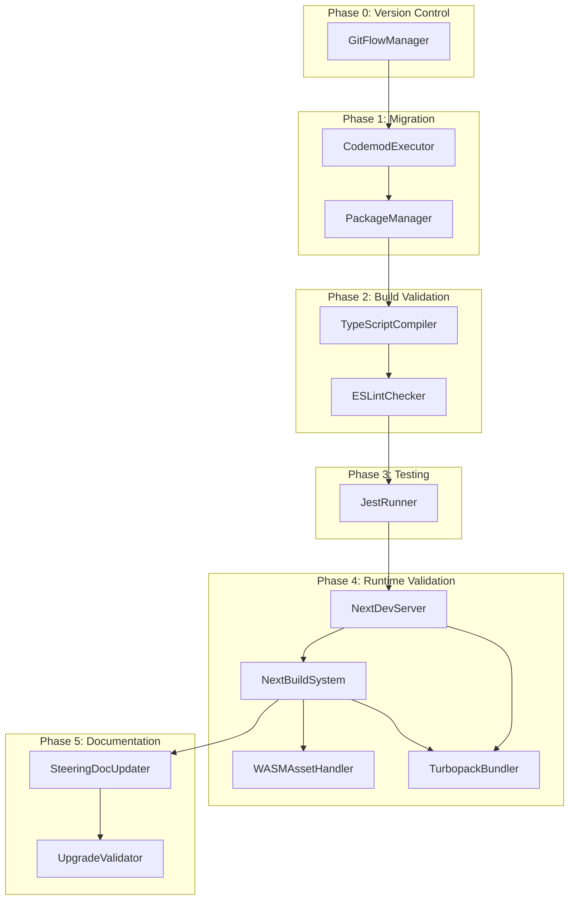
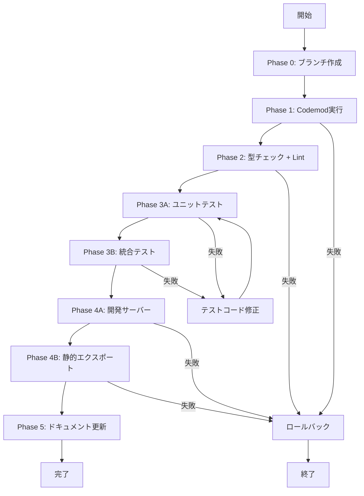
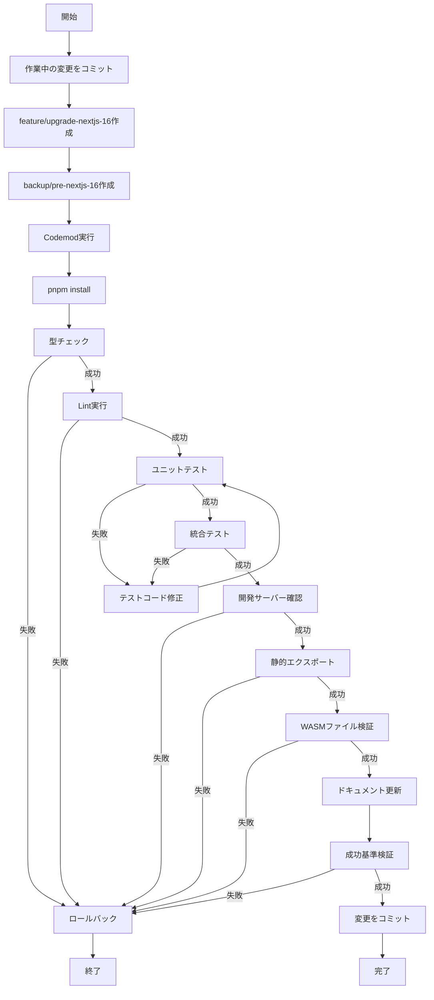

# 技術設計書

## Overview

本設計は、LINE Reversi ミニアプリを Next.js 15.5.6 → 16.0.4 および React 18.3.1 → 19.2.x へアップグレードするための技術的アプローチを定義します。静的エクスポート構成を維持しながら、公式 Codemod による自動マイグレーション、段階的な検証、既存テストスイートの実行を通じて、新機能とパフォーマンス改善を安全に適用します。

**対象ユーザー**: 開発者が最新の Next.js および React のパフォーマンス改善とセキュリティアップデートを活用できるようにします。

**影響範囲**: 依存関係の更新、破壊的変更への対応、既存テストの実行による互換性検証。アプリケーションロジックやアーキテクチャは変更しません。

### Goals

- Next.js 16.0.4 および React 19.2.x へのメジャーバージョンアップグレード
- 静的エクスポート構成（`output: 'export'`）とWASMアセットハンドリングの維持
- 既存テストスイート（51ユニット + 11統合）の成功による互換性検証
- Turbopack によるビルド時間短縮（30-50%）とルーティング最適化の活用
- 公式 Codemod による破壊的変更の自動修正

### Non-Goals

- E2Eテストの追加・変更・実行（既存11ファイルはスコープ外）
- 新規テストの実装（既存テストの実行のみ）
- LIFFプラットフォームでの検証
- アプリケーション機能の追加
- アーキテクチャパターンの変更
- LIFF SDK のバージョンアップ

## Architecture

### Existing Architecture Analysis

現在のプロジェクトは以下の構成で運用されています：

- **静的エクスポート**: `output: 'export'` による SSG アプローチ（CDN最適化）
- **WASMアセット**: `/public/ai.wasm` および `/public/ai.js` を静的アセットとして配信
- **Web Workers**: AI処理をバックグラウンドスレッドで実行（UIブロッキング防止）
- **LIFF統合**: `@line/liff` 直接使用（ラッパーライブラリなし）
- **テスト構成**: Jest + React Testing Library（90%+カバレッジ）+ Playwright E2E
- **ビルドツール**: Next.js 15 デフォルトバンドラー（webpack）

### Architecture Pattern & Boundary Map



**Key Decisions**:

- **Sequential Validation**: 各フェーズを順次実行し、早期失敗検出を実現（Type → Lint → Test → Runtime）
- **Existing Test Leverage**: 新規テスト実装を行わず、既存テストスイートで React 19 互換性を検証
- **Official Codemod First**: 公式自動マイグレーションツールを最優先し、手動変更を最小化
- **Domain Boundary Preservation**: 既存のドメイン構造（`/lib/game`, `/lib/ai`, `/lib/liff`）を維持

### Technology Stack

| Layer            | Choice / Version                         | Role in Feature      | Notes                                       |
| ---------------- | ---------------------------------------- | -------------------- | ------------------------------------------- |
| **Build System** | Next.js 16.0.4                           | メインフレームワーク | React 19.2.x必須、Turbopackデフォルト有効化 |
| **Build System** | React 19.2.x                             | UIライブラリ         | 並行レンダリング改善、Strict Mode強化       |
| **Build System** | Turbopack                                | デフォルトバンドラー | ビルド時間30-50%短縮、Fast Refresh高速化    |
| **Build System** | TypeScript 5.x                           | 型チェック           | strict モード維持、React 19型定義対応       |
| **Build System** | ESLint + Next.js config                  | Lint実行             | Next.js 16ルール適用                        |
| **Testing**      | Jest 30.x + React Testing Library 16.3.0 | テストランナー       | React 19互換性あり、既存テスト実行          |
| **Migration**    | `@next/codemod@canary`                   | 自動マイグレーション | 公式ツール、破壊的変更自動修正              |
| **Runtime**      | Node.js 24.9.0                           | 開発環境             | Next.js 16最小要件20.9.0を満たす            |
| **Runtime**      | Static HTML/JS/WASM                      | 本番環境             | 静的エクスポート維持                        |

**Supporting References**: 詳細な調査結果は `research.md` を参照

## System Flows

### Sequential Upgrade Flow



**Key Flow Decisions**:

- **Early Type Check**: 型エラーを実行時テストより先に検出
- **Test-Driven Verification**: テスト失敗時はテストコードのみ修正、ロジックは変更しない
- **WASM Verification in Build**: 静的エクスポート時に `out/ai.wasm` と `out/ai.js` の存在を確認

## Requirements Traceability

| Requirement | Summary                             | Components                                          | Interfaces            | Flows            |
| ----------- | ----------------------------------- | --------------------------------------------------- | --------------------- | ---------------- |
| 1           | 依存関係のバージョン更新            | CodemodExecutor, PackageManager                     | Codemod CLI, pnpm API | Phase 1          |
| 2           | 公式 Codemod によるマイグレーション | CodemodExecutor                                     | Codemod CLI           | Phase 1          |
| 3           | 型チェックの互換性検証              | TypeScriptCompiler                                  | tsc CLI               | Phase 2          |
| 4           | ビルド検証                          | NextBuildSystem, WASMAssetHandler, TurbopackBundler | Next.js Build API     | Phase 4B         |
| 5           | 開発サーバーの動作検証              | NextDevServer, TurbopackBundler                     | Next.js Dev API       | Phase 4A         |
| 6           | ユニットテストの互換性維持          | JestRunner                                          | Jest CLI              | Phase 3A         |
| 7           | 統合テストの互換性維持              | JestRunner                                          | Jest CLI              | Phase 3B         |
| 10          | ドキュメントの更新                  | SteeringDocUpdater                                  | File System API       | Phase 5          |
| 11          | パフォーマンスの確認                | TurbopackBundler, NextBuildSystem                   | Turbopack API         | Phase 4          |
| 12          | 成功基準の検証                      | UpgradeValidator                                    | 全コンポーネント      | Phase 5          |
| 8           | コード品質の維持                    | ESLintChecker                                       | ESLint CLI            | Phase 2          |
| 9           | Git リポジトリの管理                | GitFlowManager                                      | Git CLI               | Phase 0, Phase 5 |

## Components and Interfaces

### Components Summary

| Component          | Layer           | Key Responsibility   | Phase |
| ------------------ | --------------- | -------------------- | ----- |
| CodemodExecutor    | Migration       | 公式Codemod実行      | 1     |
| PackageManager     | Build System    | 依存関係インストール | 1     |
| TypeScriptCompiler | Build System    | 型チェック実行       | 2     |
| ESLintChecker      | Build System    | Lint実行             | 2     |
| JestRunner         | Testing         | 既存テスト実行       | 3     |
| NextDevServer      | Runtime         | 開発サーバー起動     | 4     |
| NextBuildSystem    | Runtime         | 静的エクスポート     | 4     |
| WASMAssetHandler   | Runtime         | WASM検証             | 4     |
| TurbopackBundler   | Build System    | デフォルトバンドラー | 4     |
| GitFlowManager     | Version Control | ブランチ管理         | 0     |
| SteeringDocUpdater | Documentation   | ドキュメント更新     | 5     |
| UpgradeValidator   | Validation      | 成功基準検証         | 5     |

---

### Migration Layer

#### CodemodExecutor

| Field        | Detail                                                         |
| ------------ | -------------------------------------------------------------- |
| Intent       | Next.js公式Codemodを実行し、package.jsonと破壊的変更を自動修正 |
| Requirements | 1, 2                                                           |

**Responsibilities & Constraints**

- `npx @next/codemod@canary upgrade latest` コマンド実行
- package.json の Next.js と React バージョン更新の自動適用
- 破壊的変更（Async Request APIs、Image API等）の自動修正
- Codemod実行成功時は標準出力ログを記録
- 該当する破壊的変更がない場合もバージョン更新を実行

**Dependencies**

- External: `@next/codemod@canary` — 公式マイグレーションツール (P0)
- Outbound: PackageManager — 依存関係再インストールトリガー (P0)

**Contracts**: Batch [x]

##### Batch Contract

- **Trigger**: Phase 1開始時に1回実行
- **Input**: プロジェクトルートディレクトリパス
- **Validation**: コマンド終了コード0を確認
- **Output**: 更新されたpackage.json、修正されたソースファイル
- **Idempotency**: 同じバージョンへの再実行は冪等

**Implementation Notes**

- **Integration**: Git作業ディレクトリで実行、変更をコミット前に検証
- **Validation**: Codemod実行後にgit diffで変更内容を確認
- **Risks**: Codemodが未知の破壊的変更を見逃す可能性（低リスク: 静的エクスポート構成により多くの変更が非該当）

#### PackageManager

| Field        | Detail                                                       |
| ------------ | ------------------------------------------------------------ |
| Intent       | pnpmを使用して依存関係をインストールし、ロックファイルを更新 |
| Requirements | 1, 2                                                         |

**Responsibilities & Constraints**

- `pnpm install` 実行による依存関係ツリーの解決
- `pnpm-lock.yaml` の整合性保持
- devDependencies の型定義パッケージ更新（`@types/react`, `@types/react-dom`）
- インストール失敗時のエラーログ出力

**Dependencies**

- Inbound: CodemodExecutor — package.json更新後にトリガー (P0)
- External: pnpm 9.x — パッケージマネージャー (P0)

**Contracts**: Batch [x]

##### Batch Contract

- **Trigger**: CodemodExecutor完了後に1回実行
- **Input**: 更新されたpackage.json
- **Validation**: `pnpm install` 終了コード0、`node_modules` ディレクトリ存在確認
- **Output**: `pnpm-lock.yaml`, `node_modules/` ディレクトリ
- **Idempotency**: 同じpackage.jsonに対する再実行は冪等

**Implementation Notes**

- **Integration**: CI環境では `pnpm install --frozen-lockfile` を使用
- **Validation**: インストール後に `pnpm list` で依存関係ツリーを確認
- **Risks**: レジストリ障害時の失敗（ミティゲーション: pnpmキャッシュ活用）

---

### Build System Layer

#### TypeScriptCompiler

| Field        | Detail                                                            |
| ------------ | ----------------------------------------------------------------- |
| Intent       | strict モードで型チェックを実行し、React 19型定義との互換性を検証 |
| Requirements | 3                                                                 |

**Responsibilities & Constraints**

- `pnpm type-check` (= `tsc --noEmit`) 実行
- `tsconfig.json` の `strict: true` 設定維持
- LIFF SDK型定義と React 19型定義の互換性検証
- 型エラー発生時は詳細なエラーメッセージを出力

**Dependencies**

- Inbound: PackageManager — 依存関係インストール完了後にトリガー (P0)
- External: TypeScript 5.x — コンパイラ (P0)
- External: `@types/react` 19.x, `@types/react-dom` 19.x — 型定義 (P0)

**Contracts**: Batch [x]

##### Batch Contract

- **Trigger**: Phase 2開始時に1回実行
- **Input**: TypeScriptソースファイル、型定義ファイル
- **Validation**: tsc終了コード0、エラー出力なし
- **Output**: 型チェック成功ログ（`--noEmit` のためビルド成果物なし）
- **Idempotency**: 同じソースに対する再実行は冪等

**Implementation Notes**

- **Integration**: CI環境ではTypeScriptバージョンを固定
- **Validation**: 既存の全TypeScriptファイルで型エラーが発生しないこと確認
- **Risks**: LIFF SDK型定義がReact 19と互換性がない場合（低リスク: LIFFはフレームワーク非依存）

#### ESLintChecker

| Field        | Detail                                     |
| ------------ | ------------------------------------------ |
| Intent       | Next.js 16のESLintルールでコード品質を検証 |
| Requirements | 8                                          |

**Responsibilities & Constraints**

- `pnpm lint` 実行（ESLint + Prettier統合）
- Next.js 16のESLint設定（`eslint-config-next`）適用
- Prettierフォーマットルール準拠確認
- Lintエラー発生時は修正提案を出力

**Dependencies**

- Inbound: TypeScriptCompiler — 型チェック成功後にトリガー (P0)
- External: ESLint 8.x, `eslint-config-next` 16.x — Lintツール (P0)
- External: Prettier 3.x — フォーマッター (P1)

**Contracts**: Batch [x]

##### Batch Contract

- **Trigger**: Phase 2で型チェック成功後に1回実行
- **Input**: JavaScriptおよびTypeScriptソースファイル
- **Validation**: ESLint終了コード0、エラー出力なし
- **Output**: Lint成功ログ
- **Idempotency**: 同じソースに対する再実行は冪等

**Implementation Notes**

- **Integration**: Huskyとlint-stagedによるpre-commitフック動作確認
- **Validation**: 既存のコーディング規約維持
- **Risks**: Next.js 16でESLintルールが追加され既存コードが違反（ミティゲーション: 自動修正 `--fix` 適用）

#### TurbopackBundler

| Field        | Detail                                                    |
| ------------ | --------------------------------------------------------- |
| Intent       | Next.js 16のデフォルトバンドラーとしてビルドとHMRを高速化 |
| Requirements | 4, 5, 11                                                  |

**Responsibilities & Constraints**

- Next.js 16でデフォルト有効化（`--turbopack` フラグ不要）
- 開発サーバーのFast Refresh高速化（最大10倍）
- 本番ビルド時間短縮（30-50%）
- `/public` ディレクトリの静的アセット自動配信

**Dependencies**

- Inbound: NextDevServer, NextBuildSystem — ビルドエンジンとして使用される (P0)
- External: Turbopack（Next.js 16内蔵） — バンドラー (P0)

**Contracts**: Service [x]

##### Service Interface

```typescript
interface TurbopackBundler {
  bundleDevelopment(): Promise<void>; // 開発サーバー用バンドル
  bundleProduction(): Promise<BuildOutput>; // 本番ビルド
  handleHMR(change: FileChange): Promise<void>; // Hot Module Replacement
}
```

- **Preconditions**: Next.js設定ファイルが有効
- **Postconditions**: バンドル成果物がメモリまたは`/out`に生成
- **Invariants**: Turbopackはwebpackと異なるカスタム設定をサポートしない（本プロジェクトでは該当なし）

**Implementation Notes**

- **Integration**: カスタムwebpack設定が存在しないため移行スムーズ
- **Validation**: ビルド時間をNext.js 15と比較（30-50%短縮期待）
- **Risks**: Turbopack未対応の機能を使用している場合（該当なし: 本プロジェクトは標準機能のみ）

---

### Testing Layer

#### JestRunner

| Field        | Detail                                                       |
| ------------ | ------------------------------------------------------------ |
| Intent       | 既存のユニットおよび統合テストを実行し、React 19互換性を検証 |
| Requirements | 6, 7                                                         |

**Responsibilities & Constraints**

- Phase 3A: `pnpm test:unit` 実行（51ユニットテストファイル）
- Phase 3B: `pnpm test:integration` 実行（11統合テストファイル）
- テストカバレッジ90%以上維持
- テスト失敗時はテストコードのみ更新（アプリケーションロジックは変更しない）
- React 19 Strict Modeの影響を検出（useEffect二重実行等）

**Dependencies**

- Inbound: ESLintChecker — Lint成功後にトリガー (P0)
- External: Jest 30.2.0 — テストランナー (P0)
- External: React Testing Library 16.3.0 — React 19互換テストユーティリティ (P0)
- External: `@line/liff-mock` — LIFF SDK モック (P1)

**Contracts**: Service [x]

##### Service Interface

```typescript
interface JestRunner {
  runUnitTests(): Promise<TestResult>; // 51ユニットテスト実行
  runIntegrationTests(): Promise<TestResult>; // 11統合テスト実行
  getCoverage(): Promise<CoverageReport>; // カバレッジレポート取得
}

interface TestResult {
  success: boolean;
  totalTests: number;
  passedTests: number;
  failedTests: TestFailure[];
}
```

- **Preconditions**: 依存関係インストール完了、ソースコード型チェック成功
- **Postconditions**: 全テスト成功、カバレッジ90%以上
- **Invariants**: テスト失敗時はReact 19またはNext.js 16のAPI変更が原因

**Implementation Notes**

- **Integration**: WASM統合テストでは `HEAP` ビューの初期化が必要（既存実装で対応済み）
- **Validation**: React Testing Library 16.3.0はReact 19と互換性あり（要確認: 既存テストのレンダリングAPI使用箇所）
- **Risks**: React 19 Strict Modeでクリーンアップ関数の実行が厳格化され、既存テストが失敗する可能性（ミティゲーション: LiffProviderは既にisMountedフラグパターン実装済み）

---

### Runtime Layer

#### NextDevServer

| Field        | Detail                                                     |
| ------------ | ---------------------------------------------------------- |
| Intent       | Next.js 16開発サーバーを起動し、LIFF初期化とWASM動作を検証 |
| Requirements | 5                                                          |

**Responsibilities & Constraints**

- `pnpm dev` 実行（`next dev`）
- `http://localhost:3000` でアクセス可能
- Turbopackによる高速なFast Refresh動作
- ゲーム盤面の正常表示とLIFF初期化処理の実行確認
- コンソールエラーなし

**Dependencies**

- Inbound: JestRunner — テスト成功後にトリガー (P0)
- Outbound: TurbopackBundler — バンドルエンジン (P0)
- External: Next.js 16 Dev Server — 開発ランタイム (P0)

**Contracts**: Service [x]

##### Service Interface

```typescript
interface NextDevServer {
  start(port: number): Promise<ServerInstance>;
  stop(): Promise<void>;
  checkHealth(): Promise<HealthStatus>;
}

interface HealthStatus {
  accessible: boolean;
  consoleErrors: string[];
  liffInitialized: boolean;
  wasmLoaded: boolean;
}
```

- **Preconditions**: 静的アセット（`/public/ai.wasm`, `/public/ai.js`）が存在
- **Postconditions**: サーバー起動、Fast Refresh動作、エラーなし
- **Invariants**: Turbopackがデフォルトで使用される

**Implementation Notes**

- **Integration**: ブラウザでページアクセス後、Reactコンポーネントのマウント確認
- **Validation**: コンソールエラー監視（React 19 Strict Modeの警告含む）
- **Risks**: LIFF SDKがReact 19で予期しないエラーを発生（低リスク: フレームワーク非依存API）

#### NextBuildSystem

| Field        | Detail                                              |
| ------------ | --------------------------------------------------- |
| Intent       | 静的エクスポートを実行し、`out/` ディレクトリを生成 |
| Requirements | 4                                                   |

**Responsibilities & Constraints**

- `pnpm build` 実行（`next build`）
- `output: 'export'` 設定による静的HTMLとJavaScript生成
- `/out` ディレクトリへのビルド成果物出力
- ビルド時の警告やエラーなし

**Dependencies**

- Inbound: NextDevServer — 開発サーバー検証後にトリガー (P0)
- Outbound: TurbopackBundler — 本番バンドル実行 (P0)
- Outbound: WASMAssetHandler — WASMファイルコピー検証 (P0)
- External: Next.js 16 Build System — ビルドランタイム (P0)

**Contracts**: Batch [x]

##### Batch Contract

- **Trigger**: Phase 4Bで1回実行
- **Input**: Next.jsソースコード、静的アセット
- **Validation**: ビルド終了コード0、`/out` ディレクトリ存在、警告なし
- **Output**: `/out` ディレクトリ（HTML、JS、CSS、WASM）
- **Idempotency**: 同じソースに対する再ビルドは冪等

**Implementation Notes**

- **Integration**: `next.config.ts` の `output: 'export'` 設定を確認
- **Validation**: ビルドログで静的エクスポートモードが有効であることを確認
- **Risks**: Turbopackが静的エクスポートで予期しない動作（低リスク: Next.js 16で公式サポート）

#### WASMAssetHandler

| Field        | Detail                                       |
| ------------ | -------------------------------------------- |
| Intent       | 静的エクスポート後のWASMファイルコピーを検証 |
| Requirements | 4                                            |

**Responsibilities & Constraints**

- `/public/ai.wasm` が `/out/ai.wasm` へコピーされたことを検証
- `/public/ai.js` が `/out/ai.js` へコピーされたことを検証
- ファイルサイズと内容の一致確認
- コピー失敗時はエラーを報告

**Dependencies**

- Inbound: NextBuildSystem — ビルド完了後にトリガー (P0)
- External: File System API — ファイル読み取り (P0)

**Contracts**: Batch [x]

##### Batch Contract

- **Trigger**: NextBuildSystem完了後に1回実行
- **Input**: `/out` ディレクトリパス
- **Validation**: `out/ai.wasm` および `out/ai.js` の存在確認
- **Output**: 検証成功ログまたはエラーメッセージ
- **Idempotency**: 同じビルド成果物に対する再検証は冪等

**Implementation Notes**

- **Integration**: TurbopackはNext.js 16で `/public` ディレクトリを自動配信（WASM含む）
- **Validation**: ファイルサイズ比較で完全性を確認
- **Risks**: Turbopackがカスタムアセットコピーをサポートしない場合（該当なし: `/public` は標準パターン）

---

### Version Control Layer

#### GitFlowManager

| Field        | Detail                                         |
| ------------ | ---------------------------------------------- |
| Intent       | Git Flowブランチ戦略でアップグレード作業を管理 |
| Requirements | 9                                              |

**Responsibilities & Constraints**

- Phase 0: 作業中の変更をコミット、フィーチャーブランチ作成
- `git flow feature start upgrade-nextjs-16` 実行
- バックアップブランチ `backup/pre-nextjs-16` 作成
- Phase 5: Semantic Commit Message形式でコミット作成
- ロールバック時の `git reset --hard` サポート

**Dependencies**

- External: Git CLI — バージョン管理 (P0)
- External: Git Flow — ブランチ管理拡張 (P1)

**Contracts**: Service [x]

##### Service Interface

```typescript
interface GitFlowManager {
  commitChanges(message: string): Promise<void>;
  createFeatureBranch(name: string): Promise<void>;
  createBackupBranch(name: string): Promise<void>;
  rollback(commitHash: string): Promise<void>;
}
```

- **Preconditions**: Gitリポジトリが初期化済み
- **Postconditions**: フィーチャーブランチでの作業、変更履歴記録
- **Invariants**: `main` ブランチへの直接コミット禁止

**Implementation Notes**

- **Integration**: GitHub Flowとの統合（`git flow feature publish` でリモートプッシュ）
- **Validation**: コミットメッセージがSemantic Commit形式に準拠
- **Risks**: なし（標準Git操作）

---

### Documentation Layer

#### SteeringDocUpdater

| Field        | Detail                                         |
| ------------ | ---------------------------------------------- |
| Intent       | ステアリングドキュメントのバージョン番号を更新 |
| Requirements | 10                                             |

**Responsibilities & Constraints**

- `.specify/steering/tech.md` のNext.jsバージョン番号を 16.x に更新
- `.specify/steering/tech.md` のReactバージョン番号を 19.x に更新
- 変更内容をGitコミットメッセージに記録
- 破壊的変更への対応内容を記載

**Dependencies**

- Inbound: NextBuildSystem — ビルド成功後にトリガー (P0)
- External: File System API — ファイル書き込み (P0)

**Contracts**: Batch [x]

##### Batch Contract

- **Trigger**: Phase 5開始時に1回実行
- **Input**: `.specify/steering/tech.md` ファイルパス
- **Validation**: ファイル内容の正規表現マッチでバージョン番号更新確認
- **Output**: 更新されたtech.mdファイル
- **Idempotency**: 同じバージョンへの再更新は冪等

**Implementation Notes**

- **Integration**: Gitコミットに含めて記録
- **Validation**: tech.mdのMarkdown構文が壊れていないことを確認
- **Risks**: なし（単純なテキスト置換）

#### UpgradeValidator

| Field        | Detail                           |
| ------------ | -------------------------------- |
| Intent       | アップグレード成功基準の最終検証 |
| Requirements | 12                               |

**Responsibilities & Constraints**

- 全パッケージがNext.js 16.x + React 19.xに更新されていることを確認
- `pnpm build` 成功を検証
- `pnpm dev` 起動成功を検証
- `out/` ディレクトリ生成を検証
- `pnpm type-check` 成功を検証
- `pnpm lint` 成功を検証
- 全ユニットテスト成功を検証
- 全統合テスト成功を検証
- テストカバレッジ90%以上を検証
- コンソールエラーなしを検証

**Dependencies**

- Inbound: SteeringDocUpdater — ドキュメント更新後にトリガー (P0)
- Outbound: 全コンポーネント — 各検証項目のステータス確認 (P0)

**Contracts**: Service [x]

##### Service Interface

```typescript
interface UpgradeValidator {
  validateAll(): Promise<ValidationReport>;
}

interface ValidationReport {
  allCriteriaMet: boolean;
  criteriaResults: Record<string, boolean>;
  errors: string[];
}
```

- **Preconditions**: 全フェーズが完了
- **Postconditions**: 成功基準の全項目が満たされている
- **Invariants**: 1項目でも失敗した場合は全体を失敗として扱う

**Implementation Notes**

- **Integration**: 各コンポーネントの実行結果を集約
- **Validation**: package.jsonのバージョン番号、テストカバレッジレポート、ビルド成果物の存在確認
- **Risks**: なし（検証ロジックのみ）

## Testing Strategy

### Principle

本アップグレードでは**新規テスト実装を行わず、既存テストスイートの実行により React 19 および Next.js 16 との互換性を検証**します。

### Existing Test Inventory

- **ユニットテスト**: 51ファイル（`*.test.ts`, `*.test.tsx`、`*.integration.test.*` を除外）
- **統合テスト**: 11ファイル（`*.integration.test.ts`, `*.integration.test.tsx`）
- **E2Eテスト**: 11ファイル（Playwright、**スコープ外**）

### Phase 3A: Unit Tests

**実行コマンド**: `pnpm test:unit`

**対象範囲**:

- ゲームロジック（`/lib/game`）
- AIエンジン（`/lib/ai` - 非統合テスト）
- LIFF型定義（`/lib/liff`）
- React Hooks（`/hooks`）
- React Components（`/components` - 非統合テスト）
- React Contexts（`/contexts`）

**期待結果**:

- 全51ユニットテストが成功
- テストカバレッジ90%以上維持
- React Testing Library 16.3.0がReact 19と互換性あり

**想定される失敗パターンと対応**:

- React 19 Strict ModeによるuseEffect二重実行警告 → テストコードでクリーンアップ関数を確認
- React 19 型定義変更による型エラー → テストコードの型アサーションを更新
- LIFF型定義と React 19型定義の不整合 → 型定義のインポート方法を調整

### Phase 3B: Integration Tests

**実行コマンド**: `pnpm test:integration`

**対象範囲**:

- WASM統合テスト（`/lib/ai/*integration.test.ts`）
- Reactコンポーネント統合テスト（`/components/*integration.test.tsx`）

**期待結果**:

- 全11統合テストが成功
- WASM + Web Workers + React統合動作確認
- React 19並行レンダリングとの互換性確認

**想定される失敗パターンと対応**:

- React 19並行レンダリング変更によるタイミング問題 → `waitFor` タイムアウト調整
- WASM初期化タイミングの変更 → テストのsetup/teardownを調整

### Test Update Policy

**テスト失敗時の修正方針**:

1. **アプリケーションロジックは変更しない** — テストコードのみ更新
2. **React 19/Next.js 16のAPI変更が原因であることを確認** — 公式ドキュメントで検証
3. **最小限の変更** — 失敗したテストケースのみ修正
4. **コメント記載** — 修正理由をテストコード内に記録

**E2Eテストの扱い**:

- **スコープ外** — 実行しない、更新しない、追加しない
- 理由: LIFFプラットフォームでの検証が必要（本アップグレードの範囲外）

### Manual Verification

**Phase 4A: 開発サーバー起動確認**:

- ゲーム盤面が正常に表示されることを目視確認
- ブラウザコンソールでエラーがないことを確認
- Fast Refreshが正常に動作することを確認

**Phase 4B: 静的エクスポート確認**:

- `ls -la out/ai.wasm out/ai.js` でファイル存在確認
- ファイルサイズが `/public` と一致することを確認

## Error Handling

### Error Strategy

各フェーズで失敗時の明確な対応を定義し、早期失敗検出によりロールバックを容易にします。

### Error Categories and Responses

**Phase 1: Migration Errors**

- Codemod実行失敗 → エラーログを確認し、手動でpackage.json更新を検討、ロールバック
- 依存関係解決失敗 → pnpmキャッシュクリア（`pnpm store prune`）後に再試行、失敗時はロールバック

**Phase 2: Build Validation Errors**

- 型チェック失敗 → 型エラーの詳細を確認、LIFF型定義の互換性を調査、必要に応じて型アサーションを追加、重大な問題時はロールバック
- Lintエラー → `eslint --fix` で自動修正、修正不可能な場合は手動調整、Next.js 16の新ルールを確認

**Phase 3: Testing Errors**

- ユニットテスト失敗 → React 19のStrict Mode変更を確認、テストコードのクリーンアップ関数を修正
- 統合テスト失敗 → React Testing Libraryのタイミング調整、WASM初期化パターンを確認、アプリケーションロジックは変更しない

**Phase 4: Runtime Errors**

- 開発サーバー起動失敗 → Turbopack関連エラーを確認、静的アセット配置を検証、ロールバック
- 静的エクスポート失敗 → ビルドログを確認、WASMファイルコピーを検証、ロールバック
- WASMファイル検証失敗 → `/public` ディレクトリの内容を確認、Turbopack設定を検証、ロールバック

**Phase 5: Documentation/Validation Errors**

- ステアリングドキュメント更新失敗 → ファイルパスと権限を確認、手動修正
- 成功基準検証失敗 → 未達成の基準項目を確認、該当フェーズを再実行

### Monitoring

**Execution Logs**

- 各フェーズの標準出力とエラー出力を記録
- コマンド終了コードをチェック（0以外は失敗）

**Validation Checkpoints**

- Phase 1: package.json差分確認
- Phase 2: tscとeslintのエラー件数
- Phase 3: Jestテスト結果サマリー
- Phase 4: ブラウザコンソールログ、ビルド成果物リスト
- Phase 5: 成功基準チェックリスト

## Migration Strategy



### Phase Breakdown

**Phase 0: Version Control Setup**

- 現在の作業をコミット
- `git flow feature start upgrade-nextjs-16` 実行
- `git branch backup/pre-nextjs-16` でバックアップ作成

**Phase 1: Automated Migration**

- `npx @next/codemod@canary upgrade latest` 実行
- `pnpm install` で依存関係更新
- `git diff` で変更内容確認

**Phase 2: Build Validation**

- `pnpm type-check` 実行
- `pnpm lint` 実行
- エラーなく完了することを確認

**Phase 3: Test Execution**

- `pnpm test:unit` 実行
- `pnpm test:integration` 実行
- 失敗時はテストコードのみ修正して再実行

**Phase 4: Runtime Validation**

- `pnpm dev` で開発サーバー起動、ブラウザ確認
- `pnpm build` で静的エクスポート実行
- `out/ai.wasm` と `out/ai.js` の存在確認

**Phase 5: Documentation & Validation**

- `.specify/steering/tech.md` のバージョン番号更新
- 成功基準の全項目を検証
- `git commit` で変更をコミット

### Rollback Triggers

以下の条件でロールバックを実行：

- Phase 1: Codemodまたはpnpm installが失敗
- Phase 2: 型チェックまたはLintが失敗し、修正が困難
- Phase 3: テスト失敗が React 19/Next.js 16 のAPI変更以外に起因
- Phase 4: 開発サーバー起動失敗、ビルド失敗、WASMファイル検証失敗
- Phase 5: 成功基準の重要項目が未達成

### Validation Checkpoints

**Phase 1完了時**:

- package.json の Next.js と React バージョン確認
- pnpm-lock.yaml が更新されていることを確認

**Phase 2完了時**:

- `tsc --noEmit` が終了コード0
- `pnpm lint` が終了コード0

**Phase 3完了時**:

- 全ユニットテスト成功
- 全統合テスト成功
- カバレッジレポートで90%以上維持

**Phase 4完了時**:

- 開発サーバーが `http://localhost:3000` でアクセス可能
- `out/` ディレクトリに静的ファイル生成
- `out/ai.wasm` および `out/ai.js` が存在

**Phase 5完了時**:

- tech.md のバージョン番号が更新済み
- 成功基準の全10項目が満たされている

## Performance & Scalability

### Target Metrics

**Build Performance**:

- 静的エクスポート時間: 30-50%短縮（Turbopack効果）
- Fast Refresh時間: 最大10倍高速化
- 初回ビルド時間: Next.js 15との比較測定

**Runtime Performance**:

- 初期ロード時間: 2秒未満維持（SSGによるsub-2-second目標）
- AI処理の非ブロッキング動作: Web Workerにより維持
- Prefetch効率: Next.js 16のルーティング最適化により向上

### Measurement Strategy

**Before/After Comparison**:

- Next.js 15でのビルド時間を記録
- Next.js 16でのビルド時間を記録
- 差分を計算してパフォーマンス改善を確認

**Continuous Monitoring**:

- CI環境でビルド時間を記録
- 開発環境でFast Refresh速度を体感確認

### Optimization Techniques

- Turbopackによる自動最適化（設定不要、デフォルト有効）
- 静的エクスポートによるCDN配信（既存パターン維持）
- WASMバイナリの圧縮配信（既存パターン維持）

## Security Considerations

### Dependency Updates

- Next.js 16 および React 19 のセキュリティアップデート適用
- 依存関係の脆弱性スキャン（`pnpm audit`）実行
- 既知の脆弱性が修正されていることを確認

### Static Export Security

- 静的ファイル配信のため、サーバーサイドの脆弱性リスクなし
- CSP（Content Security Policy）設定は既存のまま維持
- LIFF SDKのセキュリティパッチ適用状況を確認（本アップグレードではバージョン変更なし）

### Type Safety

- TypeScript strict モードによる型安全性維持
- `any` 型を使用せず、明示的な型定義を維持
- LIFF SDK型定義の安全性確認

## Supporting References

### Research Document

詳細な調査結果と設計決定の根拠は以下を参照：

- `research.md` — Next.js 16/React 19互換性調査、Turbopack/WASM検証、LIFF SDK互換性、破壊的変更分析、設計決定の詳細

### Official Documentation

- [Next.js 16 Release Blog](https://nextjs.org/blog/next-16)
- [Next.js 16 Upgrade Guide](https://nextjs.org/docs/app/guides/upgrading/version-16)
- [React 19 StrictMode Reference](https://react.dev/reference/react/StrictMode)
