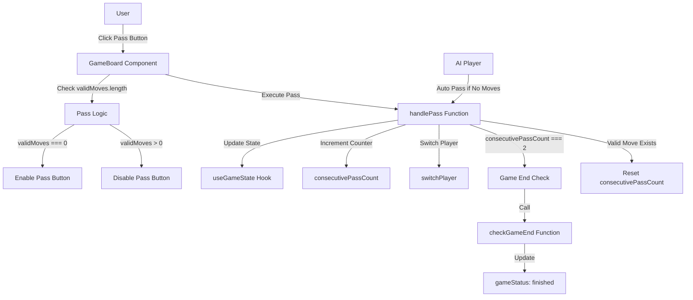
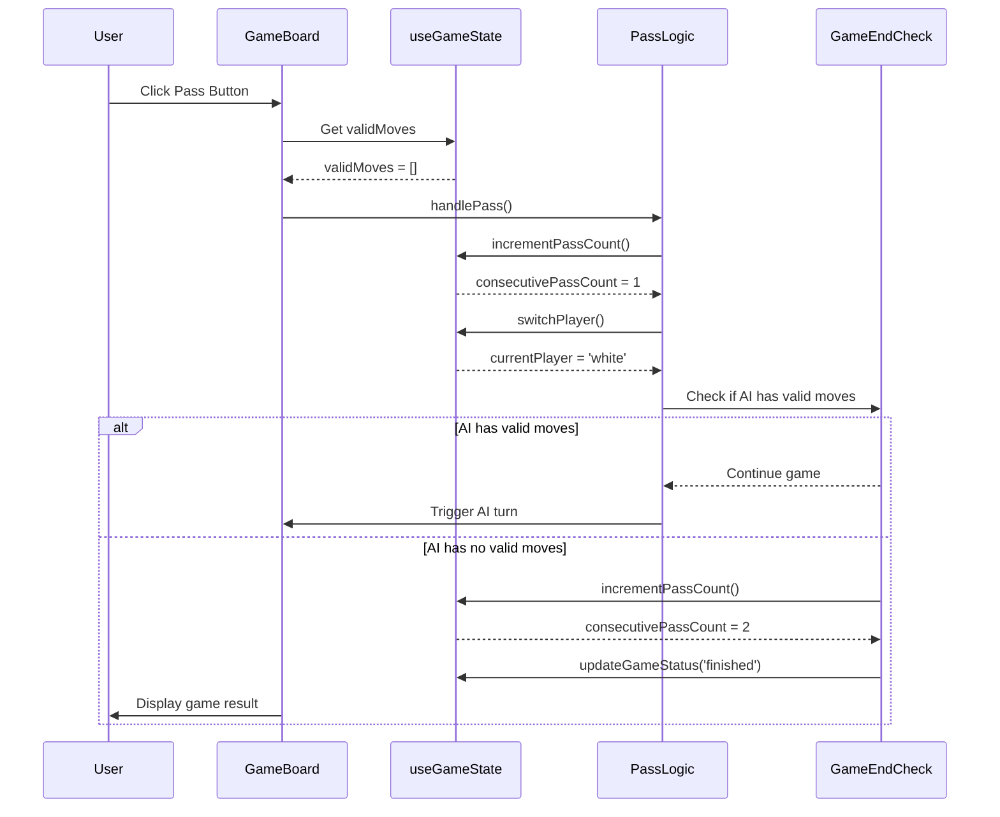
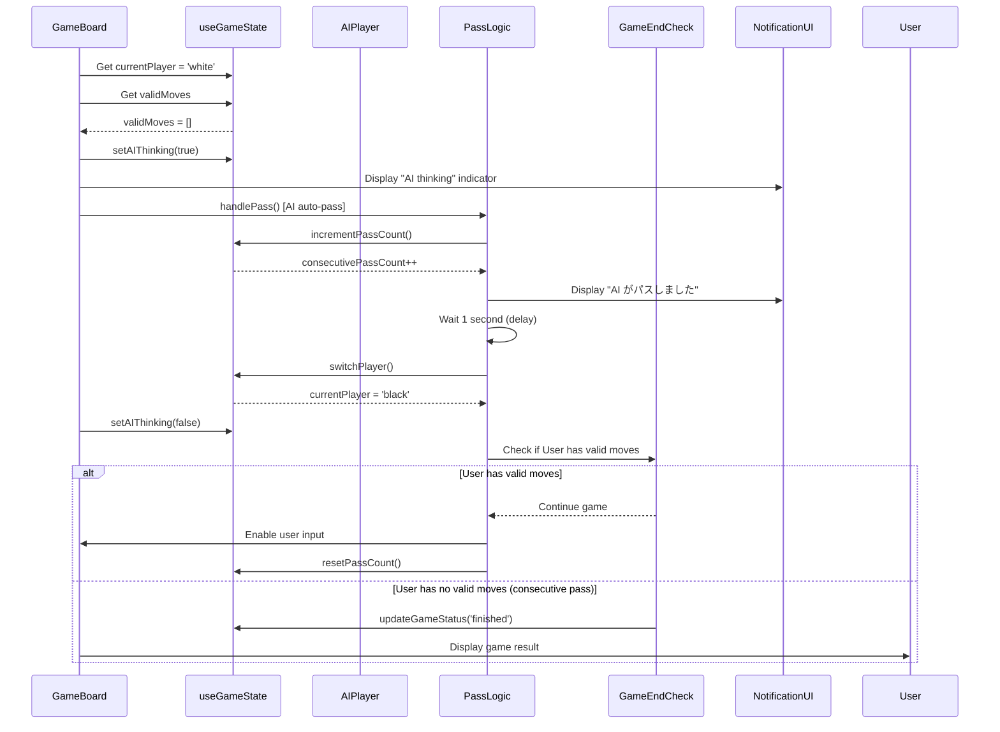
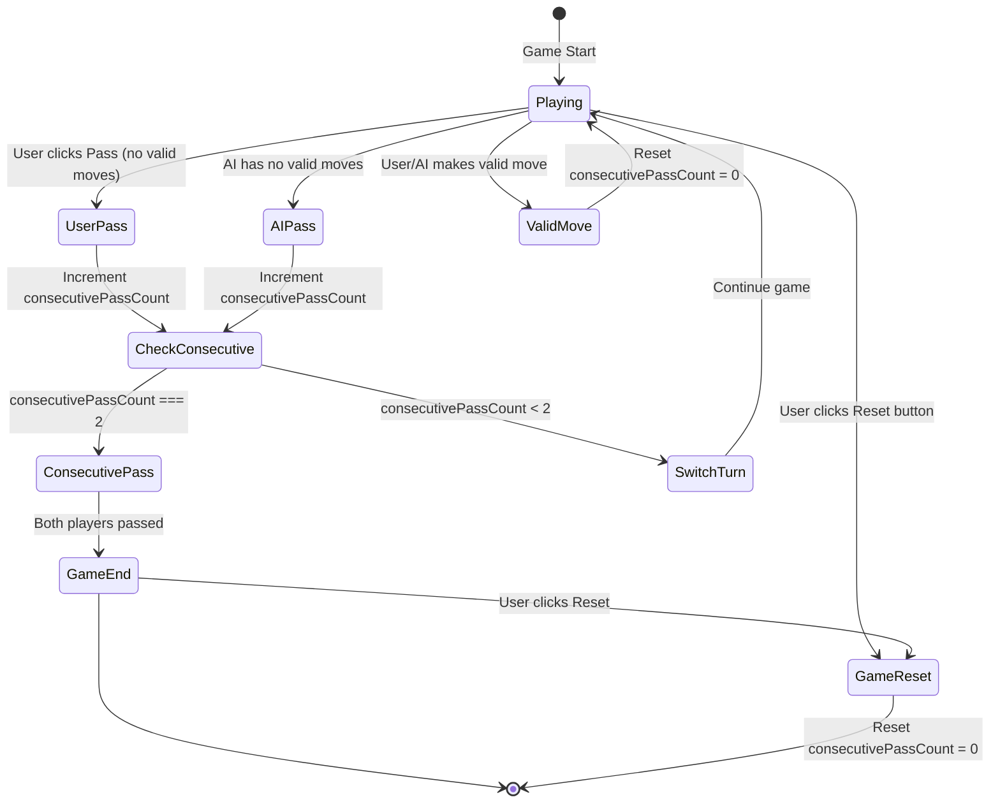

# 設計ドキュメント

## Overview

ユーザプレーヤーが有効な手が存在しない場合に明示的にターンをパスできる機能を提供します。パスボタンは盤面の下部に配置され、リバーシゲームのルールに準拠した完全なゲームフローを実現します。この機能により、両プレイヤーが連続してパスした場合のゲーム終了処理が正しく実行され、ユーザエクスペリエンスが向上します。

**Purpose**: 有効な手が存在しない状況で、ユーザが明示的にターンをスキップし、ゲームを継続できるようにする。

**Users**: リバーシゲームをプレイする全てのユーザが、有効な手が存在しない場合にこの機能を利用します。

**Impact**: 現在のゲームフローを拡張し、パス操作の状態管理と連続パス検出を追加します。既存のターン切り替えロジックとゲーム終了判定ロジックを強化します。

### Goals

- ユーザが有効な手が存在しない場合にターンをパスできるUIを提供する
- パス操作の有効化条件を正しく実装し、不正なパスを防止する
- 連続パス(両プレイヤーがパス)を検出し、ゲーム終了処理を実行する
- パス操作の状態を適切に管理し、ゲーム状態の整合性を保つ
- アクセシビリティとタッチデバイスの操作性を確保する

### Non-Goals

- AIプレーヤーのパスロジックの変更(既存のAIエンジンはパスが必要な状況を自動処理)
- パス履歴の永続化や統計表示
- パスアニメーションや高度な視覚効果
- マルチプレイヤーモードでのパス通知

## Architecture

### Existing Architecture Analysis

現在のアーキテクチャパターンと制約:

- **Layer-based Architecture**: Presentation Layer (React Components) → Game Logic Layer (Pure Functions) → AI Engine Layer (WASM Integration)
- **State Management**: React Hooks (`useGameState`, `useAIPlayer`, `useGameErrorHandler`) によるクライアント側状態管理
- **Immutability Pattern**: ボード状態は常に新しいインスタンス生成、React State更新の整合性保証
- **Error Handling**: Result型パターンによるエラー伝搬、Error Boundary によるUI保護
- **Current Game Flow**: `GameBoard.tsx` がゲームロジックを統合し、ユーザ操作とAIターンを管理

既存のドメイン境界と統合ポイント:

- **GameState**: `board`, `currentPlayer`, `validMoves`, `gameStatus` を管理
- **Game Logic**: `applyMove`, `calculateValidMoves`, `checkGameEnd` による純粋関数ベースのロジック
- **AI Integration**: `useAIPlayer` による Web Worker 経由の WASM AI計算
- **UI Components**: `GameBoard.tsx` がメインコンポーネント、CSS Modules によるスタイリング

技術的な制約:

- TypeScript strict mode、`any`型の使用禁止
- Pure Functions重視、副作用の分離
- React 18.x、Next.js 15.x (App Router, Static Export)
- 既存のテスト構造 (Jest + React Testing Library + Playwright) に準拠

### High-Level Architecture



### Technology Alignment

既存技術スタックとの整合性:

**Frontend Layer**:

- React 18.x Client Component として `GameBoard.tsx` に統合
- 既存の CSS Modules パターンを踏襲し、パスボタンスタイルを追加
- Tailwind CSS ユーティリティクラスとの併用

**State Management**:

- `useGameState` Hook に `consecutivePassCount` 状態を追加
- 既存の `switchPlayer`, `updateGameStatus` メソッドを再利用
- Immutability Pattern を維持し、状態更新は新しいインスタンス生成

**Game Logic**:

- 既存の `calculateValidMoves` を利用してパス有効化条件を判定
- 既存の `checkGameEnd` を拡張し、連続パス検出ロジックを統合
- Pure Functions パターンを維持、副作用なし

**Testing**:

- Jest によるユニットテスト: パスロジック、状態管理
- React Testing Library: パスボタンコンポーネントテスト
- Playwright E2E: パス操作を含むゲームフローテスト

新規導入ライブラリ: なし (既存の依存関係のみで実装可能)

### Key Design Decisions

#### Decision 1: Pass State Management Strategy

**Decision**: `consecutivePassCount` を `useGameState` Hook に追加し、React state として管理する

**Context**: 連続パス検出にはターン間の状態保持が必要だが、現在の状態管理は React Hooks ベース

**Alternatives**:

1. **Global state management library** (Zustand, Redux): 小規模な状態追加には過剰
2. **Context API**: 単一コンポーネント内の状態には不要
3. **Game Logic Layer に状態を移動**: Pure Functions 原則に違反

**Selected Approach**: `useGameState` Hook に以下を追加:

- `consecutivePassCount: number` 状態
- `incrementPassCount()`, `resetPassCount()` メソッド
- パス実行時に `incrementPassCount()` を呼び出し
- 有効な手が実行された際に `resetPassCount()` を呼び出し

**Rationale**:

- 既存のアーキテクチャパターンに準拠
- シンプルで理解しやすい
- React の状態管理機能を最大限活用
- テストが容易

**Trade-offs**:

- **Gain**: 既存パターンとの一貫性、実装の簡潔さ、テスタビリティ
- **Sacrifice**: 大規模アプリケーションへのスケーラビリティ (現時点では不要)

#### Decision 2: Pass Button UI Integration

**Decision**: パスボタンを盤面の下部、ゲーム結果表示エリアの上に配置し、`GameBoard.tsx` コンポーネントに直接統合する

**Context**: 既存UIレイアウトは `game-status` (上部) → `board-grid` (中央) → `game-result` (下部) の構造

**Alternatives**:

1. **Separate PassButton Component**: 小規模な機能には過剰な分離
2. **Board Grid 内に配置**: 盤面の視覚的整合性を損なう
3. **Floating Action Button**: モバイルUXとして一般的だが、既存デザインと不整合

**Selected Approach**:

- `board-grid` の直後、`game-result` の前にボタンを配置
- インライン要素として `GameBoard.tsx` に実装
- CSS Modules (`GameBoard.css`) にスタイルを追加
- Tailwind CSS クラスで基本スタイリング、カスタムクラスで拡張

**Rationale**:

- 既存のコンポーネント構造を維持
- 盤面と視覚的に分離され、操作意図が明確
- スマートフォン画面でタップしやすい位置 (親指到達範囲)
- 実装がシンプル、テストが容易

**Trade-offs**:

- **Gain**: 既存UIとの整合性、実装の簡潔さ、タッチ操作性
- **Sacrifice**: 高度な UI/UX パターン (フローティング、アニメーション) の柔軟性

#### Decision 3: AI Pass Handling

**Decision**: AIプレーヤーのパス処理は既存の `useAIPlayer` Hook と `calculateMove` の自然な失敗処理として実装する

**Context**:

- AIエンジン (`ai-worker.ts`, WASM) は有効な手が存在しない場合にエラーを返す
- 既存の `useAIPlayer` は `calculateMove` が失敗した場合、エラーログを出力してターンをスキップする
- Requirements では AI が自動的にパスを実行することが求められている

**Alternatives**:

1. **AI Worker に Pass Logic を追加**: WASM境界を越える複雑な変更が必要
2. **Separate AI Pass Detection**: 二重の有効手チェックによる非効率
3. **User-only Pass Button**: Requirements の連続パス検出に違反

**Selected Approach**:

- `GameBoard.tsx` の AI turn handling (`useEffect`) で `validMoves.length === 0` をチェック
- 有効な手が存在しない場合、`calculateMove` をスキップし、直接 `handlePass()` を呼び出す
- `consecutivePassCount` を増加し、ゲーム終了チェックを実行
- ユーザ通知: `useGameErrorHandler` の新規 `notifyPass()` メソッドで「AI がパスしました」を表示
- **通知タイミング制御**: AIパス検出 → `isAIThinking` 表示 → パス通知表示 → 1秒待機 → プレイヤー切り替え

**Rationale**:

- 既存のエラーハンドリングパターンを活用
- WASM 境界を越える変更が不要
- Pure Functions 原則を維持
- AI と User のパス処理を統一的に管理

**Trade-offs**:

- **Gain**: 既存コードへの影響最小化、実装の簡潔さ、WASM 依存なし
- **Sacrifice**: AI Worker の責務明確化 (現状は「手を計算する」のみで「パス判定」は含まない設計)

**Note**: 既存の `notifyTurnSkip()` と `getSkipMessage()` はパス通知に統一されるため、削除されます。リバーシのルールでは「スキップ」と「パス」は同じ意味であり、メッセージ管理をシンプルにするため、`notifyPass()` と `getPassMessage()` に置き換えます。

## System Flows

### User Pass Flow



### AI Auto-Pass Flow



### Pass State Management Flow



## Requirements Traceability

| Requirement | 要件概要                   | Components                                    | Interfaces                                                         | Flows                             |
| ----------- | -------------------------- | --------------------------------------------- | ------------------------------------------------------------------ | --------------------------------- |
| 1.1-1.4     | パスボタンUI表示           | GameBoard Component, CSS Modules              | `<button>` element, CSS classes                                    | -                                 |
| 2.1-2.5     | パスボタン有効化条件       | GameBoard Component, useGameState Hook        | `validMoves: Position[]`, `currentPlayer: Player`                  | User Pass Flow                    |
| 3.1-3.4     | パス操作実行               | handlePass function, useGameState Hook        | `switchPlayer()`, `incrementPassCount()`, notification display     | User Pass Flow, AI Auto-Pass Flow |
| 4.1-4.4     | パス後のゲームフロー       | GameBoard Component, checkGameEnd function    | `consecutivePassCount`, `updateGameStatus()`                       | Pass State Management Flow        |
| 5.1-5.4     | パス操作の状態管理         | useGameState Hook                             | `consecutivePassCount`, `incrementPassCount()`, `resetPassCount()` | Pass State Management Flow        |
| 6.1-6.4     | パスボタンアクセシビリティ | GameBoard Component                           | `aria-label`, `aria-disabled`, CSS focus styles                    | -                                 |
| 7.1-7.4     | エラーハンドリング         | handlePass function, useGameErrorHandler Hook | Error logging, user notification                                   | User Pass Flow                    |

## Components and Interfaces

### Presentation Layer

#### GameBoard Component

**Responsibility & Boundaries**

- **Primary Responsibility**: パスボタンUIの表示、パス操作のトリガー、ゲームフローの統合
- **Domain Boundary**: Presentation Layer - ユーザー操作と視覚的フィードバックを管理
- **Data Ownership**: パスボタンの有効/無効状態 (derived from `validMoves`)、パス通知の表示状態
- **Transaction Boundary**: なし (状態管理は useGameState Hook に委譲)

**Dependencies**

- **Inbound**: User interaction (button click)
- **Outbound**:
  - `useGameState` Hook (state management)
  - `handlePass` function (pass logic execution)
  - `useGameErrorHandler` Hook (notification messages)
- **External**: なし

**Contract Definition - UI Component Interface**

```typescript
interface PassButtonProps {
  // Pass button UI props (internal to GameBoard)
  isEnabled: boolean; // validMoves.length === 0 && currentPlayer === 'black' && gameStatus === 'playing'
  onClick: () => void; // handlePass function
  label: string; // "パス"
  ariaLabel: string; // "ターンをパスする"
  ariaDisabled: boolean; // !isEnabled
}
```

**UI Structure**:

- Pass button placed after `board-grid`, before `game-result`
- Center-aligned, minimum touch target size 44x44px
- Visual states: enabled (normal color), disabled (grayed out)
- Focus indicator for keyboard navigation

**Preconditions**:

- GameBoard component is mounted
- Game state is initialized

**Postconditions**:

- Pass button is rendered with correct enabled/disabled state
- Button click triggers `handlePass` function

**Invariants**:

- Pass button is always visible during gameplay (enabled/disabled state changes)
- Pass button is hidden when game is finished

**State Management**:

- Stateless component (derives state from `useGameState`)
- No local state for pass button

**Integration Strategy**:

- **Modification Approach**: Extend existing `GameBoard.tsx` component
- **Backward Compatibility**: No breaking changes to existing game flow
- **Migration Path**: Add pass button UI → Integrate pass logic → Add tests

### Game Logic Layer

#### Pass Logic Handler

**Responsibility & Boundaries**

- **Primary Responsibility**: パス操作の実行、連続パス検出、ゲーム終了判定
- **Domain Boundary**: Game Logic Layer - ゲームルールに基づくパス処理
- **Data Ownership**: `consecutivePassCount` の更新ロジック
- **Transaction Boundary**: 単一のパス操作 (状態更新はアトミック)

**Dependencies**

- **Inbound**: GameBoard Component (`handlePass` function call)
- **Outbound**:
  - `useGameState` Hook (`incrementPassCount`, `resetPassCount`, `switchPlayer`, `updateGameStatus`)
  - `calculateValidMoves` function (next player's valid moves check)
  - `checkGameEnd` function (game end detection)
- **External**: なし

**Contract Definition - Service Interface**

```typescript
interface PassHandler {
  /**
   * Executes a pass operation for the current player
   *
   * @preconditions
   * - currentPlayer has no valid moves (validMoves.length === 0)
   * - gameStatus is 'playing'
   * - Game is not in the process of ending (no operation blocking)
   *
   * @postconditions
   * - consecutivePassCount is incremented by 1
   * - currentPlayer is switched to opponent
   * - If opponent also has no valid moves (consecutivePassCount === 2), game ends
   * - If opponent has valid moves, consecutivePassCount is reset to 0
   * - Pass notification is displayed
   * - For AI pass: Display notification → wait 1s → switch player (timing control)
   *
   * @invariants
   * - consecutivePassCount is always >= 0 and <= 2
   * - consecutivePassCount is reset to 0 when a valid move is made
   * - consecutivePassCount is reset to 0 when resetGame() is called
   *
   * @edgeCases
   * - If resetGame() is called during pass processing: abort pass, reset count to 0
   * - If user double-clicks pass button: second click is ignored (operation blocking)
   * - If consecutivePassCount === 2 is reached: block all user operations until game end processing completes
   */
  handlePass(): void;

  /**
   * Resets consecutive pass count when a valid move is made
   * Called after applyMove success
   */
  resetPassCountOnMove(): void;
}
```

**Implementation Notes**:

- `handlePass()` は `GameBoard.tsx` 内の関数として実装
- `resetPassCountOnMove()` は既存の `handleCellClick` と AI turn handler に統合
- Pure function ではなく、React Hook の状態更新メソッドを呼び出す

**Preconditions**:

- `currentPlayer` has no valid moves (`validMoves.length === 0`)
- `gameStatus.type === 'playing'`

**Postconditions**:

- `consecutivePassCount` is incremented by 1
- `currentPlayer` is switched to opponent
- Game end check is executed
- Pass notification is displayed

**Invariants**:

- `consecutivePassCount` is always `>= 0` and `<= 2`
- If `consecutivePassCount === 2`, game must end
- If a valid move is executed, `consecutivePassCount` is reset to 0

### State Management Layer

#### useGameState Hook Extension

**Responsibility & Boundaries**

- **Primary Responsibility**: `consecutivePassCount` 状態の管理、パス関連メソッドの提供
- **Domain Boundary**: State Management Layer - React state を介したゲーム状態管理
- **Data Ownership**: `consecutivePassCount` state
- **Transaction Boundary**: React state update (automatic batching)

**Dependencies**

- **Inbound**: GameBoard Component, Pass Logic Handler
- **Outbound**: React `useState`, `useCallback` hooks
- **External**: なし

**Contract Definition - Service Interface**

```typescript
interface GameStateExtension {
  // Existing interface...
  board: Board;
  currentPlayer: Player;
  validMoves: Position[];
  gameStatus: GameStatus;
  blackCount: number;
  whiteCount: number;
  isAIThinking: boolean;
  updateBoard: (newBoard: Board) => void;
  switchPlayer: () => void;
  updateGameStatus: (status: GameStatus) => void;
  setAIThinking: (thinking: boolean) => void;
  resetGame: () => void;

  // New pass-related state and methods
  consecutivePassCount: number;
  incrementPassCount: () => void;
  resetPassCount: () => void;
}
```

**State Model**:

- `consecutivePassCount: number` (0, 1, or 2)
  - 0: No consecutive passes
  - 1: One player passed
  - 2: Both players passed (triggers game end)

**Persistence**: In-memory only (React state)

**Concurrency**: Not applicable (single-threaded React state updates)

**Preconditions**:

- Hook is used within a React component
- State is initialized via `useState`

**Postconditions**:

- `incrementPassCount()`: `consecutivePassCount` increases by 1
- `resetPassCount()`: `consecutivePassCount` is set to 0
- `resetGame()`: `consecutivePassCount` is reset to 0

**Invariants**:

- `consecutivePassCount` is always a non-negative integer
- `consecutivePassCount` does not exceed 2 (game ends at 2)

**Integration Strategy**:

- **Modification Approach**: Extend existing `useGameState.ts` hook
- **Backward Compatibility**: Existing return values unchanged, new properties added
- **Migration Path**: Add state and methods → Update GameBoard → Add tests

#### useGameErrorHandler Hook Extension

**Responsibility & Boundaries**

- **Primary Responsibility**: パス通知メッセージの管理と表示
- **Domain Boundary**: State Management Layer - ユーザー通知の状態管理
- **Data Ownership**: Pass notification message state
- **Transaction Boundary**: React state update

**Dependencies**

- **Inbound**: GameBoard Component, Pass Logic Handler
- **Outbound**: React `useState`, `useCallback` hooks
- **External**: なし

**Contract Definition - Service Interface**

```typescript
interface GameErrorHandlerExtension {
  // Existing interface...
  handleInvalidMove: (position: Position, reason: string) => void;
  getErrorMessage: () => string | null;
  hasInconsistency: boolean;
  clearInconsistency: () => void;
  getInconsistencyMessage: () => string;

  // New pass notification methods (replaces notifyTurnSkip/getSkipMessage)
  passNotification: Player | null;
  notifyPass: (player: Player) => void;
  getPassMessage: () => string | null;
}
```

**Migration Notes**:

- **Removed**: `skipNotification`, `notifyTurnSkip()`, `getSkipMessage()` - 未使用のスキップ通知機能を削除
- **Added**: `passNotification`, `notifyPass()`, `getPassMessage()` - パス通知に統一
- **Rationale**: リバーシのルールでは「スキップ」と「パス」は同じ意味。既存の `notifyTurnSkip` は実際には使われておらず、パス機能と概念的に重複するため削除し、`notifyPass` に統一します。

**Implementation Notes**:

- `notifyPass(player)` sets a temporary notification message
- Message examples:
  - `player === 'black'`: "有効な手がありません。パスしました。"
  - `player === 'white'`: "AIに有効な手がありません。AIがパスしました。"
- Message is displayed in existing notification UI area
- Auto-clear after 3 seconds (existing pattern)

**Preconditions**:

- Hook is used within a React component
- `player` is a valid Player type ('black' | 'white')

**Postconditions**:

- Notification message is set and displayed
- Message auto-clears after timeout

**Invariants**:

- Only one notification message is displayed at a time
- Notification does not block game interaction

**Integration Strategy**:

- **Modification Approach**: Extend existing `useGameErrorHandler.ts` hook
- **Backward Compatibility**: Existing methods unchanged
- **Migration Path**: Add notification method → Integrate into handlePass → Add tests

## Data Models

### Domain Model

**Core Concepts**:

**Value Objects**:

- `consecutivePassCount: number` (0, 1, or 2) - パス回数カウンタ
  - Immutable within a single game state update
  - Reset to 0 when a valid move is executed
  - Increment by 1 when a pass occurs

**Business Rules & Invariants**:

- **Invariant 1**: `consecutivePassCount` は常に `0 <= count <= 2` の範囲
- **Invariant 2**: `consecutivePassCount === 2` の場合、ゲームは終了状態に遷移しなければならない
- **Invariant 3**: 有効な手が実行された場合、`consecutivePassCount` は 0 にリセットされる
- **Validation Rule**: パス操作は `validMoves.length === 0` の場合のみ有効

### Logical Data Model

**GameState Extension**:

```typescript
interface GameState {
  // Existing fields
  board: Board;
  currentPlayer: Player;
  validMoves: Position[];
  gameStatus: GameStatus;
  blackCount: number;
  whiteCount: number;
  isAIThinking: boolean;

  // New field for pass feature
  consecutivePassCount: number; // 0, 1, or 2
}
```

**Consistency & Integrity**:

- **Transaction Boundary**: `consecutivePassCount` の更新は `switchPlayer()` と同一トランザクション内で実行
- **Cascading Rules**: `resetGame()` 実行時、`consecutivePassCount` は 0 にリセット
- **Temporal Aspects**: 状態はゲームセッション内でのみ保持、永続化なし

## Error Handling

### Error Strategy

パス機能のエラーハンドリングは既存のエラー戦略を継承し、以下のパターンを適用します:

- **Fail Fast**: 無効なパス操作は即座に検出し、実行をブロック
- **Graceful Degradation**: エラー発生時もゲーム状態は維持し、ユーザーに通知
- **User Context**: エラーメッセージは具体的で、ユーザーが次の行動を理解できる内容
- **Observability**: コンソールログによるエラー詳細記録

### Error Categories and Responses

#### User Errors (Invalid Pass Attempt)

**Error Type**: パスボタンが無効状態でクリックされた場合

**Detection**:

```typescript
if (validMoves.length > 0) {
  // Invalid pass: user has valid moves available
  console.warn('Pass button clicked while valid moves exist');
  return; // Ignore operation
}
```

**Response**:

- 操作を無視し、何も実行しない (silent failure)
- UI 上ではボタンが無効状態 (grayed out) であるため、ユーザーは事前に認識可能
- No error message displayed (UI state is self-explanatory)

**Recovery**: なし (操作が無視されるだけで、ゲーム状態は変更されない)

#### System Errors (State Inconsistency)

**Error Type**: パス実行中にゲーム状態が不正である場合

**Detection**:

```typescript
if (gameStatus.type !== 'playing') {
  console.error('Pass attempted while game is not in playing state', {
    gameStatus,
  });
  return; // Abort operation
}
```

**Response**:

- 操作を中止し、ゲーム状態を変更しない
- エラー詳細をコンソールログに記録
- ユーザーにエラーメッセージを表示 (既存の error-message UI を再利用)
- メッセージ例: "ゲーム状態が不正です。ページをリロードしてください。"

**Recovery**:

- ゲームリセットボタンを提供 (`resetGame()`)
- ページリロードを推奨

#### Business Logic Errors (Consecutive Pass Count)

**Error Type**: `consecutivePassCount` が不正な値になった場合

**Detection**:

```typescript
if (consecutivePassCount < 0 || consecutivePassCount > 2) {
  console.error('Invalid consecutivePassCount value', { consecutivePassCount });
  // Force reset to safe state
}
```

**Response**:

- コンソールログにエラー記録
- `consecutivePassCount` を 0 にリセット
- ゲームは継続可能 (ユーザーへの影響を最小化)

**Recovery**: 自動リセットによりゲーム継続

### Monitoring

**Error Logging**:

- `console.error()`: 予期しないエラー、状態不整合
- `console.warn()`: 無効な操作試行、フォールバック実行
- `console.log()`: パス操作の正常実行 (開発環境のみ)

**Health Monitoring**:

- E2E テストによるパスフロー検証
- ユニットテストによる状態遷移カバレッジ
- 本番環境では既存のエラーバウンダリが最上位のエラーをキャッチ

## Testing Strategy

### Unit Tests

**Target**: Game Logic Layer - Pass Handler

1. **Pass Count Increment**:
   - Test: `handlePass()` が `incrementPassCount()` を呼び出すこと
   - Expected: `consecutivePassCount` が 1 増加

2. **Pass Count Reset on Valid Move**:
   - Test: 有効な手が実行された後、`consecutivePassCount` が 0 にリセットされること
   - Expected: `resetPassCount()` が呼び出され、カウンタが 0 になる

3. **Consecutive Pass Detection**:
   - Test: 連続パス時 (`consecutivePassCount === 2`) にゲーム終了判定が実行されること
   - Expected: `updateGameStatus({ type: 'finished', winner: ... })` が呼び出される

4. **Pass Validation**:
   - Test: `validMoves.length > 0` の場合、パス操作が実行されないこと
   - Expected: `incrementPassCount()` が呼び出されず、状態が変更されない

5. **Game Status Validation**:
   - Test: `gameStatus.type !== 'playing'` の場合、パス操作が中止されること
   - Expected: 操作が無視され、エラーログが記録される

### Integration Tests

**Target**: useGameState Hook + Pass Logic

1. **User Pass Flow**:
   - Test: ユーザーがパスし、次のターンが AI に切り替わること
   - Setup: `validMoves = []`, `currentPlayer = 'black'`
   - Execute: `handlePass()`
   - Verify: `currentPlayer === 'white'`, `consecutivePassCount === 1`

2. **AI Auto-Pass Flow**:
   - Test: AI が有効な手がない場合、自動的にパスすること
   - Setup: `validMoves = []`, `currentPlayer = 'white'`
   - Execute: AI turn effect triggers
   - Verify: `currentPlayer === 'black'`, `consecutivePassCount === 2`, game ends

3. **Pass Count Reset Flow**:
   - Test: パス後に有効な手が実行されると、カウンタがリセットされること
   - Setup: `consecutivePassCount = 1`, user makes valid move
   - Execute: `handleCellClick(validPosition)`
   - Verify: `consecutivePassCount === 0`

4. **Notification Display**:
   - Test: パス実行時、通知メッセージが表示されること
   - Execute: `handlePass()`
   - Verify: `getPassMessage()` returns pass notification

5. **Game Reset Clears Pass State**:
   - Test: ゲームリセット時、`consecutivePassCount` が 0 になること
   - Setup: `consecutivePassCount = 2`, game finished
   - Execute: `resetGame()`
   - Verify: `consecutivePassCount === 0`

### E2E Tests (Playwright)

**Target**: Complete Pass Feature in Real Browser

1. **User Pass Button Interaction**:
   - Scenario: ユーザーが有効な手がない状況でパスボタンをクリック
   - Steps:
     1. Set up board state with no valid moves for black
     2. Click pass button
     3. Verify turn switches to AI
     4. Verify pass notification is displayed
   - Expected: Pass operation executes, turn switches, notification shown

2. **Consecutive Pass Game End**:
   - Scenario: 両プレイヤーが連続してパスし、ゲームが終了
   - Steps:
     1. User has no valid moves, clicks pass
     2. AI has no valid moves, auto-passes
     3. Verify game ends with winner display
   - Expected: Game status transitions to 'finished', winner determined

3. **Pass Button Disabled State**:
   - Scenario: 有効な手が存在する場合、パスボタンが無効化されている
   - Steps:
     1. Verify valid moves exist for current player
     2. Check pass button is disabled (aria-disabled=true, grayed out)
     3. Attempt to click disabled button
   - Expected: Button is disabled, click has no effect

4. **Pass Button Accessibility**:
   - Scenario: パスボタンがキーボードとスクリーンリーダーで操作可能
   - Steps:
     1. Tab to pass button
     2. Verify focus indicator is visible
     3. Check aria-label is set
     4. Press Enter key
   - Expected: Button receives focus, accessible attributes present, keyboard activation works

5. **Mobile Touch Target**:
   - Scenario: モバイルデバイスでパスボタンが操作しやすい
   - Steps:
     1. Test on mobile viewport (375px width)
     2. Verify button size is at least 44x44px
     3. Tap button with touch simulation
   - Expected: Button is large enough for touch input, tap succeeds

### Performance Tests

**Target**: Pass Operation Performance

1. **Pass Operation Latency**:
   - Metric: パスボタンクリックから視覚的フィードバックまでの時間
   - Target: < 100ms (Requirements: NFR Performance 1)
   - Measurement: Performance API `performance.now()` before/after `handlePass()`

2. **State Update Latency**:
   - Metric: `handlePass()` 実行からゲーム状態更新までの時間
   - Target: < 50ms (Requirements: NFR Performance 2)
   - Measurement: React Profiler による state update duration

## Optional Sections

### Security Considerations

パス機能は以下のセキュリティ観点を考慮します:

**Client-Side Validation**:

- パス操作の有効性検証はクライアント側でのみ実行 (サーバーレスアプリケーション)
- ユーザーがブラウザ開発者ツールで状態を改ざんしても、ゲームロジックの整合性は保たれる (Pure Functions による検証)

**Input Validation**:

- パスボタンは `disabled` 属性により無効化され、UI レベルで不正操作を防止
- React の型システムによりランタイムエラーを最小化

**Data Integrity**:

- `consecutivePassCount` は React state として管理され、直接的な外部アクセスは不可能
- Immutability Pattern により状態の予期しない変更を防止

**No External Attack Surface**:

- パス機能は外部 API やネットワーク通信を行わない
- XSS/CSRF のリスクはなし (既存のアプリケーションと同様)

### Performance & Scalability

**Target Metrics**:

- Pass button click → visual feedback: < 100ms (Requirement: NFR Performance 1)
- Pass operation → state update: < 50ms (Requirement: NFR Performance 2)
- No additional network latency (client-side operation)

**Optimization Techniques**:

1. **React State Update Batching**:
   - `incrementPassCount()` と `switchPlayer()` は連続して呼び出されるが、React 18 の自動バッチングにより単一の再レンダリングで処理
   - パフォーマンスへの影響を最小化

2. **Memoization**:
   - `handlePass` は `useCallback` でメモ化し、不要な再生成を防止
   - 依存配列を最小限に保ち、再計算を削減

3. **Derived State**:
   - パスボタンの有効/無効状態は `validMoves.length === 0` から導出
   - 追加の状態管理が不要で、メモリ効率的

**Scalability Considerations**:

- パス機能は単一ゲームセッション内での状態管理のみ
- 複数ゲームセッション、マルチプレイヤーへのスケーラビリティは Non-Goals
- 現在のアーキテクチャで十分な性能を発揮

**Monitoring Strategy**:

- E2E テストで実際のブラウザ環境での操作レイテンシを測定
- React Profiler で再レンダリング回数とコンポーネント更新時間を監視
- パフォーマンスリグレッションは CI パイプラインで検出
