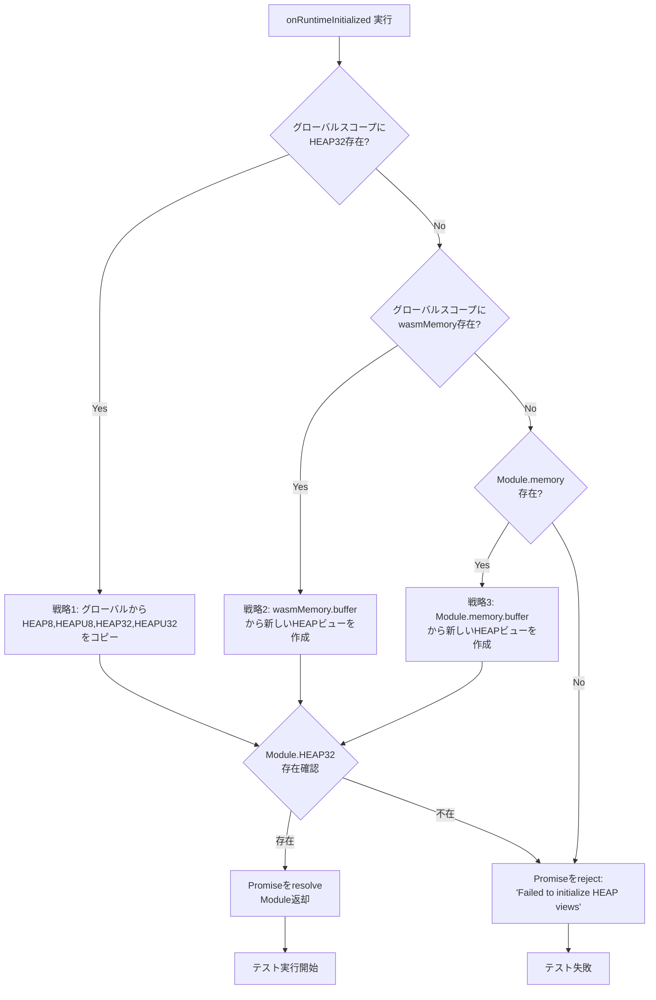
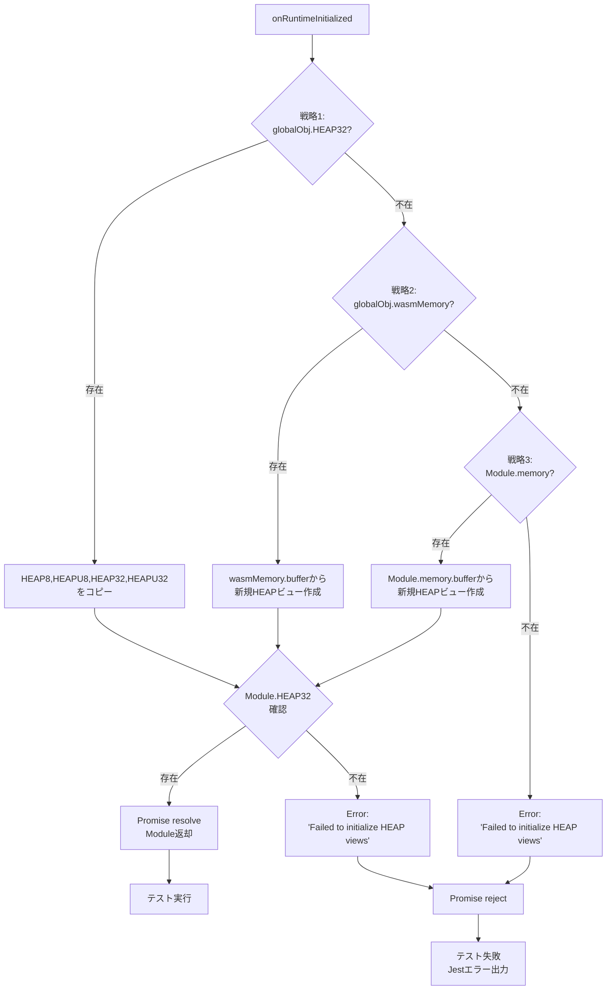

# 技術設計書

## 概要

本機能は、Node.js環境で実行されるWASM統合テストにおけるHEAPビュー初期化問題を修正します。Emscriptenが生成する`public/ai.js`がNode.js環境で`Module.HEAP32`を正しく初期化しないため、統合テストが失敗する問題に対処します。

テストコード側で3段階のフォールバック戦略（グローバルスコープ、wasmMemory、Module.memory）を実装し、異なる環境での互換性を確保しながら、本番環境のファイル（`public/ai.js`、`public/ai.wasm`）を変更せずに問題を解決します。

**Users**: 開発者、テスト実行者、CI/CDパイプライン
**Impact**: 統合テストの安定性向上、本番環境への影響なし

### Goals

- Node.js環境でのWASM統合テスト（565個）をすべて成功させる
- 本番環境のWASMファイル（`public/ai.js`、`public/ai.wasm`）を変更しない
- TypeScript型安全性を維持しながらHEAPビュー初期化を実装
- 複数のフォールバック戦略により、異なる環境・Emscriptenバージョンでの互換性を確保

### Non-Goals

- 本番環境（Web Worker）のWASMロードロジックの変更
- Emscriptenビルド設定の変更
- 統合テストの構造やテストケースの追加・削除
- ブラウザ環境でのHEAP初期化の変更（既に正常動作）

## Architecture

### Existing Architecture Analysis

現在の統合テストは、Node.js環境で`public/ai.wasm`と`public/ai.js`を直接ロードして実行します。

**Current Test Pattern**:

```typescript
// 1. WASMバイナリとglue codeをファイルシステムから読み込み
const wasmBinary = fs.readFileSync(WASM_PATH);
const glueCode = fs.readFileSync(GLUE_PATH, 'utf-8');

// 2. new Function()でglue codeを実行（スコープ分離が発生）
const executeGlue = new Function('Module', 'process', 'require', glueCode);
executeGlue(moduleConfig, process, require);

// 3. onRuntimeInitializedコールバックで初期化完了を待機
onRuntimeInitialized: function (this: EgaroucidWASMModule) {
  // ❌ 問題: グローバルスコープのHEAPビューがModule.HEAPにコピーされない
  this.HEAP8 = globalObj.HEAP8!;  // 現在の実装
  this.HEAP32 = globalObj.HEAP32!; // undefined になる
  resolve(this);
}
```

**Production Code Pattern** (`wasm-loader.ts:116-122`):

```typescript
// 本番環境では既にこの問題に対処している
Module.HEAP8 = globalScope.HEAP8;
Module.HEAPU8 = globalScope.HEAPU8;
Module.HEAP32 = globalScope.HEAP32;
Module.HEAPU32 = globalScope.HEAPU32;
Module.memory = globalScope.wasmMemory || { buffer: Module.HEAP8?.buffer };
```

**Root Cause**:

- Emscripten 2.0.10以降、MODULARIZEモードではHEAP\*変数がModule外からアクセスできなくなった
- `new Function()`によるスコープ分離により、Emscripten内部で生成されるグローバル変数がテストスコープに閉じ込められる
- `public/ai.js`（minified版）では`Module.HEAP32`への二重代入が欠落している可能性がある

### Architecture Pattern & Boundary Map

本機能は既存のテストコード構造を維持し、HEAPビュー初期化ロジックのみを強化します。

**Architecture Integration**:

- **Selected pattern**: Fallback Strategy Pattern（3段階フォールバック）
- **Domain/feature boundaries**: テストコード（`src/lib/ai/__tests__/`）のみを変更、本番コード（`src/lib/ai/`）は変更しない
- **Existing patterns preserved**: 統合テストのbeforeAll/beforeEachパターン、Promiseベースの初期化、型安全な実装
- **New components rationale**: 新規コンポーネントなし、既存の`onRuntimeInitialized`コールバックロジックの強化のみ
- **Steering compliance**: Pure Function原則（副作用を`onRuntimeInitialized`内に限定）、Type Safety原則（strictモード準拠）を維持

### Technology Stack

| Layer                    | Choice / Version        | Role in Feature                    | Notes                                                     |
| ------------------------ | ----------------------- | ---------------------------------- | --------------------------------------------------------- |
| Frontend / CLI           | N/A                     | N/A                                | テストコードのみの変更                                    |
| Backend / Services       | N/A                     | N/A                                | テストコードのみの変更                                    |
| Data / Storage           | N/A                     | N/A                                | テストコードのみの変更                                    |
| Messaging / Events       | N/A                     | N/A                                | テストコードのみの変更                                    |
| Infrastructure / Runtime | Node.js 24.x            | テスト実行環境                     | 既存の開発環境を継続使用                                  |
| Testing                  | Jest                    | 統合テストフレームワーク           | 既存のテストインフラを継続使用                            |
| WASM Runtime             | Emscripten 4.x (推定)   | WASM glue code生成およびランタイム | `public/ai.js`のバージョンは変更しない                    |
| Type System              | TypeScript 5.x (strict) | 型安全性の維持                     | `typeof global & { HEAP8?: Int8Array }`などの型注釈を使用 |

## System Flows

### HEAP初期化フローチャート



**Key Decisions**:

- **優先順位**: グローバルスコープからのコピーを最優先（本番コードとの整合性）
- **フォールバック**: 3段階の戦略により異なる環境・設定への対応を確保
- **エラーハンドリング**: すべての戦略が失敗した場合は明確なエラーメッセージでPromiseをreject

## Requirements Traceability

| Requirement | Summary                                 | Components                                                                 | Interfaces                      | Flows                   |
| ----------- | --------------------------------------- | -------------------------------------------------------------------------- | ------------------------------- | ----------------------- |
| 1.1         | グローバルスコープからHEAPビュー取得    | onRuntimeInitialized (7箇所)                                               | EgaroucidWASMModule             | HEAP初期化フロー戦略1   |
| 1.2         | wasmMemory.bufferから新規HEAP作成       | onRuntimeInitialized (7箇所)                                               | EgaroucidWASMModule             | HEAP初期化フロー戦略2   |
| 1.3         | Module.memory.bufferから新規HEAP作成    | onRuntimeInitialized (7箇所)                                               | EgaroucidWASMModule             | HEAP初期化フロー戦略3   |
| 1.4         | 初期化失敗時のエラーハンドリング        | onRuntimeInitialized (7箇所)                                               | Promise rejection               | HEAP初期化フロー reject |
| 1.5         | 7箇所の統合テストへの統一ロジック適用   | wasm.integration.test.ts (6箇所)<br/>ai-engine.integration.test.ts (1箇所) | EgaroucidWASMModule             | N/A                     |
| 2.1         | Task 5.1 (Module Loading) テスト成功    | wasm.integration.test.ts:68付近                                            | EgaroucidWASMModule             | HEAP初期化フロー        |
| 2.2         | Task 5.2 (Board Encoding) テスト成功    | wasm.integration.test.ts:249付近                                           | EgaroucidWASMModule             | HEAP初期化フロー        |
| 2.3         | Task 5.3 (\_calc_value) テスト成功      | wasm.integration.test.ts:1058付近                                          | EgaroucidWASMModule             | HEAP初期化フロー        |
| 2.4         | Task 5.4 (Memory Management) テスト成功 | wasm.integration.test.ts:1400付近                                          | EgaroucidWASMModule             | HEAP初期化フロー        |
| 2.5         | Task 5.5 (Performance) テスト成功       | wasm.integration.test.ts:1616付近                                          | EgaroucidWASMModule             | HEAP初期化フロー        |
| 2.6         | Task 5.6 (Error Cases) テスト成功       | wasm.integration.test.ts:1945付近                                          | EgaroucidWASMModule             | HEAP初期化フロー        |
| 2.7         | AIEngine統合テスト成功                  | ai-engine.integration.test.ts:47付近                                       | EgaroucidWASMModule             | HEAP初期化フロー        |
| 2.8         | 565個のテストすべて成功                 | 全統合テスト                                                               | EgaroucidWASMModule             | HEAP初期化フロー        |
| 3.1         | public/ai.js 非変更                     | N/A (テストコードのみ変更)                                                 | N/A                             | N/A                     |
| 3.2         | public/ai.wasm 非変更                   | N/A (テストコードのみ変更)                                                 | N/A                             | N/A                     |
| 3.3         | テストコードのみ変更                    | src/lib/ai/**tests**/配下                                                  | N/A                             | N/A                     |
| 3.4         | Web Worker環境での既存動作維持          | N/A (テストコードのみ変更)                                                 | N/A                             | N/A                     |
| 4.1         | グローバルオブジェクト型注釈            | onRuntimeInitialized (7箇所)                                               | typeof global & { HEAP8?: ... } | N/A                     |
| 4.2         | Non-null assertion operator 使用        | onRuntimeInitialized (7箇所)                                               | EgaroucidWASMModule             | HEAP初期化フロー戦略1   |
| 4.3         | thisの型指定                            | onRuntimeInitialized (7箇所)                                               | EgaroucidWASMModule             | N/A                     |
| 4.4         | TypeScript strict mode準拠              | 全テストコード                                                             | N/A                             | N/A                     |
| 5.1         | 戦略1: グローバルスコープ優先           | onRuntimeInitialized (7箇所)                                               | EgaroucidWASMModule             | HEAP初期化フロー戦略1   |
| 5.2         | 戦略2: wasmMemoryフォールバック         | onRuntimeInitialized (7箇所)                                               | EgaroucidWASMModule             | HEAP初期化フロー戦略2   |
| 5.3         | 戦略3: Module.memoryフォールバック      | onRuntimeInitialized (7箇所)                                               | EgaroucidWASMModule             | HEAP初期化フロー戦略3   |
| 5.4         | 成功時の早期リターン                    | onRuntimeInitialized (7箇所)                                               | EgaroucidWASMModule             | HEAP初期化フロー        |
| 6.1         | 初期化失敗時のエラーメッセージ          | onRuntimeInitialized (7箇所)                                               | Promise rejection               | HEAP初期化フロー reject |
| 6.2         | Module.HEAP32存在確認                   | onRuntimeInitialized (7箇所)                                               | EgaroucidWASMModule             | HEAP初期化フロー        |
| 6.3         | Jestエラー出力                          | Jestフレームワーク                                                         | N/A                             | N/A                     |

## Components and Interfaces

### Components Summary

| Component                       | Domain/Layer | Intent                                     | Req Coverage                            | Key Dependencies (P0/P1) | Contracts       |
| ------------------------------- | ------------ | ------------------------------------------ | --------------------------------------- | ------------------------ | --------------- |
| onRuntimeInitialized (Task 5.1) | Test         | WASMモジュールロードテスト時のHEAP初期化   | 1.1-1.5, 2.1, 4.1-4.4, 5.1-5.4, 6.1-6.2 | EgaroucidWASMModule (P0) | Callback, State |
| onRuntimeInitialized (Task 5.2) | Test         | ボードエンコーディングテスト時のHEAP初期化 | 1.1-1.5, 2.2, 4.1-4.4, 5.1-5.4, 6.1-6.2 | EgaroucidWASMModule (P0) | Callback, State |
| onRuntimeInitialized (Task 5.3) | Test         | \_calc_valueテスト時のHEAP初期化           | 1.1-1.5, 2.3, 4.1-4.4, 5.1-5.4, 6.1-6.2 | EgaroucidWASMModule (P0) | Callback, State |
| onRuntimeInitialized (Task 5.4) | Test         | メモリ管理テスト時のHEAP初期化             | 1.1-1.5, 2.4, 4.1-4.4, 5.1-5.4, 6.1-6.2 | EgaroucidWASMModule (P0) | Callback, State |
| onRuntimeInitialized (Task 5.5) | Test         | パフォーマンステスト時のHEAP初期化         | 1.1-1.5, 2.5, 4.1-4.4, 5.1-5.4, 6.1-6.2 | EgaroucidWASMModule (P0) | Callback, State |
| onRuntimeInitialized (Task 5.6) | Test         | エラーケーステスト時のHEAP初期化           | 1.1-1.5, 2.6, 4.1-4.4, 5.1-5.4, 6.1-6.2 | EgaroucidWASMModule (P0) | Callback, State |
| onRuntimeInitialized (AIEngine) | Test         | AIEngine統合テスト時のHEAP初期化           | 1.1-1.5, 2.7, 4.1-4.4, 5.1-5.4, 6.1-6.2 | EgaroucidWASMModule (P0) | Callback, State |

すべてのコンポーネントは同じHEAP初期化ロジックを共有するため、以下に統一された実装詳細を記述します。

### Test Layer

#### onRuntimeInitialized Callback (統合テスト共通)

| Field             | Detail                                                                             |
| ----------------- | ---------------------------------------------------------------------------------- |
| Intent            | Emscripten WASM初期化完了時にHEAPビューをModuleオブジェクトに設定                  |
| Requirements      | 1.1, 1.2, 1.3, 1.4, 1.5, 2.1-2.8, 4.1, 4.2, 4.3, 4.4, 5.1, 5.2, 5.3, 5.4, 6.1, 6.2 |
| Owner / Reviewers | テストチーム                                                                       |

**Responsibilities & Constraints**:

- Emscripten WASMモジュールの初期化完了を検出し、HEAPビュー（HEAP8、HEAPU8、HEAP32、HEAPU32）をModuleオブジェクトに設定する
- 3段階のフォールバック戦略を実装し、異なる環境・Emscriptenバージョンでの互換性を確保する
- TypeScript strictモードに準拠した型安全な実装を維持する
- すべての戦略が失敗した場合は明確なエラーメッセージでPromiseをrejectする
- Domain boundary: テストコード内のみで完結、本番コードには影響しない
- Transaction scope: 同期的な初期化処理、Promiseベースの完了通知
- Data ownership: Moduleオブジェクトへのプロパティ設定、グローバルスコープからの読み取り

**Dependencies**:

- Inbound: Emscriptenランタイム — WASM初期化完了時にコールバック実行 (P0)
- Outbound: Promise resolver/rejecter — 初期化成功/失敗の通知 (P0)
- External: Node.js global object — HEAPビューおよびwasmMemoryへのアクセス (P0)
- External: EgaroucidWASMModule型定義 — Module.memory、Module.HEAP\*プロパティの型情報 (P0)

**Contracts**: [x] Service / [ ] API / [ ] Event / [ ] Batch / [x] State

##### Service Interface

```typescript
interface EmscriptenModule {
  onRuntimeInitialized?: (this: EgaroucidWASMModule) => void;
  // その他のEmscripten設定プロパティは省略
}

// 使用パターン
const moduleConfig: Partial<EmscriptenModule> = {
  onRuntimeInitialized: function (this: EgaroucidWASMModule) {
    // HEAP初期化ロジック（以下のState Managementセクション参照）
    // ...
    if (this.HEAP32) {
      resolve(this);
    } else {
      reject(new Error('Failed to initialize HEAP views'));
    }
  },
};
```

**Preconditions**:

- Emscripten glue codeが正常にロードされている
- WASMバイナリが正常にインスタンス化されている
- Node.js環境で`global`オブジェクトにアクセス可能

**Postconditions**:

- `Module.HEAP8`、`Module.HEAPU8`、`Module.HEAP32`、`Module.HEAPU32`が設定されている
- `Module.HEAP32`が`undefined`でない（存在確認済み）
- Promiseが解決され、テストコードがWASM関数を呼び出し可能

**Invariants**:

- いずれかのフォールバック戦略が成功した場合のみPromiseを解決
- すべての戦略が失敗した場合は`'Failed to initialize HEAP views'`エラーでPromiseをreject
- HEAPビューはすべて同じメモリバッファを参照する（異なる型の型付き配列）

##### State Management

**State model**:

```typescript
// グローバルオブジェクト型注釈（要件4.1）
const globalObj = global as typeof global & {
  HEAP8?: Int8Array;
  HEAPU8?: Uint8Array;
  HEAP32?: Int32Array;
  HEAPU32?: Uint32Array;
  wasmMemory?: WebAssembly.Memory;
};

// 状態遷移フロー
// 1. グローバルスコープチェック（戦略1）
if (globalObj.HEAP32) {
  // 要件4.2: Non-null assertion operator使用
  this.HEAP8 = globalObj.HEAP8!;
  this.HEAPU8 = globalObj.HEAPU8!;
  this.HEAP32 = globalObj.HEAP32!;
  this.HEAPU32 = globalObj.HEAPU32!;
}
// 2. wasmMemoryチェック（戦略2）
else if (globalObj.wasmMemory) {
  const buffer = globalObj.wasmMemory.buffer;
  this.HEAP8 = new Int8Array(buffer);
  this.HEAPU8 = new Uint8Array(buffer);
  this.HEAP32 = new Int32Array(buffer);
  this.HEAPU32 = new Uint32Array(buffer);
}
// 3. Module.memoryチェック（戦略3）
else if (this.memory && this.memory.buffer) {
  const buffer = this.memory.buffer;
  this.HEAP8 = new Int8Array(buffer);
  this.HEAPU8 = new Uint8Array(buffer);
  this.HEAP32 = new Int32Array(buffer);
  this.HEAPU32 = new Uint32Array(buffer);
}

// 4. 成功確認（要件5.4）
if (this.HEAP32) {
  resolve(this); // 早期リターン
} else {
  reject(new Error('Failed to initialize HEAP views')); // 要件6.1
}
```

**Persistence & consistency**:

- HEAPビューはテスト実行中のみメモリ上に存在
- 各テストスイート（Task 5.1-5.6、AIEngine）ごとに独立したWASMモジュールインスタンスを生成
- テスト間での状態共有なし（各beforeAllで新規初期化）

**Concurrency strategy**:

- 統合テストは順次実行（`--runInBand`フラグ使用）
- 同一WASMモジュールへの並行アクセスなし
- Promiseベースの非同期初期化、完了待機パターン

**Implementation Notes**:

- **Integration**: 既存の7箇所の`onRuntimeInitialized`コールバックを統一ロジックで置き換え。本番コード（`wasm-loader.ts`）との整合性を維持
- **Validation**: `this.HEAP32`の存在確認により、すべてのHEAPビューが正しく初期化されたことを検証。失敗時は明確なエラーメッセージで診断を容易化
- **Risks**:
  - 将来のEmscriptenバージョン変更により、すべてのフォールバック戦略が無効化される可能性 → 3段階の戦略により耐性を確保、公式ドキュメントとの定期的な整合性確認が必要
  - グローバルスコープへのアクセスが制限される環境では戦略1が失敗する可能性 → 戦略2、3がフォールバックとして機能

## Data Models

本機能はデータモデルの変更を含まない。既存の型定義（`EgaroucidWASMModule`）を使用し、HEAPビュー初期化ロジックのみを追加する。

### Domain Model

既存の型定義:

```typescript
// src/lib/ai/types.ts (既存)
export interface EgaroucidWASMModule {
  // WASM関数（変更なし）
  _init_ai(percentagePtr?: number): number;
  _ai_js(boardPtr: number, level: number, ai_player: number): number;
  _calc_value(
    boardPtr: number,
    resPtr: number,
    level: number,
    ai_player: number
  ): void;
  _malloc(size: number): number;
  _free(ptr: number): void;

  // メモリビュー（本機能で正しく初期化）
  memory: WebAssembly.Memory;
  HEAP8: Int8Array;
  HEAPU8: Uint8Array;
  HEAP32: Int32Array;
  HEAPU32: Uint32Array;

  // 初期化コールバック（本機能で実装）
  onRuntimeInitialized?: () => void;
}
```

**Business rules & invariants**:

- すべてのHEAPビュー（HEAP8、HEAPU8、HEAP32、HEAPU32）は同じWebAssembly.Memoryバッファを参照する
- `onRuntimeInitialized`コールバックが完了するまで、WASM関数（`_ai_js`、`_calc_value`など）の呼び出しは禁止
- テストコードは`Module.HEAP32`が`undefined`でないことを確認してからWASM関数を呼び出す

## Error Handling

### Error Strategy

HEAP初期化の各段階で明確なエラーハンドリングを実装し、問題の診断を容易にします。

**Error Categories and Responses**:

**Initialization Errors** (HEAP初期化失敗):

- **Condition**: すべてのフォールバック戦略（グローバルスコープ、wasmMemory、Module.memory）が失敗
- **Error Message**: `'Failed to initialize HEAP views'`
- **Response**: Promiseをreject、Jestがエラーメッセージとスタックトレースを表示
- **User Guidance**: エラーメッセージにより、HEAP初期化の失敗を即座に特定可能

**Validation Errors** (HEAP32存在確認失敗):

- **Condition**: いずれかの戦略が実行されたが、`Module.HEAP32`が依然として`undefined`
- **Error Message**: `'Failed to initialize HEAP views'`（同上）
- **Response**: Promiseをreject
- **User Guidance**: フォールバック戦略のロジックエラーを示唆

**System Errors** (Node.js環境エラー):

- **Condition**: グローバルオブジェクトへのアクセス失敗、メモリバッファ取得失敗
- **Error Message**: JavaScriptランタイムのネイティブエラー（例: `TypeError`、`ReferenceError`）
- **Response**: Promiseをreject、Jestがスタックトレースを表示
- **User Guidance**: Node.js環境の設定問題を示唆

### Process Flow Visualization



### Monitoring

**Error tracking**:

- Jestの標準エラー出力により、初期化失敗の詳細なスタックトレースを取得
- エラーメッセージ`'Failed to initialize HEAP views'`により、HEAP初期化の問題を即座に特定

**Logging**:

- 本機能ではカスタムログを追加しない（Jestの標準出力を使用）
- 必要に応じて、各フォールバック戦略の実行状況をデバッグログに出力可能（実装時に検討）

**Health monitoring**:

- CI/CDパイプラインでのテスト成功率モニタリング
- 565個のテストすべてが成功することを継続的に検証

## Testing Strategy

### Unit Tests

本機能はテストコードの修正であるため、新規単体テストは不要。既存の統合テストが修正の正しさを検証します。

### Integration Tests

統合テストそのものが修正対象であるため、以下の検証を実施:

1. **Task 5.1 (Module Loading)** - `wasm.integration.test.ts:68付近`
   - WASMモジュールが正常にロードされ、HEAPビューが初期化されることを確認
   - `Module.HEAP32`が`undefined`でないことを確認

2. **Task 5.2 (Board Encoding)** - `wasm.integration.test.ts:249付近`
   - ボードエンコーディング処理でHEAPビューにアクセス可能であることを確認
   - `HEAP32.buffer`へのアクセスがエラーを発生させないことを確認

3. **Task 5.3 (\_calc_value)** - `wasm.integration.test.ts:1058付近`
   - `_calc_value`関数の実行でHEAPビューにアクセス可能であることを確認
   - 結果の読み取りが正常に実行されることを確認

4. **Task 5.4 (Memory Management)** - `wasm.integration.test.ts:1400付近`
   - メモリ管理テストでHEAPビューが正しく機能することを確認
   - `_malloc`、`_free`の実行が正常に完了することを確認

5. **Task 5.5 (Performance)** - `wasm.integration.test.ts:1616付近`
   - パフォーマンステストでHEAPビューが正しく機能することを確認
   - 大量のWASM関数呼び出しが正常に実行されることを確認

6. **Task 5.6 (Error Cases)** - `wasm.integration.test.ts:1945付近`
   - エラーケーステストでHEAPビューが正しく機能することを確認
   - エラーハンドリングが正常に動作することを確認

7. **AIEngine Integration** - `ai-engine.integration.test.ts:47付近`
   - AIEngine全体の統合テストでHEAPビューが正しく機能することを確認
   - AI計算の完全なフローが正常に実行されることを確認

### E2E/UI Tests

E2Eテスト（Playwright）は変更不要。ブラウザ環境ではWeb WorkerがWASMをロードし、既に正常動作しています。

### Performance/Load

パフォーマンスへの影響は最小限（フォールバックチェックのみ）。既存のTask 5.5（Performance）テストで検証済み。

**Expected Results**:

- 565個のテストすべてが成功
- テスト実行時間の有意な変化なし（フォールバックチェックは数ミリ秒）
- CI/CDパイプラインでの統合テスト成功

## Migration Strategy

本機能はテストコードの修正のみであり、データマイグレーションは不要。

**Deployment Steps**:

1. テストコードの7箇所を統一ロジックで修正
2. ローカル環境でテスト実行（`pnpm test src/lib/ai/__tests__/wasm.integration.test.ts`）
3. すべてのテスト（565個）が成功することを確認
4. CI/CDパイプラインでのテスト実行
5. PR作成、レビュー、マージ

**Rollback Plan**:

- テストコードのみの変更であるため、Git revertで即座に元に戻すことが可能
- 本番環境への影響なし

**Validation Checkpoints**:

- ローカル環境でのテスト成功（565/565 passed）
- CI環境でのテスト成功
- 既存のE2Eテスト（Playwright）も引き続き成功することを確認
